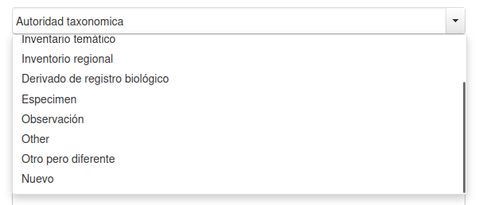
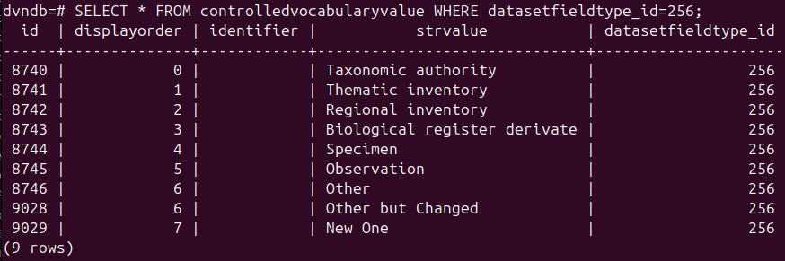
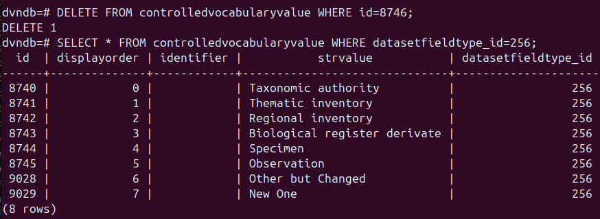
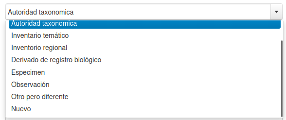
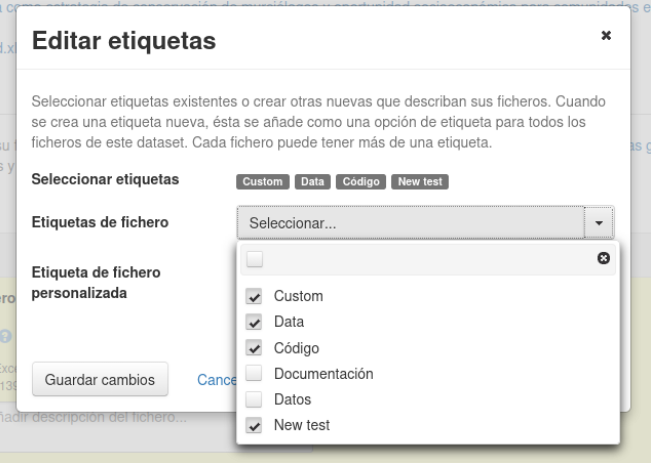
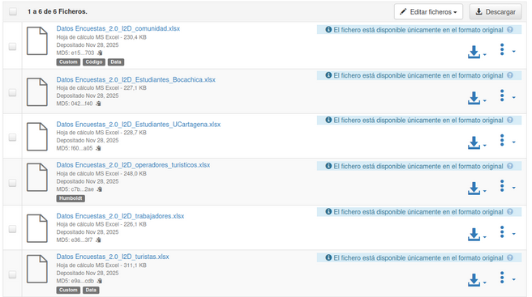
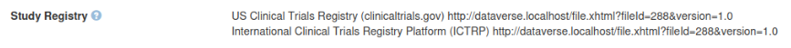
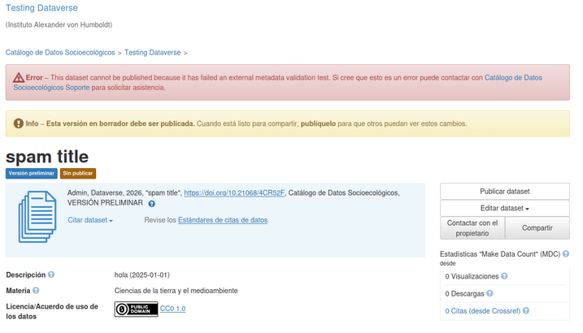

# Personalización de metadatos en Dataverse

Los metadatos de Dataverse se definen en archivos .tsv. Estos se encuentran, dentro del contenedor de dataverse del instituto, en la ruta:
`/usr/local/dvinstall/data/metadatablocks/`
Se recomienda mantener un archivo TSV para cada bloque o conjunto de metadatos.

## Estructura de los bloques
Los archivos TSV de Dataverse tienen una estructura definida estricta. Es posible observar ejemplos de estos aquí. Los archivos se dividen en una sección de bloque, una sección de metadatos y una sección de vocabulario controlado.
### Sección de bloque
Esta sección se muestra como el cabecero del archivo y contiene la información del bloque o conjunto de metadatos. Se identifica porque inicia con `#metadataBlock` y sus atributos son los siguientes:
- `name`: Nombre que identifica el bloque de metadatos (debe ser único en todo el aplicativo).
- `dataverseAlias`: Si se especifica, el bloque de metadatos estará disponible únicamente para ese dataverso y sus hijos.
- `displayName`: Nombre que se muestra en la UI.
- `blockURI`: Asocia el bloque con un URI externo.

Esta es una sección corta, únicamente consta del cabecero con el nombre de las columnas y una única fila de valores.

### Sección de metadatos
Esta es la sección intermedia del archivo y está posicionada justo debajo de las dos líneas que componen la sección del bloque.
- `name`: Nombre para identificar el campo (debe ser único en todo el aplicativo).
- `title`: Nombre que se muestra en la UI.
- `description`: Descripción del campo (tooltip).
- `watermark`: Texto que se mostrará por defecto como ejemplo para el usuario.
- `fieldType`: Tipo del campo.
- `displayOrder`: Controla el orden en el que se mostrarán los campos en la UI (0 indica el campo que debe mostrarse primero)
- `displayFormat`: La forma en la que el campo se va a mostrar durante la visualización (texto plano, email, url, imágen, etc.)
- `advancedSearchField`: Define si el campo podrá ser consultado en la búsqueda avanzada. (TRUE/FALSE)
- `allowControlledVocabulary`: Define si el campo tendrá una lista de selección específica (vocabulario controlado) (TRUE/FALSE).
- `allowMultiples`: Define si el campo podrá duplicarse o repetirse para recibir múltiples registros (TRUE/FALSE).
- `facetable`: Define si el campo puede ser "facetable", ser usado para búsqueda o para las opciones de filtrado en el menú izquierdo de Dataverse.
- `displayOnCreate`: Define si el campo se mostrará al momento de crear un nuevo dataset, o si sólo se mostrará durante la edición (TRUE/FALSE).
- `required`: Define si el campo es obligatorio o no. En caso de que el campo sea compuesto puede especificar esta propiedad para todos sus hijos.
- `parent`: Define si el campo es hijo de otro campo.
- `metadatablock_id`: Especifica el nombre del #metadataBlock del que este metadato hace parte.
- `termURI`: Especifica una URI externa.

Para conocer mayores detalles de los metadatos, se puede acceder directamente a la [documentación](https://guides.dataverse.org/en/6.6/admin/metadatacustomization.html). 

### Sección de vocabulario controlado
Para los cambios con con vocabulario controlado, este se define a partir de los siguientes atributos:
- `datsetField`: Nombre del campo al que pertenece el vocabulario
- `value`: Texto de la opción
- `identificador`: Texto usado como identificador
- `displayOrder`: Controla el orden en el que se mostrarán las opciones del vocabulario controlado en la UI (0 indica el campo que debe mostrarse primero)

## Creación de nuevos bloques de metadatos
Dataverse es enfático en la no recomendación de modificar los metadatos propios de Dataverse, debido a que puede generar errores e incompatibilidades, además de perder soporte para futuras actualizaciones. En caso de necesitar nuevos campos de metadatos, se recomienda siempre optar por la opción de generar nuevos archivos TSV.

**Importante: Las rutas de contenedores indicadas en esta documentación corresponden a la configuración interna del Instituto. En otras instancias pueden variar, por lo que los usuarios externos deben ajustarlas según su entorno.**

### Paso 1: Generar un nuevo archivo TSV
Un nuevo archivo puede generarse desde un excel, agregando todas las columnas necesarias y exportándolo como TSV (Tabular Separated Value). Debe asegurarse de añadir todas las columnas y llenarlas correctamente para así evitar errores al momento de cargarlas.

### Paso 2: Cargar el nuevo archivo a Dataverse
Puede añadir el nuevo archivo al contenedor con:

`docker cp new_block.tsv dataverse:/usr/local/dvinstall/data/metadatablocks/`

> Nota: Esta ruta corresponde al contenedor de la versión 6.6 del instituto, se recomienda alojar allí el bloque de metadato para mantener la consistencia. Sin embargo, puede ser almacenado en cualquier otra ruta para la ejecución de los pasos posteriores. Para la versión 6.10, los bloques de metadato no están almacenados en ninguna ruta del contenedor, sino que se alojan dentro de los volúmenes de Docker. 

Posteriormente, se debe cargar el archivo a través de la API de Dataverse, con el siguiente comando:

`curl http://localhost:8080/api/admin/datasetfield/load -H "Content-type: text/tab-separated-values" -X POST --upload-file <route>/new_block.tsv`

Si la carga es exitosa retornará un mensaje `{"status":"OK"}`, de lo contrario especificará la línea del problema para su revisión. 

Para ver el nuevo bloque de metadatos cargado en la UI, reinicie el servidor:

`asadmin restart-domain domain1`

### Paso 3: Habilitar nuevos metadatos
Hasta este punto, un administrador podrá ingresar a la opción “Nuevo dataverso” y verá el nuevo bloque en el listado de metadatos, pero no estará habilitado. Para habilitarlo desde la API, se ejecuta el siguiente comando indicando los bloques de metadatos a habilitar. Este comando se puede ejecutar sobre un dataverso en específico o sobre el dataverso padre (`:root`), sin embargo, se recomienda habilitarlo sobre el dataverseo root directamente y luego editar cualquier dataverso hijo que no requiera ciertos bloques desde la UI, en aras de evitar posibles errores. 

- Desde el panel de administrador, se copia el Token:
	`export API_TOKEN=xxxxxx` 

- Se habilitan los metadatos 

	`curl -H "X-Dataverse-key:$API_TOKEN" -X POST -H "Content-type:application/json" -d "[\"citation\",\"geospatial\",..., \"institutional\"]" http://localhost:8080/api/dataverses/:root/metadatablocks `

  **Nota: Este comando sobreescribe, no añade. Al momento de ejecutarlo se deben añadir todos los bloques de metadatos.**

	Como alternativa, también se puede hacer usando un archivo `json` que contenga los nombres de todos los bloques y usarlo en el comando:  
	```json
	[  
	"citation",
	"geospatial",
	...,
	"institutional"
	]
	```
	
	`curl -H "X-Dataverse-key:$API_TOKEN" -X POST -H "Content-type:application/json" --upload-file metadatablocks.json "http://localhost:8080/api/dataverses/:root/metadatablocks"`

### Paso 4: Reindexar a Solr
Este paso es crucial para garantizar la persistencia, omitir este paso puede ocasionar inconsistencias y errores. Para llevar a cabo este paso, se necesitan archivos de los contenedores de Dataverse y de Solr. Se deben correr comandos desde dentro del contenedor de Dataverse y desde la máquina host, de la siguiente manera:

#### Desde el contenedor de Dataverse:
1. Acceder al contenedor

	`docker exec -it dataverse bash`

2. Generar el nuevo esquema de campos con:

	`curl http://localhost:8080/api/admin/index/solr/schema > /tmp/dv-fields.xml`

> Nota: Asegúrese de tener permisos de acceso a la carpeta donde almacene el archivo. Para la versión 6.10 se recomienda usar una ruta alternativa como  `/opt/payara`
	
#### Desde la máquina host:
Es en la máquina host donde se ejecutarán los scripts que actualizarán el index de Solr. El ejemplo usará la ruta `/tmp/` para almacenar los archivos, sin embargo esta ruta puede ser reemplazada sin inconveniente:

1. Puede descargar el script `update-fields.sh` ya sea directamente desde el [repositorio de Dataverse](https://github.com/IQSS/dataverse/blob/develop/conf/solr/update-fields.sh) o descargarlo desde el contenedor de Dataverse con:

	`docker cp dataverse:/usr/local/dvinstall/update-fields.sh /tmp/update-fields.sh`

2. Copiar `dv-fields.xml` previamente generado del contenedor de Dataverse al host:
  
   `docker cp dataverse:/<ruta-contenedor>/dv-fields.xml /tmp/`

3. Copiar `schema.xml` del contenedor de Solr:
  
	`docker cp dataverse-solr:/var/solr/data/collection1/conf/schema.xml /tmp/`

> Nota: Recuerde validar el nombre del contenedor del que sea está conectando. Para le versión 6.10, el nombre del contenedor de `solr`

5. Generar el nuevo índice de Solr:
	```
   cd /tmp/
   ./update-fields.sh schema.xml dv-fields.xml
	```
  
6. Copiar el nuevo `schema.xml` generado al contenedor de Solr:
  
	`docker cp /tmp/schema.xml dataverse-solr:/var/solr/data/collection1/conf/schema.xml`

> Nota: Recuerde validar el nombre del contenedor del que sea está conectando. Para le versión 6.10, el nombre del contenedor de `solr`
	 
8. Una vez completados los pasos anteriores, se debe reiniciar el contenedor de Solr:
  
	`docker restart dataverse-solr`

> Nota: Recuerde validar el nombre del contenedor del que sea está conectando. Para le versión 6.10, el nombre del contenedor de `solr`

Y finalmente, se ingresa nuevamente al contenedor de Dataverse y se ejecuta desde allí la re-indexación del Solr:
```
	docker exec -it dataverse bash
    curl "http://localhost:8080/api/admin/index"
```

### Paso 5: Recargar plantillas (opcional)
Este último paso puede no ser necesario en caso de que el dataverso sobre el que se hayan habilitado los nuevos metadatos no cuente con una plantilla ya definida. 
Una vez finalizados los pasos anteriores, es posible que dataverse se comporte de manera extraña al momento de crear o editar datasets, haciendo que algunos metadatos no se muestren correctamente o que aparezcan bloques vacíos. Eso puede deberse a que la plantilla original que heredan los datasets, no ha sido actualizada para tomar los nuevos cambios. Para solucionar esto, simplemente se debe ingresar a `Plantillas` -> `Editar plantilla` -> `Guardar` sin hacer ningún cambio para que la plantilla se actualice.

### Modificar metadatos con Controlled Vocabulary
Modificar archivos TSV propios no tiene diferencia a lo que sería agregar un nuevo archivo: se debe cargar el TSV y reindexarlo a Solr, luego actualizar la plantilla si aparecen inconsistencias. Sin embargo, cuando se modifica un vocabulario controlado, el proceso puede variar ligeramente ya que Dataverse no detecta muy bien estas modificaciones:

1. Si no se modifica un vocabulario controlado existente y sólo se agrega uno nuevo, entonces bastará con los pasos descritos anteriormente para actualizar un TSV.
2. Si se modifica un vocabulario controlado que ya existía, entonces esta modificación se añadirá como un nuevo vocabulario controlado y el antiguo, que se intentó modificar, persistirá, lo que generará una redundancia. Para arreglar esto, se tendrá que eliminar el antiguo directamente desde la base de datos. 

**Por ejemplo:**
Asumimos que tenemos el siguiente vocabulario controlado en un archivo TSV:
```
	emlSubType	Taxonomic authority		0
	emlSubType	Thematic inventory		1
	emlSubType	Regional inventory		2
	emlSubType	Biological register derivate		3
	emlSubType	Specimen		4
	emlSubType	Observation		5
	emlSubType	Other		6
```
Realizaremos la prueba modificando el último elemento `Other` por `Other But Changed` y agregando uno adicional que llamaremos `New one`. Con estos cambios, nuestro nuevo vocabulario controlado quedaría de la siguiente manera:
```
	emlSubType	Taxonomic authority		0
	emlSubType	Thematic inventory		1
	emlSubType	Regional inventory		2
	emlSubType	Biological register derivate		3
	emlSubType	Specimen		4
	emlSubType	Observation		5
	emlSubType	Other But Changed		6
	emlSubType	New one		7
```
Y en nuestro archivo de traducción, también realizamos la modificación correspondiente, pasando de:
```
controlledvocabulary.emlSubType.other=Otro
```
A lo siguiente (nótese que aquí también eliminamos por completo la referencia al campo `Other`):
```
controlledvocabulary.emlSubType.other_but_changed=Otro pero diferente
controlledvocabulary.emlSubType.new_one=Nuevo
```

Una vez realizados los pasos de carga y reindexación a Solr, al ingresar al metadato notaremos que el vocabulario original `Other` persiste, y tanto el nuevo vocabulario como el modificado, fueron añadidos como si fuesen nuevos, dejándonos con una opción adicional a lo que originalmente nos planteamos:



Si observamos la base de datos, observaremos el mismo comportamiento:



Esto sucede porque Dataverse es incapaz de detectar que un  vocabulario fue modificado, y cualquier cambio lo asume como una nueva opción. Lo anterior implica la necesidad de modificar directamente la base de datos para eliminar el campo que ha quedado obsoleto, en nuestro caso, el campo `Other`. 



Con esto, automáticamente se ve reflejado el cambio en el vocabulario controlado. De igual manera, se recomienda repetir el paso 4 de la sección anterior (Reindexar a Solr) para evitar posibles inconsistencias.



### Definición de campos visibles durante la creación
Dataverse fue desarrollado con la idea de separar la creación de datasets en dos partes, para evitar saturar al usuario: 
1. La creación inicial del recurso solicita al usuario una cantidad limitada y mínima de metadatos, ya sea que estos sean obligatorios u opcionales.
2. La edición del recurso da al usuario una cantidad adicional de metadatos opcionales a llenar según consideración del investigador.

Para definir qué metadatos se deben mostrar en la primera o en la segunda parte, se hace uso de la columna `displayOnCreate` del TSV. 
- Si `displayOnCreate` es `TRUE` entonces se mostrará al crear.
- Si `displayOnCreate` es `FALSE` entonces sólo se mostrará en la edición. 

Esta columna puede ser manipulada incluso después de la carga y habilitación inicial de los bloques: una vez editada, simplemente se debe recargar el TSV:

`curl http://localhost:8080/api/admin/datasetfield/load -H "Content-type: text/tab-separated-values" -X POST --upload-file file.tsv`

Una vez hecho esto, los cambios en la visualización se verán reflejados. No es necesario hacer ningún paso extra.

También es posible realizar la actualización directamente sobre la base de datos de postgres:

`UPDATE datasetfieldtype SET displayoncreate=false WHERE id=181;`

Y posteriormente, reiniciar los contenedores:

`docker compose restart`

Sin embargo, la visibilidad también puede verse afectada por la obligatoriedad del campo (definido en la columa `required` del TSV o desde el panel de edición de un dataverso). Si el campo se marca como obligatorio, entonces sobreescribirá el valor del `displayOnCreate` y siempre se mostrará durante la fase de creación del recurso.

| `displayOnCreate` | `required` | Creation state | Edition state |
|--|--|--|--|
| `false`  | `false` | Oculto | Visible |
| `false`  | `true` | Visible | Visible |
| `true`  | `false` | Visible | Visible |
| `true`  | `true` | Visible | Visible |

Con lo anterior entendemos, que un campo obligatorio siempre se mostrará durante la creación del recurso. Si el campo es opcional, su visibilidad dependerá netamente del valor de la columna `displayOnCreate`.

Desde la interfaz de Dataverse, un usuario con permisos de administrador puede manipular también la visibilidad de los metadatos a partir de checkboxes. Sin embargo, esta visibilidad **no** sobreescribe el valor de la columa `displayOnCreate` sino que es una capa de personalización adicional:
| `displayOnCreate` | `Checkbox` | Visible al crear | Visible al editar |
|--|--|--|--|
| `true`  | ✅ | ✅ | ✅ |
| `false`  | ✅ | ❌ | ✅ |
| `true`  | ⬜ | ❌ | ❌ |
| `false`  | ⬜ | ❌ | ❌ |

## Manipulación y edición de metadatos existentes
Como se mencionó en la sección anterior, la edición de metadatos core de Dataverse no es recomendado y se sugiere siempre crear nuevos bloques en su lugar. 

### Modificar atributos
Dado el caso que sea absolutamente necesario hacer modificaciones a metadatos existentes, se pueden seguir las recomendaciones establecidas en la documentación, las cuales implican realizar un fork al proyecto y modificar el código, haciendo que actualizarse a futuras versiones pueda generar conflictos y requiera un mantenimiento propio dedicado:

> “If it becomes necessary to modify one of such core fields, code changes may be necessary to accompany the change in the block tsv, plus some sample and test files maintained in the Dataverse source tree will need to be adjusted accordingly.”

Por ejemplo, en caso de querer modificar un atributo para volverlo MultiValue, estos son los pasos generales a seguir:
1.  Modificar archivo .TSV
    
2.  Actualizar schema.xml
    
3.  Modificar los siguientes archivos para que concuerden con las modificaciones:
	  
	1.  ImportDDIServiceBean.java
	    
	2.  DdiExportUtil.java
	    
	3.  OpenAireExportUtil.java
    

4.  Modificar los archivos JSON definidos en la documentación
    
5.  Modificar los archivos XML definidos en la documentación
    
6.  Realizar nuevamente el ciclo de pruebas unitarias y de integración

Insistimos que esta ruta no es recomendada y no debe seguirse a menos de que ninguna de las siguientes soluciones pueda atender a las necesidades existentes. 

### Añadir nuevos atributos
A pesar de la recomendación anterior, es igualmente posible agregar nuevos campos en los archivos que ya existen (por ejemplo, añadir un nuevo campo a geospatial.tsv, en vez de editar alguno ya definido). Si bien esto también podría generar resultados inesperados, es posible aproximarse con cuidado, siempre con la precaución de realizar pruebas posteriores para evitar bugs.

1.  El primer paso es acceder al archivo y modificarlo a gusto. 
2. Se corre el comando de load para cargar el TSV con los nuevos cambios:
`curl http://localhost:8080/api/admin/datasetfield/load -H "Content-type: text/tab-separated-values" -X POST --upload-file new_tsv.tsv`
3. (Opcional) Si los metadatos no están ya previamente habilitados, deben habilitarse como se describe [en esta sección](#creación-de-nuevos-bloques-de-metadatos).
4. Es necesario actualizar el índice de Solr como se indica [en esta sección](#creación-de-nuevos-bloques-de-metadatos).
5. Se recomienda actualizar las plantillas como se indica [en esta sección](#creación-de-nuevos-bloques-de-metadatos).
6. Se recomienda realizar pruebas exhaustivas para verificar que no se hayan generado problemas o incompatibilidades.

## Ocultamiento o eliminación de metadatos core
Para la integración de los catálogos en el instituto, es necesario generar nuevos bloques de metadatos incluso para los metadatos núcleo como `geospatial` y `social_science`. Para evitar tener bloques duplicados en la UI de cara a los usuarios, evaluamos la posibilidad de descartar, eliminar u ocultar los bloques de metadatos originales de Dataverse.

Para lograr deshabilitar los metadatos, es necesario mantener la misma dinámica que se ha venido explicando anteriormente. 
1. Se corre el comando de habilitación de metadatos, omitiendo el metadato que se quiere deshabilitar. Por ejemplo, si se quiere mantener `citations`, `social_science` e `institutional`, y deshabilitar `geospatial`, el comando que se debe correr es:	
`curl -H "X-Dataverse-key:$API_TOKEN" -X POST -H "Content-type:application/json" -d "[\"citation\", \"social_science\", \"institutional\"]" http://localhost:8080/api/dataverses/:root/metadatablocks`
2. Generar nuevamente el índice de Solr como se indica [en esta sección](#creación-de-nuevos-bloques-de-metadatos).

Esto hará que cualquier nuevo dataverso o dataset no incluya el bloque `geospatial`. Sin embargo, este campo seguirá viéndose desde la UI al acceder a la opción `Crear nuevo dataverso`, y un administrador con permisos puede habilitarlo nuevamente desde allí. Es posible manejar este tema realizando cambios directos en la base de datos, eliminando todos los campos correspondientes y reindexando posteriormente la nueva estructura en Solr. No obstante, esta decisión es invasiva y **no reversible sin respaldos**, por lo que antes de llevarla a cabo sería necesario definir y ejecutar una migración de los datos existentes en los datasets que actualmente utilizan estos campos para evitar pérdida de información. Adicionalmente, debe considerarse que en una futura actualización a una nueva versión de Dataverse, este tipo de modificaciones probablemente requerirían volver a aplicarse.

Ocurre un caso particular con el bloque de `citations` y es que este es de carácter obligatorio para Dataverse y **no** es posible deshabilitarlo sin generar errores que imposibiliten la creación de nuevos recursos. 

## Metadatos de archivos
Los metadatos de los archivos no se comportan de igual manera que los metadatos de los datasets, es decir, no son almacenados en archivos TSV y por lo tanto, no pueden ser modificados de la misma manera. Según la documentación de Dataverse, hay una restricción respecto a los metadatos de los archivos que imposibilita la modificación de los mismos.

 **Alternativas**

1.  Tags (También llamadas “Categories” por la API):
    
Son etiquetas asignables a los archivos, usadas para categorizar los archivos. Pueden ser creadas y asignadas directamente sobre la UI o a través de la API usando:

`curl -H "X-Dataverse-key:$API_TOKEN" -X POST "$SERVER_URL/api/files/$ID/metadata/categories" -H "Content-type:application/json" --upload-file $FILE_PATH`

Y revisar sus etiquetas, bajo “Categories” usando:

`curl -H "X-Dataverse-key:$API_TOKEN" "$SERVER_URL/api/datasets/:persistentId/?persistentId=$DATASET_PERSISTENT_ID"`

El comando anterior, crear etiquetas reutilizables para los demás archivos del dataset.

Estas categorías son totalmente personalizables y pueden ser vinculadas a un único archivo o a muchos. Si se desea agregar un `tag` a un archivo desde la UI se puede crear directamente en “Etiqueta de fichero personalizada”




2. Crear una nueva sección de metadatos

Esta opción es realizable a partir de todos los pasos descritos en secciones anteriores. Sin embargo, hay ciertas restricciones importantes que le restan usabilidad. Inicialmente, no se podría relacionar directamente el archivo con el metadato, esto provoca que el usuario tenga la responsabilidad de relacionar correctamente los metadatos con cada archivo, ya sea a través de su ID o a través de un link que él mismo tendría que consultar y agregar. El resultado final podría verse algo como esto:


Siendo, de izquierda a derecha para este ejemplo:

-   Study registry: El nombre del metadato
-   US Clinical Trials Registry/International clinical Trials: El valor del metadato.
-   Link del archivo (que debe ser agregado manualmente por cada usuario).
    

Adicionalmente, es importante destacar que Dataverse cuenta con campos tipo `url` que permiten el almacenado de links clickeables, a diferencia de campos texto que los muestran como texto plano. Para esto, es necesario definir en el TSV:
-   `fieldType` = url
-  ` displayFormat` = `<a href="#VALUE" target="_blank">#VALUE</a>`
    

Con esto en mente, la sección de metadatos se vería así:


## Metadatos de términos y condiciones
Los Dataversos puede establecer licencias o términos predeterminados para todas las colecciones que lo compondrán, es decir que cada vez que un Dataset se cree allí, herederá automáticamente estos términos. A pesar de esto, cada dataset permite la personalización total de su sección de términos y condiciones. 

Para agregar los términos y condiciones de un Dataverse, un administrador debe acceder o crear una plantilla en él y acceder a la sección de "Condiciones", donde encontrará los siguientes bloques:

1. Condiciones de uso del dataset: aquí el administrador puede definir una licencia predeterminada (por defecto: `CC0 1.0` o `CC BY 4.0`) pero también tiene acceso a la opción `Condiciones de uso personalizadas para el dataset`, la cuál permite acceder a una serie de campos adicionales para definir una licencia personalizada y detallada, con sus condiciones de uso, declaración de confidencialidad, permisos, restricciones, requisitos para citaciones y para el depositante, condiciones y renuncia de responsabilidad. Adicionalmente, también es posible agregar más licencias por defecto, este proceso se explica en la próxima sección.

2. Ficheros restringidos + Condiciones de uso: cada dataset puede contener distintos archivos cargados, y cada uno de ellos puede tener restricciones de acceso diferentes. Desde esta sección es posible definir dichas restricciones, establecer información adicional sobre ellas y habilitar o deshabilitar la opción para que los usuarios soliciten acceso a los archivos restringidos.

Hasta el momento, Dataverse no cuenta con el soporte para modificar los campos de esta sección, pues no pueden ser agregados ni modificados a partir de archivos TSV como los demás metadatos. 

Por otro lado, tampoco es posible generar una comunicación entre un metadato y un campo de las condiciones (que el cambio en un campo active un cambio en el otro), ya que no existe este soporte nativo en el aplicativo. 

### Agregar nuevas licencias
Como mencioné antes, Dataverse cuenta con unas licencias bases cargadas, sin embargo es igualmente posible cargar más licencias de la siguiente manera:

1. Se debe crear un json (se puede usar el mostrado [aquí](https://guides.dataverse.org/en/6.6/api/native-api.html#license-management-api) como plantilla), o se pueden descargar alguno de los mostrados en la sección [Adding Licenses](https://guides.dataverse.org/en/6.6/installation/config.html). El json debe tener un nombre y URI único.

2. El json debe ser cargado al contenedor, puede ser cargado junto al resto de las licencias (ubicadas en la ruta `/usr/local/dvinstall/data/licenses` en el contenedor 6.6 del instituto):
`docker cp licenseLicenciaIAVH.json dataverse:/usr/local/dvinstall/data/licenses`

3. Ejecutar los siguientes comandos para activar la carga de la licencia:
```
export SERVER_URL=http://localhost:8080
export API_TOKEN=XXXXXXXXXXXX
curl -X POST -H 'Content-Type: application/json' -H "X-Dataverse-key:$API_TOKEN" --upload-file file.json "$SERVER_URL/api/licenses"
```

Si es exitoso, retornará una respuesta `{"status":"OK","data":{"message":"License created"}}`. Una vez completados estos pasos, la licencia ya aparecerá en el listado de licencias de la instancia:


## Validación de datos
Dataverse permite la instalación de scripts personalizados externos para realizar validaciones a los metadatos al momento de publicar un dataset o colecciones de datasets. Descrito en la documentación en la sección JVM Options ([https://guides.dataverse.org/en/6.6/installation/config.html](https://guides.dataverse.org/en/6.6/installation/config.html))

Cada script debe vincularse con una configuración en la tabla `setting` de la base de datos de Postgresql, cada una de estas configuraciones incluye el disparador que ejecutará el script. Estos scripts deben almacenarse dentro del contenedor, deben ser ejecutables y deben tomar el nombre del archivo que contiene los metadatos en el formato nativo `json` como argumento (la aplicación de Dataverse exporta los metadatos de un dataset en este formato, almacenándolo como un archivo temporal y enviando el nombre de este archivo al validador). Los scripts deben retornar un código de error diferente de 0 si la validación falla, haciendo que el dataset se mantenga como `no publicado` y se muestre un mensaje de error al usuario. Es también importante que el script sea ligero e, idealmente, pueda realizar las validaciones en segundos, puesto que las validaciones se realizan de manera síncrona mientras el usuario espera a la publicación.

Este es un script de ejemplo básico que busca la palabra `spam` en el título del recurso:
```python
#!/usr/bin/env python3
import sys
import json
# 1. Get file path argument
file_path = sys.argv[1]
# 2. Load JSON from file
with open(file_path) as f:
    data = json.load(f)
# 3. Extract title (Dataverse JSON structure)
title = ""
fields = data["datasetVersion"]["metadataBlocks"]["citation"]["fields"]
for field in fields:
    if field["typeName"] == "title":
        title = field["value"]
# 4. Validate
if "spam" in title.lower():
    sys.exit(1)
sys.exit(0)
```


**:DatasetMetadataValidatorScript**
Valida los metadatos de un dataset antes de su publicación y se ejecuta cuando el usuario da click en `publicar dataset`. Para añadirlo a la tabla `setting` de postgres, se usa:  
  
`curl -X PUT -d /usr/local/bin/ds_validator.sh http://localhost:8080/api/admin/settings/:DatasetMetadataValidatorScript`

**:DatasetMetadataValidationFailureMsg** 
Permite añadir un mensaje personalizado de error para cuando la validación falle. En caso de no configurarse, se mostrará el mensaje de error por defecto: 

> This dataset cannot be published because it has failed an external metadata validation test

Para cargar esta configuración, se ejecuta el siguiente comando:
`curl -X PUT -d "This is the message que user will see when they try to publish and validation fails!" http://localhost:8080/api/admin/settings/:DatasetMetadataValidationFailureMsg`

**:DataverseMetadataValidationScript**
Valida los metadatos de todos los datasets de un dataverso antes de su publicación y se ejecuta cuando el usuario da click en `publicar dataset`. También se ejecuta cuando un administrador intenta editar un dataverso y este tiene datasets inválidos.
`curl -X PUT -d /usr/local/bin/ds_validator.sh http://localhost:8080/api/admin/settings/:DataverseMetadataValidationScript`

### Manejo de múltiples scripts de validación
Dataverse no soporta la carga de múltiples scripts de validación para la misma configuración, es decir, no es posible tener más de un script vinculado al valor `DatasetMetadataValidatorScript`, por ejemplo. En caso de que se requieran hacer múltiples validaciones, se sugiere lo siguiente:
1. Generar un único script que realice todas las validaciones necesarias.
2. Generar múltiples scripts y generar un `wrapper script`que se encargue de ejecutar a los demás, siendo este el que se vinculará con el `setting`. 

El alcance de estos scripts son limitados, por lo que no es posible generar un error personalizado para cada uno, así que aunque se ejecuten múltiples validaciones siempre se mostrará un único mensaje de error general (establecido con `:DatasetMetadataValidationFailureMsg`).
