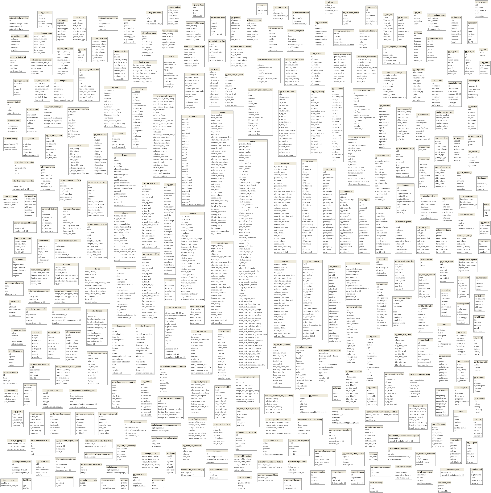

```{r setup}
require(kableExtra)
require(RPostgreSQL)
require(dm)
require(png)
knitr::opts_chunk$set(cache=F,tidy.opts = list(width.cutoff = 70),
                     tidy = TRUE,
                     max.print=50,fig.path="./Fig/explor_biocultural_",echo=T,
                     collapse=F, echo=T)
def.chunk.hook  <- knitr::knit_hooks$get("chunk")
knitr::knit_hooks$set(chunk = function(x, options) {
  x <- def.chunk.hook(x, options)
  paste0("\n \\", "footnotesize","\n\n", x, "\n\n \\normalsize\n\n")
})
```

# Base de datos en postgres

La base de datos en postgres está almacenada en un servidor en AWS.
Esta base de datos no se puede consultar desde el exterior, así, el procedimiento es:

1. conectarse, desde la red del instituto Humboldt, con ssh al servidor AWS
1. producir el archivo dump en el servidor con el comando `pg_dump -U dvnreader -d dvndb -Fc > dump_dvndb_20240918`
1. reproducir la base de datos en un computador local :

```bash
createdb biocultural
pg_restore -d biocultural -c --no-owner --no-acl ../access_dump/dump_dvndb_20240918
```

```{r}
biocultural<-dbConnect(PostgreSQL(),dbname="biocultural",user="marius")
```


# Descripción de la estructura de la base de datos de biocultural-dataverse

El sistema dataverse es un ensamblaje de software que permite almacenar, organizar y publicar juegos de datos.
El manejo de los datos y sus flujos se hace a través de una base de datos en PostgreSQL.

A continuación se presenta la estructura de las 109 tablas que contiene el sistema dataverse y sus relaciones

```{r fig.height=40,fig.width=25}
dm_object <- dm_from_con(biocultural, learn_keys = T)
A<-dm_object %>%
  dm_draw(view_type = "all")
A2<-DiagrammeRsvg::export_svg(A)%>%charToRaw()%>%rsvg::rsvg_png("Fig/explor_biocultural_structureBD.png")

```

Como se puede ver, es una estructura compleja con muchas tablas diferentes.
Muchas de esas tablas, en el sistema de biocultural, no se utilizan (no tienen registros):

```{r}
tables_biocultural <- dbListTables(biocultural)
info_tables<-function(conn,tables)
{
  sapply(tables,function(ta,co)
  {
    tab<-dbReadTable(co,ta)
    return(c(size=object.size(tab),nrow=nrow(tab),ncol=ncol(tab),propNull=sum(is.na(tab)|is.null(tab))/(nrow(tab)*ncol(tab))))
  },co=conn)
}
inf_tab_biotablero<-as.data.frame(t(info_tables(biocultural,tables_biocultural)))
kable(inf_tab_biotablero)
```

Podemos filtrar las tablas que tienen registros así:

```{r}
inf_tab_biotablero_signif<-inf_tab_biotablero[inf_tab_biotablero$nrow>1,]
inf_tab_biotablero_signif[order(inf_tab_biotablero_signif$size,decreasing=T),]
```

Acá representamos las relaciones entre tablas que tienen registros:

```{r fig.height=20,fig.width=15}
dm_object <- dm_from_con(biocultural, table_names=rownames(inf_tab_biotablero_signif), learn_keys = T)
A<-dm_object %>%
  dm_draw(view_type = "all")
A
```

# Ejercicios de extracción en la base de datos

## List of datasets

Los objetos de la base de datos están en la tabla `dvobject`

```{sql connection=biocultural}
SELECT *
FROM dvobject
LIMIT 10
```

En el sistema dataverse tenemos 3 tipos de objetos:

```{sql connection=biocultural}
SELECT dtype,count(*)
FROM dvobject
GROUP BY dtype
```

## Versiones de los datasets

Existen también versiones de los dataset, que están descritas en la tabla `datasetversion`, tabla que está referenciada en todas las tablas que describen los metadatos de los datasets.

```{sql connection=biocultural}
SELECT dataset_id,id,versionnumber,minorversionnumber,versionnote,versionstate,releasetime
FROM datasetversion
ORDER BY dataset_id, versionnumber, minorversionnumber
```

Cuales son los ultimos datasets:

```{sql connection=biocultural}
WITH a AS(
SELECT id, dataset_id, versionnumber||'.'||minorversionnumber version_tot, releasetime,
  ROW_NUMBER() OVER (PARTITION BY dataset_id ORDER BY releasetime DESC) recent_to_old
FROM datasetversion
)
SELECT *
FROM a
WHERE recent_to_old=1
```

Nota: con este codigo, podemos ahora extraer las variables que conciernen únicamente la ultima versión de cada uno de los dataset.

## Variables de los metadatos

La consulta siguiente permite obtener los metadatos de cada dataset:

```{sql connection=biocultural}
WITH a AS(
SELECT id, dataset_id, versionnumber||'.'||minorversionnumber version_tot, releasetime,
  ROW_NUMBER() OVER (PARTITION BY dataset_id ORDER BY releasetime DESC) recent_to_old
FROM datasetversion
)
SELECT dvo.id, version_tot, dft.title, value
FROM datasetfieldvalue dfv
LEFT JOIN datasetfield df ON dfv.datasetfield_id=df.id
LEFT JOIN datasetfieldtype dft ON df.datasetfieldtype_id=dft.id
LEFT JOIN a dver ON df.datasetversion_id=dver.id
LEFT JOIN dvobject dvo ON dver.dataset_id=dvo.id
WHERE dver.recent_to_old=1
ORDER BY dvo.id
LIMIT 10
```

En algunos casos, tenemos repeticiones de variables para algunos datasets:

```{sql connection=biocultural}
WITH a AS(
SELECT id, dataset_id, versionnumber||'.'||minorversionnumber version_tot, releasetime,
  ROW_NUMBER() OVER (PARTITION BY dataset_id ORDER BY releasetime DESC) recent_to_old
FROM datasetversion
), b AS(
SELECT dvo.id, version_tot, dft.title, value
FROM datasetfieldvalue dfv
LEFT JOIN datasetfield df ON dfv.datasetfield_id=df.id
LEFT JOIN datasetfieldtype dft ON df.datasetfieldtype_id=dft.id
LEFT JOIN a dver ON df.datasetversion_id=dver.id
LEFT JOIN dvobject dvo ON dver.dataset_id=dvo.id
WHERE dver.recent_to_old=1
ORDER BY dvo.id
)
SELECT id,title, count(*),STRING_AGG(value,'|')
FROM b
GROUP BY id,title
HAVING count(*)>1
```

Ahora para crear una matriz que pueda contener todas las variables:

```{r}
require(ecolUtil)
db_meta<-dbGetQuery(biocultural,
"WITH a AS(
SELECT id, dataset_id, versionnumber||'.'||minorversionnumber version_tot, releasetime,
  ROW_NUMBER() OVER (PARTITION BY dataset_id ORDER BY releasetime DESC) recent_to_old
FROM datasetversion
), b AS(
SELECT dvo.id, version_tot, dft.title, value
FROM datasetfieldvalue dfv
LEFT JOIN datasetfield df ON dfv.datasetfield_id=df.id
LEFT JOIN datasetfieldtype dft ON df.datasetfieldtype_id=dft.id
LEFT JOIN a dver ON df.datasetversion_id=dver.id
LEFT JOIN dvobject dvo ON dver.dataset_id=dvo.id
WHERE dver.recent_to_old=1
ORDER BY dvo.id
)
SELECT id,title, STRING_AGG(value,'|') value
FROM b
GROUP BY id,title
")

mat<-dbTab2mat(db_meta,col_samplingUnits = "id",col_species = "title",col_content = "value")
write.csv(mat,file="../../../data_metadatos_catalogos/export_datasets_biocultural.csv")

```


```{sql connection=biocultural}
SELECT dataset_id, ARRAY_AGG(versionnumber||'.'||minorversionnumber ORDER BY versionnumber,minorversionnumber)
FROM datasetversion
GROUP BY dataset_id
```


Getting the titles of datasets:

```r

dbGetQuery(biocultural,statement=
       
"SELECT dft.title,value,dtype,dvo.id,version
FROM datasetfieldvalue dfv
LEFT JOIN datasetfield df ON dfv.datasetfield_id=df.id
LEFT JOIN datasetfieldtype dft ON df.datasetfieldtype_id=dft.id
LEFT JOIN datasetversion dver ON df.datasetversion_id=dver.id
LEFT JOIN dvobject dvo ON dver.dataset_id=dvo.id
WHERE dft.title='Title'
ORDER BY dvo.id,version
") %>%
  kable()
```


```r
dbGetQuery(biocultural,statement=
       
"SELECT dft.title,value,identifier 
FROM datasetfieldvalue dfv
LEFT JOIN datasetfield df ON dfv.datasetfield_id=df.id
LEFT JOIN datasetfieldtype dft ON df.datasetfieldtype_id=dft.id
LEFT JOIN datasetversion dver ON df.datasetversion_id=dver.id
LEFT JOIN dvobject dvo ON dver.dataset_id=dvo.id
")
```


```{sql, connection=biocultural}
WITH a AS(
SELECT dft.name, value, identifier
FROM datasetfieldvalue dfv
LEFT JOIN datasetfield df ON dfv.datasetfield_id=df.id
LEFT JOIN datasetfieldtype dft ON df.datasetfieldtype_id=dft.id
LEFT JOIN datasetversion dver ON df.datasetversion_id=dver.id
LEFT JOIN dvobject dvo ON dver.dataset_id=dvo.id
WHERE value IS NOT NULL
)
SELECT name, identifier, ARRAY_AGG(value)
FROM a
GROUP BY name,identifier
HAVING count(DISTINCT value)>1
```

```{sql, connection=biocultural}
SELECT mdb.name metadatablock, dft.name var
FROM datasetfieldtype dft
LEFT JOIN metadatablock mdb ON dft.metadatablock_id=mdb.id
ORDER BY mdb.id
```
Para entender como funcionan los compound value:

```{sql, connection=biocultural}
SELECT id,name,parentdatasetfieldtype_id,allowMultiples
FROM datasetfieldtype
WHERE id BETWEEN 8 AND 12
```

```{sql, connection=biocultural}
SELECT value,  datasetfieldtype_id, parentdatasetfieldcompoundvalue_id
FROM datasetfieldvalue dfv 
LEFT JOIN datasetfield df ON dfv.datasetfield_id=df.id 
WHERE datasetfieldtype_id IN (8,9,10,11,12) 
ORDER BY parentdatasetfieldcompoundvalue_id
;
```

```{sql, connection=biocultural}
SELECT dfcv.*,dft.name
FROM  datasetfieldcompoundvalue dfcv
LEFT JOIN datasetfield df ON dfcv.parentdatasetfield_id=df.id
LEFT JOIN datasetfieldtype dft ON df.datasetfieldtype_id=dft.id
```

```{sql, connection=biocultural}
SELECT dft2.name,ARRAY_AGG(dft.name)
FROM datasetfieldtype dft
LEFT JOIN datasetfieldtype dft2 ON dft.parentdatasetfieldtype_id=dft2.id
WHERE dft.parentdatasetfieldtype_id IS NOT NULL
GROUP BY dft2.name
```


```{sql, connection=biocultural}
SELECT dft2.id, dft2.parentdatasetfieldtype_id
FROM datasetfieldtype dft1
JOIN datasetfieldtype dft2 ON dft1.parentdatasetfieldtype_id=dft2.id
WHERE dft2.parentdatasetfieldtype_id IS NOT NULL
```
```{r}
analyseVar<-dbGetQuery(biocultural,"
SELECT dft.id, mdb.name metadatablock, dft.name, fieldtype, allowmultiples,
  COUNT(dfv.value) FILTER (WHERE value IS NOT NULL) nb_values,
  COUNT(dfcvv.controlledvocabularyvalues_id) FILTER (WHERE dfcvv.controlledvocabularyvalues_id  IS NOT NULL) nb_controlled_values,
  dft.parentdatasetfieldtype_id,
  dft.id IN (SELECT DISTINCT parentdatasetfieldtype_id FROM datasetfieldtype WHERE parentdatasetfieldtype_id IS NOT NULL) is_parent
FROM datasetfieldtype dft
LEFT JOIN metadatablock mdb ON dft.metadatablock_id=mdb.id
LEFT JOIN datasetfield df ON df.datasetfieldtype_id=dft.id
LEFT JOIN datasetfieldvalue dfv ON dfv.datasetfield_id=df.id
LEFT JOIN datasetfield_controlledvocabularyvalue dfcvv ON dfcvv.datasetfield_id=df.id
GROUP BY dft.id, mdb.name, dft.name, fieldtype, allowmultiples, dft.id IN (SELECT DISTINCT parentdatasetfieldtype_id FROM datasetfieldtype WHERE parentdatasetfieldtype_id IS NOT NULL), dft.parentdatasetfieldtype_id
ORDER BY dft.id
")
```

Note: todo: add the controlled vocabulary values


```{r}
analyseVar$is_gp<-analyseVar$allowmultiples | analyseVar$is_parent
table(analyseVar$is_gp)
```


Let's see whether variables have values, or their children variables:

```{r}
toKeep<-logical(nrow(analyseVar))
for(i in analyseVar$id)
{toKeep[analyseVar$id==i]<- as.logical(
  sum(colSums(analyseVar[analyseVar$id == i | analyseVar$parentdatasetfieldtype_id == i,
                    c("nb_values","nb_controlled_values")],na.rm = T)))}
table(toKeep)
kable(analyseVar<-analyseVar[toKeep,])
```

******************************

**How much variables are not parents, have multiple values and have parent variables:**

```{r}
nrow(analyseVar[(!analyseVar$is_parent) & (analyseVar$allowmultiples) & (!is.na(analyseVar$parentdatasetfieldtype_id)),])
```

This does not happen, it will simplify the export and analyse of metadata, because variables either have parent variable or accept multiple values, not both, to be sure we apply:

```{r}
if(any((!is.na(analyseVar$parentdatasetfieldtype_id)) & analyseVar$allowmultiples))
   {stop("The code has been thought for cases where variables either have parent variable or accept multiple values, not both")}
```

******************************

**How much variables are not parent but have multiple values and have no parents:**

```{r}
nrow(analyseVar[(!analyseVar$is_parent) & (analyseVar$allowmultiples) & (is.na(analyseVar$parentdatasetfieldtype_id)),])
```

For these variables we will need to create subtables with only one variable and the repeated references to the dataset.

******************************

**Not parent, no multiple values and not children of a compound variable:**

```{r}
nrow(analyseVar[(!analyseVar$is_parent) & (!analyseVar$allowmultiples) & (is.na(analyseVar$parentdatasetfieldtype_id)),])
```

Those are the simplest cases: simple variable for a metadata block

******************************

**Single values and have parents**:

```{r}
nrow(analyseVar[(!analyseVar$is_parent) & (!analyseVar$allowmultiples) & (!is.na(analyseVar$parentdatasetfieldtype_id)),])
```

*******************************

**Is parent and has parent:**

```{r}
nrow(analyseVar[(analyseVar$is_parent)  & (!is.na(analyseVar$parentdatasetfieldtype_id)),])
stopifnot(!nrow(analyseVar[(analyseVar$is_parent)  & (!is.na(analyseVar$parentdatasetfieldtype_id)),]))
```

Other good news, variables have parents or are parents, not both!

*********************************

**Are parents of compound variables with single values**:

```{r}
# Variables parents, with single values
nrow(analyseVar[(analyseVar$is_parent) & (!analyseVar$allowmultiples),])
```

That is weird: what is the need of being a parent variable when all the children are simple variables without repetitions and the group is not repeated in the dataset?

Potentially we could just skip this compound variables and put the children in the main table.


*****************************************

**Parents of compound variables with multiple values**:

```{r}
nrow(analyseVar[(analyseVar$is_parent) & (analyseVar$allowmultiples),])
```

Make a subtable with all the children and the reference to the dataset.

***************************************

```{r}
kable(gpTab<-analyseVar[analyseVar$is_gp,])
listGp<-list()
for(i in 1:nrow(gpTab))
{
  listGp[[gpTab$name[i]]]<-analyseVar[analyseVar$id==gpTab[i,"id"]|(!is.na(analyseVar$parentdatasetfieldtype_id) & analyseVar$parentdatasetfieldtype_id==gpTab[i,"id"]),]
}
```


```{r fig.width=12, fig.height=12}
require(data.tree)
require(igraph)

analyseVar$var_gp<-factor(NA,levels=c("var","gp","gpvar"))
analyseVar$var_gp[analyseVar$is_parent]<-"gp"
analyseVar$var_gp[!analyseVar$is_parent & analyseVar$is_gp & rowSums(analyseVar[,c("nb_values","nb_controlled_values")])] <- "gpvar"
analyseVar$var_gp[!analyseVar$is_parent & !analyseVar$is_gp & rowSums(analyseVar[,c("nb_values","nb_controlled_values")])] <- "var"

analyseVar$gpHier <- analyseVar$inGp <- NA
for (i in 1:nrow(analyseVar))
{
  prepGpHier<-c("dataverse","dataset","datasetVersion",analyseVar$metadatablock[i])
  if(analyseVar$var_gp[i]=="gp")
  {
    prepGpHier<-c(prepGpHier,analyseVar$name[i])
    analyseVar$inGp[i]<-analyseVar$id[i]
  }
  if(analyseVar$var_gp[i]=="gpvar")
  {
    prepGpHier<-c(prepGpHier,paste0(analyseVar$name[i],"_"))
    analyseVar$inGp[i]<-analyseVar$id[i]
  }
  if(!is.na(analyseVar$parentdatasetfieldtype_id[i]))
  {
    prepGpHier<-c(prepGpHier,analyseVar$name[analyseVar$id==analyseVar$parentdatasetfieldtype_id[i]])
    analyseVar$inGp[i]<-analyseVar$parentdatasetfieldtype_id[i]
  }
  if(analyseVar$var_gp[i]=="var"||analyseVar$var_gp[i]=="gpvar"){
    prepGpHier<-c(prepGpHier,analyseVar$name[i])
  }
  analyseVar$gpHier[i]<-paste(prepGpHier,collapse="/")
}

gpTab<-rbind(
  data.frame(
  id=c(1000,1001,1002,1003,1004,1005),
  name=c("dataverse","dataset","datasetVersion","citation","geospatial","socialscience"),
  gpHier=c("dataverse","dataverse/dataset","dataverse/dataset/datasetVersion",paste("dataverse/dataset/datasetVersion",c("citation","geospatial","socialscience"),sep="/")),
  var_gp="gp",
  inGp=c(1000,1001,1002,1003,1004,1005)
  ),
  analyseVar[analyseVar$var_gp %in% c("gp", "gpvar"),c("id", "name", "gpHier", "var_gp", "inGp")]
)
gpTab$name[gpTab$var_gp=="gpvar"]<-paste0(gpTab$name[gpTab$var_gp=="gpvar"],"_")
gpTab$gpHier<-sub("(^.*_).*$","\\1",gpTab$gpHier)
gpTab$var_gp="gp"

varTab<-analyseVar[analyseVar$var_gp %in% c("gpvar", "var"), c("id", "name", "gpHier", "var_gp", "inGp") ]
addGp<-is.na(varTab$inGp)
varTab$inGp[addGp]<-gpTab$id[match(analyseVar[analyseVar$var_gp %in% c("gpvar", "var"),"metadatablock"][addGp],gpTab$name)]
varTab$var_gp<-"var"

varTab$inGp%in%gpTab$id

hierTab<-rbind(gpTab,varTab)
if(any(hierTab$name%in%NODE_RESERVED_NAMES_CONST))
  {
    hierTab$name[hierTab$name%in%NODE_RESERVED_NAMES_CONST]<-paste0(
      hierTab$name[hierTab$name%in%NODE_RESERVED_NAMES_CONST],"_")
  }
net<-as.igraph(FromDataFrameTable(hierTab,pathName="gpHier"))
m<-match(V(net)$name,hierTab$name)
V(net)$var_gp<-hierTab$var_gp[m]
V(net)$inGp<-as.numeric(factor(hierTab$inGp))[m]

plot(net, vertex.size=5, vertex.label=V(net)$name, vertex.shape=c(var="circle",gp="square")[V(net)$var_gp],
     vertex.color=rainbow(length(unique(V(net)$inGp)))[V(net)$inGp])
```


```{r}
dbDisconnect(biocultural)
```

