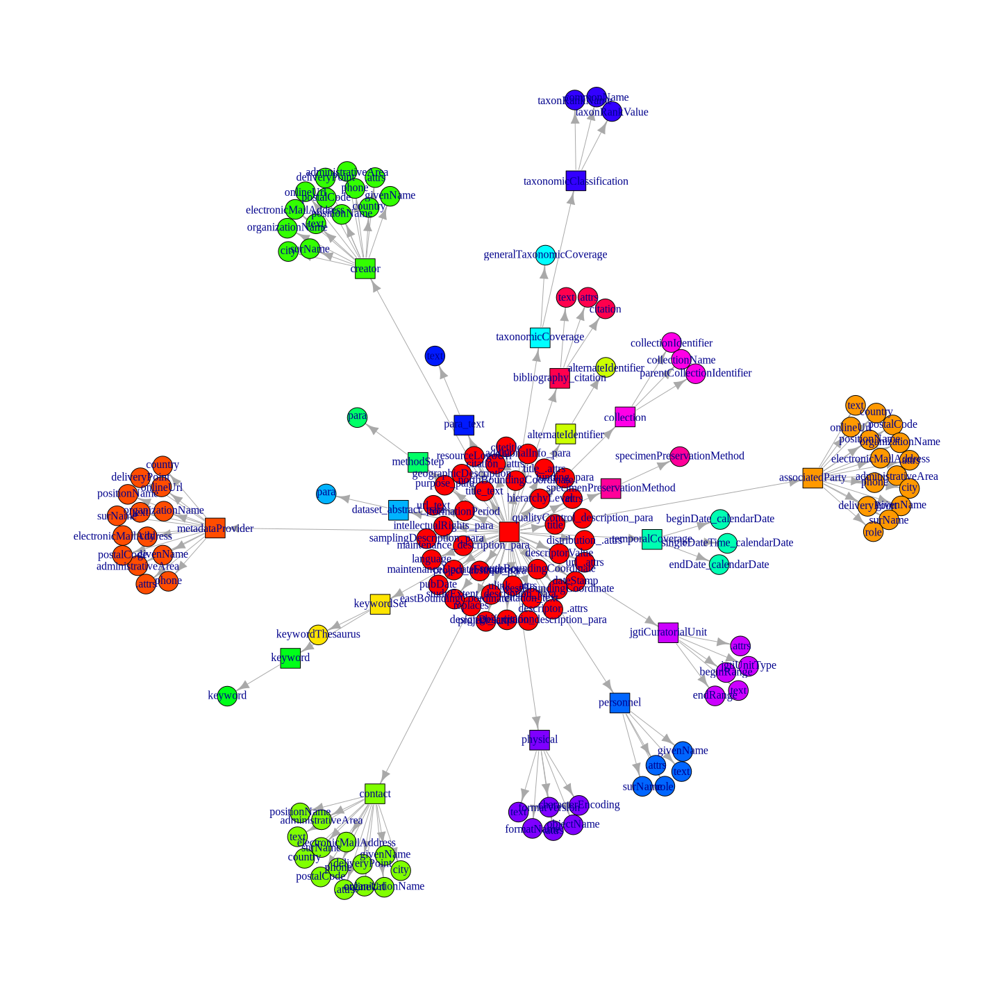

Estructura y descripción de los metadatos de Ceiba
================
Marius Bottin
2025-02-13

- [1 Datadir en el servidor Ceiba](#1-datadir-en-el-servidor-ceiba)
  - [1.1 Descripción](#11-descripción)
  - [1.2 Extracción de los metadatos](#12-extracción-de-los-metadatos)
- [2 Analisis de los metadatos](#2-analisis-de-los-metadatos)
  - [2.1 Repetitions](#21-repetitions)
  - [2.2 Extracting final variables (leaves of the xml
    tree)](#22-extracting-final-variables-leaves-of-the-xml-tree)
- [3 Estructura de repetición](#3-estructura-de-repetición)
  - [3.1 Managing names without repetitions in
    gp](#31-managing-names-without-repetitions-in-gp)
- [4 Representation of the variable
  structure](#4-representation-of-the-variable-structure)
- [5 Exportation of a table with values and references (dataset and
  variables)](#5-exportation-of-a-table-with-values-and-references-dataset-and-variables)
- [6 Utilizar sql para manejar los datos
  extraídos](#6-utilizar-sql-para-manejar-los-datos-extraídos)
  - [6.1 Crear la base de datos](#61-crear-la-base-de-datos)
  - [6.2 Crear las primeras tablas](#62-crear-las-primeras-tablas)

``` r
require(RPostgreSQL)
```

    ## Loading required package: RPostgreSQL

    ## Loading required package: DBI

``` r
require(dm)
```

    ## Loading required package: dm

    ## 
    ## Attaching package: 'dm'

    ## The following object is masked from 'package:stats':
    ## 
    ##     filter

``` r
require(png)
```

    ## Loading required package: png

``` r
knitr::opts_chunk$set(cache=T,tidy.opts = list(width.cutoff = 70),
                     tidy = TRUE,
                     max.print=50,fig.path="./Fig/explor_ceiba_",echo=T,
                     collapse=F, echo=T)
def.chunk.hook  <- knitr::knit_hooks$get("chunk")
knitr::knit_hooks$set(chunk = function(x, options) {
  x <- def.chunk.hook(x, options)
  paste0("\n \\", "footnotesize","\n\n", x, "\n\n \\normalsize\n\n")
})
```

# 1 Datadir en el servidor Ceiba

## 1.1 Descripción

Todos los datos de Ceiba están organizados como carpetas en el datadir
del servidor. Se maneja después con el sistema Integrated Publishing
Toolkit desarrollado por GBIF.

En cada carpeta (cada juego de datos), podemos encontrar:

- el archivo comprimido que contiene los archivos y los metadatos en
  formato DarwinCore completo.
- el archivo `eml.xml` que contiene los metadatos, y todas las versiones
  del archivo (con los nombres `eml-1.xml`, `eml-2.xml` etc)
- el archivo `publication.log` que contiene el historial de
  publicación/modificación del juego de datos
- archivos de descripción de los juegos de datos en “Rich Text Format”
  (rtf), tambien para cada versión publicada
- archivos de administración de datos y metadatos `resource.xml`
- una carpeta `sources` que contiene los datos (?)

## 1.2 Extracción de los metadatos

En ssh, accedemos al servidor de ceiba desde la red del instituto:

``` bash
ssh integracion@192.168.11.74
```

Extraemos 3 archivos:

- un archivo que tiene las direcciones de los archivos “eml.xml” y sus
  contenidos
- un archivo que contiene las direcciones de los archivos “resource.xml”
  y sus contenidos
- un catalogo de todos los archivos presentes en la carpeta de datos
  manejada por el ipt

Esos 2 archivos se pueden obtener con:

``` bash
find /home/pem/datadir/ -name eml.xml -exec bash file_and_content.sh {} \; >file_and_content_result_eml 2> errors_find_file_and_content_eml
find /home/pem/datadir/ -name resource.xml  -exec bash file_and_content.sh {} \; >file_and_content_result_resource 2> errors_find_file_and_content_resource
find /home/pem/datadir/ -type f  > result_find
```

Los archivos se pueden descargar desde la red del instituto, gracias al
applicativo scp, que funciona a través de ssh.

# 2 Analisis de los metadatos

``` r
result_find <- readLines("../../../data_metadatos_catalogos/ceiba/result_find")
meta_ceiba <- readLines("../../../data_metadatos_catalogos/ceiba/file_and_content_result_eml")
meta_ceiba <- meta_ceiba[!meta_ceiba == ""]
```

Numero de archivos de metadatos

``` r
sum(grepl("---file:.*---", meta_ceiba))
```

    ## [1] 1051

We search for the names/pathes of the files and we create the tables
describing the adresses in the R object

``` r
nameFilesAddr <- grep("---file:.*---", meta_ceiba)
addresses_xml <- data.frame(file = sub("^---file:(.*)---$", "\\1", meta_ceiba[nameFilesAddr]),
    beg = nameFilesAddr + 1, end = c(nameFilesAddr[2:length(nameFilesAddr)] -
        1, length(meta_ceiba)))
```

Checking integrity and correspondances with the other objects

``` r
any(duplicated(addresses_xml$file))
```

    ## [1] FALSE

``` r
match(addresses_xml$file, result_find)
```

    ##    [1]     4    22    72    89   145   185   198   209   251   270   285   308
    ##   [13]   323   334   356   394   410   434   442   482   516   527   581   597
    ##   [25]   601   609   616   629   651   661   680   697   712   733   751   768
    ##   [37]   779   795   808   849   890   900   923   956   975   990  1009  1031
    ##   [49]  1050  1083  1104  1119  1131  1169  1180  1225  1258  1278  1303  1324
    ##   [61]  1349  1366  1390  1413  1436  1459  1502  1533  1564  1591  1618  1641
    ##   [73]  1664  1691  1722  1745  1784  1808  1843  1866  1907  1917  1956  1985
    ##   [85]  2019  2061  2099  2135  2174  2207  2237  2267  2303  2336  2366  2392
    ##   [97]  2411  2426  2456  2497  2535  2595  2606  2625  2674  2703  2711  2752
    ##  [109]  2765  2777  2790  2807  2843  2866  2886  2897  2921  2936  2944  2949
    ##  [121]  2994  3016  3052  3063  3082  3112  3123  3130  3158  3176  3188  3222
    ##  [133]  3237  3257  3272  3303  3333  3359  3407  3457  3508  3557  3595  3629
    ##  [145]  3661  3728  3765  3816  3853  3895  3923  3958  3981  3999  4011  4020
    ##  [157]  4032  4055  4071  4079  4104  4118  4129  4140  4167  4188  4221  4231
    ##  [169]  4246  4263  4302  4353  4380  4415  4446  4458  4469  4480  4491  4508
    ##  [181]  4529  4546  4560  4577  4592  4604  4627  4653  4671  4679  4693  4706
    ##  [193]  4716  4736  4765  4784  4798  4810  4826  4839  4856  4892  4933  4972
    ##  [205]  5010  5046  5070  5109  5150  5184  5206  5243  5276  5289  5296  5304
    ##  [217]  5320  5332  5345  5358  5390  5425  5448  5463  5478  5488  5498  5506
    ##  [229]  5514  5526  5534  5544  5554  5561  5573  5585  5598  5616  5630  5645
    ##  [241]  5655  5668  5684  5692  5706  5723  5741  5762  5785  5822  5857  5880
    ##  [253]  5896  5914  5928  5935  5955  5970  5990  6005  6023  6038  6055  6060
    ##  [265]  6081  6098  6117  6135  6147  6160  6178  6201  6232  6248  6260  6294
    ##  [277]  6338  6384  6416  6449  6481  6507  6532  6556  6576  6592  6608  6626
    ##  [289]  6642  6654  6683  6712  6739  6754  6768  6780  6804  6821  6840  6857
    ##  [301]  6873  6885  6906  6927  6941  6950  6982  7022  7070  7121  7162  7201
    ##  [313]  7219  7246  7265  7304  7332  7350  7364  7376  7393  7412  7430  7449
    ##  [325]  7462  7476  7491  7512  7534  7553  7581  7605  7625  7646  7674  7702
    ##  [337]  7718  7728  7735  7751  7769  7787  7807  7835  7858  7883  7906  7925
    ##  [349]  7958  7987  8008  8025  8045  8070  8083  8121  8138  8157  8171  8190
    ##  [361]  8228  8254  8267  8278  8307  8326  8340  8351  8357  8365  8374  8381
    ##  [373]  8388  8404  8422  8437  8462  8479  8493  8503  8517  8541  8558  8572
    ##  [385]  8585  8607  8624  8637  8656  8680  8715  8750  8765  8779  8804  8821
    ##  [397]  8847  8880  8917  8942  8945  8973  9011  9039  9055  9080  9103  9114
    ##  [409]  9149  9185  9203  9249  9278  9314  9340  9358  9376  9388  9414  9437
    ##  [421]  9479  9516  9540  9559  9578  9589  9607  9619  9644  9694  9729  9745
    ##  [433]  9764  9784  9804  9826  9856  9887  9912  9928  9947  9968  9996 10014
    ##  [445] 10021 10048 10083 10116 10132 10156 10176 10187 10198 10239 10266 10285
    ##  [457] 10297 10317 10337 10361 10393 10419 10458 10477 10499 10530 10564 10586
    ##  [469] 10621 10653 10686 10705 10712 10722 10740 10751 10760 10769 10777 10801
    ##  [481] 10845 10888 10932 10981 11025 11062 11093 11147 11199 11241 11278 11318
    ##  [493] 11358 11390 11447 11498 11525 11537 11554 11572 11589 11615 11632 11679
    ##  [505] 11705 11717 11743 11765 11798 11815 11841 11864 11887 11908 11935 11954
    ##  [517] 11977 12017 12042 12059 12077 12091 12109 12143 12169 12189 12202 12240
    ##  [529] 12291 12321 12343 12356 12373 12399 12418 12436 12452 12463 12474 12523
    ##  [541] 12557 12599 12632 12650 12660 12690 12716 12761 12808 12834 12846 12862
    ##  [553] 12883 12902 12913 12919 12931 12936 12976 13003 13019 13036 13045 13055
    ##  [565] 13105 13153 13194 13215 13259 13289 13307 13320 13329 13340 13356 13370
    ##  [577] 13390 13418 13447 13464 13477 13492 13506 13521 13533 13546 13565 13588
    ##  [589] 13605 13616 13629 13644 13669 13685 13699 13714 13741 13778 13816 13844
    ##  [601] 13863 13890 13913 13934 13950 13968 13985 14009 14034 14083 14112 14127
    ##  [613] 14143 14160 14177 14198 14226 14258 14283 14300 14317 14335 14350 14365
    ##  [625] 14390 14416 14437 14452 14472 14489 14499 14506 14520 14527 14537 14558
    ##  [637] 14601 14630 14645 14662 14681 14698 14717 14732 14759 14783 14801 14817
    ##  [649] 14827 14834 14854 14880 14901 14916 14941 14972 14995 15011 15025 15038
    ##  [661] 15065 15088 15118 15150 15174 15193 15212 15229 15255 15273 15291 15305
    ##  [673] 15325 15355 15375 15391 15421 15446 15466 15479 15504 15532 15554 15567
    ##  [685] 15571 15582 15599 15622 15638 15664 15684 15717 15743 15766 15783 15806
    ##  [697] 15831 15860 15893 15918 15942 15962 15976 15988 16003 16016 16039 16064
    ##  [709] 16092 16119 16133 16159 16186 16208 16225 16238 16273 16313 16337 16368
    ##  [721] 16384 16406 16427 16449 16479 16509 16524 16551 16569 16588 16610 16625
    ##  [733] 16635 16647 16660 16671 16695 16719 16758 16798 16822 16836 16848 16858
    ##  [745] 16868 16881 16896 16936 16964 16977 17026 17065 17105 17131 17156 17191
    ##  [757] 17213 17228 17242 17257 17268 17286 17324 17364 17389 17411 17435 17453
    ##  [769] 17471 17493 17531 17571 17588 17607 17636 17653 17673 17690 17735 17801
    ##  [781] 17847 17875 17888 17895 17908 17942 17961 17975 18000 18016 18028 18035
    ##  [793] 18048 18064 18081 18099 18124 18144 18162 18184 18202 18217 18234 18245
    ##  [805] 18259 18277 18289 18303 18321 18345 18359 18370 18382 18393 18417 18431
    ##  [817] 18438 18476 18530 18580 18620 18644 18664 18677 18690 18705 18720 18741
    ##  [829] 18780 18805 18841 18880 18912 18941 18966 18982 19002 19014 19028 19043
    ##  [841] 19073 19112 19148 19168 19188 19221 19247 19273 19290 19301 19319 19343
    ##  [853] 19360 19379 19415 19439 19453 19490 19536 19575 19598 19613 19629 19644
    ##  [865] 19660 19672 19695 19724 19765 19795 19812 19825 19844 19863 19885 19904
    ##  [877] 19917 19937 19954 19966 19978 19991 20020 20060 20099 20126 20153 20182
    ##  [889] 20212 20229 20242 20254 20264 20284 20298 20305 20329 20353 20375 20399
    ##  [901] 20424 20458 20481 20500 20519 20549 20569 20584 20602 20628 20645 20655
    ##  [913] 20679 20714 20735 20751 20772 20794 20814 20829 20851 20891 20918 20930
    ##  [925] 20945 20966 20984 21012 21038 21058 21080 21100 21121 21136 21159 21177
    ##  [937] 21192 21216 21232 21255 21282 21300 21337 21368 21381 21390 21400 21416
    ##  [949] 21426 21442 21452 21463 21474 21490 21512 21527 21543 21561 21578 21594
    ##  [961] 21608 21620 21634 21656 21666 21680 21689 21705 21723 21737 21755 21763
    ##  [973] 21780 21785 21800 21810 21820 21828 21836 21860 21879 21892 21911 21919
    ##  [985] 21926 21937 21959 21972 21987 22002 22024 22046 22061 22076 22091 22114
    ##  [997] 22131 22146 22159 22172 22185 22203 22218 22233 22246 22257 22269 22280
    ## [1009] 22291 22310 22326 22344 22362 22378 22394 22410 22427 22441 22460 22473
    ## [1021] 22479 22493 22513 22521 22534 22548 22566 22577 22591 22601 22615 22629
    ## [1033] 22637 22644 22660 22668 22679 22688 22710 22720 22735 22746 22760 22770
    ## [1045] 22780 22782 22792 22802 22812 22826 22832

There might be a problem when there is an empty xml. After manual
checking, we realize that this problem creates an end before the beg, so
to avoid these lines in the rest of the code, we just suppress these
cases in the addresses_xml object:

``` r
w_empty <- which((addresses_xml$beg[1:(nrow(addresses_xml) - 1)] + 1) ==
    addresses_xml$beg[2:nrow(addresses_xml)])
addresses_xml[(w_empty - 2):(w_empty + 2), ]
```

    ##                                                                       file
    ## 1048                   /home/pem/datadir/resources/yaguara_sonidos/eml.xml
    ## 1049               /home/pem/datadir/resources/frutos-corozo_cesar/eml.xml
    ## 1050            /home/pem/datadir/resources/cacay-moriche_guaviare/eml.xml
    ## 1051 /home/pem/datadir/resources/reserva-natural_lostucanes-boyaca/eml.xml
    ## NA                                                                    <NA>
    ##         beg    end
    ## 1048 451243 451646
    ## 1049 451648 451909
    ## 1050 451911 451910
    ## 1051 451912 452135
    ## NA       NA     NA

``` r
addresses_xml[addresses_xml$beg > addresses_xml$end, ]
```

    ##                                                            file    beg    end
    ## 1050 /home/pem/datadir/resources/cacay-moriche_guaviare/eml.xml 451911 451910

``` r
addresses_xml <- addresses_xml[addresses_xml$beg < addresses_xml$end, ]
```

Separating by origin files:

``` r
xml_files <- apply(addresses_xml, 1, function(a, rl) paste(rl[a[2]:a[3]],
    sep = "\n", collapse = "\n"), rl = meta_ceiba)
names(xml_files) <- addresses_xml$file
```

Then reading the xml code:

``` r
require(XML)
```

    ## Loading required package: XML

``` r
require(xml2)
```

    ## Loading required package: xml2

``` r
xml_list <- lapply(xml_files, function(x) xmlToList(xmlParse(x)))
xml_list2 <- lapply(xml_files, function(x) xmlToList(xmlParse(x), simplify = F))
```

I gotta check this part because it does not make sense: this only take
the large categories which are:

- dataset
- additionalMetadata
- .attrs

``` r
names1<-names(xml_list[[1]])
names_all<-lapply(xml_list,names) 
sapply(names_all,function(x,y)!all(y==x),y=names1)
(names_fields<-unique(Reduce(c,names_all)))
mostComplete<-which.max(sapply(names_all,function(x,y)sum(y%in%x),y=names_fields))
  
```

Seems that part is useless as well:

``` r
level1<-data.frame(
  name=names_fields,
  hasValue=F
)
A<-sapply(xml_list,names)
A_corres<-data.frame(
  lev0_nb=rep(1:length(A),sapply(A,length)),
  lev1_nb=unlist(lapply(A,function(x)1:length(x))),
  level1_match=unlist(lapply(A,function(x,y)match(x,y),y=level1$name))
)
LIST<- ISNULL <- logical(length=nrow(A_corres))
LENGTH <- DEPTH <- numeric(length=nrow(A_corres))
# NAMES <- list()
# for(i in 1:nrow(A_corres))LIST[i]<-is.list(xml_list[[A_corres[i,1]]][[A_corres[i,2]]])
# for(i in 1:nrow(A_corres))ISNULL[i]<-is.null(xml_list[[A_corres[i,1]]][[A_corres[i,2]]])
# for(i in 1:nrow(A_corres))LENGTH[i]<-length(xml_list[[A_corres[i,1]]][[A_corres[i,2]]])
# for(i in 1:nrow(A_corres))DEPTH[i]<-ldepth(xml_list[[A_corres[i,1]]][[A_corres[i,2]]])
# for(i in 1:nrow(A_corres))NAMES[[i]]<-names(xml_list[[A_corres[i,1]]][[A_corres[i,2]]])
# tapply(LENGTH,level1[A_corres[,3],"name"],table)
# table(unlist(NAMES[A_corres$level1_match==1]),useNA = "ifany")
# table(unlist(NAMES[A_corres$level1_match==2]),useNA = "ifany")
# table(unlist(NAMES[A_corres$level1_match==3]),useNA = "ifany")
# table(unlist(NAMES[A_corres$level1_match==4]),useNA = "ifany")
# table(unlist(NAMES[A_corres$level1_match==5]),useNA = "ifany")
# table(unlist(NAMES[A_corres$level1_match==6]),useNA = "ifany")
# table(unlist(NAMES[A_corres$level1_match==7]),useNA = "ifany")
# table(unlist(NAMES[A_corres$level1_match==8]),useNA = "ifany")
# table(unlist(NAMES[A_corres$level1_match==9]),useNA = "ifany")
# table(unlist(NAMES[A_corres$level1_match==10]),useNA = "ifany")
# table(unlist(NAMES[A_corres$level1_match==11]),useNA = "ifany")
# table(unlist(NAMES[A_corres$level1_match==12]),useNA = "ifany")
# table(unlist(NAMES[A_corres$level1_match==13]),useNA = "ifany")
# table(unlist(NAMES[A_corres$level1_match==14]),useNA = "ifany")
# table(unlist(NAMES[A_corres$level1_match==15]),useNA = "ifany")
# table(unlist(NAMES[A_corres$level1_match==16]),useNA = "ifany")
# table(unlist(NAMES[A_corres$level1_match==17]),useNA = "ifany")
# table(unlist(NAMES[A_corres$level1_match==18]),useNA = "ifany")
# table(unlist(NAMES[A_corres$level1_match==19]),useNA = "ifany")
# table(unlist(NAMES[A_corres$level1_match==20]),useNA = "ifany")
# table(unlist(NAMES[A_corres$level1_match==21]),useNA = "ifany")
# table(unlist(NAMES[A_corres$level1_match==22]),useNA = "ifany")
# table(unlist(NAMES[A_corres$level1_match==23]),useNA = "ifany")
# table(unlist(NAMES[A_corres$level1_match==24]),useNA = "ifany")
# table(unlist(NAMES[A_corres$level1_match==25]),useNA = "ifany")
# table(unlist(NAMES[A_corres$level1_match==26]),useNA = "ifany")
# table(unlist(NAMES[A_corres$level1_match==27]),useNA = "ifany")
```

Algoritmo que permite navegar en toda la estructura de los xml. Basado
en 2 tablas:

1.  tabla que describe la jerarquía de los campos potenciales
2.  tabla que describe la presencia de los campos para los registros

Note: the following function get the elements from a recursive path

``` r
recPathList <- function(listNavig, path) {
    x = listNavig
    for (i in path) x <- x[[i]]
    return(x)
}
# example
```

Lo que hacemos primero es crear una matriz que contiene todo los paths,
nivel por nivel que existen en la lista representando el XML. Anotar:
cuando el nivel siguiente no es una lista, no fila está añadida.

``` r
require(collapse)
```

    ## Loading required package: collapse

    ## collapse 2.0.19, see ?`collapse-package` or ?`collapse-documentation`

    ## 
    ## Attaching package: 'collapse'

    ## The following object is masked from 'package:stats':
    ## 
    ##     D

``` r
listStruct <- matrix(data = c(1:length(xml_list), rep(NA, length(xml_list) *
    (ldepth(xml_list) - 1))), nrow = length(xml_list), ncol = ldepth(xml_list))
findNextLevelPaths <- function(li, pathParent, maxDepth) {
    if (!is.list(recPathList(li, pathParent))) {
        return(NULL)
    }
    LN <- length(recPathList(li, pathParent))
    return(cbind(matrix(data = pathParent, nrow = LN, byrow = T, ncol = length(pathParent)),
        1:LN, matrix(NA, nrow = LN, ncol = maxDepth - (length(pathParent) +
            1))))
}
for (i in 2:ncol(listStruct)) {
    cat("number of parents", sum(apply(listStruct, 1, function(x) length(na.omit(x))) ==
        (i - 1)), "\n")
    listStruct <- rbind(listStruct, Reduce(rbind, apply(listStruct[apply(listStruct,
        1, function(x) length(na.omit(x))) == (i - 1), ], 1, function(p,
        l, ml) {
        p = p[!is.na(p)]
        findNextLevelPaths(l, p, ml)
    }, l = xml_list, ml = ncol(listStruct), simplify = F)))
}
```

    ## number of parents 1050 
    ## number of parents 3150 
    ## number of parents 26793 
    ## number of parents 96966 
    ## number of parents 101621 
    ## number of parents 91287 
    ## number of parents 8511 
    ## number of parents 1350

Now let’s apply a function to transform this matrix in a name matrix.

``` r
# nameCurrentLevel<-apply(listStruct[apply(listStruct,1,function(x)length(na.omit(x)))>1,],1,function(x,li)
nameCurrentLevel <- apply(listStruct, 1, function(x, li) {
    A <- na.omit(x)
    last <- A[length(A)]
    path <- A[-length(A)]
    names(recPathList(li, path))[last]
}, li = xml_list)
nameCurrentLevel[(length(nameCurrentLevel) - 50):length(nameCurrentLevel)]
```

    ##  [1] ".attrs" "text"   ".attrs" "text"   ".attrs" "text"   ".attrs" "text"  
    ##  [9] ".attrs" "text"   ".attrs" "text"   ".attrs" "text"   ".attrs" "text"  
    ## [17] ".attrs" "text"   ".attrs" "text"   ".attrs" "text"   ".attrs" "text"  
    ## [25] ".attrs" "text"   ".attrs" "text"   ".attrs" "text"   ".attrs" "text"  
    ## [33] ".attrs" "text"   ".attrs" "text"   ".attrs" "text"   ".attrs" "text"  
    ## [41] ".attrs" "text"   ".attrs" "text"   ".attrs" "text"   ".attrs" "text"  
    ## [49] ".attrs" "text"   ".attrs"

``` r
allNames <- matrix(NA, nrow = nrow(listStruct), ncol = ncol(listStruct) -
    1)
for (i in 1:nrow(listStruct)) {
    if (i%%50000 == 0)
        cat(i, "/", nrow(listStruct), "\n")
    for (j in 2:max(2, length(na.omit(listStruct[i, ])))) {

        path <- listStruct[i, 1:(j - 1)]
        last <- listStruct[i, j]
        allNames[i, j - 1] <- names(recPathList(xml_list, path))[last]
    }
}
```

    ## 50000 / 331960 
    ## 100000 / 331960 
    ## 150000 / 331960 
    ## 200000 / 331960 
    ## 250000 / 331960 
    ## 300000 / 331960

Desde el nivel 2 hasta maximo, determinamos cual es el parent:

``` r
level <- apply(listStruct, 1, function(x) length(na.omit(x)))
parent <- integer(nrow(listStruct))
for (i in 2:max(level)) {
    m <- match(apply(listStruct[level == i, ], 1, function(x) {
        x[which.max(which(!is.na(x)))] <- NA
        return(x)
    }, simplify = F), split(listStruct[level == (i - 1), ], row(listStruct[level ==
        (i - 1), ])))
    parent[level == i] <- which(level == (i - 1))[m]
}
```

Cuales son los hijos directos?

``` r
directChildren <- list()
for (i in 1:length(parent)) {
    directChildren[[i]] <- which(parent == i)
}
```

``` r
allChildren <- vector(mode = "list", length(directChildren))
for (i in 1:length(allChildren)) {
    newChildren <- children <- directChildren[[i]]
    while (length(newChildren) > 0) {
        newChildren <- unlist(directChildren[newChildren])
        children <- c(children, newChildren)
    }
    allChildren[[i]] <- children
}
```

## 2.1 Repetitions

From the children list, we may see what are the repetitions.

`directChildren` takes all nivels in the `listStruct` object which
describes all the hierarchical levels in the xml. For each of these
levels (each row of `listStruct`), it gives the children. It results in
a list which contains all rows of `listStruct`, without duplication:

``` r
length(directChildren)
```

    ## [1] 331960

``` r
any(duplicated(unlist(directChildren)))
```

    ## [1] FALSE

Hence, we can use this simple list to see whether there are repetitions
there of the names, which are in nameCurrentLevel

``` r
nameChildren <- lapply(directChildren, function(x, n) {
    n[x]
}, n = nameCurrentLevel)
dupliNameChildren <- lapply(nameChildren, duplicated)
anyDupliNameChildren <- sapply(dupliNameChildren, any)
```

Using mapply (to apply a function to corresponding elements of various
list), we may use, in the cases where there are various children with
the same names:

``` r
# La función numRep da el indice de repetición en un NOTE: not sure
# how it would react to NA
numRep <- function(x) {
    x <- factor(x)
    un <- levels(x)
    m <- match(x, un)
    t <- table(x)
    res <- integer(length(x))
    res[order(m)] <- unlist(lapply(t, function(x) 1:x))
    return(res)
}
```

``` r
repetitions <- Reduce(rbind, mapply(function(id_listStruct, name, dupl) {
    nameUn <- unique(name[dupl])
    mnD <- match(name, nameUn)
    num <- numRep(name)
    return(data.frame(id = id_listStruct[!is.na(mnD)], name = name[!is.na(mnD)],
        numRep = num[!is.na(mnD)]))
}, id_listStruct = directChildren[anyDupliNameChildren], name = nameChildren[anyDupliNameChildren],
    dupl = dupliNameChildren[anyDupliNameChildren], SIMPLIFY = F))
```

Now we will create a matrix of the same dimension as listStruct, with
values 0 for the levels which exist, NA when the level does not exist
and instead of 0, the number of the repetition when it does apply

``` r
listStructRep <- matrix(0L, nrow(listStruct), ncol(listStruct))
listStructRep[is.na(listStruct)] <- NA
for (i in 1:nrow(repetitions)) {
    matrixAdd <- cbind(row = c(repetitions$id[i], allChildren[[repetitions$id[i]]]),
        col = level[repetitions$id[i]])
    listStructRep[matrixAdd] <- repetitions$numRep[i]
}
```

## 2.2 Extracting final variables (leaves of the xml tree)

Cuales son los path que contienen una lista

``` r
contList <- apply(listStruct, 1, function(x, li) {
    path = na.omit(x)
    return(is.list(recPathList(li, path)))
}, li = xml_list)
```

Cuales son los casos que no contienen listas, pero son nulos:

``` r
contNull <- apply(listStruct, 1, function(x, li) {
    path = na.omit(x)
    return(is.null(recPathList(li, path)))
}, li = xml_list)
noListButNull <- !contList & contNull
sum(!contList)
```

    ## [1] 223595

``` r
sum(noListButNull)
```

    ## [1] 1123

``` r
sum(!contList & !contNull)
```

    ## [1] 222472

``` r
# which of listStruct is a non-null, non-list value
leaves <- which(!contList & !contNull)
# table of unique variable names
un_leaves <- unique(allNames[leaves, ])
# correspondence between non-null, non-list values and unique
# variable names
m <- match(split(allNames[leaves, ], row(allNames[leaves, ])), split(un_leaves,
    row(un_leaves)))
# Correspondence between listStruct and unique variable names
corres_leaves <- integer(nrow(listStruct))
corres_leaves[leaves] <- m
```

``` r
NAMES <- apply(un_leaves, 1, function(x) paste(na.omit(x), collapse = "."))
nb_byVar <- table(m)
names(nb_byVar) <- NAMES
nb_byVar[order(nb_byVar)]
```

    ##                                           additionalMetadata.metadata.gbif.formationPeriod 
    ##                                                                                          1 
    ##                                                       dataset.maintenance.description.para 
    ##                                                                                          1 
    ##                              dataset.coverage.temporalCoverage.singleDateTime.calendarDate 
    ##                                                                                          3 
    ##                         additionalMetadata.metadata.gbif.jgtiCuratorialUnit.jgtiUnits.text 
    ##                                                                                         12 
    ##                       additionalMetadata.metadata.gbif.jgtiCuratorialUnit.jgtiUnits..attrs 
    ##                                                                                         12 
    ##                                                                dataset.contact.userId.text 
    ##                                                                                         28 
    ##                                                              dataset.contact.userId..attrs 
    ##                                                                                         28 
    ##                                                        dataset.associatedParty.userId.text 
    ##                                                                                         29 
    ##                                                      dataset.associatedParty.userId..attrs 
    ##                                                                                         29 
    ##                                                      dataset.project.personnel.userId.text 
    ##                                                                                         29 
    ##                                                    dataset.project.personnel.userId..attrs 
    ##                                                                                         29 
    ##                                                       dataset.metadataProvider.userId.text 
    ##                                                                                         33 
    ##                                                     dataset.metadataProvider.userId..attrs 
    ##                                                                                         33 
    ##                                                  additionalMetadata.metadata.gbif.citation 
    ##                                                                                         37 
    ##                                                                dataset.creator.userId.text 
    ##                                                                                         37 
    ##                                                              dataset.creator.userId..attrs 
    ##                                                                                         37 
    ##               additionalMetadata.metadata.gbif.jgtiCuratorialUnit.jgtiUnitRange.beginRange 
    ##                                                                                         43 
    ##                 additionalMetadata.metadata.gbif.jgtiCuratorialUnit.jgtiUnitRange.endRange 
    ##                                                                                         43 
    ##                                           additionalMetadata.metadata.gbif.resourceLogoUrl 
    ##                                                                                         44 
    ##                           additionalMetadata.metadata.gbif.jgtiCuratorialUnit.jgtiUnitType 
    ##                                                                                         55 
    ##                                                              dataset.project.abstract.para 
    ##                                                                                        103 
    ##                                                         dataset.contact.address.postalCode 
    ##                                                                                        109 
    ## additionalMetadata.metadata.gbif.physical.dataFormat.externallyDefinedFormat.formatVersion 
    ##                                                                                        118 
    ##                                                         dataset.creator.address.postalCode 
    ##                                                                                        124 
    ##                                                                     dataset.project..attrs 
    ##                                                                                        125 
    ##                                                dataset.metadataProvider.address.postalCode 
    ##                                                                                        129 
    ##                                            dataset.intellectualRights.para.ulink.citetitle 
    ##                                                                                        319 
    ##                                               dataset.intellectualRights.para.ulink..attrs 
    ##                                                                                        319 
    ##                                                 dataset.associatedParty.address.postalCode 
    ##                                                                                        443 
    ##                                                                dataset.additionalInfo.para 
    ##                                                                                        466 
    ##                                                                  dataset.creator.onlineUrl 
    ##                                                                                        484 
    ##                                                         dataset.metadataProvider.onlineUrl 
    ##                                                                                        489 
    ##                                                                  dataset.contact.onlineUrl 
    ##                                                                                        603 
    ##                                       additionalMetadata.metadata.gbif.physical.objectName 
    ##                                                                                        616 
    ##                                additionalMetadata.metadata.gbif.physical.characterEncoding 
    ##                                                                                        616 
    ##    additionalMetadata.metadata.gbif.physical.dataFormat.externallyDefinedFormat.formatName 
    ##                                                                                        616 
    ##                     additionalMetadata.metadata.gbif.physical.distribution.online.url.text 
    ##                                                                                        616 
    ##                   additionalMetadata.metadata.gbif.physical.distribution.online.url..attrs 
    ##                                                                                        616 
    ##                                additionalMetadata.metadata.gbif.specimenPreservationMethod 
    ##                                                                                        621 
    ##                                                       dataset.intellectualRights.para.text 
    ##                                                                                        638 
    ##                                            dataset.methods.qualityControl.description.para 
    ##                                                                                        650 
    ##                                                            dataset.intellectualRights.para 
    ##                                                                                        725 
    ##                     additionalMetadata.metadata.gbif.collection.parentCollectionIdentifier 
    ##                                                                                        730 
    ##                           additionalMetadata.metadata.gbif.collection.collectionIdentifier 
    ##                                                                                        817 
    ##                                         dataset.project.designDescription.description.para 
    ##                                                                                        820 
    ##                                 additionalMetadata.metadata.gbif.collection.collectionName 
    ##                                                                                        828 
    ##                                                                      dataset.creator.phone 
    ##                                                                                        910 
    ##                                                  additionalMetadata.metadata.gbif.replaces 
    ##                                                                                        916 
    ##                                                             dataset.metadataProvider.phone 
    ##                                                                                        918 
    ##                            dataset.project.studyAreaDescription.descriptor.descriptorValue 
    ##                                                                                        985 
    ##                                                                dataset.distribution..attrs 
    ##                                                                                        986 
    ##                                                       dataset.distribution.online.url.text 
    ##                                                                                        986 
    ##                                                     dataset.distribution.online.url..attrs 
    ##                                                                                        986 
    ##                                     dataset.project.studyAreaDescription.descriptor..attrs 
    ##                                                                                        987 
    ##                                                               dataset.project.funding.para 
    ##                                                                                        993 
    ##                                                                       dataset.purpose.para 
    ##                                                                                        995 
    ##                                                      dataset.creator.address.deliveryPoint 
    ##                                                                                        996 
    ##                                             additionalMetadata.metadata.gbif.citation.text 
    ##                                                                                       1000 
    ##                                           additionalMetadata.metadata.gbif.citation..attrs 
    ##                                                                                       1000 
    ##                                                                      dataset.project.title 
    ##                                                                                       1002 
    ##                                             dataset.maintenance.maintenanceUpdateFrequency 
    ##                                                                                       1006 
    ##                                             dataset.metadataProvider.address.deliveryPoint 
    ##                                                                                       1031 
    ##                                                                      dataset.contact.phone 
    ##                                                                                       1033 
    ##                                                      dataset.metadataProvider.positionName 
    ##                                                                                       1043 
    ##                                          dataset.metadataProvider.individualName.givenName 
    ##                                                                                       1046 
    ##                                          dataset.methods.sampling.samplingDescription.para 
    ##                                                                                       1047 
    ##                                      dataset.methods.sampling.studyExtent.description.para 
    ##                                                                                       1047 
    ##                                                               dataset.contact.positionName 
    ##                                                                                       1049 
    ##                                                                                     .attrs 
    ##                                                                                       1050 
    ##                                                                            dataset.pubDate 
    ##                                                                                       1050 
    ##                                                                           dataset.language 
    ##                                                                                       1050 
    ##                                                                         dataset.title.text 
    ##                                                                                       1050 
    ##                                                                       dataset.title..attrs 
    ##                                                                                       1050 
    ##                                  dataset.coverage.geographicCoverage.geographicDescription 
    ##                                                                                       1050 
    ##                                                   dataset.contact.individualName.givenName 
    ##                                                                                       1050 
    ##                                                 additionalMetadata.metadata.gbif.dateStamp 
    ##                                                                                       1050 
    ##                                            additionalMetadata.metadata.gbif.hierarchyLevel 
    ##                                                                                       1050 
    ##             dataset.coverage.geographicCoverage.boundingCoordinates.westBoundingCoordinate 
    ##                                                                                       1050 
    ##             dataset.coverage.geographicCoverage.boundingCoordinates.eastBoundingCoordinate 
    ##                                                                                       1050 
    ##            dataset.coverage.geographicCoverage.boundingCoordinates.northBoundingCoordinate 
    ##                                                                                       1050 
    ##            dataset.coverage.geographicCoverage.boundingCoordinates.southBoundingCoordinate 
    ##                                                                                       1050 
    ##                                                      dataset.creator.electronicMailAddress 
    ##                                                                                       1051 
    ##                                                               dataset.creator.positionName 
    ##                                                                                       1055 
    ##                                                                      dataset.abstract.para 
    ##                                                                                       1073 
    ##                                                 dataset.creator.address.administrativeArea 
    ##                                                                                       1074 
    ##                                             dataset.metadataProvider.electronicMailAddress 
    ##                                                                                       1083 
    ##                                                   dataset.creator.individualName.givenName 
    ##                                                                                       1083 
    ##                                                               dataset.creator.address.city 
    ##                                                                                       1086 
    ##                                                            dataset.creator.address.country 
    ##                                                                                       1087 
    ##                                                     dataset.creator.individualName.surName 
    ##                                                                                       1088 
    ##                                                           dataset.creator.organizationName 
    ##                                                                                       1089 
    ##                                        dataset.metadataProvider.address.administrativeArea 
    ##                                                                                       1090 
    ##                                                   dataset.metadataProvider.address.country 
    ##                                                                                       1092 
    ##                                            dataset.metadataProvider.individualName.surName 
    ##                                                                                       1094 
    ##                                                      dataset.metadataProvider.address.city 
    ##                                                                                       1094 
    ##                                                             dataset.project.personnel.role 
    ##                                                                                       1094 
    ##                                                  dataset.metadataProvider.organizationName 
    ##                                                                                       1097 
    ##                                                      dataset.contact.electronicMailAddress 
    ##                                                                                       1098 
    ##                                                      dataset.contact.address.deliveryPoint 
    ##                                                                                       1100 
    ##                                         dataset.project.personnel.individualName.givenName 
    ##                                                                                       1108 
    ##                                                 dataset.contact.address.administrativeArea 
    ##                                                                                       1110 
    ##                                                            dataset.contact.address.country 
    ##                                                                                       1111 
    ##                                                               dataset.contact.address.city 
    ##                                                                                       1113 
    ##                                           dataset.project.personnel.individualName.surName 
    ##                                                                                       1114 
    ##                                                           dataset.contact.organizationName 
    ##                                                                                       1115 
    ##                                                     dataset.contact.individualName.surName 
    ##                                                                                       1115 
    ##                      dataset.coverage.temporalCoverage.rangeOfDates.beginDate.calendarDate 
    ##                                                                                       1174 
    ##                        dataset.coverage.temporalCoverage.rangeOfDates.endDate.calendarDate 
    ##                                                                                       1174 
    ##                                                                dataset.alternateIdentifier 
    ##                                                                                       1176 
    ##                                dataset.coverage.taxonomicCoverage.generalTaxonomicCoverage 
    ##                                                                                       1291 
    ##                                additionalMetadata.metadata.gbif.bibliography.citation.text 
    ##                                                                                       1887 
    ##                              additionalMetadata.metadata.gbif.bibliography.citation..attrs 
    ##                                                                                       1887 
    ##                                                dataset.methods.methodStep.description.para 
    ##                                                                                       2191 
    ##                                                          dataset.associatedParty.onlineUrl 
    ##                                                                                       3111 
    ##                                                        dataset.keywordSet.keywordThesaurus 
    ##                                                                                       3661 
    ##                                                              dataset.associatedParty.phone 
    ##                                                                                       3939 
    ##                                                       dataset.associatedParty.positionName 
    ##                                                                                       4202 
    ##                                           dataset.associatedParty.individualName.givenName 
    ##                                                                                       4241 
    ##                                              dataset.associatedParty.address.deliveryPoint 
    ##                                                                                       4546 
    ##                                              dataset.associatedParty.electronicMailAddress 
    ##                                                                                       4832 
    ##                                         dataset.associatedParty.address.administrativeArea 
    ##                                                                                       5297 
    ##                                                       dataset.associatedParty.address.city 
    ##                                                                                       5491 
    ##                                                    dataset.associatedParty.address.country 
    ##                                                                                       5575 
    ##                                                               dataset.associatedParty.role 
    ##                                                                                       5718 
    ##                                                   dataset.associatedParty.organizationName 
    ##                                                                                       5727 
    ##                                             dataset.associatedParty.individualName.surName 
    ##                                                                                       5788 
    ##                      dataset.coverage.taxonomicCoverage.taxonomicClassification.commonName 
    ##                                                                                       5790 
    ##                                     additionalMetadata.metadata.gbif.bibliography.citation 
    ##                                                                                       7105 
    ##                                                                 dataset.keywordSet.keyword 
    ##                                                                                      10059 
    ##                   dataset.coverage.taxonomicCoverage.taxonomicClassification.taxonRankName 
    ##                                                                                      24713 
    ##                  dataset.coverage.taxonomicCoverage.taxonomicClassification.taxonRankValue 
    ##                                                                                      25668

``` r
# View(un_leaves[do.call('order',as.data.frame(un_leaves)),])
```

Para cada variable (hoja), necesitamos saber:

- cuantas veces aparece?
- En cuantos registros aparece?
- cual es el maximo de las repeticiones en un registro?
- cual es el minimo/maximo de la longitud del vector de valores?
- ejemplos de valores

``` r
nbOccurrences <- table(corres_leaves[corres_leaves != 0])
nbReg <- tapply(listStruct[, 1], corres_leaves, function(x) length(unique(x)))[-1]
nbRepMin <- apply(Reduce(rbind, tapply(factor(corres_leaves), listStruct[,
    1], table)), 2, function(x) min(na.omit(x[x > 0])))[-1]
nbRepMax <- apply(Reduce(rbind, tapply(factor(corres_leaves), listStruct[,
    1], table)), 2, max)[-1]


rangeLN <- by(listStruct[corres_leaves != 0, ], corres_leaves[corres_leaves !=
    0], FUN = function(tab, ls_xml) {
    ls_byVar <- apply(tab, 1, FUN = function(x, l_x) recPathList(ls_xml,
        na.omit(x)), l_x = ls_xml, simplify = F)
    return(range(sapply(ls_byVar, length)))
}, ls_xml = xml_list)
len_min <- sapply(rangeLN, min)
len_max <- sapply(rangeLN, max)

subNames <- by(listStruct[corres_leaves != 0, ], corres_leaves[corres_leaves !=
    0], FUN = function(tab, ls_xml) {
    subN <- unique(unlist(lapply(apply(tab, 1, FUN = function(x, l_x) recPathList(ls_xml,
        na.omit(x)), l_x = ls_xml, simplify = F), names)))
    return(paste(subN, sep = "|", collapse = "|"))
}, ls_xml = xml_list)

examples <- as.list(by(listStruct, corres_leaves, FUN = function(tab, ls_xml) {
    ls_byVar <- apply(tab, 1, FUN = function(x, l_x) recPathList(ls_xml,
        na.omit(x)), l_x = ls_xml)
}, ls_xml = xml_list)[-1])
isAttr <- grepl("\\.attr", NAMES)
```

Now we export a csv file to be able to analyse and name the variables:

``` r
un_leaves <- data.frame(id = 1:nrow(un_leaves), un_leaves, isAttr, nbOccurrences,
    nbReg, nbRepMin, nbRepMax, len_min, len_max, subNames)
un_leaves <- un_leaves[do.call("order", as.list(un_leaves[2:ncol(un_leaves)])),
    ]

write.csv(un_leaves, file = "../../../data_metadatos_catalogos/ceiba_un_leaves.csv")
```

# 3 Estructura de repetición

Tenemos 2 objetos principales para entender la estructura de repetición
de las variables en los archivos xml:

- repetitions: data.frame que da “id” la referencia a `listStruct`
  (fila), “name” el nombre del nivel Xn donde está la repetición,
  “numRep” que cuenta la repetición de una variable en un mismo parent.
- listStructRep: matriz que contiene exactamente en fila los mismos
  objetos que listStruct. Vale NA cuando el nivel no aplica, 0 cuando no
  aplica la repetición y el numero de repetición (numRep) cuando aplica
  una repetición de variable en un mismo parent.

``` r
unRep <- unique(allNames[repetitions$id, ])
un_leaves_matNames <- as.matrix(un_leaves[grep("^X", names(un_leaves))])
lev_rep <- apply(unRep, 1, function(x) sum(!is.na(x)))
inRep <- matrix(NA, nrow = nrow(un_leaves), ncol = length(unique(lev_rep)),
    dimnames = list(NULL, unique(lev_rep)))
for (i in unique(lev_rep)) {
    inRep[, as.character(i)] <- which(lev_rep == i)[match(split(un_leaves_matNames[,
        1:i], row(un_leaves_matNames[, 1:i])), split(unRep[lev_rep == i,
        1:i, drop = F], row(unRep[lev_rep == i, 1:i, drop = F])))]
}
inGp <- apply(inRep, 1, function(x) {
    A <- na.omit(x)
    if (length(A) == 0) {
        return(0)
    } else {
        return(A[length(A)])
    }
})
gpInGp <- Reduce(rbind, apply(unique(inRep[apply(inRep, 1, function(x) sum(!is.na(x)) >
    1), , drop = F]), 1, function(x) {
    A <- na.omit(x)
    return(data.frame(gp = A[length(A)], inGp = A[length(A) - 1]))
}))
```

## 3.1 Managing names without repetitions in gp

Tenemos que dar nombres a los grupos, a las variables, que no se repiten
en los grupos.

``` r
nameGp <- apply(unRep, 1, function(x) {
    A <- na.omit(x)
    A[length(A)]
})
gp_var_info <- data.frame(type = "gp", refUn = 1:nrow(unRep), name = nameGp,
    varPath = apply(unRep, 1, function(x) paste(na.omit(x), collapse = "|")),
    inGp = 0)
gp_var_info[match(gpInGp$gp, gp_var_info$refUn), "inGp"] <- gpInGp$inGp
```

``` r
namesVar <- apply(un_leaves[grep("^X", colnames(un_leaves))], 1, function(x) {
    A <- na.omit(x)
    A[length(A)]
})
gp_var_info <- rbind(gp_var_info, data.frame(type = "var", refUn = un_leaves$id,
    name = namesVar, varPath = apply(un_leaves[grep("^X", colnames(un_leaves))],
        1, function(x) paste(na.omit(x), collapse = "|")), inGp = inGp))
```

``` r
repeatedNames <- by(gp_var_info, gp_var_info$inGp, function(x) {
    dupliNames <- x$name[duplicated(x$name)]
    res <- x[x$name %in% dupliNames, c("type", "refUn", "name", "varPath")]
})
repeatedNames <- repeatedNames[sapply(repeatedNames, nrow) > 0]
nbNamesToTake <- 1
while ((length(repeatedNames) > 0 & nbNamesToTake < ldepth(xml_list)) &&
    (sum(sapply(repeatedNames, length)) > 0)) {
    nbNamesToTake <- nbNamesToTake + 1
    toModif <- Reduce(rbind, lapply(repeatedNames, function(x, n) {
        replacement <- lapply(strsplit(x$varPath, "\\|"), function(x, n) paste(x[max(length(x) -
            (n - 1), 1):length(x)], collapse = "_"), n = n)
        x$name <- unlist(replacement)
        return(x)
    }, n = nbNamesToTake))
    for (i in 1:nrow(toModif)) {
        gp_var_info$name[gp_var_info$type == toModif$type[i] & gp_var_info$refUn ==
            toModif$refUn[i]] <- toModif$name[i]
    }
    repeatedNames <- by(gp_var_info, gp_var_info$inGp, function(x) {
        dupliNames <- x$name[duplicated(x$name)]
        res <- x[x$name %in% dupliNames, c("type", "refUn", "name", "varPath")]
        return(res)
    })
    repeatedNames <- repeatedNames[sapply(repeatedNames, nrow) > 0]
}
```

# 4 Representation of the variable structure

``` r
require(data.tree)
```

    ## Loading required package: data.tree

``` r
gp_var_info$gp_var_name <- paste(gp_var_info$type, gp_var_info$refUn, sep = "_")
gp_var_info$pathString <- NA
gp_var_info$pathString[gp_var_info$inGp == 0] <- paste0("gp_0/", gp_var_info$gp_var_name[gp_var_info$inGp ==
    0])
while (any(is.na(gp_var_info$pathString))) {
    toAdd <- gp_var_info$pathString[match(paste0("gp_", gp_var_info$inGp[is.na(gp_var_info$pathString)]),
        gp_var_info$gp_var_name)]
    gp_var_info$pathString[is.na(gp_var_info$pathString)][!is.na(toAdd)] <- paste(toAdd[!is.na(toAdd)],
        gp_var_info$gp_var_name[is.na(gp_var_info$pathString)][!is.na(toAdd)],
        sep = "/")
}
gp_var_info$label <- gp_var_info$name
nodeGpVar <- as.Node(gp_var_info, "pathString", "label")
print(nodeGpVar, "label", pruneMethod = NULL)
```

    ##               levelName                              label
    ## 1   gp_0                                                  
    ## 2    ¦--gp_1                              metadataProvider
    ## 3    ¦   ¦--var_48                      administrativeArea
    ## 4    ¦   ¦--var_47                                    city
    ## 5    ¦   ¦--var_49                                 country
    ## 6    ¦   ¦--var_46                           deliveryPoint
    ## 7    ¦   ¦--var_73                              postalCode
    ## 8    ¦   ¦--var_14                   electronicMailAddress
    ## 9    ¦   ¦--var_44                               givenName
    ## 10   ¦   ¦--var_45                                 surName
    ## 11   ¦   ¦--var_33                               onlineUrl
    ## 12   ¦   ¦--var_11                        organizationName
    ## 13   ¦   ¦--var_13                                   phone
    ## 14   ¦   ¦--var_12                            positionName
    ## 15   ¦   ¦--var_82                                  .attrs
    ## 16   ¦   °--var_81                                    text
    ## 17   ¦--gp_2                               associatedParty
    ## 18   ¦   ¦--var_53                      administrativeArea
    ## 19   ¦   ¦--var_52                                    city
    ## 20   ¦   ¦--var_54                                 country
    ## 21   ¦   ¦--var_51                           deliveryPoint
    ## 22   ¦   ¦--var_74                              postalCode
    ## 23   ¦   ¦--var_17                   electronicMailAddress
    ## 24   ¦   ¦--var_55                               givenName
    ## 25   ¦   ¦--var_50                                 surName
    ## 26   ¦   ¦--var_18                               onlineUrl
    ## 27   ¦   ¦--var_15                        organizationName
    ## 28   ¦   ¦--var_16                                   phone
    ## 29   ¦   ¦--var_20                            positionName
    ## 30   ¦   ¦--var_19                                    role
    ## 31   ¦   ¦--var_84                                  .attrs
    ## 32   ¦   °--var_83                                    text
    ## 33   ¦--gp_3                                    keywordSet
    ## 34   ¦   ¦--gp_7                                   keyword
    ## 35   ¦   ¦   °--var_22                             keyword
    ## 36   ¦   °--var_23                        keywordThesaurus
    ## 37   ¦--gp_4                           alternateIdentifier
    ## 38   ¦   °--var_2                      alternateIdentifier
    ## 39   ¦--gp_5                                       contact
    ## 40   ¦   ¦--var_63                      administrativeArea
    ## 41   ¦   ¦--var_62                                    city
    ## 42   ¦   ¦--var_64                                 country
    ## 43   ¦   ¦--var_61                           deliveryPoint
    ## 44   ¦   ¦--var_75                              postalCode
    ## 45   ¦   ¦--var_30                   electronicMailAddress
    ## 46   ¦   ¦--var_59                               givenName
    ## 47   ¦   ¦--var_60                                 surName
    ## 48   ¦   ¦--var_35                               onlineUrl
    ## 49   ¦   ¦--var_27                        organizationName
    ## 50   ¦   ¦--var_29                                   phone
    ## 51   ¦   ¦--var_28                            positionName
    ## 52   ¦   ¦--var_86                                  .attrs
    ## 53   ¦   °--var_85                                    text
    ## 54   ¦--gp_6                                       creator
    ## 55   ¦   ¦--var_42                      administrativeArea
    ## 56   ¦   ¦--var_41                                    city
    ## 57   ¦   ¦--var_43                                 country
    ## 58   ¦   ¦--var_40                           deliveryPoint
    ## 59   ¦   ¦--var_72                              postalCode
    ## 60   ¦   ¦--var_10                   electronicMailAddress
    ## 61   ¦   ¦--var_38                               givenName
    ## 62   ¦   ¦--var_39                                 surName
    ## 63   ¦   ¦--var_32                               onlineUrl
    ## 64   ¦   ¦--var_7                         organizationName
    ## 65   ¦   ¦--var_9                                    phone
    ## 66   ¦   ¦--var_8                             positionName
    ## 67   ¦   ¦--var_80                                  .attrs
    ## 68   ¦   °--var_79                                    text
    ## 69   ¦--gp_8                                    methodStep
    ## 70   ¦   °--var_98                                    para
    ## 71   ¦--gp_9                              temporalCoverage
    ## 72   ¦   ¦--var_119                 beginDate_calendarDate
    ## 73   ¦   ¦--var_120                   endDate_calendarDate
    ## 74   ¦   °--var_116            singleDateTime_calendarDate
    ## 75   ¦--gp_10                            taxonomicCoverage
    ## 76   ¦   ¦--gp_14                  taxonomicClassification
    ## 77   ¦   ¦   ¦--var_111                         commonName
    ## 78   ¦   ¦   ¦--var_96                       taxonRankName
    ## 79   ¦   ¦   °--var_97                      taxonRankValue
    ## 80   ¦   °--var_58                generalTaxonomicCoverage
    ## 81   ¦--gp_11                        dataset_abstract_para
    ## 82   ¦   °--var_21                                    para
    ## 83   ¦--gp_12                                    personnel
    ## 84   ¦   ¦--var_101                              givenName
    ## 85   ¦   ¦--var_102                                surName
    ## 86   ¦   ¦--var_65                                    role
    ## 87   ¦   ¦--var_118                                 .attrs
    ## 88   ¦   °--var_117                                   text
    ## 89   ¦--gp_13                                    para_text
    ## 90   ¦   °--var_56                                    text
    ## 91   ¦--gp_15                                     physical
    ## 92   ¦   ¦--var_114                      characterEncoding
    ## 93   ¦   ¦--var_128                             formatName
    ## 94   ¦   ¦--var_129                          formatVersion
    ## 95   ¦   ¦--var_131                                 .attrs
    ## 96   ¦   ¦--var_130                                   text
    ## 97   ¦   °--var_113                             objectName
    ## 98   ¦--gp_16                           jgtiCuratorialUnit
    ## 99   ¦   ¦--var_126                             beginRange
    ## 100  ¦   ¦--var_127                               endRange
    ## 101  ¦   ¦--var_125                                 .attrs
    ## 102  ¦   ¦--var_124                                   text
    ## 103  ¦   °--var_115                           jgtiUnitType
    ## 104  ¦--gp_17                                   collection
    ## 105  ¦   ¦--var_109                   collectionIdentifier
    ## 106  ¦   ¦--var_110                         collectionName
    ## 107  ¦   °--var_108             parentCollectionIdentifier
    ## 108  ¦--gp_18                   specimenPreservationMethod
    ## 109  ¦   °--var_70              specimenPreservationMethod
    ## 110  ¦--gp_19                        bibliography_citation
    ## 111  ¦   ¦--var_123                                 .attrs
    ## 112  ¦   ¦--var_122                                   text
    ## 113  ¦   °--var_112                               citation
    ## 114  ¦--var_1                                       .attrs
    ## 115  ¦--var_107                            citation_.attrs
    ## 116  ¦--var_106                              citation_text
    ## 117  ¦--var_77                               gbif_citation
    ## 118  ¦--var_68                                   dateStamp
    ## 119  ¦--var_78                             formationPeriod
    ## 120  ¦--var_69                              hierarchyLevel
    ## 121  ¦--var_71                                    replaces
    ## 122  ¦--var_76                             resourceLogoUrl
    ## 123  ¦--var_36                         additionalInfo_para
    ## 124  ¦--var_93                      eastBoundingCoordinate
    ## 125  ¦--var_94                     northBoundingCoordinate
    ## 126  ¦--var_95                     southBoundingCoordinate
    ## 127  ¦--var_92                      westBoundingCoordinate
    ## 128  ¦--var_57                       geographicDescription
    ## 129  ¦--var_24                         distribution_.attrs
    ## 130  ¦--var_91                                  url_.attrs
    ## 131  ¦--var_90                                    url_text
    ## 132  ¦--var_89                                ulink_.attrs
    ## 133  ¦--var_88                                   citetitle
    ## 134  ¦--var_34                     intellectualRights_para
    ## 135  ¦--var_4                                     language
    ## 136  ¦--var_87                maintenance_description_para
    ## 137  ¦--var_26                  maintenanceUpdateFrequency
    ## 138  ¦--var_100            qualityControl_description_para
    ## 139  ¦--var_99                    samplingDescription_para
    ## 140  ¦--var_121               studyExtent_description_para
    ## 141  ¦--var_37                              project_.attrs
    ## 142  ¦--var_66                       project_abstract_para
    ## 143  ¦--var_105         designDescription_description_para
    ## 144  ¦--var_67                                funding_para
    ## 145  ¦--var_104                          descriptor_.attrs
    ## 146  ¦--var_103                            descriptorValue
    ## 147  ¦--var_31                                       title
    ## 148  ¦--var_3                                      pubDate
    ## 149  ¦--var_25                                purpose_para
    ## 150  ¦--var_6                                 title_.attrs
    ## 151  °--var_5                                   title_text

`r fig.height=10,fig.width=2 SetGraphStyle(nodeGpVar,rankdir="LR") SetNodeStyle(nodeGpVar,label=function(node)node$label) plot(nodeGpVar)`

``` r
library(igraph)
# png('testReprNetwork.pdf',1500,1500)
ig_gpVar <- as.igraph(nodeGpVar, directed = TRUE, direction = "climb")
str(ig_gpVar)
```

    ## Class 'igraph'  hidden list of 10
    ##  $ : num 151
    ##  $ : logi TRUE
    ##  $ : num [1:150] 0 0 0 0 0 0 0 0 0 0 ...
    ##  $ : num [1:150] 1 16 32 36 38 53 68 70 74 80 ...
    ##  $ : NULL
    ##  $ : NULL
    ##  $ : NULL
    ##  $ : NULL
    ##  $ :List of 4
    ##   ..$ : num [1:3] 1 0 1
    ##   ..$ : Named list()
    ##   ..$ :List of 1
    ##   .. ..$ name: chr [1:151] "gp_0" "gp_1" "var_48" "var_47" ...
    ##   ..$ : Named list()
    ##  $ :<environment: 0x55aeb8429000>

``` r
V(ig_gpVar)$inGp <- gp_var_info$inGp[match(names(V(ig_gpVar)), gp_var_info$gp_var_name)]
V(ig_gpVar)$type <- ifelse(grepl("^gp", names(V(ig_gpVar))), "gp", "var")
gpCol <- rep(NA, length(V(ig_gpVar)))
gpCol[V(ig_gpVar)$type == "gp"] <- as.integer(gsub("^gp_", "", names(V(ig_gpVar))[V(ig_gpVar)$type ==
    "gp"])) + 1
gpCol[V(ig_gpVar)$type == "var"] <- V(ig_gpVar)$inGp[V(ig_gpVar)$type ==
    "var"] + 1
COL <- rainbow(max(gpCol))[gpCol]

# gp_var_info[c('gp_var_name','name')][match(names(V(ig_gpVar)),gp_var_info$gp_var_name),]
plot(ig_gpVar, vertex.label = gp_var_info$name[match(names(V(ig_gpVar)),
    gp_var_info$gp_var_name)], vertex.size = 5, vertex.shape = c(var = "circle",
    gp = "square")[V(ig_gpVar)$type], vertex.color = COL)
```

<!-- -->

# 5 Exportation of a table with values and references (dataset and variables)

What we have got is:

- the table `un_leaves` which contains many characteristics of the
  different variables
- `listStruct` which contains all the paths in rows
- `corres_leaves`, which corresponds one on one to listStruct and which
  gives 0 when the path does not go to a “leaf” and gives the id of the
  table `un_leaves` when it is a leaf
- `xml_list` which contains all the info from the xml files, and might
  be accessed through the function `recPathList` with the path from
  `listStruct`
- `parent` which gives, for each of the line of `listStruct` the parent
  line, in `listStruct` as well
- `addresses_xml` which contains, in the first column, the system path
  of the files xml, on the same order as the column 1 from `listStruct`:
  we can extract the name of the folder from there…

One of the difficulties we could have to extract the table of values is
that some leaves (some of the .attr ones only) have more than one value
on the leaves

``` r
recalculate <- F
folder <- gsub("^.*/", "", dirname(addresses_xml$file))
ref <- which(corres_leaves != 0)
if (recalculate) {
    res <- Reduce(rbind, lapply(ref, function(x, f, lS, cl, xl, p, ul) {
        val <- recPathList(xl, na.omit(lS[x, ]))
        nameVal <- names(val)
        if (is.null(nameVal)) {
            nameVal <- NA
        }
        return(data.frame(ref_struct = x, parent = p[x], folder = f[lS[x,
            1]], id_var = cl[x], subname = nameVal, value = as.character(val)))
    }, f = folder, lS = listStruct, cl = corres_leaves, xl = xml_list,
        p = parent, ul = un_leaves))
    save(res, file = "../../../data_metadatos_catalogos/tab_variable.RData")
} else {
    (load(file = "../../../data_metadatos_catalogos/tab_variable.RData"))
}
```

    ## [1] "res"

# 6 Utilizar sql para manejar los datos extraídos

El trabajo para hacer acá es muy fastidioso, se trata de explorar los
campos del eml en xml para crear tablas y grupos de variables que pueden
ser repetidos etc. Utilizar SQL permite hacer este trabajo con un
lenguaje más adaptado a esa complejidad… En esa instancia, vamos a crear
una base de datos SQLite para el desarrollo, sin embargo, puede valer la
pena más tarde pasar a un motor más eficiente com PostgreSQL.

------------------------------------------------------------------------

Incluso, para empezar, vamos a utilizar `sqldf`

``` r
require(sqldf)
```

    ## Loading required package: sqldf

    ## Loading required package: gsubfn

    ## Loading required package: proto

    ## Loading required package: RSQLite

    ## sqldf will default to using PostgreSQL

``` r
sqldf("
      WITH a AS(
        SELECT id_var,subname, folder, count(*) nb
        FROM res 
        GROUP BY id_var,subname ,folder
        ), b AS(
        SELECT id_var,subname,nb,count(*) nb_cases
        FROM a
        GROUP BY id_var,subname,nb)
      SELECT id_var,subname,X1,X2,X3,X4,X5,X6,X7,x8
      FROM b 
      LEFT JOIN un_leaves ul ON b.id_var=ul.id
      GROUP BY id_var,subname,X1,X2,X3,X4,X5,X6,X7,x8
      HAVING max(nb)=1
      ",
    drv = "SQLite")
```

    ##    id_var                     subname                 X1                 X2
    ## 1       1                        lang             .attrs               <NA>
    ## 2       1                   packageId             .attrs               <NA>
    ## 3       1              schemaLocation             .attrs               <NA>
    ## 4       1                       scope             .attrs               <NA>
    ## 5       1                      system             .attrs               <NA>
    ## 6       3                        <NA>            dataset            pubDate
    ## 7       4                        <NA>            dataset           language
    ## 8       5                        <NA>            dataset              title
    ## 9       6                        lang            dataset              title
    ## 10     24                       scope            dataset       distribution
    ## 11     25                        <NA>            dataset            purpose
    ## 12     26                        <NA>            dataset        maintenance
    ## 13     31                        <NA>            dataset            project
    ## 14     34                        <NA>            dataset intellectualRights
    ## 15     36                        <NA>            dataset     additionalInfo
    ## 16     37                          id            dataset            project
    ## 17     57                        <NA>            dataset           coverage
    ## 18     66                        <NA>            dataset            project
    ## 19     67                        <NA>            dataset            project
    ## 20     68                        <NA> additionalMetadata           metadata
    ## 21     69                        <NA> additionalMetadata           metadata
    ## 22     71                        <NA> additionalMetadata           metadata
    ## 23     76                        <NA> additionalMetadata           metadata
    ## 24     77                        <NA> additionalMetadata           metadata
    ## 25     78                        <NA> additionalMetadata           metadata
    ## 26     87                        <NA>            dataset        maintenance
    ## 27     88                        <NA>            dataset intellectualRights
    ## 28     89                         url            dataset intellectualRights
    ## 29     90                        <NA>            dataset       distribution
    ## 30     91                    function            dataset       distribution
    ## 31     92                        <NA>            dataset           coverage
    ## 32     93                        <NA>            dataset           coverage
    ## 33     94                        <NA>            dataset           coverage
    ## 34     95                        <NA>            dataset           coverage
    ## 35     99                        <NA>            dataset            methods
    ## 36    100                        <NA>            dataset            methods
    ## 37    103                        <NA>            dataset            project
    ## 38    104 citableClassificationSystem            dataset            project
    ## 39    104                        name            dataset            project
    ## 40    105                        <NA>            dataset            project
    ## 41    106                        <NA> additionalMetadata           metadata
    ## 42    107                  identifier additionalMetadata           metadata
    ## 43    121                        <NA>            dataset            methods
    ##                            X3                    X4                      X5
    ## 1                        <NA>                  <NA>                    <NA>
    ## 2                        <NA>                  <NA>                    <NA>
    ## 3                        <NA>                  <NA>                    <NA>
    ## 4                        <NA>                  <NA>                    <NA>
    ## 5                        <NA>                  <NA>                    <NA>
    ## 6                        <NA>                  <NA>                    <NA>
    ## 7                        <NA>                  <NA>                    <NA>
    ## 8                        text                  <NA>                    <NA>
    ## 9                      .attrs                  <NA>                    <NA>
    ## 10                     .attrs                  <NA>                    <NA>
    ## 11                       para                  <NA>                    <NA>
    ## 12 maintenanceUpdateFrequency                  <NA>                    <NA>
    ## 13                      title                  <NA>                    <NA>
    ## 14                       para                  <NA>                    <NA>
    ## 15                       para                  <NA>                    <NA>
    ## 16                     .attrs                  <NA>                    <NA>
    ## 17         geographicCoverage geographicDescription                    <NA>
    ## 18                   abstract                  para                    <NA>
    ## 19                    funding                  para                    <NA>
    ## 20                       gbif             dateStamp                    <NA>
    ## 21                       gbif        hierarchyLevel                    <NA>
    ## 22                       gbif              replaces                    <NA>
    ## 23                       gbif       resourceLogoUrl                    <NA>
    ## 24                       gbif              citation                    <NA>
    ## 25                       gbif       formationPeriod                    <NA>
    ## 26                description                  para                    <NA>
    ## 27                       para                 ulink               citetitle
    ## 28                       para                 ulink                  .attrs
    ## 29                     online                   url                    text
    ## 30                     online                   url                  .attrs
    ## 31         geographicCoverage   boundingCoordinates  westBoundingCoordinate
    ## 32         geographicCoverage   boundingCoordinates  eastBoundingCoordinate
    ## 33         geographicCoverage   boundingCoordinates northBoundingCoordinate
    ## 34         geographicCoverage   boundingCoordinates southBoundingCoordinate
    ## 35                   sampling   samplingDescription                    para
    ## 36             qualityControl           description                    para
    ## 37       studyAreaDescription            descriptor         descriptorValue
    ## 38       studyAreaDescription            descriptor                  .attrs
    ## 39       studyAreaDescription            descriptor                  .attrs
    ## 40          designDescription           description                    para
    ## 41                       gbif              citation                    text
    ## 42                       gbif              citation                  .attrs
    ## 43                   sampling           studyExtent             description
    ##      X6   X7   X8
    ## 1  <NA> <NA> <NA>
    ## 2  <NA> <NA> <NA>
    ## 3  <NA> <NA> <NA>
    ## 4  <NA> <NA> <NA>
    ## 5  <NA> <NA> <NA>
    ## 6  <NA> <NA> <NA>
    ## 7  <NA> <NA> <NA>
    ## 8  <NA> <NA> <NA>
    ## 9  <NA> <NA> <NA>
    ## 10 <NA> <NA> <NA>
    ## 11 <NA> <NA> <NA>
    ## 12 <NA> <NA> <NA>
    ## 13 <NA> <NA> <NA>
    ## 14 <NA> <NA> <NA>
    ## 15 <NA> <NA> <NA>
    ## 16 <NA> <NA> <NA>
    ## 17 <NA> <NA> <NA>
    ## 18 <NA> <NA> <NA>
    ## 19 <NA> <NA> <NA>
    ## 20 <NA> <NA> <NA>
    ## 21 <NA> <NA> <NA>
    ## 22 <NA> <NA> <NA>
    ## 23 <NA> <NA> <NA>
    ## 24 <NA> <NA> <NA>
    ## 25 <NA> <NA> <NA>
    ## 26 <NA> <NA> <NA>
    ## 27 <NA> <NA> <NA>
    ## 28 <NA> <NA> <NA>
    ## 29 <NA> <NA> <NA>
    ## 30 <NA> <NA> <NA>
    ## 31 <NA> <NA> <NA>
    ## 32 <NA> <NA> <NA>
    ## 33 <NA> <NA> <NA>
    ## 34 <NA> <NA> <NA>
    ## 35 <NA> <NA> <NA>
    ## 36 <NA> <NA> <NA>
    ## 37 <NA> <NA> <NA>
    ## 38 <NA> <NA> <NA>
    ## 39 <NA> <NA> <NA>
    ## 40 <NA> <NA> <NA>
    ## 41 <NA> <NA> <NA>
    ## 42 <NA> <NA> <NA>
    ## 43 para <NA> <NA>

``` r
sqldf("
      WITH a AS(
        SELECT id_var,subname, folder, count(*) nb
        FROM res 
        GROUP BY id_var,subname ,folder
        ), b AS(
        SELECT id_var,subname,nb,count(*) nb_cases
        FROM a
        GROUP BY id_var,subname,nb)
      SELECT id_var,subname,X1,X2,X3,X4,X5,X6,X7,x8,max(nb)
      FROM b
      LEFT JOIN un_leaves ul ON b.id_var=ul.id
      GROUP BY id_var,subname,X1,X2,X3,X4,X5,X6,X7,x8
      HAVING max(nb)!=1
      ORDER BY X1,X2,X3,X4,X5,X6,X7,x8
      ",
    drv = "SQLite")
```

    ##    id_var            subname                 X1                  X2
    ## 1     112               <NA> additionalMetadata            metadata
    ## 2     123         identifier additionalMetadata            metadata
    ## 3     122               <NA> additionalMetadata            metadata
    ## 4     109               <NA> additionalMetadata            metadata
    ## 5     110               <NA> additionalMetadata            metadata
    ## 6     108               <NA> additionalMetadata            metadata
    ## 7     126               <NA> additionalMetadata            metadata
    ## 8     127               <NA> additionalMetadata            metadata
    ## 9     115               <NA> additionalMetadata            metadata
    ## 10    125 uncertaintyMeasure additionalMetadata            metadata
    ## 11    124               <NA> additionalMetadata            metadata
    ## 12    114               <NA> additionalMetadata            metadata
    ## 13    128               <NA> additionalMetadata            metadata
    ## 14    129               <NA> additionalMetadata            metadata
    ## 15    131           function additionalMetadata            metadata
    ## 16    130               <NA> additionalMetadata            metadata
    ## 17    113               <NA> additionalMetadata            metadata
    ## 18     70               <NA> additionalMetadata            metadata
    ## 19     21               <NA>            dataset            abstract
    ## 20      2               <NA>            dataset alternateIdentifier
    ## 21     53               <NA>            dataset     associatedParty
    ## 22     52               <NA>            dataset     associatedParty
    ## 23     54               <NA>            dataset     associatedParty
    ## 24     51               <NA>            dataset     associatedParty
    ## 25     74               <NA>            dataset     associatedParty
    ## 26     17               <NA>            dataset     associatedParty
    ## 27     55               <NA>            dataset     associatedParty
    ## 28     50               <NA>            dataset     associatedParty
    ## 29     18               <NA>            dataset     associatedParty
    ## 30     15               <NA>            dataset     associatedParty
    ## 31     16               <NA>            dataset     associatedParty
    ## 32     20               <NA>            dataset     associatedParty
    ## 33     19               <NA>            dataset     associatedParty
    ## 34     84          directory            dataset     associatedParty
    ## 35     83               <NA>            dataset     associatedParty
    ## 36     63               <NA>            dataset             contact
    ## 37     62               <NA>            dataset             contact
    ## 38     64               <NA>            dataset             contact
    ## 39     61               <NA>            dataset             contact
    ## 40     75               <NA>            dataset             contact
    ## 41     30               <NA>            dataset             contact
    ## 42     59               <NA>            dataset             contact
    ## 43     60               <NA>            dataset             contact
    ## 44     35               <NA>            dataset             contact
    ## 45     27               <NA>            dataset             contact
    ## 46     29               <NA>            dataset             contact
    ## 47     28               <NA>            dataset             contact
    ## 48     86          directory            dataset             contact
    ## 49     85               <NA>            dataset             contact
    ## 50     58               <NA>            dataset            coverage
    ## 51    111               <NA>            dataset            coverage
    ## 52     96               <NA>            dataset            coverage
    ## 53     97               <NA>            dataset            coverage
    ## 54    119               <NA>            dataset            coverage
    ## 55    120               <NA>            dataset            coverage
    ## 56    116               <NA>            dataset            coverage
    ## 57     42               <NA>            dataset             creator
    ## 58     41               <NA>            dataset             creator
    ## 59     43               <NA>            dataset             creator
    ## 60     40               <NA>            dataset             creator
    ## 61     72               <NA>            dataset             creator
    ## 62     10               <NA>            dataset             creator
    ## 63     38               <NA>            dataset             creator
    ## 64     39               <NA>            dataset             creator
    ## 65     32               <NA>            dataset             creator
    ## 66      7               <NA>            dataset             creator
    ## 67      9               <NA>            dataset             creator
    ## 68      8               <NA>            dataset             creator
    ## 69     80          directory            dataset             creator
    ## 70     79               <NA>            dataset             creator
    ## 71     56               <NA>            dataset  intellectualRights
    ## 72     22               <NA>            dataset          keywordSet
    ## 73     23               <NA>            dataset          keywordSet
    ## 74     48               <NA>            dataset    metadataProvider
    ## 75     47               <NA>            dataset    metadataProvider
    ## 76     49               <NA>            dataset    metadataProvider
    ## 77     46               <NA>            dataset    metadataProvider
    ## 78     73               <NA>            dataset    metadataProvider
    ## 79     14               <NA>            dataset    metadataProvider
    ## 80     44               <NA>            dataset    metadataProvider
    ## 81     45               <NA>            dataset    metadataProvider
    ## 82     33               <NA>            dataset    metadataProvider
    ## 83     11               <NA>            dataset    metadataProvider
    ## 84     13               <NA>            dataset    metadataProvider
    ## 85     12               <NA>            dataset    metadataProvider
    ## 86     82          directory            dataset    metadataProvider
    ## 87     81               <NA>            dataset    metadataProvider
    ## 88     98               <NA>            dataset             methods
    ## 89    101               <NA>            dataset             project
    ## 90    102               <NA>            dataset             project
    ## 91     65               <NA>            dataset             project
    ## 92    118          directory            dataset             project
    ## 93    117               <NA>            dataset             project
    ##                       X3                         X4                         X5
    ## 1                   gbif               bibliography                   citation
    ## 2                   gbif               bibliography                   citation
    ## 3                   gbif               bibliography                   citation
    ## 4                   gbif                 collection       collectionIdentifier
    ## 5                   gbif                 collection             collectionName
    ## 6                   gbif                 collection parentCollectionIdentifier
    ## 7                   gbif         jgtiCuratorialUnit              jgtiUnitRange
    ## 8                   gbif         jgtiCuratorialUnit              jgtiUnitRange
    ## 9                   gbif         jgtiCuratorialUnit               jgtiUnitType
    ## 10                  gbif         jgtiCuratorialUnit                  jgtiUnits
    ## 11                  gbif         jgtiCuratorialUnit                  jgtiUnits
    ## 12                  gbif                   physical          characterEncoding
    ## 13                  gbif                   physical                 dataFormat
    ## 14                  gbif                   physical                 dataFormat
    ## 15                  gbif                   physical               distribution
    ## 16                  gbif                   physical               distribution
    ## 17                  gbif                   physical                 objectName
    ## 18                  gbif specimenPreservationMethod                       <NA>
    ## 19                  para                       <NA>                       <NA>
    ## 20                  <NA>                       <NA>                       <NA>
    ## 21               address         administrativeArea                       <NA>
    ## 22               address                       city                       <NA>
    ## 23               address                    country                       <NA>
    ## 24               address              deliveryPoint                       <NA>
    ## 25               address                 postalCode                       <NA>
    ## 26 electronicMailAddress                       <NA>                       <NA>
    ## 27        individualName                  givenName                       <NA>
    ## 28        individualName                    surName                       <NA>
    ## 29             onlineUrl                       <NA>                       <NA>
    ## 30      organizationName                       <NA>                       <NA>
    ## 31                 phone                       <NA>                       <NA>
    ## 32          positionName                       <NA>                       <NA>
    ## 33                  role                       <NA>                       <NA>
    ## 34                userId                     .attrs                       <NA>
    ## 35                userId                       text                       <NA>
    ## 36               address         administrativeArea                       <NA>
    ## 37               address                       city                       <NA>
    ## 38               address                    country                       <NA>
    ## 39               address              deliveryPoint                       <NA>
    ## 40               address                 postalCode                       <NA>
    ## 41 electronicMailAddress                       <NA>                       <NA>
    ## 42        individualName                  givenName                       <NA>
    ## 43        individualName                    surName                       <NA>
    ## 44             onlineUrl                       <NA>                       <NA>
    ## 45      organizationName                       <NA>                       <NA>
    ## 46                 phone                       <NA>                       <NA>
    ## 47          positionName                       <NA>                       <NA>
    ## 48                userId                     .attrs                       <NA>
    ## 49                userId                       text                       <NA>
    ## 50     taxonomicCoverage   generalTaxonomicCoverage                       <NA>
    ## 51     taxonomicCoverage    taxonomicClassification                 commonName
    ## 52     taxonomicCoverage    taxonomicClassification              taxonRankName
    ## 53     taxonomicCoverage    taxonomicClassification             taxonRankValue
    ## 54      temporalCoverage               rangeOfDates                  beginDate
    ## 55      temporalCoverage               rangeOfDates                    endDate
    ## 56      temporalCoverage             singleDateTime               calendarDate
    ## 57               address         administrativeArea                       <NA>
    ## 58               address                       city                       <NA>
    ## 59               address                    country                       <NA>
    ## 60               address              deliveryPoint                       <NA>
    ## 61               address                 postalCode                       <NA>
    ## 62 electronicMailAddress                       <NA>                       <NA>
    ## 63        individualName                  givenName                       <NA>
    ## 64        individualName                    surName                       <NA>
    ## 65             onlineUrl                       <NA>                       <NA>
    ## 66      organizationName                       <NA>                       <NA>
    ## 67                 phone                       <NA>                       <NA>
    ## 68          positionName                       <NA>                       <NA>
    ## 69                userId                     .attrs                       <NA>
    ## 70                userId                       text                       <NA>
    ## 71                  para                       text                       <NA>
    ## 72               keyword                       <NA>                       <NA>
    ## 73      keywordThesaurus                       <NA>                       <NA>
    ## 74               address         administrativeArea                       <NA>
    ## 75               address                       city                       <NA>
    ## 76               address                    country                       <NA>
    ## 77               address              deliveryPoint                       <NA>
    ## 78               address                 postalCode                       <NA>
    ## 79 electronicMailAddress                       <NA>                       <NA>
    ## 80        individualName                  givenName                       <NA>
    ## 81        individualName                    surName                       <NA>
    ## 82             onlineUrl                       <NA>                       <NA>
    ## 83      organizationName                       <NA>                       <NA>
    ## 84                 phone                       <NA>                       <NA>
    ## 85          positionName                       <NA>                       <NA>
    ## 86                userId                     .attrs                       <NA>
    ## 87                userId                       text                       <NA>
    ## 88            methodStep                description                       para
    ## 89             personnel             individualName                  givenName
    ## 90             personnel             individualName                    surName
    ## 91             personnel                       role                       <NA>
    ## 92             personnel                     userId                     .attrs
    ## 93             personnel                     userId                       text
    ##                         X6            X7     X8 max(nb)
    ## 1                     <NA>          <NA>   <NA>     277
    ## 2                   .attrs          <NA>   <NA>     477
    ## 3                     text          <NA>   <NA>     477
    ## 4                     <NA>          <NA>   <NA>      47
    ## 5                     <NA>          <NA>   <NA>      50
    ## 6                     <NA>          <NA>   <NA>      47
    ## 7               beginRange          <NA>   <NA>       3
    ## 8                 endRange          <NA>   <NA>       3
    ## 9                     <NA>          <NA>   <NA>       3
    ## 10                  .attrs          <NA>   <NA>       2
    ## 11                    text          <NA>   <NA>       2
    ## 12                    <NA>          <NA>   <NA>       6
    ## 13 externallyDefinedFormat    formatName   <NA>       6
    ## 14 externallyDefinedFormat formatVersion   <NA>       4
    ## 15                  online           url .attrs       6
    ## 16                  online           url   text       6
    ## 17                    <NA>          <NA>   <NA>       6
    ## 18                    <NA>          <NA>   <NA>       3
    ## 19                    <NA>          <NA>   <NA>       4
    ## 20                    <NA>          <NA>   <NA>       4
    ## 21                    <NA>          <NA>   <NA>     104
    ## 22                    <NA>          <NA>   <NA>     118
    ## 23                    <NA>          <NA>   <NA>     169
    ## 24                    <NA>          <NA>   <NA>      97
    ## 25                    <NA>          <NA>   <NA>      26
    ## 26                    <NA>          <NA>   <NA>     102
    ## 27                    <NA>          <NA>   <NA>     105
    ## 28                    <NA>          <NA>   <NA>     171
    ## 29                    <NA>          <NA>   <NA>     160
    ## 30                    <NA>          <NA>   <NA>     170
    ## 31                    <NA>          <NA>   <NA>      94
    ## 32                    <NA>          <NA>   <NA>     105
    ## 33                    <NA>          <NA>   <NA>     170
    ## 34                    <NA>          <NA>   <NA>       2
    ## 35                    <NA>          <NA>   <NA>       2
    ## 36                    <NA>          <NA>   <NA>       2
    ## 37                    <NA>          <NA>   <NA>       2
    ## 38                    <NA>          <NA>   <NA>       2
    ## 39                    <NA>          <NA>   <NA>       2
    ## 40                    <NA>          <NA>   <NA>       2
    ## 41                    <NA>          <NA>   <NA>       2
    ## 42                    <NA>          <NA>   <NA>       2
    ## 43                    <NA>          <NA>   <NA>       2
    ## 44                    <NA>          <NA>   <NA>       2
    ## 45                    <NA>          <NA>   <NA>       2
    ## 46                    <NA>          <NA>   <NA>       2
    ## 47                    <NA>          <NA>   <NA>       2
    ## 48                    <NA>          <NA>   <NA>       2
    ## 49                    <NA>          <NA>   <NA>       2
    ## 50                    <NA>          <NA>   <NA>      92
    ## 51                    <NA>          <NA>   <NA>     980
    ## 52                    <NA>          <NA>   <NA>     979
    ## 53                    <NA>          <NA>   <NA>     980
    ## 54            calendarDate          <NA>   <NA>       9
    ## 55            calendarDate          <NA>   <NA>       9
    ## 56                    <NA>          <NA>   <NA>       2
    ## 57                    <NA>          <NA>   <NA>       7
    ## 58                    <NA>          <NA>   <NA>       7
    ## 59                    <NA>          <NA>   <NA>       7
    ## 60                    <NA>          <NA>   <NA>       7
    ## 61                    <NA>          <NA>   <NA>       2
    ## 62                    <NA>          <NA>   <NA>       7
    ## 63                    <NA>          <NA>   <NA>       7
    ## 64                    <NA>          <NA>   <NA>       7
    ## 65                    <NA>          <NA>   <NA>       2
    ## 66                    <NA>          <NA>   <NA>       7
    ## 67                    <NA>          <NA>   <NA>       6
    ## 68                    <NA>          <NA>   <NA>       7
    ## 69                    <NA>          <NA>   <NA>       2
    ## 70                    <NA>          <NA>   <NA>       2
    ## 71                    <NA>          <NA>   <NA>       2
    ## 72                    <NA>          <NA>   <NA>      54
    ## 73                    <NA>          <NA>   <NA>       6
    ## 74                    <NA>          <NA>   <NA>       7
    ## 75                    <NA>          <NA>   <NA>       7
    ## 76                    <NA>          <NA>   <NA>       7
    ## 77                    <NA>          <NA>   <NA>       7
    ## 78                    <NA>          <NA>   <NA>       5
    ## 79                    <NA>          <NA>   <NA>       7
    ## 80                    <NA>          <NA>   <NA>       7
    ## 81                    <NA>          <NA>   <NA>       7
    ## 82                    <NA>          <NA>   <NA>       2
    ## 83                    <NA>          <NA>   <NA>       7
    ## 84                    <NA>          <NA>   <NA>       7
    ## 85                    <NA>          <NA>   <NA>       7
    ## 86                    <NA>          <NA>   <NA>       3
    ## 87                    <NA>          <NA>   <NA>       3
    ## 88                    <NA>          <NA>   <NA>      13
    ## 89                    <NA>          <NA>   <NA>      18
    ## 90                    <NA>          <NA>   <NA>      18
    ## 91                    <NA>          <NA>   <NA>      18
    ## 92                    <NA>          <NA>   <NA>       4
    ## 93                    <NA>          <NA>   <NA>       4

## 6.1 Crear la base de datos

``` r
require(RSQLite)
dbFile<-"../../../data_metadatos_catalogos/metadata_ceiba.sqlite"
metaCeiba<-dbConnect(SQLite(),dbFile)
```

## 6.2 Crear las primeras tablas
