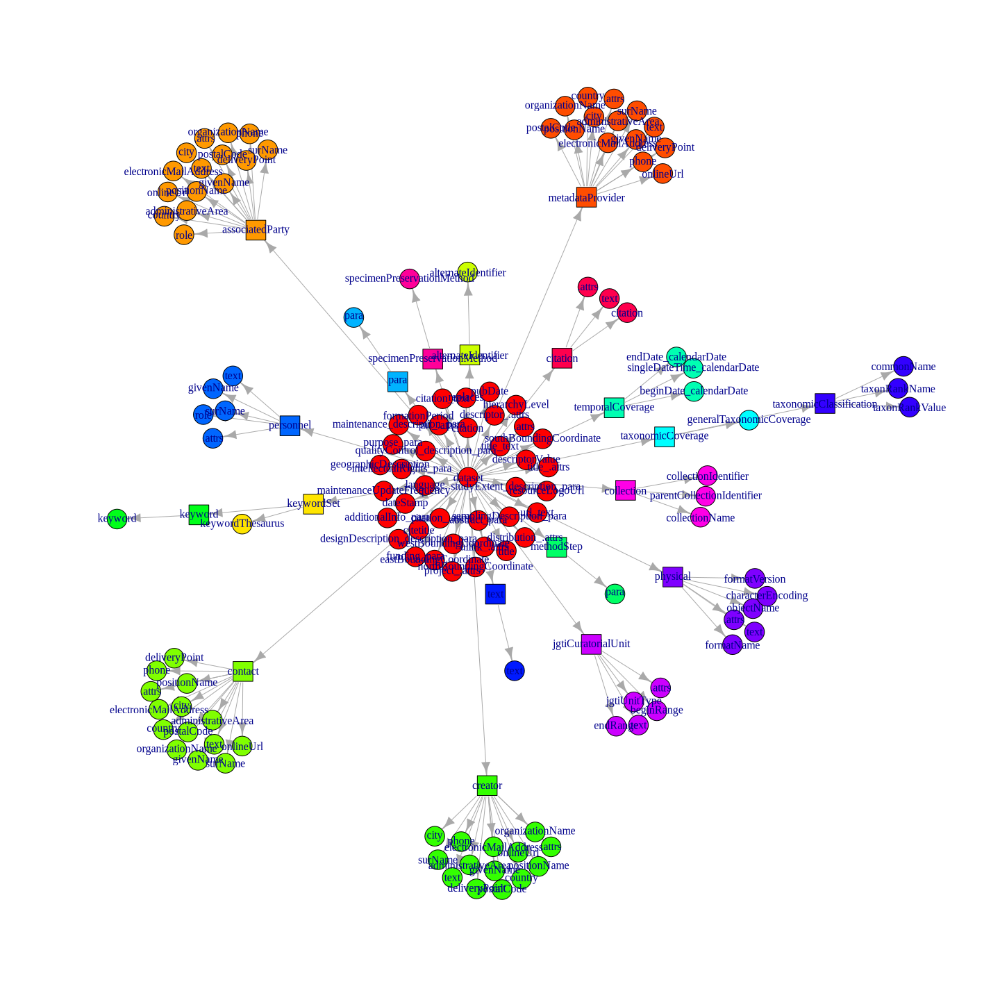

Estructura y descripción de los metadatos de Ceiba
================
Marius Bottin
2025-02-16

- [1 Datadir en el servidor Ceiba](#1-datadir-en-el-servidor-ceiba)
  - [1.1 Descripción](#11-descripción)
  - [1.2 Extracción de los metadatos](#12-extracción-de-los-metadatos)
- [2 Analisis de los metadatos](#2-analisis-de-los-metadatos)
  - [2.1 Repetitions](#21-repetitions)
  - [2.2 Extracting final variables (leaves of the xml
    tree)](#22-extracting-final-variables-leaves-of-the-xml-tree)
  - [2.3 Managing names without repetitions in
    gp](#23-managing-names-without-repetitions-in-gp)
- [3 Representation of the variable
  structure](#3-representation-of-the-variable-structure)
- [4 Exportation of a table with values and references (dataset and
  variables)](#4-exportation-of-a-table-with-values-and-references-dataset-and-variables)
- [5 Utilizar sql para manejar los datos
  extraídos](#5-utilizar-sql-para-manejar-los-datos-extraídos)
  - [5.1 Crear la base de datos](#51-crear-la-base-de-datos)
  - [5.2 Crear las primeras tablas](#52-crear-las-primeras-tablas)

``` r
require(RPostgreSQL)
```

    ## Loading required package: RPostgreSQL

    ## Loading required package: DBI

``` r
require(dm)
```

    ## Loading required package: dm

    ## 
    ## Attaching package: 'dm'

    ## The following object is masked from 'package:stats':
    ## 
    ##     filter

``` r
require(png)
```

    ## Loading required package: png

``` r
knitr::opts_chunk$set(cache=T,tidy.opts = list(width.cutoff = 70),
                     tidy = TRUE,
                     max.print=50,fig.path="./Fig/explor_ceiba_",echo=T,
                     collapse=F, echo=T)
def.chunk.hook  <- knitr::knit_hooks$get("chunk")
knitr::knit_hooks$set(chunk = function(x, options) {
  x <- def.chunk.hook(x, options)
  paste0("\n \\", "footnotesize","\n\n", x, "\n\n \\normalsize\n\n")
})
```

# 1 Datadir en el servidor Ceiba

## 1.1 Descripción

Todos los datos de Ceiba están organizados como carpetas en el datadir
del servidor. Se maneja después con el sistema Integrated Publishing
Toolkit desarrollado por GBIF.

En cada carpeta (cada juego de datos), podemos encontrar:

- el archivo comprimido que contiene los archivos y los metadatos en
  formato DarwinCore completo.
- el archivo `eml.xml` que contiene los metadatos, y todas las versiones
  del archivo (con los nombres `eml-1.xml`, `eml-2.xml` etc)
- el archivo `publication.log` que contiene el historial de
  publicación/modificación del juego de datos
- archivos de descripción de los juegos de datos en “Rich Text Format”
  (rtf), tambien para cada versión publicada
- archivos de administración de datos y metadatos `resource.xml`
- una carpeta `sources` que contiene los datos (?)

## 1.2 Extracción de los metadatos

En ssh, accedemos al servidor de ceiba desde la red del instituto:

``` bash
ssh integracion@192.168.11.74
```

Extraemos 3 archivos:

- un archivo que tiene las direcciones de los archivos “eml.xml” y sus
  contenidos
- un archivo que contiene las direcciones de los archivos “resource.xml”
  y sus contenidos
- un catalogo de todos los archivos presentes en la carpeta de datos
  manejada por el ipt

Esos 2 archivos se pueden obtener con:

``` bash
find /home/pem/datadir/ -name eml.xml -exec bash file_and_content.sh {} \; >file_and_content_result_eml 2> errors_find_file_and_content_eml
find /home/pem/datadir/ -name resource.xml  -exec bash file_and_content.sh {} \; >file_and_content_result_resource 2> errors_find_file_and_content_resource
find /home/pem/datadir/ -type f  > result_find
```

Los archivos se pueden descargar desde la red del instituto, gracias al
applicativo scp, que funciona a través de ssh.

# 2 Analisis de los metadatos

``` r
result_find <- readLines("../../../data_metadatos_catalogos/ceiba/result_find")
meta_ceiba <- readLines("../../../data_metadatos_catalogos/ceiba/file_and_content_result_eml")
meta_ceiba <- meta_ceiba[!meta_ceiba == ""]
```

Numero de archivos de metadatos

``` r
sum(grepl("---file:.*---", meta_ceiba))
```

    ## [1] 1051

We search for the names/pathes of the files and we create the tables
describing the adresses in the R object

``` r
nameFilesAddr <- grep("---file:.*---", meta_ceiba)
addresses_xml <- data.frame(file = sub("^---file:(.*)---$", "\\1", meta_ceiba[nameFilesAddr]),
    beg = nameFilesAddr + 1, end = c(nameFilesAddr[2:length(nameFilesAddr)] -
        1, length(meta_ceiba)))
```

Checking integrity and correspondances with the other objects

``` r
any(duplicated(addresses_xml$file))
```

    ## [1] FALSE

``` r
match(addresses_xml$file, result_find)
```

    ##    [1]     4    22    72    89   145   185   198   209   251   270   285   308
    ##   [13]   323   334   356   394   410   434   442   482   516   527   581   597
    ##   [25]   601   609   616   629   651   661   680   697   712   733   751   768
    ##   [37]   779   795   808   849   890   900   923   956   975   990  1009  1031
    ##   [49]  1050  1083  1104  1119  1131  1169  1180  1225  1258  1278  1303  1324
    ##   [61]  1349  1366  1390  1413  1436  1459  1502  1533  1564  1591  1618  1641
    ##   [73]  1664  1691  1722  1745  1784  1808  1843  1866  1907  1917  1956  1985
    ##   [85]  2019  2061  2099  2135  2174  2207  2237  2267  2303  2336  2366  2392
    ##   [97]  2411  2426  2456  2497  2535  2595  2606  2625  2674  2703  2711  2752
    ##  [109]  2765  2777  2790  2807  2843  2866  2886  2897  2921  2936  2944  2949
    ##  [121]  2994  3016  3052  3063  3082  3112  3123  3130  3158  3176  3188  3222
    ##  [133]  3237  3257  3272  3303  3333  3359  3407  3457  3508  3557  3595  3629
    ##  [145]  3661  3728  3765  3816  3853  3895  3923  3958  3981  3999  4011  4020
    ##  [157]  4032  4055  4071  4079  4104  4118  4129  4140  4167  4188  4221  4231
    ##  [169]  4246  4263  4302  4353  4380  4415  4446  4458  4469  4480  4491  4508
    ##  [181]  4529  4546  4560  4577  4592  4604  4627  4653  4671  4679  4693  4706
    ##  [193]  4716  4736  4765  4784  4798  4810  4826  4839  4856  4892  4933  4972
    ##  [205]  5010  5046  5070  5109  5150  5184  5206  5243  5276  5289  5296  5304
    ##  [217]  5320  5332  5345  5358  5390  5425  5448  5463  5478  5488  5498  5506
    ##  [229]  5514  5526  5534  5544  5554  5561  5573  5585  5598  5616  5630  5645
    ##  [241]  5655  5668  5684  5692  5706  5723  5741  5762  5785  5822  5857  5880
    ##  [253]  5896  5914  5928  5935  5955  5970  5990  6005  6023  6038  6055  6060
    ##  [265]  6081  6098  6117  6135  6147  6160  6178  6201  6232  6248  6260  6294
    ##  [277]  6338  6384  6416  6449  6481  6507  6532  6556  6576  6592  6608  6626
    ##  [289]  6642  6654  6683  6712  6739  6754  6768  6780  6804  6821  6840  6857
    ##  [301]  6873  6885  6906  6927  6941  6950  6982  7022  7070  7121  7162  7201
    ##  [313]  7219  7246  7265  7304  7332  7350  7364  7376  7393  7412  7430  7449
    ##  [325]  7462  7476  7491  7512  7534  7553  7581  7605  7625  7646  7674  7702
    ##  [337]  7718  7728  7735  7751  7769  7787  7807  7835  7858  7883  7906  7925
    ##  [349]  7958  7987  8008  8025  8045  8070  8083  8121  8138  8157  8171  8190
    ##  [361]  8228  8254  8267  8278  8307  8326  8340  8351  8357  8365  8374  8381
    ##  [373]  8388  8404  8422  8437  8462  8479  8493  8503  8517  8541  8558  8572
    ##  [385]  8585  8607  8624  8637  8656  8680  8715  8750  8765  8779  8804  8821
    ##  [397]  8847  8880  8917  8942  8945  8973  9011  9039  9055  9080  9103  9114
    ##  [409]  9149  9185  9203  9249  9278  9314  9340  9358  9376  9388  9414  9437
    ##  [421]  9479  9516  9540  9559  9578  9589  9607  9619  9644  9694  9729  9745
    ##  [433]  9764  9784  9804  9826  9856  9887  9912  9928  9947  9968  9996 10014
    ##  [445] 10021 10048 10083 10116 10132 10156 10176 10187 10198 10239 10266 10285
    ##  [457] 10297 10317 10337 10361 10393 10419 10458 10477 10499 10530 10564 10586
    ##  [469] 10621 10653 10686 10705 10712 10722 10740 10751 10760 10769 10777 10801
    ##  [481] 10845 10888 10932 10981 11025 11062 11093 11147 11199 11241 11278 11318
    ##  [493] 11358 11390 11447 11498 11525 11537 11554 11572 11589 11615 11632 11679
    ##  [505] 11705 11717 11743 11765 11798 11815 11841 11864 11887 11908 11935 11954
    ##  [517] 11977 12017 12042 12059 12077 12091 12109 12143 12169 12189 12202 12240
    ##  [529] 12291 12321 12343 12356 12373 12399 12418 12436 12452 12463 12474 12523
    ##  [541] 12557 12599 12632 12650 12660 12690 12716 12761 12808 12834 12846 12870
    ##  [553] 12891 12910 12921 12927 12939 12944 12984 13011 13027 13044 13053 13063
    ##  [565] 13113 13161 13202 13223 13267 13297 13315 13328 13337 13348 13364 13378
    ##  [577] 13398 13426 13455 13472 13485 13500 13514 13529 13541 13554 13573 13596
    ##  [589] 13613 13624 13637 13652 13677 13693 13707 13722 13749 13786 13824 13852
    ##  [601] 13871 13898 13921 13942 13958 13976 13993 14017 14042 14091 14120 14135
    ##  [613] 14151 14168 14185 14206 14234 14266 14291 14308 14325 14343 14358 14373
    ##  [625] 14398 14424 14445 14460 14480 14497 14507 14514 14528 14535 14545 14566
    ##  [637] 14609 14638 14653 14670 14689 14706 14725 14740 14767 14791 14809 14825
    ##  [649] 14835 14842 14862 14888 14909 14924 14949 14980 15003 15019 15033 15046
    ##  [661] 15073 15096 15126 15158 15182 15201 15220 15237 15263 15281 15299 15313
    ##  [673] 15333 15363 15383 15399 15429 15454 15474 15487 15512 15540 15562 15575
    ##  [685] 15579 15590 15607 15630 15646 15672 15692 15725 15751 15774 15791 15814
    ##  [697] 15839 15868 15901 15926 15950 15970 15984 15996 16011 16024 16047 16072
    ##  [709] 16100 16127 16141 16167 16194 16216 16233 16246 16281 16321 16345 16376
    ##  [721] 16392 16414 16435 16457 16487 16517 16532 16559 16577 16596 16618 16633
    ##  [733] 16643 16655 16668 16679 16703 16727 16766 16806 16830 16844 16856 16866
    ##  [745] 16876 16889 16904 16944 16972 16985 17034 17073 17113 17139 17164 17199
    ##  [757] 17221 17236 17250 17265 17276 17294 17332 17372 17397 17419 17443 17461
    ##  [769] 17479 17501 17539 17579 17596 17615 17644 17661 17681 17698 17743 17809
    ##  [781] 17855 17883 17896 17903 17916 17950 17969 17983 18008 18024 18036 18043
    ##  [793] 18056 18072 18089 18107 18132 18152 18170 18192 18210 18225 18242 18253
    ##  [805] 18267 18285 18297 18311 18329 18353 18367 18378 18390 18401 18425 18439
    ##  [817] 18446 18484 18538 18588 18628 18652 18672 18685 18698 18713 18728 18749
    ##  [829] 18788 18813 18849 18888 18920 18949 18974 18990 19010 19022 19036 19051
    ##  [841] 19081 19120 19156 19176 19196 19229 19255 19281 19298 19309 19327 19351
    ##  [853] 19368 19387 19423 19447 19461 19498 19544 19583 19606 19621 19637 19652
    ##  [865] 19668 19680 19703 19732 19773 19803 19820 19833 19852 19871 19893 19912
    ##  [877] 19925 19945 19962 19974 19986 19999 20028 20068 20107 20134 20161 20190
    ##  [889] 20220 20237 20250 20262 20272 20292 20306 20313 20337 20361 20383 20407
    ##  [901] 20432 20466 20489 20508 20527 20557 20577 20592 20610 20636 20653 20663
    ##  [913] 20687 20722 20743 20759 20780 20802 20822 20837 20859 20899 20926 20938
    ##  [925] 20953 20974 20992 21020 21046 21066 21088 21108 21129 21144 21167 21185
    ##  [937] 21200 21224 21240 21263 21290 21308 21345 21376 21389 21398 21408 21424
    ##  [949] 21434 21450 21460 21471 21482 21498 21520 21535 21551 21569 21586 21602
    ##  [961] 21616 21628 21642 21664 21674 21688 21697 21713 21731 21745 21763 21771
    ##  [973] 21788 21793 21808 21818 21828 21836 21844 21868 21887 21900 21919 21927
    ##  [985] 21934 21945 21967 21980 21995 22010 22032 22054 22069 22084 22099 22122
    ##  [997] 22139 22154 22167 22180 22193 22211 22226 22241 22254 22265 22277 22288
    ## [1009] 22299 22318 22334 22352 22370 22386 22402 22418 22435 22449 22468 22481
    ## [1021] 22487 22501 22521 22529 22542 22556 22574 22585 22599 22609 22623 22637
    ## [1033] 22645 22652 22668 22676 22687 22696 22718 22728 22743 22754 22768 22778
    ## [1045] 22788 22790 22800 22810 22820 22834 22840

There might be a problem when there is an empty xml. After manual
checking, we realize that this problem creates an end before the beg, so
to avoid these lines in the rest of the code, we just suppress these
cases in the addresses_xml object:

``` r
w_empty <- which((addresses_xml$beg[1:(nrow(addresses_xml) - 1)] + 1) ==
    addresses_xml$beg[2:nrow(addresses_xml)])
addresses_xml[(w_empty - 2):(w_empty + 2), ]
```

    ##                                                                       file
    ## 1048                   /home/pem/datadir/resources/yaguara_sonidos/eml.xml
    ## 1049               /home/pem/datadir/resources/frutos-corozo_cesar/eml.xml
    ## 1050            /home/pem/datadir/resources/cacay-moriche_guaviare/eml.xml
    ## 1051 /home/pem/datadir/resources/reserva-natural_lostucanes-boyaca/eml.xml
    ## NA                                                                    <NA>
    ##         beg    end
    ## 1048 445524 445925
    ## 1049 445927 446185
    ## 1050 446187 446186
    ## 1051 446188 446407
    ## NA       NA     NA

``` r
addresses_xml[addresses_xml$beg > addresses_xml$end, ]
```

    ##                                                            file    beg    end
    ## 1050 /home/pem/datadir/resources/cacay-moriche_guaviare/eml.xml 446187 446186

``` r
addresses_xml <- addresses_xml[addresses_xml$beg < addresses_xml$end, ]
```

Separating by origin files:

``` r
xml_files <- apply(addresses_xml, 1, function(a, rl) paste(rl[a[2]:a[3]],
    sep = "\n", collapse = "\n"), rl = meta_ceiba)
names(xml_files) <- addresses_xml$file
```

Then reading the xml code:

``` r
require(XML)
```

    ## Loading required package: XML

``` r
require(xml2)
```

    ## Loading required package: xml2

``` r
xml_list <- lapply(xml_files, function(x) xmlToList(xmlParse(x)))
```

I gotta check this part because it does not make sense: this only take
the large categories which are:

- dataset
- additionalMetadata
- .attrs

``` r
names1<-names(xml_list[[1]])
names_all<-lapply(xml_list,names) 
sapply(names_all,function(x,y)!all(y==x),y=names1)
(names_fields<-unique(Reduce(c,names_all)))
mostComplete<-which.max(sapply(names_all,function(x,y)sum(y%in%x),y=names_fields))
  
```

Seems that part is useless as well:

``` r
level1<-data.frame(
  name=names_fields,
  hasValue=F
)
A<-sapply(xml_list,names)
A_corres<-data.frame(
  lev0_nb=rep(1:length(A),sapply(A,length)),
  lev1_nb=unlist(lapply(A,function(x)1:length(x))),
  level1_match=unlist(lapply(A,function(x,y)match(x,y),y=level1$name))
)
LIST<- ISNULL <- logical(length=nrow(A_corres))
LENGTH <- DEPTH <- numeric(length=nrow(A_corres))
# NAMES <- list()
# for(i in 1:nrow(A_corres))LIST[i]<-is.list(xml_list[[A_corres[i,1]]][[A_corres[i,2]]])
# for(i in 1:nrow(A_corres))ISNULL[i]<-is.null(xml_list[[A_corres[i,1]]][[A_corres[i,2]]])
# for(i in 1:nrow(A_corres))LENGTH[i]<-length(xml_list[[A_corres[i,1]]][[A_corres[i,2]]])
# for(i in 1:nrow(A_corres))DEPTH[i]<-ldepth(xml_list[[A_corres[i,1]]][[A_corres[i,2]]])
# for(i in 1:nrow(A_corres))NAMES[[i]]<-names(xml_list[[A_corres[i,1]]][[A_corres[i,2]]])
# tapply(LENGTH,level1[A_corres[,3],"name"],table)
# table(unlist(NAMES[A_corres$level1_match==1]),useNA = "ifany")
# table(unlist(NAMES[A_corres$level1_match==2]),useNA = "ifany")
# table(unlist(NAMES[A_corres$level1_match==3]),useNA = "ifany")
# table(unlist(NAMES[A_corres$level1_match==4]),useNA = "ifany")
# table(unlist(NAMES[A_corres$level1_match==5]),useNA = "ifany")
# table(unlist(NAMES[A_corres$level1_match==6]),useNA = "ifany")
# table(unlist(NAMES[A_corres$level1_match==7]),useNA = "ifany")
# table(unlist(NAMES[A_corres$level1_match==8]),useNA = "ifany")
# table(unlist(NAMES[A_corres$level1_match==9]),useNA = "ifany")
# table(unlist(NAMES[A_corres$level1_match==10]),useNA = "ifany")
# table(unlist(NAMES[A_corres$level1_match==11]),useNA = "ifany")
# table(unlist(NAMES[A_corres$level1_match==12]),useNA = "ifany")
# table(unlist(NAMES[A_corres$level1_match==13]),useNA = "ifany")
# table(unlist(NAMES[A_corres$level1_match==14]),useNA = "ifany")
# table(unlist(NAMES[A_corres$level1_match==15]),useNA = "ifany")
# table(unlist(NAMES[A_corres$level1_match==16]),useNA = "ifany")
# table(unlist(NAMES[A_corres$level1_match==17]),useNA = "ifany")
# table(unlist(NAMES[A_corres$level1_match==18]),useNA = "ifany")
# table(unlist(NAMES[A_corres$level1_match==19]),useNA = "ifany")
# table(unlist(NAMES[A_corres$level1_match==20]),useNA = "ifany")
# table(unlist(NAMES[A_corres$level1_match==21]),useNA = "ifany")
# table(unlist(NAMES[A_corres$level1_match==22]),useNA = "ifany")
# table(unlist(NAMES[A_corres$level1_match==23]),useNA = "ifany")
# table(unlist(NAMES[A_corres$level1_match==24]),useNA = "ifany")
# table(unlist(NAMES[A_corres$level1_match==25]),useNA = "ifany")
# table(unlist(NAMES[A_corres$level1_match==26]),useNA = "ifany")
# table(unlist(NAMES[A_corres$level1_match==27]),useNA = "ifany")
```

Algoritmo que permite navegar en toda la estructura de los xml. Basado
en 2 tablas:

1.  tabla que describe la jerarquía de los campos potenciales
2.  tabla que describe la presencia de los campos para los registros

Note: the following function get the elements from a recursive path

``` r
recPathList <- function(listNavig, path) {
    x = listNavig
    for (i in path) x <- x[[i]]
    return(x)
}
# example
```

Lo que hacemos primero es crear una matriz que contiene todo los paths,
nivel por nivel que existen en la lista representando el XML. Anotar:
cuando el nivel siguiente no es una lista, no fila está añadida.

``` r
require(collapse)
```

    ## Loading required package: collapse

    ## collapse 2.0.19, see ?`collapse-package` or ?`collapse-documentation`

    ## 
    ## Attaching package: 'collapse'

    ## The following object is masked from 'package:stats':
    ## 
    ##     D

``` r
listStruct <- matrix(data = c(1:length(xml_list), rep(NA, length(xml_list) *
    (ldepth(xml_list) - 1))), nrow = length(xml_list), ncol = ldepth(xml_list))
findNextLevelPaths <- function(li, pathParent, maxDepth) {
    if (!is.list(recPathList(li, pathParent))) {
        return(NULL)
    }
    LN <- length(recPathList(li, pathParent))
    return(cbind(matrix(data = pathParent, nrow = LN, byrow = T, ncol = length(pathParent)),
        1:LN, matrix(NA, nrow = LN, ncol = maxDepth - (length(pathParent) +
            1))))
}
for (i in 2:ncol(listStruct)) {
    cat("number of parents", sum(apply(listStruct, 1, function(x) length(na.omit(x))) ==
        (i - 1)), "\n")
    listStruct <- rbind(listStruct, Reduce(rbind, apply(listStruct[apply(listStruct,
        1, function(x) length(na.omit(x))) == (i - 1), ], 1, function(p,
        l, ml) {
        p = p[!is.na(p)]
        findNextLevelPaths(l, p, ml)
    }, l = xml_list, ml = ncol(listStruct), simplify = F)))
}
```

    ## number of parents 1050 
    ## number of parents 3150 
    ## number of parents 26793 
    ## number of parents 96966 
    ## number of parents 101620 
    ## number of parents 91284 
    ## number of parents 8511 
    ## number of parents 1350

Now let’s apply a function to transform this matrix in a name matrix.

``` r
# nameCurrentLevel<-apply(listStruct[apply(listStruct,1,function(x)length(na.omit(x)))>1,],1,function(x,li)
nameCurrentLevel <- apply(listStruct, 1, function(x, li) {
    A <- na.omit(x)
    last <- A[length(A)]
    path <- A[-length(A)]
    names(recPathList(li, path))[last]
}, li = xml_list)
nameCurrentLevel[(length(nameCurrentLevel) - 50):length(nameCurrentLevel)]
```

    ##  [1] ".attrs" "text"   ".attrs" "text"   ".attrs" "text"   ".attrs" "text"  
    ##  [9] ".attrs" "text"   ".attrs" "text"   ".attrs" "text"   ".attrs" "text"  
    ## [17] ".attrs" "text"   ".attrs" "text"   ".attrs" "text"   ".attrs" "text"  
    ## [25] ".attrs" "text"   ".attrs" "text"   ".attrs" "text"   ".attrs" "text"  
    ## [33] ".attrs" "text"   ".attrs" "text"   ".attrs" "text"   ".attrs" "text"  
    ## [41] ".attrs" "text"   ".attrs" "text"   ".attrs" "text"   ".attrs" "text"  
    ## [49] ".attrs" "text"   ".attrs"

``` r
allNames <- matrix(NA, nrow = nrow(listStruct), ncol = ncol(listStruct) -
    1)
for (i in 1:nrow(listStruct)) {
    if (i%%50000 == 0)
        cat(i, "/", nrow(listStruct), "\n")
    for (j in 2:max(2, length(na.omit(listStruct[i, ])))) {

        path <- listStruct[i, 1:(j - 1)]
        last <- listStruct[i, j]
        allNames[i, j - 1] <- names(recPathList(xml_list, path))[last]
    }
}
```

    ## 50000 / 331956 
    ## 100000 / 331956 
    ## 150000 / 331956 
    ## 200000 / 331956 
    ## 250000 / 331956 
    ## 300000 / 331956

Desde el nivel 2 hasta maximo, determinamos cual es el parent:

``` r
level <- apply(listStruct, 1, function(x) length(na.omit(x)))
parent <- integer(nrow(listStruct))
for (i in 2:max(level)) {
    m <- match(apply(listStruct[level == i, ], 1, function(x) {
        x[which.max(which(!is.na(x)))] <- NA
        return(x)
    }, simplify = F), split(listStruct[level == (i - 1), ], row(listStruct[level ==
        (i - 1), ])))
    parent[level == i] <- which(level == (i - 1))[m]
}
```

Cuales son los hijos directos?

``` r
directChildren <- list()
for (i in 1:length(parent)) {
    directChildren[[i]] <- which(parent == i)
}
```

``` r
allChildren <- vector(mode = "list", length(directChildren))
for (i in 1:length(allChildren)) {
    newChildren <- children <- directChildren[[i]]
    while (length(newChildren) > 0) {
        newChildren <- unlist(directChildren[newChildren])
        children <- c(children, newChildren)
    }
    allChildren[[i]] <- children
}
```

## 2.1 Repetitions

From the children list, we may see what are the repetitions.

`directChildren` takes all nivels in the `listStruct` object which
describes all the hierarchical levels in the xml. For each of these
levels (each row of `listStruct`), it gives the children. It results in
a list which contains all rows of `listStruct`, without duplication:

``` r
length(directChildren)
```

    ## [1] 331956

``` r
any(duplicated(unlist(directChildren)))
```

    ## [1] FALSE

Hence, we can use this simple list to see whether there are repetitions
there of the names, which are in nameCurrentLevel

``` r
nameChildren <- lapply(directChildren, function(x, n) {
    n[x]
}, n = nameCurrentLevel)
dupliNameChildren <- lapply(nameChildren, duplicated)
anyDupliNameChildren <- sapply(dupliNameChildren, any)
```

Using mapply (to apply a function to corresponding elements of various
list), we may use, in the cases where there are various children with
the same names:

``` r
# La función numRep da el indice de repetición en un NOTE: not sure
# how it would react to NA
numRep <- function(x) {
    x <- factor(x)
    un <- levels(x)
    m <- match(x, un)
    t <- table(x)
    res <- integer(length(x))
    res[order(m)] <- unlist(lapply(t, function(x) 1:x))
    return(res)
}
```

``` r
repetitions <- Reduce(rbind, mapply(function(id_listStruct, name, dupl) {
    nameUn <- unique(name[dupl])
    mnD <- match(name, nameUn)
    num <- numRep(name)
    return(data.frame(id = id_listStruct[!is.na(mnD)], name = name[!is.na(mnD)],
        numRep = num[!is.na(mnD)]))
}, id_listStruct = directChildren[anyDupliNameChildren], name = nameChildren[anyDupliNameChildren],
    dupl = dupliNameChildren[anyDupliNameChildren], SIMPLIFY = F))
```

Now we will create a matrix with the same row as listStruct, the number
of column corresponding to the number of variables which are potentially
repeated in their parent: for each level from listStruct, it gives us

``` r
repAllNames <- allNames[repetitions$id, ]
unRep_allNames <- unique(repAllNames)
gps <- match(split(allNames, row(allNames)), split(unRep_allNames, row(unRep_allNames)))
listStructRep <- matrix(NA, nrow(listStruct), max(gps, na.rm = T))
for (i in 1:max(gps, na.rm = T)) {
    potential_rep <- which(gps == i)
    num_rep <- numRep(parent[potential_rep])  # five the index of repetitions when it has the same parent
    allChildrenRep <- allChildren[potential_rep]
    listStructRep[potential_rep, i] <- num_rep
    listStructRep[unlist(allChildrenRep), i] <- rep(num_rep, sapply(allChildrenRep,
        length))
}
lev_rep <- tapply(level, gps, unique)  # note it is the real level, not -1
gpInGp <- data.frame(gp = NULL, inGp = NULL)
for (i in 1:max(gps, na.rm = T)) {
    lowerLevels <- lev_rep < lev_rep[i]
    if (any(lowerLevels)) {
        curLevNotNa <- listStructRep[!is.na(listStructRep[, i]), lowerLevels]
        lowerLevApply <- apply(curLevNotNa, 2, function(x) any(!is.na(x)))
        if (any(lowerLevApply)) {
            inGp <- which(lowerLevels)[which(lowerLevApply)]
            inGp <- inGp[length(inGp)]
            gpInGp <- rbind(gpInGp, data.frame(gp = i, inGp = inGp))
        }
    }
}
```

Now we will create a matrix of the same dimension as listStruct, with
values 0 for the levels which exist, NA when the level does not exist
and instead of 0, the number of the repetition when it does apply

``` r
listStructRep<-matrix(0L,nrow(listStruct),ncol(listStruct))
listStructRep[is.na(listStruct)]<-NA
for(i in 1:nrow(repetitions))
{
  matrixAdd<-cbind(row=c(repetitions$id[i],allChildren[[repetitions$id[i]]]),
                   col=level[repetitions$id[i]])
  listStructRep[matrixAdd]<-repetitions$numRep[i]
}
```

## 2.2 Extracting final variables (leaves of the xml tree)

Cuales son los path que contienen una lista

``` r
contList <- apply(listStruct, 1, function(x, li) {
    path = na.omit(x)
    return(is.list(recPathList(li, path)))
}, li = xml_list)
```

Cuales son los casos que no contienen listas, pero son nulos:

``` r
contNull <- apply(listStruct, 1, function(x, li) {
    path = na.omit(x)
    return(is.null(recPathList(li, path)))
}, li = xml_list)
noListButNull <- !contList & contNull
sum(!contList)
```

    ## [1] 223592

``` r
sum(noListButNull)
```

    ## [1] 1123

``` r
sum(!contList & !contNull)
```

    ## [1] 222469

``` r
# which of listStruct is a non-null, non-list value
leaves <- which(!contList & !contNull)
# table of unique variable names
un_leaves <- unique(allNames[leaves, ])
# correspondence between non-null, non-list values and unique
# variable names
m <- match(split(allNames[leaves, ], row(allNames[leaves, ])), split(un_leaves,
    row(un_leaves)))
# Correspondence between listStruct and unique variable names
corres_leaves <- integer(nrow(listStruct))
corres_leaves[leaves] <- m
```

Para cada variable (hoja), necesitamos saber:

- cuantas veces aparece?
- En cuantos registros aparece?
- En que grupo (repeticiones) está?
- cual es el minimo/maximo de la longitud del vector de valores?
- ejemplos de valores
- Que es la secuencia de nombre de campos xml?

``` r
# Cuantas veces aparece?
nbOccurrences <- table(corres_leaves[corres_leaves != 0])
# En cuantos registros
nbReg <- tapply(listStruct[, 1], corres_leaves, function(x) length(unique(x)))[-1]
# En cual gp

inRep <- inGp <- tapply(apply(listStructRep[leaves, ], 1, function(x) {
    w <- which(!is.na(x))
    if (length(w)) {
        return(max(w))
    }
    return(0)
}), corres_leaves[leaves], unique)
# Longitud de valores
rangeLN <- by(listStruct[corres_leaves != 0, ], corres_leaves[corres_leaves !=
    0], FUN = function(tab, ls_xml) {
    ls_byVar <- apply(tab, 1, FUN = function(x, l_x) recPathList(ls_xml,
        na.omit(x)), l_x = ls_xml, simplify = F)
    return(range(sapply(ls_byVar, length)))
}, ls_xml = xml_list)
len_min <- sapply(rangeLN, min)
len_max <- sapply(rangeLN, max)

subNames <- by(listStruct[corres_leaves != 0, ], corres_leaves[corres_leaves !=
    0], FUN = function(tab, ls_xml) {
    subN <- unique(unlist(lapply(apply(tab, 1, FUN = function(x, l_x) recPathList(ls_xml,
        na.omit(x)), l_x = ls_xml, simplify = F), names)))
    return(paste(subN, sep = "|", collapse = "|"))
}, ls_xml = xml_list)

examples <- as.list(by(listStruct, corres_leaves, FUN = function(tab, ls_xml) {
    ls_byVar <- apply(tab, 1, FUN = function(x, l_x) recPathList(ls_xml,
        na.omit(x)), l_x = ls_xml)
}, ls_xml = xml_list)[-1])
NAMES <- apply(un_leaves, 1, function(x) paste(na.omit(x), collapse = "_"))
isAttr <- grepl("\\.attr", NAMES)
```

Now we export a csv file to be able to analyse and name the variables:

``` r
un_leaves <- data.frame(id = 1:nrow(un_leaves), un_leaves, inRep, isAttr,
    nbOccurrences, nbReg, len_min, len_max, subNames)

write.csv(un_leaves, file = "../../../data_metadatos_catalogos/ceiba_un_leaves.csv")
```

## 2.3 Managing names without repetitions in gp

Tenemos que dar nombres a los grupos, a las variables, que no se repiten
en los grupos.

``` r
nameGp <- apply(unRep_allNames, 1, function(x) {
    A <- na.omit(x)
    A[length(A)]
})
gp_info <- data.frame(refUn = 1:nrow(unRep_allNames), name = nameGp, varPath = apply(unRep_allNames,
    1, function(x) paste(na.omit(x), collapse = "|")), inGp = 0)
gp_info[match(gpInGp$gp, gp_info$refUn), "inGp"] <- gpInGp$inGp
```

``` r
namesVar <- apply(un_leaves[grep("^X", colnames(un_leaves))], 1, function(x) {
    A <- na.omit(x)
    A[length(A)]
})
var_info <- data.frame(refUn = un_leaves$id, name = namesVar, varPath = apply(un_leaves[grep("^X",
    colnames(un_leaves))], 1, function(x) paste(na.omit(x), collapse = "|")),
    inGp = inGp, subNames = un_leaves$subNames)
```

``` r
repeatedNames_var <- by(var_info, var_info$inGp, function(x) {
    dupliNames <- x$name[duplicated(x$name)]
    res <- x[x$name %in% dupliNames, c("refUn", "name", "varPath")]
})
repeatedNames_var <- repeatedNames_var[sapply(repeatedNames_var, nrow) >
    0]
nbNamesToTake <- 1
while ((length(repeatedNames_var) > 0 & nbNamesToTake < ldepth(xml_list)) &&
    (sum(sapply(repeatedNames_var, length)) > 0)) {
    nbNamesToTake <- nbNamesToTake + 1
    toModif <- Reduce(rbind, lapply(repeatedNames_var, function(x, n) {
        replacement <- lapply(strsplit(x$varPath, "\\|"), function(x, n) paste(x[max(length(x) -
            (n - 1), 1):length(x)], collapse = "_"), n = n)
        x$name <- unlist(replacement)
        return(x)
    }, n = nbNamesToTake))
    for (i in 1:nrow(toModif)) {
        var_info$name[var_info$refUn == toModif$refUn[i]] <- toModif$name[i]
    }
    repeatedNames_var <- by(var_info, var_info$inGp, function(x) {
        dupliNames <- x$name[duplicated(x$name)]
        res <- x[x$name %in% dupliNames, c("refUn", "name", "varPath")]
        return(res)
    })
    repeatedNames_var <- repeatedNames_var[sapply(repeatedNames_var, nrow) >
        0]
}
```

``` r
repeatedNames_gp <- by(gp_info, gp_info$inGp, function(x) {
    dupliNames <- x$name[duplicated(x$name)]
    res <- x[x$name %in% dupliNames, c("refUn", "name", "varPath")]
})
repeatedNames_gp <- repeatedNames_gp[sapply(repeatedNames_gp, nrow) > 0]
nbNamesToTake <- 1
while ((length(repeatedNames_gp) > 0 & nbNamesToTake < ldepth(xml_list)) &&
    (sum(sapply(repeatedNames_gp, length)) > 0)) {
    nbNamesToTake <- nbNamesToTake + 1
    toModif <- Reduce(rbind, lapply(repeatedNames_gp, function(x, n) {
        replacement <- lapply(strsplit(x$varPath, "\\|"), function(x, n) paste(x[max(length(x) -
            (n - 1), 1):length(x)], collapse = "_"), n = n)
        x$name <- unlist(replacement)
        return(x)
    }, n = nbNamesToTake))
    for (i in 1:nrow(toModif)) {
        gp_info$name[gp_info$refUn == toModif$refUn[i]] <- toModif$name[i]
    }
    repeatedNames_gp <- by(gp_info, gp_info$inGp, function(x) {
        dupliNames <- x$name[duplicated(x$name)]
        res <- x[x$name %in% dupliNames, c("refUn", "name", "varPath")]
        return(res)
    })
    repeatedNames_gp <- repeatedNames_gp[sapply(repeatedNames_gp, nrow) >
        0]
}
```

# 3 Representation of the variable structure

``` r
# We changed gp_var_info for gp_info and var_info What we should do
# now is: 1. manage the gp_path variable in the gp_info table 2. add
# the gp_path variable in the var_info table from the gp_info gp_path
# and ingp variable 3. feed the gp_path variable from the var_info
# table to the data.tree structure (Node) 4. manage the labels in the
# data.tree (Node) structure from the table gp_info and var_info


require(data.tree)
```

    ## Loading required package: data.tree

``` r
gp_info$gp_path <- NA
gp_info$gp_path[gp_info$inGp == 0] <- paste0("gp_0/gp_", gp_info$refUn[gp_info$inGp ==
    0])
while (any(is.na(gp_info$gp_path))) {
    ref <- which(is.na(gp_info$gp_path))
    ref <- ref[!is.na(gp_info$gp_path[gp_info$inGp[ref]])]
    gp_info$gp_path[ref] <- paste0(gp_info$gp_path[gp_info$inGp[ref]],
        "/gp_", gp_info$refUn[ref])
}

var_info$gp_path <- NA
var_info$gp_path[var_info$inGp == 0] <- paste0("gp_0/var_", var_info$refUn[var_info$inGp ==
    0])
var_info$gp_path[var_info$inGp != 0] <- paste0(gp_info$gp_path[var_info$inGp[var_info$inGp !=
    0]], "/var_", var_info$refUn[var_info$inGp != 0])

dataTreeGpVar <- rbind(data.frame(gp_info[c("refUn", "gp_path")], name = paste0("gp_",
    gp_info$refUn), label = gp_info$name, gp_var = "gp", gp_col = gp_info$refUn),
    data.frame(var_info[c("refUn", "gp_path")], name = paste0("var_", var_info$refUn),
        label = var_info$name, gp_var = "var", gp_col = var_info$inGp))
nodeGpVar <- FromDataFrameTable(dataTreeGpVar, "gp_path")
print(nodeGpVar, "label", pruneMethod = NULL)
```

    ##               levelName                              label
    ## 1   gp_0                                                  
    ## 2    ¦--gp_1                              metadataProvider
    ## 3    ¦   ¦--var_11                        organizationName
    ## 4    ¦   ¦--var_12                            positionName
    ## 5    ¦   ¦--var_13                                   phone
    ## 6    ¦   ¦--var_14                   electronicMailAddress
    ## 7    ¦   ¦--var_33                               onlineUrl
    ## 8    ¦   ¦--var_44                               givenName
    ## 9    ¦   ¦--var_45                                 surName
    ## 10   ¦   ¦--var_46                           deliveryPoint
    ## 11   ¦   ¦--var_47                                    city
    ## 12   ¦   ¦--var_48                      administrativeArea
    ## 13   ¦   ¦--var_49                                 country
    ## 14   ¦   ¦--var_73                              postalCode
    ## 15   ¦   ¦--var_81                                    text
    ## 16   ¦   °--var_82                                  .attrs
    ## 17   ¦--gp_2                               associatedParty
    ## 18   ¦   ¦--var_15                        organizationName
    ## 19   ¦   ¦--var_16                                   phone
    ## 20   ¦   ¦--var_17                   electronicMailAddress
    ## 21   ¦   ¦--var_18                               onlineUrl
    ## 22   ¦   ¦--var_19                                    role
    ## 23   ¦   ¦--var_20                            positionName
    ## 24   ¦   ¦--var_50                                 surName
    ## 25   ¦   ¦--var_51                           deliveryPoint
    ## 26   ¦   ¦--var_52                                    city
    ## 27   ¦   ¦--var_53                      administrativeArea
    ## 28   ¦   ¦--var_54                                 country
    ## 29   ¦   ¦--var_55                               givenName
    ## 30   ¦   ¦--var_74                              postalCode
    ## 31   ¦   ¦--var_83                                    text
    ## 32   ¦   °--var_84                                  .attrs
    ## 33   ¦--gp_3                                    keywordSet
    ## 34   ¦   ¦--gp_7                                   keyword
    ## 35   ¦   ¦   °--var_22                             keyword
    ## 36   ¦   °--var_23                        keywordThesaurus
    ## 37   ¦--gp_4                           alternateIdentifier
    ## 38   ¦   °--var_2                      alternateIdentifier
    ## 39   ¦--gp_5                                       contact
    ## 40   ¦   ¦--var_27                        organizationName
    ## 41   ¦   ¦--var_28                            positionName
    ## 42   ¦   ¦--var_29                                   phone
    ## 43   ¦   ¦--var_30                   electronicMailAddress
    ## 44   ¦   ¦--var_35                               onlineUrl
    ## 45   ¦   ¦--var_59                               givenName
    ## 46   ¦   ¦--var_60                                 surName
    ## 47   ¦   ¦--var_61                           deliveryPoint
    ## 48   ¦   ¦--var_62                                    city
    ## 49   ¦   ¦--var_63                      administrativeArea
    ## 50   ¦   ¦--var_64                                 country
    ## 51   ¦   ¦--var_75                              postalCode
    ## 52   ¦   ¦--var_85                                    text
    ## 53   ¦   °--var_86                                  .attrs
    ## 54   ¦--gp_6                                       creator
    ## 55   ¦   ¦--var_7                         organizationName
    ## 56   ¦   ¦--var_8                             positionName
    ## 57   ¦   ¦--var_9                                    phone
    ## 58   ¦   ¦--var_10                   electronicMailAddress
    ## 59   ¦   ¦--var_32                               onlineUrl
    ## 60   ¦   ¦--var_38                               givenName
    ## 61   ¦   ¦--var_39                                 surName
    ## 62   ¦   ¦--var_40                           deliveryPoint
    ## 63   ¦   ¦--var_41                                    city
    ## 64   ¦   ¦--var_42                      administrativeArea
    ## 65   ¦   ¦--var_43                                 country
    ## 66   ¦   ¦--var_72                              postalCode
    ## 67   ¦   ¦--var_79                                    text
    ## 68   ¦   °--var_80                                  .attrs
    ## 69   ¦--gp_8                                    methodStep
    ## 70   ¦   °--var_98                                    para
    ## 71   ¦--gp_9                              temporalCoverage
    ## 72   ¦   ¦--var_116            singleDateTime_calendarDate
    ## 73   ¦   ¦--var_119                 beginDate_calendarDate
    ## 74   ¦   °--var_120                   endDate_calendarDate
    ## 75   ¦--gp_10                            taxonomicCoverage
    ## 76   ¦   ¦--gp_14                  taxonomicClassification
    ## 77   ¦   ¦   ¦--var_96                       taxonRankName
    ## 78   ¦   ¦   ¦--var_97                      taxonRankValue
    ## 79   ¦   ¦   °--var_111                         commonName
    ## 80   ¦   °--var_58                generalTaxonomicCoverage
    ## 81   ¦--gp_11                                         para
    ## 82   ¦   °--var_21                                    para
    ## 83   ¦--gp_12                                    personnel
    ## 84   ¦   ¦--var_65                                    role
    ## 85   ¦   ¦--var_101                              givenName
    ## 86   ¦   ¦--var_102                                surName
    ## 87   ¦   ¦--var_117                                   text
    ## 88   ¦   °--var_118                                 .attrs
    ## 89   ¦--gp_13                                         text
    ## 90   ¦   °--var_56                                    text
    ## 91   ¦--gp_15                                     physical
    ## 92   ¦   ¦--var_113                             objectName
    ## 93   ¦   ¦--var_114                      characterEncoding
    ## 94   ¦   ¦--var_128                             formatName
    ## 95   ¦   ¦--var_129                          formatVersion
    ## 96   ¦   ¦--var_130                                   text
    ## 97   ¦   °--var_131                                 .attrs
    ## 98   ¦--gp_16                           jgtiCuratorialUnit
    ## 99   ¦   ¦--var_115                           jgtiUnitType
    ## 100  ¦   ¦--var_124                                   text
    ## 101  ¦   ¦--var_125                                 .attrs
    ## 102  ¦   ¦--var_126                             beginRange
    ## 103  ¦   °--var_127                               endRange
    ## 104  ¦--gp_17                                   collection
    ## 105  ¦   ¦--var_108             parentCollectionIdentifier
    ## 106  ¦   ¦--var_109                   collectionIdentifier
    ## 107  ¦   °--var_110                         collectionName
    ## 108  ¦--gp_18                   specimenPreservationMethod
    ## 109  ¦   °--var_70              specimenPreservationMethod
    ## 110  ¦--gp_19                                     citation
    ## 111  ¦   ¦--var_112                               citation
    ## 112  ¦   ¦--var_122                                   text
    ## 113  ¦   °--var_123                                 .attrs
    ## 114  ¦--var_1                                       .attrs
    ## 115  ¦--var_3                                      pubDate
    ## 116  ¦--var_4                                     language
    ## 117  ¦--var_5                                   title_text
    ## 118  ¦--var_6                                 title_.attrs
    ## 119  ¦--var_24                         distribution_.attrs
    ## 120  ¦--var_25                                purpose_para
    ## 121  ¦--var_26                  maintenanceUpdateFrequency
    ## 122  ¦--var_31                                       title
    ## 123  ¦--var_34                     intellectualRights_para
    ## 124  ¦--var_36                         additionalInfo_para
    ## 125  ¦--var_37                              project_.attrs
    ## 126  ¦--var_57                       geographicDescription
    ## 127  ¦--var_66                               abstract_para
    ## 128  ¦--var_67                                funding_para
    ## 129  ¦--var_68                                   dateStamp
    ## 130  ¦--var_69                              hierarchyLevel
    ## 131  ¦--var_71                                    replaces
    ## 132  ¦--var_76                             resourceLogoUrl
    ## 133  ¦--var_77                                    citation
    ## 134  ¦--var_78                             formationPeriod
    ## 135  ¦--var_87                maintenance_description_para
    ## 136  ¦--var_88                                   citetitle
    ## 137  ¦--var_89                                ulink_.attrs
    ## 138  ¦--var_90                                    url_text
    ## 139  ¦--var_91                                  url_.attrs
    ## 140  ¦--var_92                      westBoundingCoordinate
    ## 141  ¦--var_93                      eastBoundingCoordinate
    ## 142  ¦--var_94                     northBoundingCoordinate
    ## 143  ¦--var_95                     southBoundingCoordinate
    ## 144  ¦--var_99                    samplingDescription_para
    ## 145  ¦--var_100            qualityControl_description_para
    ## 146  ¦--var_103                            descriptorValue
    ## 147  ¦--var_104                          descriptor_.attrs
    ## 148  ¦--var_105         designDescription_description_para
    ## 149  ¦--var_106                              citation_text
    ## 150  ¦--var_107                            citation_.attrs
    ## 151  °--var_121               studyExtent_description_para

`r fig.height=10,fig.width=2 SetGraphStyle(nodeGpVar,rankdir="LR") SetNodeStyle(nodeGpVar,label=function(node)node$label) plot(nodeGpVar)`

``` r
library(igraph)
```

    ## 
    ## Attaching package: 'igraph'

    ## The following objects are masked from 'package:stats':
    ## 
    ##     decompose, spectrum

    ## The following object is masked from 'package:base':
    ## 
    ##     union

``` r
# png('testReprNetwork.pdf',1500,1500)
ig_gpVar <- as.igraph(nodeGpVar, directed = TRUE, direction = "climb")
str(ig_gpVar)
```

    ## Class 'igraph'  hidden list of 10
    ##  $ : num 151
    ##  $ : logi TRUE
    ##  $ : num [1:150] 0 0 0 0 0 0 0 0 0 0 ...
    ##  $ : num [1:150] 1 16 32 36 38 53 68 70 74 80 ...
    ##  $ : NULL
    ##  $ : NULL
    ##  $ : NULL
    ##  $ : NULL
    ##  $ :List of 4
    ##   ..$ : num [1:3] 1 0 1
    ##   ..$ : Named list()
    ##   ..$ :List of 1
    ##   .. ..$ name: chr [1:151] "gp_0" "gp_1" "var_11" "var_12" ...
    ##   ..$ : Named list()
    ##  $ :<environment: 0x55a010bd5de0>

``` r
V(ig_gpVar)$gp_col <- dataTreeGpVar$gp_col[match(names(V(ig_gpVar)), dataTreeGpVar$name)]
V(ig_gpVar)["gp_0"]$gp_col <- 0
V(ig_gpVar)$gp_var <- dataTreeGpVar$gp_var[match(names(V(ig_gpVar)), dataTreeGpVar$name)]
V(ig_gpVar)["gp_0"]$gp_var <- "var"
V(ig_gpVar)$label <- dataTreeGpVar$label[match(names(V(ig_gpVar)), dataTreeGpVar$name)]
V(ig_gpVar)["gp_0"]$label <- "dataset"

COL <- rainbow(max(V(ig_gpVar)$gp_col + 1, na.rm = T))[V(ig_gpVar)$gp_col +
    1]

# gp_var_info[c('gp_var_name','name')][match(names(V(ig_gpVar)),gp_var_info$gp_var_name),]
plot(ig_gpVar, vertex.label = V(ig_gpVar)$label, vertex.size = 5, vertex.shape = c(var = "circle",
    gp = "square")[V(ig_gpVar)$gp_var], vertex.color = COL)
```

<!-- -->

# 4 Exportation of a table with values and references (dataset and variables)

What we have got is:

- the table `un_leaves` which contains many characteristics of the
  different variables
- `listStruct` which contains all the paths in rows
- `corres_leaves`, which corresponds one on one to listStruct and which
  gives 0 when the path does not go to a “leaf” and gives the id of the
  table `un_leaves` when it is a leaf
- `xml_list` which contains all the info from the xml files, and might
  be accessed through the function `recPathList` with the path from
  `listStruct`
- `parent` which gives, for each of the line of `listStruct` the parent
  line, in `listStruct` as well
- `addresses_xml` which contains, in the first column, the system path
  of the files xml, on the same order as the column 1 from `listStruct`:
  we can extract the name of the folder from there…
- `listStructRep` corresponde exactamente a `listStructRep` en terminos
  de row y columns, vale NA en los levels que no conciernen la fila, 0
  cuando no hay repetición (incluso cuando puede haber repetición para
  la variable), y el numero de repetición dentro de un parent cuando
  aplique
- `gp_var_info` contiene toda la información sobre la estructura de
  tablas y de relaciones entre tablas

One of the difficulties we could have to extract the table of values is
that some leaves (some of the .attr ones only) have more than one value
on the leaves

Here is an attempt to extract all leaves in a simple table, in a
“dataset-\>var-\>value” schema which do not account for the repeated
variables and their groups.

``` r
recalculate <- F
folder <- gsub("^.*/", "", dirname(addresses_xml$file))
if (recalculate) {
    res <- Reduce(rbind, lapply(leaves, function(x, f, lS, cl, xl, p, ul) {
        val <- recPathList(xl, na.omit(lS[x, ]))
        nameVal <- names(val)
        if (is.null(nameVal)) {
            nameVal <- NA
        }
        return(data.frame(ref_struct = x, parent = p[x], folder = f[lS[x,
            1]], id_var = cl[x], subname = nameVal, value = as.character(val)))
    }, f = folder, lS = listStruct, cl = corres_leaves, xl = xml_list,
        p = parent, ul = un_leaves))
    save(res, file = "../../../data_metadatos_catalogos/tab_variable.RData")
} else {
    (load(file = "../../../data_metadatos_catalogos/tab_variable.RData"))
}
```

    ## [1] "res"

Now if we want to account for the repeated variables and their groups,
we need to:

1.  for each leaf give it its `gp` (table) and reference `inGp` in terms
    of ids
2.  create the table as matrix of character
3.  go through the leaf table and put the values in the corresponding
    table
4.  determine the type of the variables and transform the matrix into
    data.frame that may be exported in a database

<!--
It does not make sense to manage that here:
the process should be the following
&#10;1. We search for repetitions
2. We look for which names present repetitions in their parents
3. For all case where a names is associated with a repetition, then we look for each leaf (part of allChildren for these names) in which repetition it is
&#10;It is different than the current process, because we did already that for repetitions, but it might be some case where the xml variable accept repetitions in their parent but is not actually repeated.
&#10;Note: we need to decide whether we do it only for leaves or for every row of listStruct
&#10;
-->

``` r
# Step 1:for each leaf give it its `gp` (table) and reference `inGp`
# in terms of ids
matGp <- cbind(listStruct[leaves, 1], listStructRep[leaves, ])
colnames(matGp) <- c(0, 1:ncol(listStructRep))
gpLeaves <- var_info$inGp[corres_leaves[leaves]]
varLeaves <- corres_leaves[leaves]
```

``` r
# Step 2: prep the matrix Extract colnames for every table
varGp <- tapply(apply(var_info[c("name", "subNames")], 1, function(x) {
    if (x[2] == "") {
        return(x[1])
    }
    return(paste(x[1], unlist(strsplit(x[2], "\\|")), sep = "_"))
}), var_info$inGp, unlist)
# get info to preparing the tables
prepTables <- list()
for (i in colnames(matGp)) {
    gp <- as.integer(i)
    un_gp <- unique(matGp[gpLeaves == gp, ])
    prepTables[[as.name(i)]] <- list(gp = gp, nameTable = gp_info$name[gp_info$refUn ==
        gp], un_gp = un_gp, fields = varGp[[i]])
}
# There is no tableName for the gp0
prepTables[["0"]]$nameTable <- "dataset"

# Step3 create the matrices and fill their contents
matData <- list()
for (i in 1:length(prepTables)) {
    gp <- prepTables[[i]]$gp
    # Create empty matrix
    matData[[i]] <- matrix(NA, nrow(prepTables[[i]]$un_gp), length(prepTables[[i]]$fields),
        dimnames = list(NULL, prepTables[[i]]$fields))
    # extract content of each corresponding leaf for the group
    content <- apply(listStruct[leaves, ][gpLeaves == prepTables[[i]]$gp,
        ], 1, function(x) recPathList(xml_list, na.omit(x)), simplify = F)
    # for each content extraction which row of the matrix corresponds
    rowM <- match(split(matGp[gpLeaves == prepTables[[i]]$gp, ], row(matGp[gpLeaves ==
        prepTables[[i]]$gp, ])), split(prepTables[[i]]$un_gp, row(prepTables[[i]]$un_gp)))
    # which var correspond (var number)
    varM <- varLeaves[gpLeaves == gp]
    # get the name from the var number
    field_complete <- vector(mode = "list", length = length(varM))
    hasSubnames <- var_info[varM, ]$subNames != ""
    field_complete[!hasSubnames] <- as.list(var_info[varM, "name"][!hasSubnames])
    field_complete[hasSubnames] <- mapply(function(x, y) {
        paste(x, names(y), sep = "_")
    }, x = var_info[varM, "name"][hasSubnames], y = content[hasSubnames],
        SIMPLIFY = F)
    # Add the subnames field_complete<-mapply(function(x,y){
    # if(length(names(y))){return(paste(x,names(y),sep='_'))}
    # return(x) },x=field_part1,y=content) get the match in a matrix
    # to automatically fill the contents in the matrix
    matData[[i]][cbind(row = rep(rowM, sapply(content, length)), col = match(unlist(field_complete),
        colnames(matData[[i]])))] <- unlist(content)
}
```

# 5 Utilizar sql para manejar los datos extraídos

El trabajo para hacer acá es muy fastidioso, se trata de explorar los
campos del eml en xml para crear tablas y grupos de variables que pueden
ser repetidos etc. Utilizar SQL permite hacer este trabajo con un
lenguaje más adaptado a esa complejidad… En esa instancia, vamos a crear
una base de datos SQLite para el desarrollo, sin embargo, puede valer la
pena más tarde pasar a un motor más eficiente com PostgreSQL.

------------------------------------------------------------------------

Incluso, para empezar, vamos a utilizar `sqldf`

``` r
require(sqldf)
sqldf("
      WITH a AS(
        SELECT id_var,subname, folder, count(*) nb
        FROM res 
        GROUP BY id_var,subname ,folder
        ), b AS(
        SELECT id_var,subname,nb,count(*) nb_cases
        FROM a
        GROUP BY id_var,subname,nb)
      SELECT id_var,subname,X1,X2,X3,X4,X5,X6,X7,x8
      FROM b 
      LEFT JOIN un_leaves ul ON b.id_var=ul.id
      GROUP BY id_var,subname,X1,X2,X3,X4,X5,X6,X7,x8
      HAVING max(nb)=1
      ",drv="SQLite")
sqldf("
      WITH a AS(
        SELECT id_var,subname, folder, count(*) nb
        FROM res 
        GROUP BY id_var,subname ,folder
        ), b AS(
        SELECT id_var,subname,nb,count(*) nb_cases
        FROM a
        GROUP BY id_var,subname,nb)
      SELECT id_var,subname,X1,X2,X3,X4,X5,X6,X7,x8,max(nb)
      FROM b
      LEFT JOIN un_leaves ul ON b.id_var=ul.id
      GROUP BY id_var,subname,X1,X2,X3,X4,X5,X6,X7,x8
      HAVING max(nb)!=1
      ORDER BY X1,X2,X3,X4,X5,X6,X7,x8
      ",drv="SQLite")
```

## 5.1 Crear la base de datos

``` r
require(RSQLite)
dbFile<-"../../../data_metadatos_catalogos/metadata_ceiba.sqlite"
metaCeiba<-dbConnect(SQLite(),dbFile)
```

## 5.2 Crear las primeras tablas
