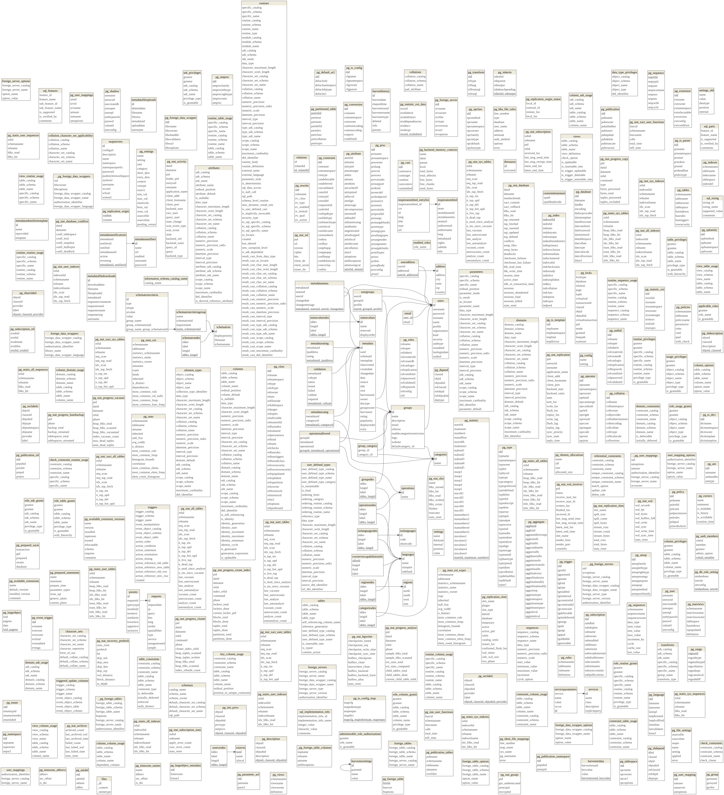
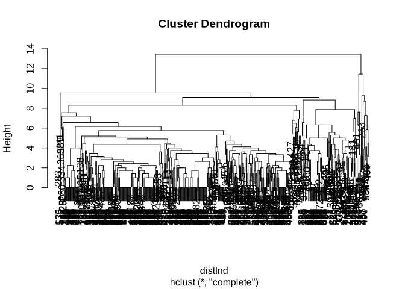

Estructura y descripción de los metadatos de geonetwork
================
Marius Bottin
2024-10-18

- [1 Importación](#1-importación)
- [2 XML representation and
  analyses](#2-xml-representation-and-analyses)

``` r
require(RPostgreSQL)
```

    ## Loading required package: RPostgreSQL

    ## Loading required package: DBI

``` r
require(dm)
```

    ## Loading required package: dm

    ## 
    ## Attaching package: 'dm'

    ## The following object is masked from 'package:stats':
    ## 
    ##     filter

``` r
require(DiagrammeRsvg)
```

    ## Loading required package: DiagrammeRsvg

``` r
require(rsvg)
```

    ## Loading required package: rsvg

    ## Linking to librsvg 2.54.4

``` r
require(png)
```

    ## Loading required package: png

``` r
knitr::opts_chunk$set(cache=F,tidy.opts = list(width.cutoff = 70),
                     tidy = TRUE,
                     max.print=50,fig.path="./Fig/expl_meta",echo=T,
                     collapse=F, echo=T)
def.chunk.hook  <- knitr::knit_hooks$get("chunk")
knitr::knit_hooks$set(chunk = function(x, options) {
  x <- def.chunk.hook(x, options)
  paste0("\n \\", "footnotesize","\n\n", x, "\n\n \\normalsize\n\n")
})
```

# 1 Importación

In my computer at home I created the database with the following
commands:

``` bash
createdb geonetwork -D extra
pg_restore -d geonetwork -c --no-owner --no-acl access_dump/dump-geonetwork-202409051028.sql
```

``` r
geonetwork <- dbConnect(PostgreSQL(), dbname = "geonetwork", user = "marius")
```

``` r
dm_object <- dm_from_con(geonetwork, learn_keys = T)
```

    ## Warning: <PostgreSQLConnection> uses an old dbplyr interface
    ## ℹ Please install a newer version of the package or contact the maintainer
    ## This warning is displayed once every 8 hours.

``` r
A <- dm_object %>%
    dm_draw(view_type = "all")
A2 <- DiagrammeRsvg::export_svg(A) %>%
    charToRaw() %>%
    rsvg::rsvg_png("Fig/explor_geonetwork_structureDB.png")

```


# 2 XML representation and analyses

It seems that most of the data is in an xml form in the field `data` of
the `metadata` table.

We will need to analyse particularly this XML structure, to be able to
extract the metadata from the geonetwork.

``` r
require(xml2)
```

    ## Loading required package: xml2

``` r
require(XML)
```

    ## Loading required package: XML

``` r
require(data.tree)
```

    ## Loading required package: data.tree

``` r
require(collapse)
```

    ## Loading required package: collapse

    ## collapse 2.0.16, see ?`collapse-package` or ?`collapse-documentation`

    ## 
    ## Attaching package: 'collapse'

    ## The following object is masked from 'package:stats':
    ## 
    ##     D

``` r
mtdt <- dbGetQuery(geonetwork, "SELECT data FROM metadata")
# xmlToDataFrame(xmlParse(mtdt[1,]))
```

``` r
xml_list <- lapply(mtdt[-479, 1], function(x) xmlToList(xmlParse(x)))
names1 <- names(xml_list[[1]])
names_all <- lapply(xml_list, names)
# sapply(names_all,function(x,y)!all(y==x),y=names1)
(names_fields <- unique(Reduce(c, names_all)))
```

    ##  [1] "fileIdentifier"            "language"                 
    ##  [3] "characterSet"              "parentIdentifier"         
    ##  [5] "hierarchyLevel"            "hierarchyLevelName"       
    ##  [7] "contact"                   "dateStamp"                
    ##  [9] "metadataStandardName"      "metadataStandardVersion"  
    ## [11] "spatialRepresentationInfo" "referenceSystemInfo"      
    ## [13] "identificationInfo"        "contentInfo"              
    ## [15] "distributionInfo"          "dataQualityInfo"          
    ## [17] "metadataConstraints"       "metadataMaintenance"      
    ## [19] "dataSetURI"                ".attrs"                   
    ## [21] "metadataExtensionInfo"     "transferOptions"          
    ## [23] "individualName"            "organisationName"         
    ## [25] "positionName"              "contactInfo"              
    ## [27] "role"

``` r
mostComplete <- which.max(sapply(names_all, function(x, y) sum(y %in% x),
    y = names_fields))
```

``` r
level1 <- data.frame(name = names_fields, hasValue = F)
A <- sapply(xml_list, names)
A_corres <- data.frame(lev0_nb = rep(1:length(A), sapply(A, length)), lev1_nb = unlist(lapply(A,
    function(x) 1:length(x))), level1_match = unlist(lapply(A, function(x,
    y) match(x, y), y = level1$name)))
LIST <- ISNULL <- logical(length = nrow(A_corres))
LENGTH <- DEPTH <- numeric(length = nrow(A_corres))
NAMES <- list()
for (i in 1:nrow(A_corres)) LIST[i] <- is.list(xml_list[[A_corres[i, 1]]][[A_corres[i,
    2]]])
for (i in 1:nrow(A_corres)) ISNULL[i] <- is.null(xml_list[[A_corres[i,
    1]]][[A_corres[i, 2]]])
for (i in 1:nrow(A_corres)) LENGTH[i] <- length(xml_list[[A_corres[i, 1]]][[A_corres[i,
    2]]])
for (i in 1:nrow(A_corres)) DEPTH[i] <- ldepth(xml_list[[A_corres[i, 1]]][[A_corres[i,
    2]]])
for (i in 1:nrow(A_corres)) NAMES[[i]] <- names(xml_list[[A_corres[i, 1]]][[A_corres[i,
    2]]])
# tapply(LENGTH,level1[A_corres[,3],'name'],table)
# table(unlist(NAMES[A_corres$level1_match==1]),useNA = 'ifany')
# table(unlist(NAMES[A_corres$level1_match==2]),useNA = 'ifany')
# table(unlist(NAMES[A_corres$level1_match==3]),useNA = 'ifany')
# table(unlist(NAMES[A_corres$level1_match==4]),useNA = 'ifany')
# table(unlist(NAMES[A_corres$level1_match==5]),useNA = 'ifany')
# table(unlist(NAMES[A_corres$level1_match==6]),useNA = 'ifany')
# table(unlist(NAMES[A_corres$level1_match==7]),useNA = 'ifany')
# table(unlist(NAMES[A_corres$level1_match==8]),useNA = 'ifany')
# table(unlist(NAMES[A_corres$level1_match==9]),useNA = 'ifany')
# table(unlist(NAMES[A_corres$level1_match==10]),useNA = 'ifany')
# table(unlist(NAMES[A_corres$level1_match==11]),useNA = 'ifany')
# table(unlist(NAMES[A_corres$level1_match==12]),useNA = 'ifany')
# table(unlist(NAMES[A_corres$level1_match==13]),useNA = 'ifany')
# table(unlist(NAMES[A_corres$level1_match==14]),useNA = 'ifany')
# table(unlist(NAMES[A_corres$level1_match==15]),useNA = 'ifany')
# table(unlist(NAMES[A_corres$level1_match==16]),useNA = 'ifany')
# table(unlist(NAMES[A_corres$level1_match==17]),useNA = 'ifany')
# table(unlist(NAMES[A_corres$level1_match==18]),useNA = 'ifany')
# table(unlist(NAMES[A_corres$level1_match==19]),useNA = 'ifany')
# table(unlist(NAMES[A_corres$level1_match==20]),useNA = 'ifany')
# table(unlist(NAMES[A_corres$level1_match==21]),useNA = 'ifany')
# table(unlist(NAMES[A_corres$level1_match==22]),useNA = 'ifany')
# table(unlist(NAMES[A_corres$level1_match==23]),useNA = 'ifany')
# table(unlist(NAMES[A_corres$level1_match==24]),useNA = 'ifany')
# table(unlist(NAMES[A_corres$level1_match==25]),useNA = 'ifany')
# table(unlist(NAMES[A_corres$level1_match==26]),useNA = 'ifany')
# table(unlist(NAMES[A_corres$level1_match==27]),useNA = 'ifany')
```

Algoritmo que permite navegar en toda la estructura de los xml. Basado
en 2 tablas:

1.  tabla que describe la jerarquía de los campos potenciales
2.  tabla que describe la presencia de los campos para los registros

Note: the following function get the elements from a recursive path

``` r
recPathList <- function(listNavig, path) {
    x = listNavig
    for (i in path) x <- x[[i]]
    return(x)
}
# example
path <- c(1, 7, 1, 3, 1)
xml_list[[1]][[7]][[1]][[3]][[1]]
```

    ## [1] "Gestión de datos Geográficos"

``` r
recPathList(xml_list, path)
```

    ## [1] "Gestión de datos Geográficos"

Lo que hacemos primero es crear una matriz que contiene todo los paths,
nivel por nivel que existen en la lista representando el XML. Anotar:
cuando el nivel siguiente no es una lista, no fila está añadida.

``` r
listStruct <- matrix(data = c(1:length(xml_list), rep(NA, length(xml_list) *
    (ldepth(xml_list) - 1))), nrow = length(xml_list), ncol = ldepth(xml_list))
findNextLevelPaths <- function(li, pathParent, maxDepth) {
    if (!is.list(recPathList(li, pathParent))) {
        return(NULL)
    }
    LN <- length(recPathList(li, pathParent))
    return(cbind(matrix(data = pathParent, nrow = LN, byrow = T, ncol = length(pathParent)),
        1:LN, matrix(NA, nrow = LN, ncol = maxDepth - (length(pathParent) +
            1))))
}
for (i in 2:ncol(listStruct)) {
    cat("number of parents", sum(apply(listStruct, 1, function(x) length(na.omit(x))) ==
        (i - 1)), "\n")
    listStruct <- rbind(listStruct, Reduce(rbind, apply(listStruct[apply(listStruct,
        1, function(x) length(na.omit(x))) == (i - 1), ], 1, function(p,
        l) {
        ml = length(p)
        p = p[!is.na(p)]
        findNextLevelPaths(l, p, ml)
    }, l = xml_list)))
}
```

    ## number of parents 594 
    ## number of parents 11011 
    ## number of parents 11060 
    ## number of parents 27570 
    ## number of parents 27517 
    ## number of parents 35661 
    ## number of parents 35173 
    ## number of parents 31320 
    ## number of parents 31335 
    ## number of parents 10757 
    ## number of parents 9789 
    ## number of parents 11923

Now let’s apply a function to get transform this matrix in a name
matrix.

``` r
nameCurrentLevel <- apply(listStruct[apply(listStruct, 1, function(x) length(na.omit(x))) >
    1, ], 1, function(x, li) {
    A <- na.omit(x)
    last <- A[length(A)]
    path <- A[-length(A)]
    names(recPathList(li, path))[last]
}, li = xml_list)
nameCurrentLevel[(length(nameCurrentLevel) - 50):length(nameCurrentLevel)]
```

    ##  [1] "CharacterString" "CharacterString" "CharacterString" "Country"        
    ##  [5] "CharacterString" "CharacterString" "CharacterString" "CharacterString"
    ##  [9] "Country"         "CharacterString" "CharacterString" "CharacterString"
    ## [13] "CharacterString" "Country"         "CharacterString" "CharacterString"
    ## [17] "CharacterString" "CharacterString" "Country"         "CharacterString"
    ## [21] "CharacterString" "CharacterString" "CharacterString" "Country"        
    ## [25] "CharacterString" "CharacterString" "CharacterString" "CharacterString"
    ## [29] "Country"         "CharacterString" "CharacterString" "CharacterString"
    ## [33] "CharacterString" "Country"         "CharacterString" "CharacterString"
    ## [37] "CharacterString" "CharacterString" "CharacterString" "Country"        
    ## [41] "CharacterString" "CharacterString" "CharacterString" "CharacterString"
    ## [45] "Country"         "CharacterString" "CharacterString" "CharacterString"
    ## [49] "CharacterString" "Country"         "CharacterString"

``` r
allNames <- matrix(NA, nrow = nrow(listStruct), ncol = ncol(listStruct) -
    1)
for (i in 1:nrow(listStruct)) {
    if (i%%10000 == 0)
        cat(i, "/", nrow(listStruct), "\n")
    for (j in 2:max(2, length(na.omit(listStruct[i, ])))) {

        path <- listStruct[i, 1:(j - 1)]
        last <- listStruct[i, j]
        allNames[i, j - 1] <- names(recPathList(xml_list, path))[last]
    }
}
```

    ## 10000 / 256045 
    ## 20000 / 256045 
    ## 30000 / 256045 
    ## 40000 / 256045 
    ## 50000 / 256045 
    ## 60000 / 256045 
    ## 70000 / 256045 
    ## 80000 / 256045 
    ## 90000 / 256045 
    ## 100000 / 256045 
    ## 110000 / 256045 
    ## 120000 / 256045 
    ## 130000 / 256045 
    ## 140000 / 256045 
    ## 150000 / 256045 
    ## 160000 / 256045 
    ## 170000 / 256045 
    ## 180000 / 256045 
    ## 190000 / 256045 
    ## 200000 / 256045 
    ## 210000 / 256045 
    ## 220000 / 256045 
    ## 230000 / 256045 
    ## 240000 / 256045 
    ## 250000 / 256045

Desde el nivel 2 hasta maximo, determinamos cual es el parent:

``` r
level <- apply(listStruct, 1, function(x) length(na.omit(x)))
parent <- integer(nrow(listStruct))
for (i in 2:max(level)) {
    m <- match(apply(listStruct[level == i, ], 1, function(x) {
        x[which.max(which(!is.na(x)))] <- NA
        return(x)
    }, simplify = F), split(listStruct[level == (i - 1), ], row(listStruct[level ==
        (i - 1), ])))
    parent[level == i] <- which(level == (i - 1))[m]
}
```

Cuales son los hijos directos?

``` r
directChildren <- list()
for (i in 1:length(parent)) {
    directChildren[[i]] <- which(parent == i)
}
```

Cuales son los path que contienen una lista

``` r
contList <- apply(listStruct, 1, function(x, li) {
    path = na.omit(x)
    return(is.list(recPathList(li, path)))
}, li = xml_list)
```

Cuales son los casos que no contienen listas, pero son nulos:

``` r
contNull <- apply(listStruct, 1, function(x, li) {
    path = na.omit(x)
    return(is.null(recPathList(li, path)))
}, li = xml_list)
noListButNull <- !contList & contNull
sum(!contList)
```

    ## [1] 91311

``` r
sum(noListButNull)
```

    ## [1] 1674

``` r
sum(!contList & !contNull)
```

    ## [1] 89637

``` r
# which of listStruct is a non-null, non-list value
leaves <- which(!contList & !contNull)
# table of unique variable names
un_leaves <- unique(allNames[leaves, ])
# correspondence between non-null, non-list values and unique
# variable names
m <- match(split(allNames[leaves, ], row(allNames[leaves, ])), split(un_leaves,
    row(un_leaves)))
# Correspondence between listStruct and unique variable names
corres_leaves <- integer(nrow(listStruct))
corres_leaves[leaves] <- m
```

``` r
NAMES <- apply(un_leaves, 1, function(x) paste(na.omit(x), collapse = "."))
nb_byVar <- table(m)
names(nb_byVar) <- NAMES
nb_byVar[order(nb_byVar)]
```

    ##                                                                                                                                               contentInfo.MD_ImageDescription.attributeDescription 
    ##                                                                                                                                                                                                  1 
    ##                                                                                                                                           identificationInfo.MD_DataIdentification.abstract..attrs 
    ##                                                                                                                                                                                                  1 
    ##                                                                                                                                             identificationInfo.MD_DataIdentification.credit..attrs 
    ##                                                                                                                                                                                                  1 
    ##                                                                                                                                            identificationInfo.MD_DataIdentification.purpose..attrs 
    ##                                                                                                                                                                                                  1 
    ##                                                                                                                                identificationInfo.MD_DataIdentification.descriptiveKeywords..attrs 
    ##                                                                                                                                                                                                  1 
    ##                                                                                                                                      identificationInfo.MD_DataIdentification.topicCategory..attrs 
    ##                                                                                                                                                                                                  1 
    ##                                                                                                   identificationInfo.MD_DataIdentification.aggregationInfo.MD_AggregateInformation.associationType 
    ##                                                                                                                                                                                                  1 
    ##                                                                               identificationInfo.MD_DataIdentification.resourceMaintenance.MD_MaintenanceInformation.maintenanceAndUpdateFrequency 
    ##                                                                                                                                                                                                  1 
    ##                                                                                                                    identificationInfo.SV_ServiceIdentification.citation.CI_Citation.alternateTitle 
    ##                                                                                                                                                                                                  1 
    ##                                                                                           metadataMaintenance.MD_MaintenanceInformation.contact.CI_ResponsibleParty.individualName.CharacterString 
    ##                                                                                                                                                                                                  1 
    ##                                                                                         metadataMaintenance.MD_MaintenanceInformation.contact.CI_ResponsibleParty.organisationName.CharacterString 
    ##                                                                                                                                                                                                  1 
    ##                                                                                             metadataMaintenance.MD_MaintenanceInformation.contact.CI_ResponsibleParty.positionName.CharacterString 
    ##                                                                                                                                                                                                  1 
    ##                                                                                                         metadataMaintenance.MD_MaintenanceInformation.contact.CI_ResponsibleParty.role.CI_RoleCode 
    ##                                                                                                                                                                                                  1 
    ##                                                                                                                                    contentInfo.MD_ImageDescription.dimension.MD_Band.maxValue.Real 
    ##                                                                                                                                                                                                  1 
    ##                                                                                                                                    contentInfo.MD_ImageDescription.dimension.MD_Band.minValue.Real 
    ##                                                                                                                                                                                                  1 
    ##                                                                                                  identificationInfo.MD_DataIdentification.pointOfContact.CI_ResponsibleParty.individualName..attrs 
    ##                                                                                                                                                                                                  1 
    ##                                                                                                   identificationInfo.MD_DataIdentification.resourceConstraints.MD_Constraints.useLimitation..attrs 
    ##                                                                                                                                                                                                  1 
    ##                                                                                                   identificationInfo.MD_DataIdentification.graphicOverview.MD_BrowseGraphic.fileDescription..attrs 
    ##                                                                                                                                                                                                  1 
    ##                                                                                     distributionInfo.MD_Distribution.transferOptions.MD_DigitalTransferOptions.unitsOfDistribution.CharacterString 
    ##                                                                                                                                                                                                  1 
    ##                                                                                                         identificationInfo.MD_DataIdentification.citation.CI_Citation.citedResponsibleParty..attrs 
    ##                                                                                                                                                                                                  1 
    ##                                                                             identificationInfo.MD_DataIdentification.aggregationInfo.MD_AggregateInformation.aggregateDataSetName.CI_Citation.date 
    ##                                                                                                                                                                                                  1 
    ##                                                                                                    distributionInfo.MD_Distribution.distributor.MD_Distributor.distributorFormat.MD_Format.version 
    ##                                                                                                                                                                                                  1 
    ##                                                                                              dataQualityInfo.DQ_DataQuality.scope.DQ_Scope.levelDescription.MD_ScopeDescription.attributeInstances 
    ##                                                                                                                                                                                                  1 
    ##                                                                                              identificationInfo.MD_DataIdentification.abstract.PT_FreeText.textGroup.LocalisedCharacterString.text 
    ##                                                                                                                                                                                                  1 
    ##                                                                                            identificationInfo.MD_DataIdentification.abstract.PT_FreeText.textGroup.LocalisedCharacterString..attrs 
    ##                                                                                                                                                                                                  1 
    ##                                                    identificationInfo.MD_DataIdentification.resourceMaintenance.MD_MaintenanceInformation.contact.CI_ResponsibleParty.positionName.CharacterString 
    ##                                                                                                                                                                                                  1 
    ##                                                                    metadataMaintenance.MD_MaintenanceInformation.contact.CI_ResponsibleParty.contactInfo.CI_Contact.hoursOfService.CharacterString 
    ##                                                                                                                                                                                                  1 
    ##                                                                                       contact.CI_ResponsibleParty.contactInfo.CI_Contact.onlineResource.CI_OnlineResource.protocol.CharacterString 
    ##                                                                                                                                                                                                  1 
    ##                                                                                           contact.CI_ResponsibleParty.contactInfo.CI_Contact.onlineResource.CI_OnlineResource.name.CharacterString 
    ##                                                                                                                                                                                                  1 
    ##                                                                     identificationInfo.MD_DataIdentification.aggregationInfo.MD_AggregateInformation.aggregateDataSetName.CI_Citation.title..attrs 
    ##                                                                                                                                                                                                  1 
    ##                                                         identificationInfo.MD_DataIdentification.resourceMaintenance.MD_MaintenanceInformation.contact.CI_ResponsibleParty.organisationName..attrs 
    ##                                                                                                                                                                                                  1 
    ##                                                                             distributionInfo.MD_Distribution.distributor.MD_Distributor.distributorContact.CI_ResponsibleParty.positionName..attrs 
    ##                                                                                                                                                                                                  1 
    ##                                                            identificationInfo.SV_ServiceIdentification.containsOperations.SV_OperationMetadata.parameters.SV_Parameter.optionality.CharacterString 
    ##                                                                                                                                                                                                  1 
    ##                                                                  identificationInfo.SV_ServiceIdentification.containsOperations.SV_OperationMetadata.parameters.SV_Parameter.repeatability.Boolean 
    ##                                                                                                                                                                                                  1 
    ##                                                                                                    dataQualityInfo.DQ_DataQuality.scope.DQ_Scope.levelDescription.MD_ScopeDescription.other..attrs 
    ##                                                                                                                                                                                                  1 
    ##                                                                   identificationInfo.MD_DataIdentification.citation.CI_Citation.alternateTitle.PT_FreeText.textGroup.LocalisedCharacterString.text 
    ##                                                                                                                                                                                                  1 
    ##                                                                 identificationInfo.MD_DataIdentification.citation.CI_Citation.alternateTitle.PT_FreeText.textGroup.LocalisedCharacterString..attrs 
    ##                                                                                                                                                                                                  1 
    ##                                                             identificationInfo.SV_ServiceIdentification.containsOperations.SV_OperationMetadata.parameters.SV_Parameter.name.aName.CharacterString 
    ##                                                                                                                                                                                                  1 
    ##                           identificationInfo.MD_DataIdentification.resourceMaintenance.MD_MaintenanceInformation.contact.CI_ResponsibleParty.contactInfo.CI_Contact.hoursOfService.CharacterString 
    ##                                                                                                                                                                                                  1 
    ##                                                          metadataMaintenance.MD_MaintenanceInformation.contact.CI_ResponsibleParty.contactInfo.CI_Contact.phone.CI_Telephone.voice.CharacterString 
    ##                                                                                                                                                                                                  1 
    ##                                                  metadataMaintenance.MD_MaintenanceInformation.contact.CI_ResponsibleParty.contactInfo.CI_Contact.address.CI_Address.deliveryPoint.CharacterString 
    ##                                                                                                                                                                                                  1 
    ##                                                           metadataMaintenance.MD_MaintenanceInformation.contact.CI_ResponsibleParty.contactInfo.CI_Contact.address.CI_Address.city.CharacterString 
    ##                                                                                                                                                                                                  1 
    ##                                                                metadataMaintenance.MD_MaintenanceInformation.contact.CI_ResponsibleParty.contactInfo.CI_Contact.address.CI_Address.country.Country 
    ##                                                                                                                                                                                                  1 
    ##                                          metadataMaintenance.MD_MaintenanceInformation.contact.CI_ResponsibleParty.contactInfo.CI_Contact.address.CI_Address.electronicMailAddress.CharacterString 
    ##                                                                                                                                                                                                  1 
    ##                                                           identificationInfo.MD_DataIdentification.aggregationInfo.MD_AggregateInformation.aggregateDataSetName.CI_Citation.date.CI_Date.date.Date 
    ##                                                                                                                                                                                                  1 
    ##                                            identificationInfo.MD_DataIdentification.aggregationInfo.MD_AggregateInformation.aggregateDataSetName.CI_Citation.date.CI_Date.dateType.CI_DateTypeCode 
    ##                                                                                                                                                                                                  1 
    ##                                               identificationInfo.MD_DataIdentification.citation.CI_Citation.citedResponsibleParty.CI_ResponsibleParty.contactInfo.CI_Contact.hoursOfService..attrs 
    ##                                                                                                                                                                                                  1 
    ##                                               identificationInfo.SV_ServiceIdentification.containsOperations.SV_OperationMetadata.parameters.SV_Parameter.valueType.TypeName.aName.CharacterString 
    ##                                                                                                                                                                                                  1 
    ##                                                 identificationInfo.MD_DataIdentification.pointOfContact.CI_ResponsibleParty.contactInfo.CI_Contact.address.CI_Address.electronicMailAddress..attrs 
    ##                                                                                                                                                                                                  1 
    ##                                                       identificationInfo.MD_DataIdentification.descriptiveKeywords.MD_Keywords.thesaurusName.CI_Citation.identifier.MD_Identifier.code.Anchor.text 
    ##                                                                                                                                                                                                  1 
    ##                                                     identificationInfo.MD_DataIdentification.descriptiveKeywords.MD_Keywords.thesaurusName.CI_Citation.identifier.MD_Identifier.code.Anchor..attrs 
    ##                                                                                                                                                                                                  1 
    ##                        identificationInfo.MD_DataIdentification.aggregationInfo.MD_AggregateInformation.aggregateDataSetName.CI_Citation.title.PT_FreeText.textGroup.LocalisedCharacterString.text 
    ##                                                                                                                                                                                                  1 
    ##                      identificationInfo.MD_DataIdentification.aggregationInfo.MD_AggregateInformation.aggregateDataSetName.CI_Citation.title.PT_FreeText.textGroup.LocalisedCharacterString..attrs 
    ##                                                                                                                                                                                                  1 
    ##                                      identificationInfo.SV_ServiceIdentification.containsOperations.SV_OperationMetadata.parameters.SV_Parameter.name.attributeType.TypeName.aName.CharacterString 
    ##                                                                                                                                                                                                  1 
    ##                 identificationInfo.MD_DataIdentification.resourceMaintenance.MD_MaintenanceInformation.contact.CI_ResponsibleParty.contactInfo.CI_Contact.phone.CI_Telephone.voice.CharacterString 
    ##                                                                                                                                                                                                  1 
    ##         identificationInfo.MD_DataIdentification.resourceMaintenance.MD_MaintenanceInformation.contact.CI_ResponsibleParty.contactInfo.CI_Contact.address.CI_Address.deliveryPoint.CharacterString 
    ##                                                                                                                                                                                                  1 
    ##                  identificationInfo.MD_DataIdentification.resourceMaintenance.MD_MaintenanceInformation.contact.CI_ResponsibleParty.contactInfo.CI_Contact.address.CI_Address.city.CharacterString 
    ##                                                                                                                                                                                                  1 
    ##                       identificationInfo.MD_DataIdentification.resourceMaintenance.MD_MaintenanceInformation.contact.CI_ResponsibleParty.contactInfo.CI_Contact.address.CI_Address.country.Country 
    ##                                                                                                                                                                                                  1 
    ##                               distributionInfo.MD_Distribution.distributor.MD_Distributor.distributorContact.CI_ResponsibleParty.contactInfo.CI_Contact.address.CI_Address.country.CharacterString 
    ##                                                                                                                                                                                                  1 
    ##                    identificationInfo.MD_DataIdentification.citation.CI_Citation.citedResponsibleParty.CI_ResponsibleParty.contactInfo.CI_Contact.onlineResource.CI_OnlineResource.protocol..attrs 
    ##                                                                                                                                                                                                  1 
    ##                        identificationInfo.MD_DataIdentification.citation.CI_Citation.citedResponsibleParty.CI_ResponsibleParty.contactInfo.CI_Contact.onlineResource.CI_OnlineResource.name..attrs 
    ##                                                                                                                                                                                                  1 
    ##                 identificationInfo.MD_DataIdentification.citation.CI_Citation.citedResponsibleParty.CI_ResponsibleParty.contactInfo.CI_Contact.onlineResource.CI_OnlineResource.description..attrs 
    ##                                                                                                                                                                                                  1 
    ##                                                                                                                                                                     individualName.CharacterString 
    ##                                                                                                                                                                                                  2 
    ##                                                                                                                                                                   organisationName.CharacterString 
    ##                                                                                                                                                                                                  2 
    ##                                                                                                                                                                       positionName.CharacterString 
    ##                                                                                                                                                                                                  2 
    ##                                                                                                                                                                                   role.CI_RoleCode 
    ##                                                                                                                                                                                                  2 
    ##                                                                                                                                                               dataQualityInfo.DQ_DataQuality.scope 
    ##                                                                                                                                                                                                  2 
    ##                                                                                                                                            metadataConstraints.MD_Constraints.useLimitation..attrs 
    ##                                                                                                                                                                                                  2 
    ##                                                                                                                            identificationInfo.MD_DataIdentification.supplementalInformation..attrs 
    ##                                                                                                                                                                                                  2 
    ##                                                                                                                              distributionInfo.MD_Distribution.distributionFormat.MD_Format.version 
    ##                                                                                                                                                                                                  2 
    ##                                                                                                                          identificationInfo.MD_DataIdentification.citation.CI_Citation.date..attrs 
    ##                                                                                                                                                                                                  2 
    ##                                                                                                                         identificationInfo.MD_DataIdentification.citation.CI_Citation.title..attrs 
    ##                                                                                                                                                                                                  2 
    ##                                                                                                               identificationInfo.MD_DataIdentification.citation.CI_Citation.collectiveTitle..attrs 
    ##                                                                                                                                                                                                  2 
    ##                                                                                                             contact.CI_ResponsibleParty.contactInfo.CI_Contact.contactInstructions.CharacterString 
    ##                                                                                                                                                                                                  2 
    ##                                                                                                                           contact.CI_ResponsibleParty.contactInfo.CI_Contact.hoursOfService..attrs 
    ##                                                                                                                                                                                                  2 
    ##                                                                                                      identificationInfo.MD_DataIdentification.descriptiveKeywords.MD_Keywords.thesaurusName..attrs 
    ##                                                                                                                                                                                                  2 
    ##                                                                                                                       identificationInfo.MD_DataIdentification.extent.EX_Extent.description..attrs 
    ##                                                                                                                                                                                                  2 
    ##                                                                                       identificationInfo.MD_DataIdentification.resourceMaintenance.MD_MaintenanceInformation.dateOfNextUpdate.Date 
    ##                                                                                                                                                                                                  2 
    ##                                                                                                            transferOptions.MD_DigitalTransferOptions.onLine.CI_OnlineResource.name.CharacterString 
    ##                                                                                                                                                                                                  2 
    ##                                                                                                                                    contactInfo.CI_Contact.phone.CI_Telephone.voice.CharacterString 
    ##                                                                                                                                                                                                  2 
    ##                                                                                                                                contactInfo.CI_Contact.phone.CI_Telephone.facsimile.CharacterString 
    ##                                                                                                                                                                                                  2 
    ##                                                                                                                            contactInfo.CI_Contact.address.CI_Address.deliveryPoint.CharacterString 
    ##                                                                                                                                                                                                  2 
    ##                                                                                                                                     contactInfo.CI_Contact.address.CI_Address.city.CharacterString 
    ##                                                                                                                                                                                                  2 
    ##                                                                                                                               contactInfo.CI_Contact.address.CI_Address.postalCode.CharacterString 
    ##                                                                                                                                                                                                  2 
    ##                                                                                                                                  contactInfo.CI_Contact.address.CI_Address.country.CharacterString 
    ##                                                                                                                                                                                                  2 
    ##                                                                                                                    contactInfo.CI_Contact.address.CI_Address.electronicMailAddress.CharacterString 
    ##                                                                                                                                                                                                  2 
    ##                                                                                                                       identificationInfo.MD_DataIdentification.citation.CI_Citation.edition..attrs 
    ##                                                                                                                                                                                                  2 
    ##                                                                                                                          distributionInfo.MD_Distribution.distributionFormat.MD_Format.name..attrs 
    ##                                                                                                                                                                                                  2 
    ##                                                                                                                 distributionInfo.MD_Distribution.distributionFormat.MD_Format.specification..attrs 
    ##                                                                                                                                                                                                  2 
    ##                                                                                                    distributionInfo.MD_Distribution.distributionFormat.MD_Format.fileDecompressionTechnique..attrs 
    ##                                                                                                                                                                                                  2 
    ##                                                                                    distributionInfo.MD_Distribution.distributor.MD_Distributor.distributorFormat.MD_Format.version.CharacterString 
    ##                                                                                                                                                                                                  2 
    ##                                                                              distributionInfo.MD_Distribution.transferOptions.MD_DigitalTransferOptions.onLine.CI_OnlineResource.name.MimeFileType 
    ##                                                                                                                                                                                                  2 
    ##                                                            identificationInfo.MD_DataIdentification.aggregationInfo.MD_AggregateInformation.aggregateDataSetName.CI_Citation.title.CharacterString 
    ##                                                                                                                                                                                                  2 
    ##                                                             identificationInfo.MD_DataIdentification.pointOfContact.CI_ResponsibleParty.contactInfo.CI_Contact.contactInstructions.CharacterString 
    ##                                                                                                                                                                                                  2 
    ##                                                                                                contact.CI_ResponsibleParty.contactInfo.CI_Contact.onlineResource.CI_OnlineResource.protocol..attrs 
    ##                                                                                                                                                                                                  2 
    ##                                                                                                    contact.CI_ResponsibleParty.contactInfo.CI_Contact.onlineResource.CI_OnlineResource.name..attrs 
    ##                                                                                                                                                                                                  2 
    ##                                                                                             contact.CI_ResponsibleParty.contactInfo.CI_Contact.onlineResource.CI_OnlineResource.description..attrs 
    ##                                                                                                                                                                                                  2 
    ##                                                                         referenceSystemInfo.MD_ReferenceSystem.referenceSystemIdentifier.RS_Identifier.authority.CI_Citation.title.CharacterString 
    ##                                                                                                                                                                                                  2 
    ##                                                                            identificationInfo.MD_DataIdentification.citation.CI_Citation.title.PT_FreeText.textGroup.LocalisedCharacterString.text 
    ##                                                                                                                                                                                                  2 
    ##                                                                          identificationInfo.MD_DataIdentification.citation.CI_Citation.title.PT_FreeText.textGroup.LocalisedCharacterString..attrs 
    ##                                                                                                                                                                                                  2 
    ##                                 identificationInfo.MD_DataIdentification.citation.CI_Citation.citedResponsibleParty.CI_ResponsibleParty.contactInfo.CI_Contact.contactInstructions.CharacterString 
    ##                                                                                                                                                                                                  2 
    ##                                                                        referenceSystemInfo.MD_ReferenceSystem.referenceSystemIdentifier.RS_Identifier.authority.CI_Citation.date.CI_Date.date.Date 
    ##                                                                                                                                                                                                  2 
    ##                                                         referenceSystemInfo.MD_ReferenceSystem.referenceSystemIdentifier.RS_Identifier.authority.CI_Citation.date.CI_Date.dateType.CI_DateTypeCode 
    ##                                                                                                                                                                                                  2 
    ##                        identificationInfo.MD_DataIdentification.citation.CI_Citation.citedResponsibleParty.CI_ResponsibleParty.contactInfo.CI_Contact.onlineResource.CI_OnlineResource.linkage.URL 
    ##                                                                                                                                                                                                  2 
    ##                                                                                                                                                                          hierarchyLevelName..attrs 
    ##                                                                                                                                                                                                  3 
    ##                                                                                                                                 identificationInfo.SV_ServiceIdentification.status.MD_ProgressCode 
    ##                                                                                                                                                                                                  3 
    ##                                                                                                                                  identificationInfo.MD_DataIdentification.language.CharacterString 
    ##                                                                                                                                                                                                  3 
    ##                                                                                                           distributionInfo.MD_Distribution.transferOptions.MD_DigitalTransferOptions.onLine..attrs 
    ##                                                                                                                                                                                                  3 
    ##                                                                                       distributionInfo.MD_Distribution.distributor.MD_Distributor.distributorFormat.MD_Format.name.CharacterString 
    ##                                                                                                                                                                                                  3 
    ##                                                                                                       contentInfo.MD_CoverageDescription.dimension.MD_Band.units.UnitDefinition.catalogSymbol.text 
    ##                                                                                                                                                                                                  3 
    ##                                                                                                     contentInfo.MD_CoverageDescription.dimension.MD_Band.units.UnitDefinition.catalogSymbol..attrs 
    ##                                                                                                                                                                                                  3 
    ##                                                                      identificationInfo.MD_DataIdentification.citation.CI_Citation.citedResponsibleParty.CI_ResponsibleParty.individualName..attrs 
    ##                                                                                                                                                                                                  3 
    ##                                                                        identificationInfo.MD_DataIdentification.extent.EX_Extent.temporalElement.EX_TemporalExtent.extent.TimePeriod.beginPosition 
    ##                                                                                                                                                                                                  3 
    ##                                                                          identificationInfo.MD_DataIdentification.extent.EX_Extent.temporalElement.EX_TemporalExtent.extent.TimePeriod.endPosition 
    ##                                                                                                                                                                                                  3 
    ##                                                                               identificationInfo.MD_DataIdentification.extent.EX_Extent.temporalElement.EX_TemporalExtent.extent.TimePeriod..attrs 
    ##                                                                                                                                                                                                  3 
    ##                                                                        identificationInfo.MD_DataIdentification.extent.EX_Extent.temporalElement.EX_TemporalExtent.extent.TimeInstant.timePosition 
    ##                                                                                                                                                                                                  3 
    ##                                                    identificationInfo.MD_DataIdentification.pointOfContact.CI_ResponsibleParty.contactInfo.CI_Contact.phone.CI_Telephone.facsimile.CharacterString 
    ##                                                                                                                                                                                                  3 
    ##                                                               identificationInfo.MD_DataIdentification.pointOfContact.CI_ResponsibleParty.contactInfo.CI_Contact.address.CI_Address.country..attrs 
    ##                                                                                                                                                                                                  3 
    ##                                                                                                    identificationInfo.MD_DataIdentification.pointOfContact.CI_ResponsibleParty.positionName..attrs 
    ##                                                                                                                                                                                                  4 
    ##                                                                                              identificationInfo.SV_ServiceIdentification.graphicOverview.MD_BrowseGraphic.fileName.CharacterString 
    ##                                                                                                                                                                                                  4 
    ##                                                                                       identificationInfo.SV_ServiceIdentification.graphicOverview.MD_BrowseGraphic.fileDescription.CharacterString 
    ##                                                                                                                                                                                                  4 
    ##                                                                                              identificationInfo.SV_ServiceIdentification.graphicOverview.MD_BrowseGraphic.fileType.CharacterString 
    ##                                                                                                                                                                                                  4 
    ##                                                                                                                     identificationInfo.MD_DataIdentification.citation.CI_Citation.editionDate.Date 
    ##                                                                                                                                                                                                  4 
    ##                                                                                                                     transferOptions.MD_DigitalTransferOptions.onLine.CI_OnlineResource.linkage.URL 
    ##                                                                                                                                                                                                  4 
    ##                                                                                                    contact.CI_ResponsibleParty.contactInfo.CI_Contact.phone.CI_Telephone.facsimile.CharacterString 
    ##                                                                                                                                                                                                  4 
    ##                                                                           identificationInfo.MD_DataIdentification.descriptiveKeywords.MD_Keywords.thesaurusName.CI_Citation.title.CharacterString 
    ##                                                                                                                                                                                                  4 
    ##                                                                              identificationInfo.MD_DataIdentification.extent.EX_Extent.temporalElement.EX_TemporalExtent.extent.TimeInstant..attrs 
    ##                                                                                                                                                                                                  4 
    ##                                                                          identificationInfo.MD_DataIdentification.descriptiveKeywords.MD_Keywords.thesaurusName.CI_Citation.date.CI_Date.date.Date 
    ##                                                                                                                                                                                                  4 
    ##                                                           identificationInfo.MD_DataIdentification.descriptiveKeywords.MD_Keywords.thesaurusName.CI_Citation.date.CI_Date.dateType.CI_DateTypeCode 
    ##                                                                                                                                                                                                  4 
    ##                                                                 identificationInfo.MD_DataIdentification.pointOfContact.CI_ResponsibleParty.contactInfo.CI_Contact.phone.CI_Telephone.voice..attrs 
    ##                                                                                                                                                                                                  4 
    ##                                                             identificationInfo.MD_DataIdentification.pointOfContact.CI_ResponsibleParty.contactInfo.CI_Contact.phone.CI_Telephone.facsimile..attrs 
    ##                                                                                                                                                                                                  4 
    ##                                                    identificationInfo.MD_DataIdentification.pointOfContact.CI_ResponsibleParty.contactInfo.CI_Contact.address.CI_Address.administrativeArea..attrs 
    ##                                                                                                                                                                                                  4 
    ##                                                            identificationInfo.MD_DataIdentification.pointOfContact.CI_ResponsibleParty.contactInfo.CI_Contact.address.CI_Address.postalCode..attrs 
    ##                                                                                                                                                                                                  4 
    ##                                                         identificationInfo.MD_DataIdentification.pointOfContact.CI_ResponsibleParty.contactInfo.CI_Contact.address.CI_Address.deliveryPoint..attrs 
    ##                                                                                                                                                                                                  4 
    ##                                                                  identificationInfo.MD_DataIdentification.pointOfContact.CI_ResponsibleParty.contactInfo.CI_Contact.address.CI_Address.city..attrs 
    ##                                                                                                                                                                                                  4 
    ##                                                                                                                   identificationInfo.MD_DataIdentification.supplementalInformation.CharacterString 
    ##                                                                                                                                                                                                  5 
    ##                                                                                                                                identificationInfo.SV_ServiceIdentification.purpose.CharacterString 
    ##                                                                                                                                                                                                  5 
    ##                                                                                                                                                    contact.CI_ResponsibleParty.positionName..attrs 
    ##                                                                                                                                                                                                  5 
    ##                                                                                                         referenceSystemInfo.MD_ReferenceSystem.referenceSystemIdentifier.RS_Identifier.code.Anchor 
    ##                                                                                                                                                                                                  5 
    ##                                                                                                    identificationInfo.SV_ServiceIdentification.citation.CI_Citation.alternateTitle.CharacterString 
    ##                                                                                                                                                                                                  5 
    ##                                                                                          identificationInfo.SV_ServiceIdentification.citation.CI_Citation.presentationForm.CI_PresentationFormCode 
    ##                                                                                                                                                                                                  5 
    ##                                                                                        identificationInfo.SV_ServiceIdentification.pointOfContact.CI_ResponsibleParty.positionName.CharacterString 
    ##                                                                                                                                                                                                  5 
    ##                                                                                       identificationInfo.SV_ServiceIdentification.resourceConstraints.MD_Constraints.useLimitation.CharacterString 
    ##                                                                                                                                                                                                  5 
    ##                                                                                          identificationInfo.SV_ServiceIdentification.accessProperties.MD_StandardOrderProcess.fees.CharacterString 
    ##                                                                                                                                                                                                  5 
    ##                                                                                           identificationInfo.MD_DataIdentification.resourceConstraints.MD_LegalConstraints.otherConstraints..attrs 
    ##                                                                                                                                                                                                  5 
    ##                                                                                                              identificationInfo.MD_DataIdentification.citation.CI_Citation.edition.CharacterString 
    ##                                                                                                                                                                                                  5 
    ##                                                                                    distributionInfo.MD_Distribution.transferOptions.MD_DigitalTransferOptions.onLine.CI_OnlineResource.name..attrs 
    ##                                                                                                                                                                                                  5 
    ##                                                                                                               contact.CI_ResponsibleParty.contactInfo.CI_Contact.address.CI_Address.country..attrs 
    ##                                                                                                                                                                                                  5 
    ##                                                                                        identificationInfo.MD_DataIdentification.citation.CI_Citation.identifier.MD_Identifier.code.CharacterString 
    ##                                                                                                                                                                                                  5 
    ##                                   identificationInfo.SV_ServiceIdentification.citation.CI_Citation.citedResponsibleParty.CI_ResponsibleParty.contactInfo.CI_Contact.hoursOfService.CharacterString 
    ##                                                                                                                                                                                                  5 
    ##                                                     identificationInfo.SV_ServiceIdentification.pointOfContact.CI_ResponsibleParty.contactInfo.CI_Contact.phone.CI_Telephone.voice.CharacterString 
    ##                                                                                                                                                                                                  5 
    ##                                                          identificationInfo.SV_ServiceIdentification.pointOfContact.CI_ResponsibleParty.contactInfo.CI_Contact.phone.CI_Telephone.facsimile..attrs 
    ##                                                                                                                                                                                                  5 
    ##                                             identificationInfo.SV_ServiceIdentification.pointOfContact.CI_ResponsibleParty.contactInfo.CI_Contact.address.CI_Address.deliveryPoint.CharacterString 
    ##                                                                                                                                                                                                  5 
    ##                                                      identificationInfo.SV_ServiceIdentification.pointOfContact.CI_ResponsibleParty.contactInfo.CI_Contact.address.CI_Address.city.CharacterString 
    ##                                                                                                                                                                                                  5 
    ##                                                 identificationInfo.SV_ServiceIdentification.pointOfContact.CI_ResponsibleParty.contactInfo.CI_Contact.address.CI_Address.administrativeArea..attrs 
    ##                                                                                                                                                                                                  5 
    ##                                                         identificationInfo.SV_ServiceIdentification.pointOfContact.CI_ResponsibleParty.contactInfo.CI_Contact.address.CI_Address.postalCode..attrs 
    ##                                                                                                                                                                                                  5 
    ##                                                   identificationInfo.SV_ServiceIdentification.pointOfContact.CI_ResponsibleParty.contactInfo.CI_Contact.address.CI_Address.country.CharacterString 
    ##                                                                                                                                                                                                  5 
    ##                                                 identificationInfo.SV_ServiceIdentification.pointOfContact.CI_ResponsibleParty.contactInfo.CI_Contact.onlineResource.CI_OnlineResource.linkage.URL 
    ##                                                                                                                                                                                                  5 
    ##                                                                                                                                            contentInfo.MD_CoverageDescription.attributeDescription 
    ##                                                                                                                                                                                                  6 
    ##                                                                                                                               identificationInfo.SV_ServiceIdentification.abstract.CharacterString 
    ##                                                                                                                                                                                                  6 
    ##                                                                                                                           identificationInfo.SV_ServiceIdentification.couplingType.SV_CouplingType 
    ##                                                                                                                                                                                                  6 
    ##                                                                                                                             identificationInfo.SV_ServiceIdentification.serviceType.LocalName.text 
    ##                                                                                                                                                                                                  6 
    ##                                                                                                                           identificationInfo.SV_ServiceIdentification.serviceType.LocalName..attrs 
    ##                                                                                                                                                                                                  6 
    ##                                                                                     identificationInfo.MD_DataIdentification.resourceConstraints.MD_LegalConstraints.useLimitation.CharacterString 
    ##                                                                                                                                                                                                  6 
    ##                                                                                                                    contentInfo.MD_CoverageDescription.dimension.MD_Band.descriptor.CharacterString 
    ##                                                                                                                                                                                                  6 
    ##                                                                                                                                 contentInfo.MD_CoverageDescription.dimension.MD_Band.maxValue.Real 
    ##                                                                                                                                                                                                  6 
    ##                                                                                                                                 contentInfo.MD_CoverageDescription.dimension.MD_Band.minValue.Real 
    ##                                                                                                                                                                                                  6 
    ##                                                                                                                          contentInfo.MD_CoverageDescription.dimension.MD_Band.bitsPerValue.Integer 
    ##                                                                                                                                                                                                  6 
    ##                                                                                                             identificationInfo.SV_ServiceIdentification.citation.CI_Citation.title.CharacterString 
    ##                                                                                                                                                                                                  6 
    ##                                                                                      identificationInfo.SV_ServiceIdentification.pointOfContact.CI_ResponsibleParty.individualName.CharacterString 
    ##                                                                                                                                                                                                  6 
    ##                                                                                    identificationInfo.SV_ServiceIdentification.pointOfContact.CI_ResponsibleParty.organisationName.CharacterString 
    ##                                                                                                                                                                                                  6 
    ##                                                                                                    identificationInfo.SV_ServiceIdentification.pointOfContact.CI_ResponsibleParty.role.CI_RoleCode 
    ##                                                                                                                                                                                                  6 
    ##                                                                                                        transferOptions.MD_DigitalTransferOptions.onLine.CI_OnlineResource.protocol.CharacterString 
    ##                                                                                                                                                                                                  6 
    ##                                                                                                     transferOptions.MD_DigitalTransferOptions.onLine.CI_OnlineResource.description.CharacterString 
    ##                                                                                                                                                                                                  6 
    ##                                                                                                      dataQualityInfo.DQ_DataQuality.scope.DQ_Scope.levelDescription.MD_ScopeDescription.attributes 
    ##                                                                                                                                                                                                  6 
    ##                                                                                                                   contentInfo.MD_CoverageDescription.dimension.MD_Band.units.UnitDefinition..attrs 
    ##                                                                                                                                                                                                  6 
    ##                                                                        identificationInfo.MD_DataIdentification.citation.CI_Citation.citedResponsibleParty.CI_ResponsibleParty.positionName..attrs 
    ##                                                                                                                                                                                                  6 
    ##                                                     identificationInfo.MD_DataIdentification.aggregationInfo.MD_AggregateInformation.aggregateDataSetIdentifier.MD_Identifier.code.CharacterString 
    ##                                                                                                                                                                                                  6 
    ##                                                                                                  dataQualityInfo.DQ_DataQuality.scope.DQ_Scope.levelDescription.MD_ScopeDescription.dataset..attrs 
    ##                                                                                                                                                                                                  6 
    ##                                                                                                          contentInfo.MD_CoverageDescription.dimension.MD_Band.units.UnitDefinition.identifier.text 
    ##                                                                                                                                                                                                  6 
    ##                                                                                                        contentInfo.MD_CoverageDescription.dimension.MD_Band.units.UnitDefinition.identifier..attrs 
    ##                                                                                                                                                                                                  6 
    ##                                                                                                        identificationInfo.SV_ServiceIdentification.citation.CI_Citation.date.CI_Date.date.DateTime 
    ##                                                                                                                                                                                                  6 
    ##                                                                                             identificationInfo.SV_ServiceIdentification.citation.CI_Citation.date.CI_Date.dateType.CI_DateTypeCode 
    ##                                                                                                                                                                                                  6 
    ##                                                                 identificationInfo.SV_ServiceIdentification.extent.EX_Extent.geographicElement.EX_GeographicBoundingBox.westBoundLongitude.Decimal 
    ##                                                                                                                                                                                                  6 
    ##                                                                 identificationInfo.SV_ServiceIdentification.extent.EX_Extent.geographicElement.EX_GeographicBoundingBox.eastBoundLongitude.Decimal 
    ##                                                                                                                                                                                                  6 
    ##                                                                 identificationInfo.SV_ServiceIdentification.extent.EX_Extent.geographicElement.EX_GeographicBoundingBox.southBoundLatitude.Decimal 
    ##                                                                                                                                                                                                  6 
    ##                                                                 identificationInfo.SV_ServiceIdentification.extent.EX_Extent.geographicElement.EX_GeographicBoundingBox.northBoundLatitude.Decimal 
    ##                                                                                                                                                                                                  6 
    ##                                                                                           dataQualityInfo.DQ_DataQuality.scope.DQ_Scope.levelDescription.MD_ScopeDescription.other.CharacterString 
    ##                                                                                                                                                                                                  6 
    ##                                                                                                                  contact.CI_ResponsibleParty.contactInfo.CI_Contact.address.CI_Address.city..attrs 
    ##                                                                                                                                                                                                  6 
    ##                                           identificationInfo.MD_DataIdentification.pointOfContact.CI_ResponsibleParty.contactInfo.CI_Contact.address.CI_Address.administrativeArea.CharacterString 
    ##                                                                                                                                                                                                  6 
    ##                                                   identificationInfo.MD_DataIdentification.pointOfContact.CI_ResponsibleParty.contactInfo.CI_Contact.address.CI_Address.postalCode.CharacterString 
    ##                                                                                                                                                                                                  6 
    ##                                     identificationInfo.SV_ServiceIdentification.pointOfContact.CI_ResponsibleParty.contactInfo.CI_Contact.address.CI_Address.electronicMailAddress.CharacterString 
    ##                                                                                                                                                                                                  6 
    ##                                                                                                                             contentInfo.MD_FeatureCatalogueDescription.includedWithDataset.Boolean 
    ##                                                                                                                                                                                                  7 
    ##                                                                              identificationInfo.MD_DataIdentification.aggregationInfo.MD_AggregateInformation.initiativeType.DS_InitiativeTypeCode 
    ##                                                                                                                                                                                                  7 
    ##                                                                            identificationInfo.MD_DataIdentification.aggregationInfo.MD_AggregateInformation.associationType.DS_AssociationTypeCode 
    ##                                                                                                                                                                                                  7 
    ##                                                                    identificationInfo.MD_DataIdentification.citation.CI_Citation.citedResponsibleParty.CI_ResponsibleParty.organisationName..attrs 
    ##                                                                                                                                                                                                  7 
    ##                                                                             distributionInfo.MD_Distribution.transferOptions.MD_DigitalTransferOptions.onLine.CI_OnlineResource.description..attrs 
    ##                                                                                                                                                                                                  7 
    ##                                                                                                    contact.CI_ResponsibleParty.contactInfo.CI_Contact.onlineResource.CI_OnlineResource.linkage.URL 
    ##                                                                                                                                                                                                  7 
    ##                            distributionInfo.MD_Distribution.distributor.MD_Distributor.distributorContact.CI_ResponsibleParty.contactInfo.CI_Contact.address.CI_Address.postalCode.CharacterString 
    ##                                                                                                                                                                                                  7 
    ##                                                                                                 identificationInfo.MD_DataIdentification.citation.CI_Citation.otherCitationDetails.CharacterString 
    ##                                                                                                                                                                                                  8 
    ##                                                                                                                       contentInfo.MD_ImageDescription.dimension.MD_Band.descriptor.CharacterString 
    ##                                                                                                                                                                                                  8 
    ##                                                                                                                             contentInfo.MD_ImageDescription.dimension.MD_Band.bitsPerValue.Integer 
    ##                                                                                                                                                                                                  8 
    ##                                                                                                                      contentInfo.MD_ImageDescription.dimension.MD_Band.units.UnitDefinition..attrs 
    ##                                                                                                                                                                                                  8 
    ##                                                                                                 contact.CI_ResponsibleParty.contactInfo.CI_Contact.address.CI_Address.electronicMailAddress..attrs 
    ##                                                                                                                                                                                                  8 
    ##                                                                                                             contentInfo.MD_ImageDescription.dimension.MD_Band.units.UnitDefinition.identifier.text 
    ##                                                                                                                                                                                                  8 
    ##                                                                                                           contentInfo.MD_ImageDescription.dimension.MD_Band.units.UnitDefinition.identifier..attrs 
    ##                                                                                                                                                                                                  8 
    ##                                                                                                                                contentInfo.MD_FeatureCatalogueDescription.featureCatalogueCitation 
    ##                                                                                                                                                                                                  9 
    ##                                                                                                                                    spatialRepresentationInfo.MD_Georectified.centerPoint.Point.pos 
    ##                                                                                                                                                                                                  9 
    ##                                                                                                                                 spatialRepresentationInfo.MD_Georectified.centerPoint.Point..attrs 
    ##                                                                                                                                                                                                  9 
    ##                                                                                                                identificationInfo.MD_DataIdentification.citation.CI_Citation.alternateTitle..attrs 
    ##                                                                                                                                                                                                  9 
    ##                                                                 spatialRepresentationInfo.MD_GridSpatialRepresentation.axisDimensionProperties.MD_Dimension.dimensionName.MD_DimensionNameTypeCode 
    ##                                                                                                                                                                                                  9 
    ##                                                                                  spatialRepresentationInfo.MD_GridSpatialRepresentation.axisDimensionProperties.MD_Dimension.dimensionSize.Integer 
    ##                                                                                                                                                                                                  9 
    ##                                                                                spatialRepresentationInfo.MD_GridSpatialRepresentation.axisDimensionProperties.MD_Dimension.resolution.Measure.text 
    ##                                                                                                                                                                                                  9 
    ##                                                                              spatialRepresentationInfo.MD_GridSpatialRepresentation.axisDimensionProperties.MD_Dimension.resolution.Measure..attrs 
    ##                                                                                                                                                                                                  9 
    ##                                                                                                                                  contentInfo.MD_FeatureCatalogueDescription.featureTypes.LocalName 
    ##                                                                                                                                                                                                 10 
    ##                                                                                                            identificationInfo.MD_DataIdentification.descriptiveKeywords.MD_Keywords.keyword..attrs 
    ##                                                                                                                                                                                                 10 
    ##                                                                                                              identificationInfo.MD_DataIdentification.extent.EX_Extent.description.CharacterString 
    ##                                                                                                                                                                                                 10 
    ##                        identificationInfo.MD_DataIdentification.citation.CI_Citation.citedResponsibleParty.CI_ResponsibleParty.contactInfo.CI_Contact.phone.CI_Telephone.facsimile.CharacterString 
    ##                                                                                                                                                                                                 10 
    ##                                                                                                                     identificationInfo.SV_ServiceIdentification.serviceTypeVersion.CharacterString 
    ##                                                                                                                                                                                                 11 
    ##                                                                                                                                                                                             .attrs 
    ##                                                                                                                                                                                                 12 
    ##                                                                                                                   identificationInfo.MD_DataIdentification.resourceFormat.MD_Format.version..attrs 
    ##                                                                                                                                                                                                 13 
    ##                                                identificationInfo.MD_DataIdentification.resourceMaintenance.MD_MaintenanceInformation.contact.CI_ResponsibleParty.organisationName.CharacterString 
    ##                                                                                                                                                                                                 13 
    ##                                                      identificationInfo.MD_DataIdentification.pointOfContact.CI_ResponsibleParty.contactInfo.CI_Contact.address.CI_Address.country.CharacterString 
    ##                                                                                                                                                                                                 13 
    ##                                                                                           contact.CI_ResponsibleParty.contactInfo.CI_Contact.address.CI_Address.administrativeArea.CharacterString 
    ##                                                                                                                                                                                                 14 
    ##                                                  identificationInfo.MD_DataIdentification.resourceMaintenance.MD_MaintenanceInformation.contact.CI_ResponsibleParty.individualName.CharacterString 
    ##                                                                                                                                                                                                 14 
    ##                                                                identificationInfo.MD_DataIdentification.resourceMaintenance.MD_MaintenanceInformation.contact.CI_ResponsibleParty.role.CI_RoleCode 
    ##                                                                                                                                                                                                 14 
    ## identificationInfo.MD_DataIdentification.resourceMaintenance.MD_MaintenanceInformation.contact.CI_ResponsibleParty.contactInfo.CI_Contact.address.CI_Address.electronicMailAddress.CharacterString 
    ##                                                                                                                                                                                                 14 
    ##                                                                                                   contact.CI_ResponsibleParty.contactInfo.CI_Contact.address.CI_Address.postalCode.CharacterString 
    ##                                                                                                                                                                                                 15 
    ##                                                          identificationInfo.SV_ServiceIdentification.citation.CI_Citation.citedResponsibleParty.CI_ResponsibleParty.individualName.CharacterString 
    ##                                                                                                                                                                                                 15 
    ##                                                        identificationInfo.SV_ServiceIdentification.citation.CI_Citation.citedResponsibleParty.CI_ResponsibleParty.organisationName.CharacterString 
    ##                                                                                                                                                                                                 15 
    ##                                                            identificationInfo.SV_ServiceIdentification.citation.CI_Citation.citedResponsibleParty.CI_ResponsibleParty.positionName.CharacterString 
    ##                                                                                                                                                                                                 15 
    ##                                                                        identificationInfo.SV_ServiceIdentification.citation.CI_Citation.citedResponsibleParty.CI_ResponsibleParty.role.CI_RoleCode 
    ##                                                                                                                                                                                                 15 
    ##                         identificationInfo.SV_ServiceIdentification.citation.CI_Citation.citedResponsibleParty.CI_ResponsibleParty.contactInfo.CI_Contact.phone.CI_Telephone.voice.CharacterString 
    ##                                                                                                                                                                                                 15 
    ##                              identificationInfo.SV_ServiceIdentification.citation.CI_Citation.citedResponsibleParty.CI_ResponsibleParty.contactInfo.CI_Contact.phone.CI_Telephone.facsimile..attrs 
    ##                                                                                                                                                                                                 15 
    ##                 identificationInfo.SV_ServiceIdentification.citation.CI_Citation.citedResponsibleParty.CI_ResponsibleParty.contactInfo.CI_Contact.address.CI_Address.deliveryPoint.CharacterString 
    ##                                                                                                                                                                                                 15 
    ##                          identificationInfo.SV_ServiceIdentification.citation.CI_Citation.citedResponsibleParty.CI_ResponsibleParty.contactInfo.CI_Contact.address.CI_Address.city.CharacterString 
    ##                                                                                                                                                                                                 15 
    ##                     identificationInfo.SV_ServiceIdentification.citation.CI_Citation.citedResponsibleParty.CI_ResponsibleParty.contactInfo.CI_Contact.address.CI_Address.administrativeArea..attrs 
    ##                                                                                                                                                                                                 15 
    ##                             identificationInfo.SV_ServiceIdentification.citation.CI_Citation.citedResponsibleParty.CI_ResponsibleParty.contactInfo.CI_Contact.address.CI_Address.postalCode..attrs 
    ##                                                                                                                                                                                                 15 
    ##                       identificationInfo.SV_ServiceIdentification.citation.CI_Citation.citedResponsibleParty.CI_ResponsibleParty.contactInfo.CI_Contact.address.CI_Address.country.CharacterString 
    ##                                                                                                                                                                                                 15 
    ##         identificationInfo.SV_ServiceIdentification.citation.CI_Citation.citedResponsibleParty.CI_ResponsibleParty.contactInfo.CI_Contact.address.CI_Address.electronicMailAddress.CharacterString 
    ##                                                                                                                                                                                                 15 
    ##                                                                                                          identificationInfo.SV_ServiceIdentification.coupledResource.SV_CoupledResource.ScopedName 
    ##                                                                                                                                                                                                 16 
    ##                                                                                                identificationInfo.SV_ServiceIdentification.descriptiveKeywords.MD_Keywords.type.MD_KeywordTypeCode 
    ##                                                                                                                                                                                                 16 
    ##                                                                                                                               spatialRepresentationInfo.MD_Georectified.numberOfDimensions.Integer 
    ##                                                                                                                                                                                                 17 
    ##                                                                                                                         spatialRepresentationInfo.MD_Georectified.cellGeometry.MD_CellGeometryCode 
    ##                                                                                                                                                                                                 17 
    ##                                                                                                              spatialRepresentationInfo.MD_Georectified.transformationParameterAvailability.Boolean 
    ##                                                                                                                                                                                                 17 
    ##                                                                                                                           spatialRepresentationInfo.MD_Georectified.checkPointAvailability.Boolean 
    ##                                                                                                                                                                                                 17 
    ##                                                                                                                     spatialRepresentationInfo.MD_Georectified.pointInPixel.MD_PixelOrientationCode 
    ##                                                                                                                                                                                                 17 
    ##                                                                                                                                           dataQualityInfo.DQ_DataQuality.lineage.LI_Lineage.source 
    ##                                                                                                                                                                                                 17 
    ##                                                                                                                                             identificationInfo.SV_ServiceIdentification.operatesOn 
    ##                                                                                                                                                                                                 18 
    ##                                                                                       identificationInfo.SV_ServiceIdentification.coupledResource.SV_CoupledResource.operationName.CharacterString 
    ##                                                                                                                                                                                                 18 
    ##                                                                                          identificationInfo.SV_ServiceIdentification.coupledResource.SV_CoupledResource.identifier.CharacterString 
    ##                                                                                                                                                                                                 18 
    ##                                                                                                                                    identificationInfo.MD_DataIdentification.status.MD_ProgressCode 
    ##                                                                                                                                                                                                 19 
    ##                                      identificationInfo.MD_DataIdentification.citation.CI_Citation.citedResponsibleParty.CI_ResponsibleParty.contactInfo.CI_Contact.address.CI_Address.city..attrs 
    ##                                                                                                                                                                                                 27 
    ##                                   identificationInfo.MD_DataIdentification.citation.CI_Citation.citedResponsibleParty.CI_ResponsibleParty.contactInfo.CI_Contact.address.CI_Address.country..attrs 
    ##                                                                                                                                                                                                 27 
    ##                                                                              spatialRepresentationInfo.MD_Georectified.axisDimensionProperties.MD_Dimension.dimensionName.MD_DimensionNameTypeCode 
    ##                                                                                                                                                                                                 28 
    ##                                                                                               spatialRepresentationInfo.MD_Georectified.axisDimensionProperties.MD_Dimension.dimensionSize.Integer 
    ##                                                                                                                                                                                                 28 
    ##                                                                                             spatialRepresentationInfo.MD_Georectified.axisDimensionProperties.MD_Dimension.resolution.Measure.text 
    ##                                                                                                                                                                                                 28 
    ##                                                                                           spatialRepresentationInfo.MD_Georectified.axisDimensionProperties.MD_Dimension.resolution.Measure..attrs 
    ##                                                                                                                                                                                                 28 
    ##                                     identificationInfo.MD_DataIdentification.citation.CI_Citation.citedResponsibleParty.CI_ResponsibleParty.contactInfo.CI_Contact.phone.CI_Telephone.voice..attrs 
    ##                                                                                                                                                                                                 28 
    ##                                                                                                                       distributionInfo.MD_Distribution.distributionFormat.MD_Format.version..attrs 
    ##                                                                                                                                                                                                 29 
    ##                                                             distributionInfo.MD_Distribution.transferOptions.MD_DigitalTransferOptions.onLine.CI_OnlineResource.applicationProfile.CharacterString 
    ##                                                                                                                                                                                                 29 
    ##                             identificationInfo.MD_DataIdentification.citation.CI_Citation.citedResponsibleParty.CI_ResponsibleParty.contactInfo.CI_Contact.address.CI_Address.deliveryPoint..attrs 
    ##                                                                                                                                                                                                 29 
    ##                                                                                                      referenceSystemInfo.MD_ReferenceSystem.referenceSystemIdentifier.RS_Identifier.version..attrs 
    ##                                                                                                                                                                                                 30 
    ##                                                                                  identificationInfo.SV_ServiceIdentification.containsOperations.SV_OperationMetadata.operationName.CharacterString 
    ##                                                                                                                                                                                                 30 
    ##                       identificationInfo.MD_DataIdentification.citation.CI_Citation.citedResponsibleParty.CI_ResponsibleParty.contactInfo.CI_Contact.address.CI_Address.postalCode.CharacterString 
    ##                                                                                                                                                                                                 30 
    ##                                                                                                    identificationInfo.SV_ServiceIdentification.containsOperations.SV_OperationMetadata.DCP.DCPList 
    ##                                                                                                                                                                                                 32 
    ##                                                                                                                 contact.CI_ResponsibleParty.contactInfo.CI_Contact.phone.CI_Telephone.voice..attrs 
    ##                                                                                                                                                                                                 34 
    ##                     identificationInfo.MD_DataIdentification.citation.CI_Citation.citedResponsibleParty.CI_ResponsibleParty.contactInfo.CI_Contact.address.CI_Address.electronicMailAddress..attrs 
    ##                                                                                                                                                                                                 36 
    ##                    distributionInfo.MD_Distribution.distributor.MD_Distributor.distributorContact.CI_ResponsibleParty.contactInfo.CI_Contact.address.CI_Address.administrativeArea.CharacterString 
    ##                                                                                                                                                                                                 37 
    ##                                                                                                                                 identificationInfo.MD_DataIdentification.citation.CI_Citation.date 
    ##                                                                                                                                                                                                 38 
    ##                                                                                                         contact.CI_ResponsibleParty.contactInfo.CI_Contact.address.CI_Address.deliveryPoint..attrs 
    ##                                                                                                                                                                                                 38 
    ##                                                                                                                                          contentInfo.MD_ImageDescription.cloudCoverPercentage.Real 
    ##                                                                                                                                                                                                 44 
    ##                                                                                                           identificationInfo.MD_DataIdentification.citation.CI_Citation.date.CI_Date.date.DateTime 
    ##                                                                                                                                                                                                 46 
    ##                                                                                                                                   spatialRepresentationInfo.MD_Georectified.cornerPoints.Point.pos 
    ##                                                                                                                                                                                                 48 
    ##                                                                                                                                spatialRepresentationInfo.MD_Georectified.cornerPoints.Point..attrs 
    ##                                                                                                                                                                                                 48 
    ##                                                                     identificationInfo.SV_ServiceIdentification.containsOperations.SV_OperationMetadata.connectPoint.CI_OnlineResource.linkage.URL 
    ##                                                                                                                                                                                                 48 
    ##                                                        identificationInfo.SV_ServiceIdentification.containsOperations.SV_OperationMetadata.connectPoint.CI_OnlineResource.protocol.CharacterString 
    ##                                                                                                                                                                                                 48 
    ##                                                     identificationInfo.SV_ServiceIdentification.containsOperations.SV_OperationMetadata.connectPoint.CI_OnlineResource.description.CharacterString 
    ##                                                                                                                                                                                                 48 
    ##                                                  identificationInfo.SV_ServiceIdentification.containsOperations.SV_OperationMetadata.connectPoint.CI_OnlineResource.function.CI_OnLineFunctionCode 
    ##                                                                                                                                                                                                 48 
    ##                                                                                                                           contentInfo.MD_ImageDescription.imagingCondition.MD_ImagingConditionCode 
    ##                                                                                                                                                                                                 50 
    ##                                                                                                            contact.CI_ResponsibleParty.contactInfo.CI_Contact.address.CI_Address.postalCode..attrs 
    ##                                                                                                                                                                                                 52 
    ##                                                                                                    contact.CI_ResponsibleParty.contactInfo.CI_Contact.address.CI_Address.administrativeArea..attrs 
    ##                                                                                                                                                                                                 53 
    ##                                                                                                                                     contentInfo.MD_ImageDescription.triangulationIndicator.Boolean 
    ##                                                                                                                                                                                                 58 
    ##                                                                                                                     contentInfo.MD_ImageDescription.radiometricCalibrationDataAvailability.Boolean 
    ##                                                                                                                                                                                                 58 
    ##                                                                                                                   contentInfo.MD_ImageDescription.cameraCalibrationInformationAvailability.Boolean 
    ##                                                                                                                                                                                                 58 
    ##                                                                                                                      contentInfo.MD_ImageDescription.filmDistortionInformationAvailability.Boolean 
    ##                                                                                                                                                                                                 58 
    ##                                                                                                                      contentInfo.MD_ImageDescription.lensDistortionInformationAvailability.Boolean 
    ##                                                                                                                                                                                                 58 
    ##                                                                                                                                                                                  dataSetURI..attrs 
    ##                                                                                                                                                                                                 64 
    ##                                                                                                      identificationInfo.MD_DataIdentification.citation.CI_Citation.collectiveTitle.CharacterString 
    ##                                                                                                                                                                                                 65 
    ##                        identificationInfo.MD_DataIdentification.citation.CI_Citation.citedResponsibleParty.CI_ResponsibleParty.contactInfo.CI_Contact.address.CI_Address.administrativeArea..attrs 
    ##                                                                                                                                                                                                 66 
    ##               identificationInfo.MD_DataIdentification.citation.CI_Citation.citedResponsibleParty.CI_ResponsibleParty.contactInfo.CI_Contact.address.CI_Address.administrativeArea.CharacterString 
    ##                                                                                                                                                                                                 66 
    ##                                identificationInfo.MD_DataIdentification.citation.CI_Citation.citedResponsibleParty.CI_ResponsibleParty.contactInfo.CI_Contact.address.CI_Address.postalCode..attrs 
    ##                                                                                                                                                                                                 69 
    ##                                                                                                                                    contentInfo.MD_ImageDescription.attributeDescription.RecordType 
    ##                                                                                                                                                                                                 73 
    ##                                                                                                                             contentInfo.MD_ImageDescription.contentType.MD_CoverageContentTypeCode 
    ##                                                                                                                                                                                                 74 
    ##                                                                                                             contact.CI_ResponsibleParty.contactInfo.CI_Contact.phone.CI_Telephone.facsimile..attrs 
    ##                                                                                                                                                                                                 74 
    ##                                                                                                                                 contentInfo.MD_CoverageDescription.attributeDescription.RecordType 
    ##                                                                                                                                                                                                 80 
    ##                                 identificationInfo.MD_DataIdentification.citation.CI_Citation.citedResponsibleParty.CI_ResponsibleParty.contactInfo.CI_Contact.phone.CI_Telephone.facsimile..attrs 
    ##                                                                                                                                                                                                 87 
    ##                                                                                                                          contentInfo.MD_CoverageDescription.contentType.MD_CoverageContentTypeCode 
    ##                                                                                                                                                                                                 94 
    ##                                                                                                                  spatialRepresentationInfo.MD_GridSpatialRepresentation.numberOfDimensions.Integer 
    ##                                                                                                                                                                                                 99 
    ##                                                                                                            spatialRepresentationInfo.MD_GridSpatialRepresentation.cellGeometry.MD_CellGeometryCode 
    ##                                                                                                                                                                                                 99 
    ##                                                                                                 spatialRepresentationInfo.MD_GridSpatialRepresentation.transformationParameterAvailability.Boolean 
    ##                                                                                                                                                                                                 99 
    ##                                                                                                       distributionInfo.MD_Distribution.transferOptions.MD_DigitalTransferOptions.transferSize.Real 
    ##                                                                                                                                                                                                101 
    ##                                                                                                    identificationInfo.MD_DataIdentification.spatialResolution.MD_Resolution.distance.Distance.text 
    ##                                                                                                                                                                                                108 
    ##                                                                                                  identificationInfo.MD_DataIdentification.spatialResolution.MD_Resolution.distance.Distance..attrs 
    ##                                                                                                                                                                                                108 
    ##                                                                                                      contact.CI_ResponsibleParty.contactInfo.CI_Contact.address.CI_Address.country.CharacterString 
    ##                                                                                                                                                                                                113 
    ##                                                                                                identificationInfo.SV_ServiceIdentification.descriptiveKeywords.MD_Keywords.keyword.CharacterString 
    ##                                                                                                                                                                                                115 
    ##                                                                    distributionInfo.MD_Distribution.transferOptions.MD_DigitalTransferOptions.onLine.CI_OnlineResource.description.CharacterString 
    ##                                                                                                                                                                                                115 
    ##                                                                           distributionInfo.MD_Distribution.transferOptions.MD_DigitalTransferOptions.onLine.CI_OnlineResource.name.CharacterString 
    ##                                                                                                                                                                                                117 
    ##                                                                                                                                                                         dataSetURI.CharacterString 
    ##                                                                                                                                                                                                130 
    ##                          identificationInfo.MD_DataIdentification.citation.CI_Citation.citedResponsibleParty.CI_ResponsibleParty.contactInfo.CI_Contact.address.CI_Address.country.CharacterString 
    ##                                                                                                                                                                                                158 
    ##                                                                 distributionInfo.MD_Distribution.transferOptions.MD_DigitalTransferOptions.onLine.CI_OnlineResource.function.CI_OnLineFunctionCode 
    ##                                                                                                                                                                                                162 
    ##                                                                         spatialRepresentationInfo.MD_VectorSpatialRepresentation.geometricObjects.MD_GeometricObjects.geometricObjectCount.Integer 
    ##                                                                                                                                                                                                177 
    ##                                                                                             referenceSystemInfo.MD_ReferenceSystem.referenceSystemIdentifier.RS_Identifier.version.CharacterString 
    ##                                                                                                                                                                                                307 
    ##                                                                                                       identificationInfo.MD_DataIdentification.citation.CI_Citation.alternateTitle.CharacterString 
    ##                                                                                                                                                                                                378 
    ##                                                                                                                                                                   parentIdentifier.CharacterString 
    ##                                                                                                                                                                                                383 
    ##                                                                                                             identificationInfo.MD_DataIdentification.descriptiveKeywords.MD_Keywords.thesaurusName 
    ##                                                                                                                                                                                                386 
    ##                                                                                                          identificationInfo.MD_DataIdentification.resourceFormat.MD_Format.version.CharacterString 
    ##                                                                                                                                                                                                438 
    ##                                                                                                             identificationInfo.MD_DataIdentification.resourceFormat.MD_Format.name.CharacterString 
    ##                                                                                                                                                                                                451 
    ##                                                             identificationInfo.MD_DataIdentification.spatialResolution.MD_Resolution.equivalentScale.MD_RepresentativeFraction.denominator.Integer 
    ##                                                                                                                                                                                                453 
    ##                                                                                                 identificationInfo.MD_DataIdentification.graphicOverview.MD_BrowseGraphic.fileType.CharacterString 
    ##                                                                                                                                                                                                464 
    ##                                                                                                        spatialRepresentationInfo.MD_VectorSpatialRepresentation.topologyLevel.MD_TopologyLevelCode 
    ##                                                                                                                                                                                                469 
    ##                                                       spatialRepresentationInfo.MD_VectorSpatialRepresentation.geometricObjects.MD_GeometricObjects.geometricObjectType.MD_GeometricObjectTypeCode 
    ##                                                                                                                                                                                                469 
    ##                                                                                                                    identificationInfo.MD_DataIdentification.environmentDescription.CharacterString 
    ##                                                                                                                                                                                                477 
    ##                                                                         distributionInfo.MD_Distribution.transferOptions.MD_DigitalTransferOptions.onLine.CI_OnlineResource.name.MimeFileType.text 
    ##                                                                                                                                                                                                494 
    ##                                                                       distributionInfo.MD_Distribution.transferOptions.MD_DigitalTransferOptions.onLine.CI_OnlineResource.name.MimeFileType..attrs 
    ##                                                                                                                                                                                                494 
    ##                                                                                         dataQualityInfo.DQ_DataQuality.scope.DQ_Scope.levelDescription.MD_ScopeDescription.dataset.CharacterString 
    ##                                                                                                                                                                                                496 
    ##                                                                                                               identificationInfo.MD_DataIdentification.citation.CI_Citation.date.CI_Date.date.Date 
    ##                                                                                                                                                                                                501 
    ##                                                                                          identificationInfo.MD_DataIdentification.graphicOverview.MD_BrowseGraphic.fileDescription.CharacterString 
    ##                                                                                                                                                                                                518 
    ##                                                                                           referenceSystemInfo.MD_ReferenceSystem.referenceSystemIdentifier.RS_Identifier.codeSpace.CharacterString 
    ##                                                                                                                                                                                                519 
    ##                                                                                                identificationInfo.MD_DataIdentification.citation.CI_Citation.date.CI_Date.dateType.CI_DateTypeCode 
    ##                                                                                                                                                                                                547 
    ##                                                                           identificationInfo.MD_DataIdentification.resourceConstraints.MD_SecurityConstraints.classification.MD_ClassificationCode 
    ##                                                                                                                                                                                                548 
    ##                                                                                                                        dataQualityInfo.DQ_DataQuality.lineage.LI_Lineage.statement.CharacterString 
    ##                                                                                                                                                                                                548 
    ##                                                                                  identificationInfo.MD_DataIdentification.resourceConstraints.MD_LegalConstraints.otherConstraints.CharacterString 
    ##                                                                                                                                                                                                550 
    ##                                                                              identificationInfo.MD_DataIdentification.resourceConstraints.MD_LegalConstraints.accessConstraints.MD_RestrictionCode 
    ##                                                                                                                                                                                                551 
    ##                                                                  identificationInfo.MD_DataIdentification.pointOfContact.CI_ResponsibleParty.contactInfo.CI_Contact.hoursOfService.CharacterString 
    ##                                                                                                                                                                                                553 
    ##                                                                                 identificationInfo.MD_DataIdentification.resourceConstraints.MD_LegalConstraints.useConstraints.MD_RestrictionCode 
    ##                                                                                                                                                                                                554 
    ##                                                                                                                                   dataQualityInfo.DQ_DataQuality.scope.DQ_Scope.level.MD_ScopeCode 
    ##                                                                                                                                                                                                554 
    ##                                                                        identificationInfo.MD_DataIdentification.extent.EX_Extent.geographicElement.EX_GeographicBoundingBox.extentTypeCode.Boolean 
    ##                                                                                                                                                                                                554 
    ##                                                              identificationInfo.MD_DataIdentification.pointOfContact.CI_ResponsibleParty.contactInfo.CI_Contact.address.CI_Address.country.Country 
    ##                                                                                                                                                                                                557 
    ##                                                                                                                                   metadataConstraints.MD_Constraints.useLimitation.CharacterString 
    ##                                                                                                                                                                                                560 
    ##                                           distributionInfo.MD_Distribution.distributor.MD_Distributor.distributorContact.CI_ResponsibleParty.contactInfo.CI_Contact.hoursOfService.CharacterString 
    ##                                                                                                                                                                                                564 
    ##                                                                                                                                                                 hierarchyLevelName.CharacterString 
    ##                                                                                                                                                                                                567 
    ##                                                                                            metadataMaintenance.MD_MaintenanceInformation.maintenanceAndUpdateFrequency.MD_MaintenanceFrequencyCode 
    ##                                                                                                                                                                                                568 
    ##                                                                                                                                   identificationInfo.MD_DataIdentification.purpose.CharacterString 
    ##                                                                                                                                                                                                572 
    ##                                                                                          identificationInfo.MD_DataIdentification.resourceConstraints.MD_Constraints.useLimitation.CharacterString 
    ##                                                                                                                                                                                                572 
    ##                                                                                             identificationInfo.MD_DataIdentification.citation.CI_Citation.presentationForm.CI_PresentationFormCode 
    ##                                                                                                                                                                                                573 
    ##                                                         identificationInfo.MD_DataIdentification.pointOfContact.CI_ResponsibleParty.contactInfo.CI_Contact.address.CI_Address.city.CharacterString 
    ##                                                                                                                                                                                                575 
    ##                                                                                                                                    identificationInfo.MD_DataIdentification.credit.CharacterString 
    ##                                                                                                                                                                                                577 
    ##                                                                                                                          identificationInfo.MD_DataIdentification.characterSet.MD_CharacterSetCode 
    ##                                                                                                                                                                                                577 
    ##                                                identificationInfo.MD_DataIdentification.pointOfContact.CI_ResponsibleParty.contactInfo.CI_Contact.address.CI_Address.deliveryPoint.CharacterString 
    ##                                                                                                                                                                                                577 
    ##                                                        identificationInfo.MD_DataIdentification.pointOfContact.CI_ResponsibleParty.contactInfo.CI_Contact.phone.CI_Telephone.voice.CharacterString 
    ##                                                                                                                                                                                                579 
    ##                                                   identificationInfo.MD_DataIdentification.resourceMaintenance.MD_MaintenanceInformation.maintenanceAndUpdateFrequency.MD_MaintenanceFrequencyCode 
    ##                                                                                                                                                                                                580 
    ##                                                                                                                                                                        hierarchyLevel.MD_ScopeCode 
    ##                                                                                                                                                                                                581 
    ##                                                                                                                                                            metadataStandardVersion.CharacterString 
    ##                                                                                                                                                                                                581 
    ##                                                                                                                                     identificationInfo.MD_DataIdentification.language.LanguageCode 
    ##                                                                                                                                                                                                581 
    ##                                                                    identificationInfo.MD_DataIdentification.extent.EX_Extent.geographicElement.EX_GeographicBoundingBox.westBoundLongitude.Decimal 
    ##                                                                                                                                                                                                582 
    ##                                                                    identificationInfo.MD_DataIdentification.extent.EX_Extent.geographicElement.EX_GeographicBoundingBox.eastBoundLongitude.Decimal 
    ##                                                                                                                                                                                                582 
    ##                                                                    identificationInfo.MD_DataIdentification.extent.EX_Extent.geographicElement.EX_GeographicBoundingBox.southBoundLatitude.Decimal 
    ##                                                                                                                                                                                                582 
    ##                                                                    identificationInfo.MD_DataIdentification.extent.EX_Extent.geographicElement.EX_GeographicBoundingBox.northBoundLatitude.Decimal 
    ##                                                                                                                                                                                                582 
    ##                                                                                                                                                               metadataStandardName.CharacterString 
    ##                                                                                                                                                                                                583 
    ##                                                                                                                                  identificationInfo.MD_DataIdentification.abstract.CharacterString 
    ##                                                                                                                                                                                                584 
    ##                                                                                                                identificationInfo.MD_DataIdentification.citation.CI_Citation.title.CharacterString 
    ##                                                                                                                                                                                                584 
    ##                                                                                                                                                                              language.LanguageCode 
    ##                                                                                                                                                                                                585 
    ##                                                                                                                                                                   characterSet.MD_CharacterSetCode 
    ##                                                                                                                                                                                                587 
    ##                                                                                                                                                                     fileIdentifier.CharacterString 
    ##                                                                                                                                                                                                588 
    ##                                                                                                identificationInfo.MD_DataIdentification.spatialRepresentationType.MD_SpatialRepresentationTypeCode 
    ##                                                                                                                                                                                                589 
    ##                                                                                                referenceSystemInfo.MD_ReferenceSystem.referenceSystemIdentifier.RS_Identifier.code.CharacterString 
    ##                                                                                                                                                                                                589 
    ##                                                                                           identificationInfo.MD_DataIdentification.pointOfContact.CI_ResponsibleParty.positionName.CharacterString 
    ##                                                                                                                                                                                                589 
    ##                                                                                                                                                                                 dateStamp.DateTime 
    ##                                                                                                                                                                                                590 
    ##                                       distributionInfo.MD_Distribution.distributor.MD_Distributor.distributorContact.CI_ResponsibleParty.contactInfo.CI_Contact.address.CI_Address.country.Country 
    ##                                                                                                                                                                                                602 
    ##                                 distributionInfo.MD_Distribution.distributor.MD_Distributor.distributorContact.CI_ResponsibleParty.contactInfo.CI_Contact.phone.CI_Telephone.voice.CharacterString 
    ##                                                                                                                                                                                                603 
    ##                         distributionInfo.MD_Distribution.distributor.MD_Distributor.distributorContact.CI_ResponsibleParty.contactInfo.CI_Contact.address.CI_Address.deliveryPoint.CharacterString 
    ##                                                                                                                                                                                                603 
    ##                                  distributionInfo.MD_Distribution.distributor.MD_Distributor.distributorContact.CI_ResponsibleParty.contactInfo.CI_Contact.address.CI_Address.city.CharacterString 
    ##                                                                                                                                                                                                603 
    ##                                                                    distributionInfo.MD_Distribution.distributor.MD_Distributor.distributorContact.CI_ResponsibleParty.positionName.CharacterString 
    ##                                                                                                                                                                                                611 
    ##                                                                                                 identificationInfo.MD_DataIdentification.graphicOverview.MD_BrowseGraphic.fileName.CharacterString 
    ##                                                                                                                                                                                                622 
    ##                                                                  distributionInfo.MD_Distribution.distributor.MD_Distributor.distributorContact.CI_ResponsibleParty.individualName.CharacterString 
    ##                                                                                                                                                                                                626 
    ##                 distributionInfo.MD_Distribution.distributor.MD_Distributor.distributorContact.CI_ResponsibleParty.contactInfo.CI_Contact.address.CI_Address.electronicMailAddress.CharacterString 
    ##                                                                                                                                                                                                628 
    ##                                                                distributionInfo.MD_Distribution.distributor.MD_Distributor.distributorContact.CI_ResponsibleParty.organisationName.CharacterString 
    ##                                                                                                                                                                                                634 
    ##                                                                                distributionInfo.MD_Distribution.distributor.MD_Distributor.distributorContact.CI_ResponsibleParty.role.CI_RoleCode 
    ##                                                                                                                                                                                                634 
    ##                                                                                         identificationInfo.MD_DataIdentification.pointOfContact.CI_ResponsibleParty.individualName.CharacterString 
    ##                                                                                                                                                                                                639 
    ##                                                                                                              distributionInfo.MD_Distribution.distributionFormat.MD_Format.version.CharacterString 
    ##                                                                                                                                                                                                640 
    ##                                        identificationInfo.MD_DataIdentification.pointOfContact.CI_ResponsibleParty.contactInfo.CI_Contact.address.CI_Address.electronicMailAddress.CharacterString 
    ##                                                                                                                                                                                                641 
    ##                                                                                       identificationInfo.MD_DataIdentification.pointOfContact.CI_ResponsibleParty.organisationName.CharacterString 
    ##                                                                                                                                                                                                649 
    ##                                                                                                       identificationInfo.MD_DataIdentification.pointOfContact.CI_ResponsibleParty.role.CI_RoleCode 
    ##                                                                                                                                                                                                651 
    ##                                                                                                                 distributionInfo.MD_Distribution.distributionFormat.MD_Format.name.CharacterString 
    ##                                                                                                                                                                                                668 
    ##                                                                                    distributionInfo.MD_Distribution.transferOptions.MD_DigitalTransferOptions.onLine.CI_OnlineResource.linkage.URL 
    ##                                                                                                                                                                                                796 
    ##                                                                       distributionInfo.MD_Distribution.transferOptions.MD_DigitalTransferOptions.onLine.CI_OnlineResource.protocol.CharacterString 
    ##                                                                                                                                                                                                805 
    ##                                                                                                                  contact.CI_ResponsibleParty.contactInfo.CI_Contact.hoursOfService.CharacterString 
    ##                                                                                                                                                                                               1178 
    ##                                                                                                              contact.CI_ResponsibleParty.contactInfo.CI_Contact.address.CI_Address.country.Country 
    ##                                                                                                                                                                                               1221 
    ##                                      identificationInfo.MD_DataIdentification.citation.CI_Citation.citedResponsibleParty.CI_ResponsibleParty.contactInfo.CI_Contact.hoursOfService.CharacterString 
    ##                                                                                                                                                                                               1287 
    ##                                                                                                contact.CI_ResponsibleParty.contactInfo.CI_Contact.address.CI_Address.deliveryPoint.CharacterString 
    ##                                                                                                                                                                                               1305 
    ##                                                                                                        contact.CI_ResponsibleParty.contactInfo.CI_Contact.phone.CI_Telephone.voice.CharacterString 
    ##                                                                                                                                                                                               1315 
    ##                                                                                                                        identificationInfo.MD_DataIdentification.topicCategory.MD_TopicCategoryCode 
    ##                                                                                                                                                                                               1325 
    ##                                                                                                         contact.CI_ResponsibleParty.contactInfo.CI_Contact.address.CI_Address.city.CharacterString 
    ##                                                                                                                                                                                               1357 
    ##                                                                                                                                           contact.CI_ResponsibleParty.positionName.CharacterString 
    ##                                                                                                                                                                                               1397 
    ##                                                                                        contact.CI_ResponsibleParty.contactInfo.CI_Contact.address.CI_Address.electronicMailAddress.CharacterString 
    ##                                                                                                                                                                                               1458 
    ##                                                                                                                                         contact.CI_ResponsibleParty.individualName.CharacterString 
    ##                                                                                                                                                                                               1495 
    ##                                                                                                                                       contact.CI_ResponsibleParty.organisationName.CharacterString 
    ##                                                                                                                                                                                               1495 
    ##                                                                                                                                                       contact.CI_ResponsibleParty.role.CI_RoleCode 
    ##                                                                                                                                                                                               1499 
    ##                                  identificationInfo.MD_DataIdentification.citation.CI_Citation.citedResponsibleParty.CI_ResponsibleParty.contactInfo.CI_Contact.address.CI_Address.country.Country 
    ##                                                                                                                                                                                               1505 
    ##                            identificationInfo.MD_DataIdentification.citation.CI_Citation.citedResponsibleParty.CI_ResponsibleParty.contactInfo.CI_Contact.phone.CI_Telephone.voice.CharacterString 
    ##                                                                                                                                                                                               1563 
    ##            identificationInfo.MD_DataIdentification.citation.CI_Citation.citedResponsibleParty.CI_ResponsibleParty.contactInfo.CI_Contact.address.CI_Address.electronicMailAddress.CharacterString 
    ##                                                                                                                                                                                               1589 
    ##                                                                                                   identificationInfo.MD_DataIdentification.descriptiveKeywords.MD_Keywords.type.MD_KeywordTypeCode 
    ##                                                                                                                                                                                               1652 
    ##                    identificationInfo.MD_DataIdentification.citation.CI_Citation.citedResponsibleParty.CI_ResponsibleParty.contactInfo.CI_Contact.address.CI_Address.deliveryPoint.CharacterString 
    ##                                                                                                                                                                                               1686 
    ##                             identificationInfo.MD_DataIdentification.citation.CI_Citation.citedResponsibleParty.CI_ResponsibleParty.contactInfo.CI_Contact.address.CI_Address.city.CharacterString 
    ##                                                                                                                                                                                               1715 
    ##                                                           identificationInfo.MD_DataIdentification.citation.CI_Citation.citedResponsibleParty.CI_ResponsibleParty.organisationName.CharacterString 
    ##                                                                                                                                                                                               1990 
    ##                                                               identificationInfo.MD_DataIdentification.citation.CI_Citation.citedResponsibleParty.CI_ResponsibleParty.positionName.CharacterString 
    ##                                                                                                                                                                                               2136 
    ##                                                             identificationInfo.MD_DataIdentification.citation.CI_Citation.citedResponsibleParty.CI_ResponsibleParty.individualName.CharacterString 
    ##                                                                                                                                                                                               2267 
    ##                                                                           identificationInfo.MD_DataIdentification.citation.CI_Citation.citedResponsibleParty.CI_ResponsibleParty.role.CI_RoleCode 
    ##                                                                                                                                                                                               2309 
    ##                                                                                                   identificationInfo.MD_DataIdentification.descriptiveKeywords.MD_Keywords.keyword.CharacterString 
    ##                                                                                                                                                                                               7411

``` r
# View(un_leaves[do.call('order',as.data.frame(un_leaves)),])
```

Para cada variable (hoja), necesitamos saber:

- cuantas veces aparece?
- En cuantos registros aparece?
- cual es el maximo de las repeticiones en un registro?
- cual es el minimo/maximo de la longitud del vector de valores?
- ejemplos de valores

``` r
nbOccurrences <- table(corres_leaves[corres_leaves != 0])
nbReg <- tapply(listStruct[, 1], corres_leaves, function(x) length(unique(x)))[-1]
nbRepMin <- apply(Reduce(rbind, tapply(factor(corres_leaves), listStruct[,
    1], table)), 2, function(x) min(na.omit(x[x > 0])))[-1]
nbRepMax <- apply(Reduce(rbind, tapply(factor(corres_leaves), listStruct[,
    1], table)), 2, max)[-1]
rangeLN <- by(listStruct, corres_leaves, FUN = function(tab, ls_xml) {
    ls_byVar <- apply(tab, 1, FUN = function(x, l_x) recPathList(ls_xml,
        na.omit(x)), l_x = ls_xml)
    return(range(sapply(ls_byVar, length)))
}, ls_xml = xml_list)
len_min <- sapply(rangeLN, min)[-1]
len_max <- sapply(rangeLN, max)[-1]
subNames <- by(listStruct, corres_leaves, FUN = function(tab, ls_xml) {
    subN <- unique(unlist(lapply(apply(tab, 1, FUN = function(x, l_x) recPathList(ls_xml,
        na.omit(x)), l_x = ls_xml), names)))
    return(paste(subN, sep = "|", collapse = "|"))
}, ls_xml = xml_list)[-1]
examples <- as.list(by(listStruct, corres_leaves, FUN = function(tab, ls_xml) {
    ls_byVar <- apply(tab, 1, FUN = function(x, l_x) recPathList(ls_xml,
        na.omit(x)), l_x = ls_xml)
}, ls_xml = xml_list)[-1])
isAttr <- grepl("\\.attr", NAMES)
```

Now we export a csv file to be able to analyse and name the variables:

``` r
un_leaves <- data.frame(id = 1:nrow(un_leaves), un_leaves, isAttr, nbOccurrences,
    nbReg, nbRepMin, nbRepMax, len_min, len_max, subNames)

write.csv(un_leaves, "../../data_metadatos_catalogos/un_leaves.csv")
```

It might be interesting to classify the individual datasets depending on
the variable they have:

``` r
require(vegan)
```

    ## Loading required package: vegan

    ## Loading required package: permute

    ## Loading required package: lattice

    ## This is vegan 2.6-8

``` r
distInd <- vegdist(table(listStruct[, 1], corres_leaves)[, -1], method = "chisq",
    binary = T)
HC <- hclust(distInd)
plot(HC)
```

<!-- -->

``` r
save(list = c("listStruct", "nameCurrentLevel", "allNames", "level", "parent",
    "directChildren", "contList"), file = "../../data_metadatos_catalogos/analyseXmlStruct_geonetwork.RData")
```

``` r
dbDisconnect(geonetwork)
```

    ## [1] TRUE
