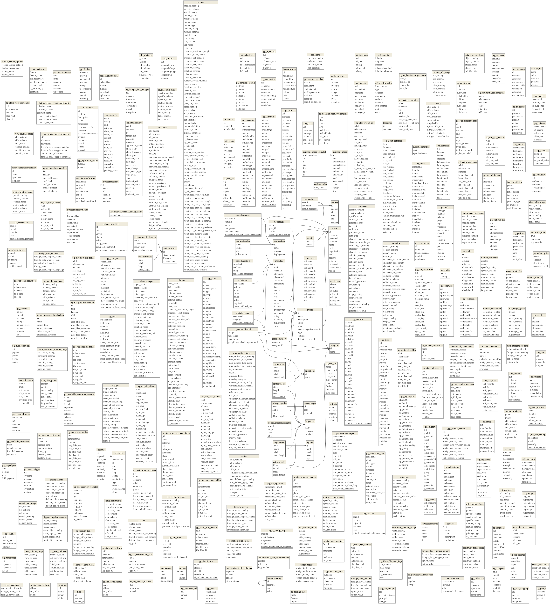

```{r setup}
require(RPostgreSQL)
require(dm)
require(DiagrammeRsvg)
require(rsvg)
require(png)
knitr::opts_chunk$set(cache=F,tidy.opts = list(width.cutoff = 70),
                     tidy = TRUE,
                     max.print=50,fig.path="./Fig/extraction_metadata_",echo=T,
                     collapse=F, echo=T)
def.chunk.hook  <- knitr::knit_hooks$get("chunk")
knitr::knit_hooks$set(chunk = function(x, options) {
  x <- def.chunk.hook(x, options)
  paste0("\n \\", "footnotesize","\n\n", x, "\n\n \\normalsize\n\n")
})
```


# Connexión a la base de datos `meta_i2d`

```{r}
require(RPostgres)
meta_i2d <- dbConnect(Postgres(),dbname = 'meta_i2d')
```

# Funciones de tratamiento de los metadatos en xml

En el archivo [`analysis_metadatos_xml.R`](../funcionesGenerales/analysis_metadatos_xml.R), se escribieron las funciones para manejar las estructuras complejas de metadatos que se pueden obtener desde los archivos (o objetos) XML que contienen los metadatos en los catálogos de Ceiba y Geonetwork.

```{r}
source("../funcionesGenerales/analysis_metadatos_xml.R")
```


# Geonetwork
## Importación

Desde un archivo dump de la base de datos de geonetwork extraído directamente en el servidor, utilizamos los comandos siguientes para duplicar la base de datos:

```bash
createdb geonetwork -D extra
pg_restore -d geonetwork -c --no-owner --no-acl access_dump/dump-geonetwork-202409051028.sql
```

```{r}
geonetwork<-dbConnect(PostgreSQL(),dbname="geonetwork",user="marius")
```

```{r}
dm_object <- dm_from_con(geonetwork, learn_keys = T)
A<-dm_object %>%
  dm_draw(view_type = "all")
A2<-DiagrammeRsvg::export_svg(A)%>%charToRaw()%>%rsvg::rsvg_png("Fig/explor_geonetwork_structureDB.png")

```

## XML representation and analyses

It seems that most of the data is in an xml form in the field `data` of the `metadata` table.

We will need to analyse particularly this XML structure, to be able to extract the metadata from the geonetwork.

```{r}
require(XML)
require(data.tree)
mtdt<-dbGetQuery(geonetwork,"SELECT uuid,data FROM metadata")
```

```{r}
xml_list_gn<-lapply(mtdt[-479,2],function(x)xmlToList(xmlParse(x)))
names(xml_list_gn)<-mtdt$uuid[-479]
```

Con esas 3 grandes funciones, extraemos y analizamos los metadatos de los juegos de datos en Geonetwork:

```{r}
structGn<-extractStructureListDocuments(xml_list_gn)
gnv_gn<-groupsAndVariables(structGn)
tabs_gn<-extractTables(xml_list_gn,structGn,gpsAndVar = gnv_gn)
```

El resultado se puede representar así:

```{r fig.width=30,fig.height=30}
plotGroupsAndVariables(gnv_gn)
```

### Exportación de los metadatos de geonetwork
```{r}
xlFile_gn<-"../../../data_metadatos_catalogos/exportMetaGeonetwork.xlsx"
sqlite_gn<-"../../../data_metadatos_catalogos/meta_geonetwork.sqlite"
tabs_gn<-sqlize_extractedTables(tabs_gn)
dbgn<-exportSQLite(tabs_gn,sqlite_file = sqlite_gn)
exportPostgres(tabs_gn,meta_i2d,schema='geonetwork')
exportXL(tabs_gn,file=xlFile_gn)
```

# Ceiba

## Descripción

Todos los datos de Ceiba están organizados como carpetas en el datadir del servidor. Se maneja después con el sistema Integrated Publishing Toolkit desarrollado por GBIF.

En cada carpeta (cada juego de datos), podemos encontrar:

-   el archivo comprimido que contiene los archivos y los metadatos en formato DarwinCore completo.
-   el archivo `eml.xml` que contiene los metadatos, y todas las versiones del archivo (con los nombres `eml-1.xml`, `eml-2.xml` etc)
-   el archivo `publication.log` que contiene el historial de publicación/modificación del juego de datos
-   archivos de descripción de los juegos de datos en "Rich Text Format" (rtf), tambien para cada versión publicada
-   archivos de administración de datos y metadatos `resource.xml`
-   una carpeta `sources` que contiene los datos (?)

## Extracción de los metadatos

En ssh, accedemos al servidor de ceiba desde la red del instituto:

``` bash
ssh integracion@192.168.11.74
```

Extraemos 3 archivos:

-   un archivo que tiene las direcciones de los archivos "eml.xml" y sus contenidos
-   un archivo que contiene las direcciones de los archivos "resource.xml" y sus contenidos
-   un catalogo de todos los archivos presentes en la carpeta de datos manejada por el ipt

Esos 2 archivos se pueden obtener con:

``` bash
find /home/pem/datadir/ -name eml.xml -exec bash file_and_content.sh {} \; >file_and_content_result_eml 2> errors_find_file_and_content_eml
find /home/pem/datadir/ -name resource.xml  -exec bash file_and_content.sh {} \; >file_and_content_result_resource 2> errors_find_file_and_content_resource
find /home/pem/datadir/ -type f  > result_find
```

Los archivos se pueden descargar desde la red del instituto, gracias al applicativo scp, que funciona a través de ssh.


## Metadatos: EML


```{r}
result_find <- readLines("../../../data_metadatos_catalogos/ceiba/result_find")
meta_ceiba <- readLines("../../../data_metadatos_catalogos/ceiba/file_and_content_result_eml")
meta_ceiba<-meta_ceiba[!meta_ceiba==""]
```


```{r}
adressesXML_emlCeiba<-extractAdressesMultiXml(meta_ceiba)
xml_files_emlCeiba<-apply(adressesXML_emlCeiba,1,function(a,rl)paste(rl[a[2]:a[3]],sep="\n",collapse="\n"),rl=meta_ceiba)
names(xml_files_emlCeiba)<-adressesXML_emlCeiba$name
xml_list_emlCeiba<-lapply(xml_files_emlCeiba,function(x)xmlToList(xmlParse(x)))
```

```{r}
structEmlCeiba<-extractStructureListDocuments(xml_list_emlCeiba)
gnv_emlCeiba<-groupsAndVariables(structEmlCeiba)
tabs_emlCeiba<-extractTables(xml_list_emlCeiba,structEmlCeiba,gpsAndVar = gnv_emlCeiba)
```

```{r fig.width=20,fig.height=20}
plotGroupsAndVariables(gnv_emlCeiba)
```

### Exportación de los metadatos EML de Ceiba
```{r}
xlFile_emlCeiba<-"../../../data_metadatos_catalogos/export_eml_ceiba.xlsx"
sqlite_emlCeiba<-"../../../data_metadatos_catalogos/meta_eml_ceiba.sqlite"
tabs_emlCeiba<-sqlize_extractedTables(tabs_emlCeiba)
dbEmlCeiba<-exportSQLite(tabs_emlCeiba,sqlite_file = sqlite_emlCeiba)
exportPostgres(tabs_emlCeiba,meta_i2d,schema='ceiba_eml')
exportXL(tabs_emlCeiba,file=xlFile_emlCeiba)
```


## Metadatos: Resources


```{r}
resource_ceiba <- readLines("../../../data_metadatos_catalogos/ceiba/file_and_content_result_resource")
resource_ceiba<-resource_ceiba[!resource_ceiba==""]
```


```{r}
adressesXML_resCeiba<-extractAdressesMultiXml(resource_ceiba)
xml_files_resCeiba<-apply(adressesXML_resCeiba,1,function(a,rl)paste(rl[a[2]:a[3]],sep="\n",collapse="\n"),rl=resource_ceiba)
names(xml_files_resCeiba)<-adressesXML_resCeiba$name
xml_list_resCeiba<-lapply(xml_files_resCeiba,function(x)xmlToList(xmlParse(x)))
```

```{r}
structResCeiba<-extractStructureListDocuments(xml_list_resCeiba)
gnv_resCeiba<-groupsAndVariables(structResCeiba)
tabs_resCeiba<-extractTables(xml_list_resCeiba,structResCeiba,gpsAndVar = gnv_resCeiba)
```

```{r fig.width=20,fig.height=20}
plotGroupsAndVariables(gnv_resCeiba)
```

### Exportación de los metadatos "Resources" de Ceiba

```{r}
xlFile_resCeiba<-"../../../data_metadatos_catalogos/export_res_ceiba.xlsx"
sqlite_resCeiba<-"../../../data_metadatos_catalogos/meta_res_ceiba.sqlite"
tabs_resCeiba<-sqlize_extractedTables(tabs_resCeiba)
dbResCeiba<-exportSQLite(tabs_resCeiba,sqlite_file = sqlite_resCeiba)
exportPostgres(tabs_resCeiba,meta_i2d,schema='ceiba_struct')
exportXL(tabs_resCeiba,file=xlFile_resCeiba)
```

## Estructura de la base de datos completas de metadatos

```{r complete_db_struct, fig.height=30, fig.width=15}
tablestosupp<-dbGetQuery(meta_i2d,"SELECT table_schema, table_name FROM information_schema.tables WHERE table_schema NOT IN ('ceiba_eml','ceiba_struct','geonetwork','biocultural')")
tablesBiocultural<-dbGetQuery(meta_i2d,"SELECT table_schema, table_name FROM information_schema.tables WHERE table_schema ='biocultural'")
tablesGeonetwork<-dbGetQuery(meta_i2d,"SELECT table_schema, table_name FROM information_schema.tables WHERE table_schema ='geonetwork'")
tablesCeibaEml<-dbGetQuery(meta_i2d,"SELECT table_schema, table_name FROM information_schema.tables WHERE table_schema ='ceiba_eml'")
tablesCeibaStruct<-dbGetQuery(meta_i2d,"SELECT table_schema, table_name FROM information_schema.tables WHERE table_schema ='ceiba_struct'")

dm_object<-dm_from_con(con=meta_i2d,learn_keys = T,schema=c('ceiba_eml','ceiba_struct','geonetwork','biocultural'),.names = "{.schema}.{.table}")
dm_object<-dm_object[names(dm_object)[!names(dm_object)%in%tablestosupp$table_name]]
A<-dm_object %>%
  dm_set_colors("red"=all_of(names(dm_object)[names(dm_object)%in%tablesBiocultural$table_name]))%>%
  dm_set_colors("blue"=all_of(names(dm_object)[names(dm_object)%in%tablesGeonetwork$table_name]))%>%
  dm_set_colors("green"=all_of(names(dm_object)[names(dm_object)%in%tablesCeibaEml$table_name]))%>%
  dm_set_colors("turquoise"=all_of(names(dm_object)[names(dm_object)%in%tablesCeibaStruct$table_name]))%>%
  dm_draw(view_type = "all")
t_file<-tempfile(fileext = ".png")
DiagrammeRsvg::export_svg(A) %>% charToRaw %>% rsvg_png(file = t_file)
plot(0, xaxt = 'n', yaxt = 'n', bty = 'n', pch = '', ylab = '', xlab = '',xlim=c(0,1),ylim=c(0,1))
png <- readPNG(t_file)
rasterImage(png,0,0,1,1)
legend("topleft",fill=c("red","blue","green","turquoise"),legend=c("biocultural","geonetwork","ceiba (eml)","ceiba (estructura)"),title="Source")
```


```{r}
dbDisconnect(dbEmlCeiba)
dbDisconnect(dbResCeiba)
dbDisconnect(dbgn)
dbDisconnect(geonetwork)
dbDisconnect(meta_i2d)
```

