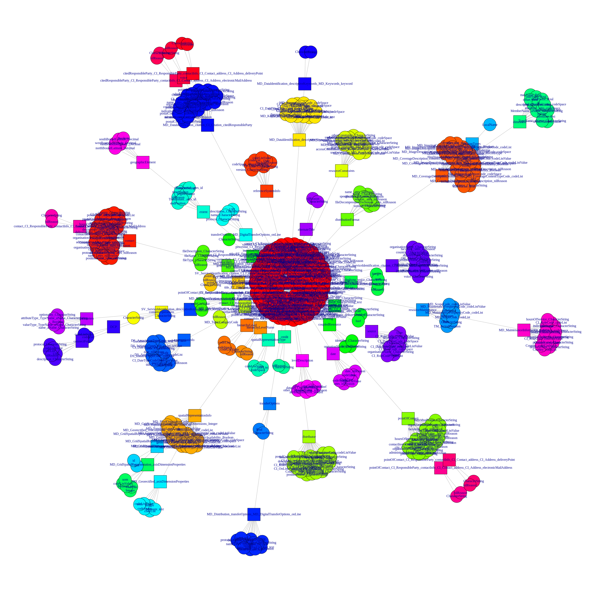
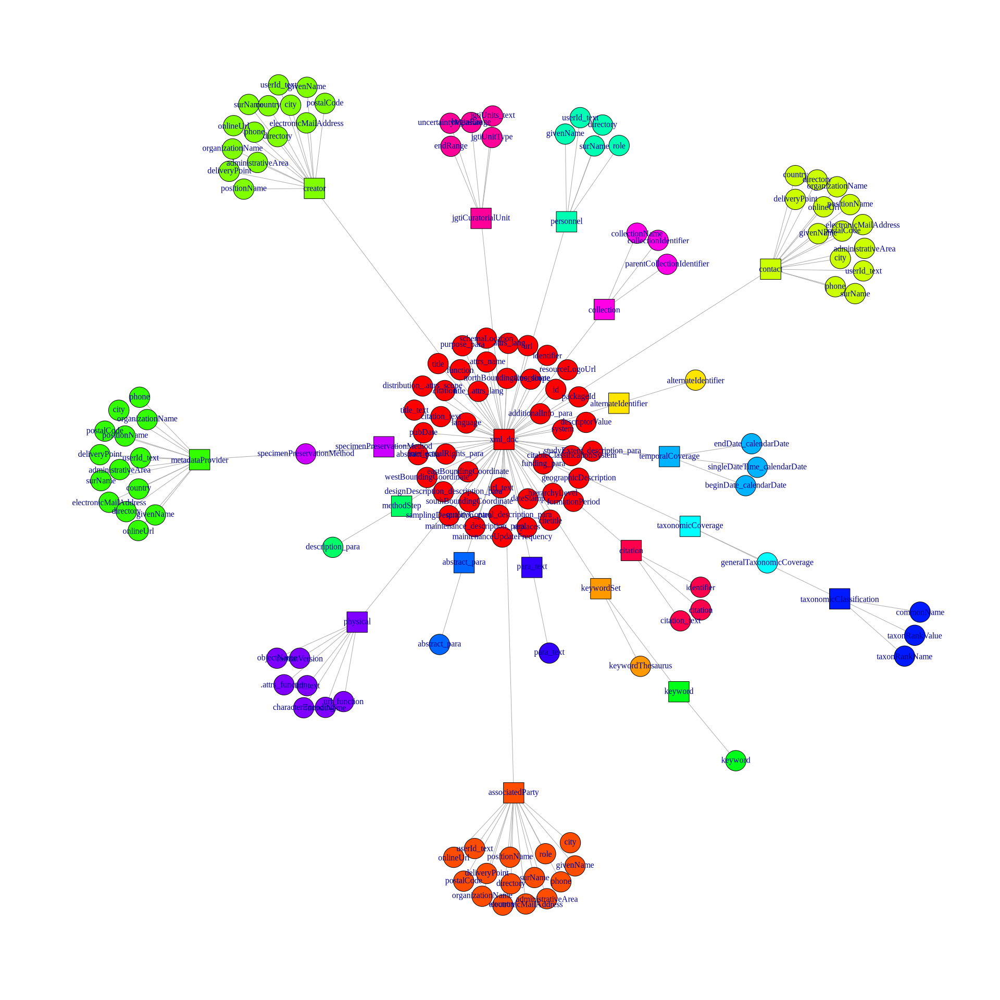
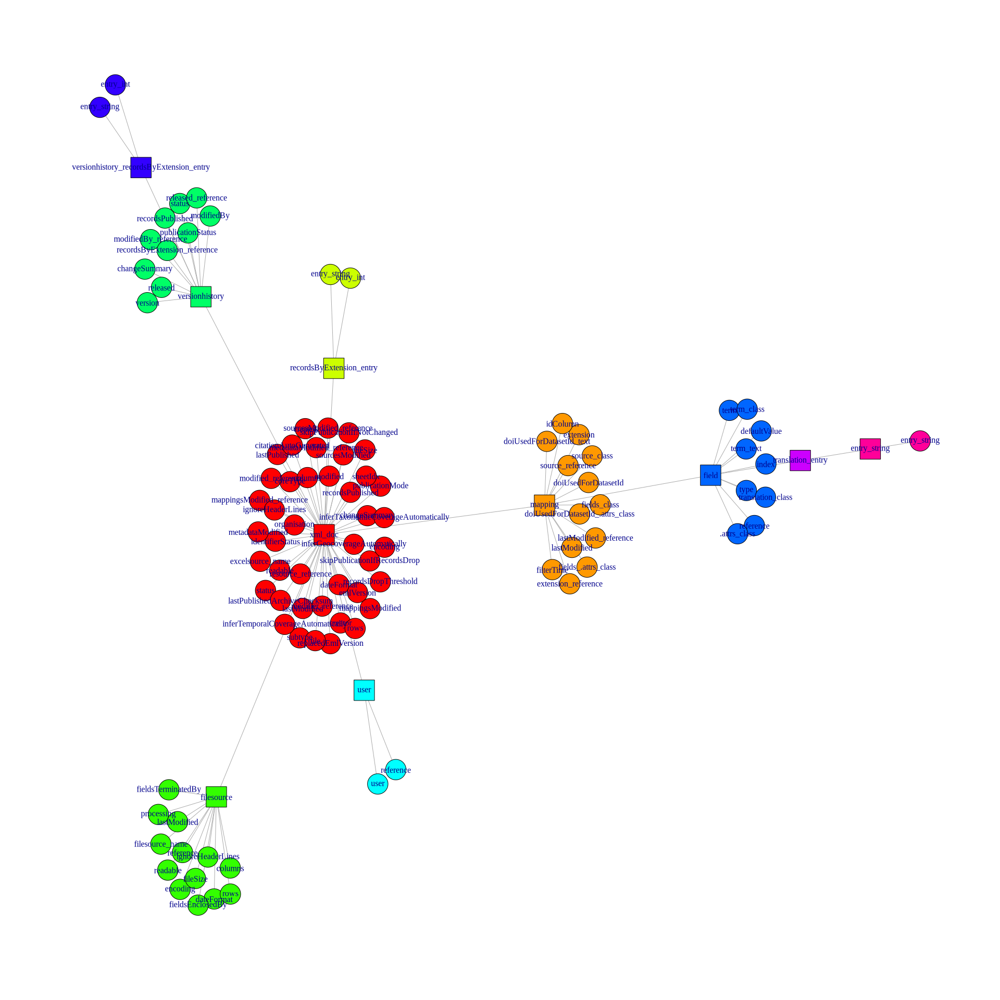
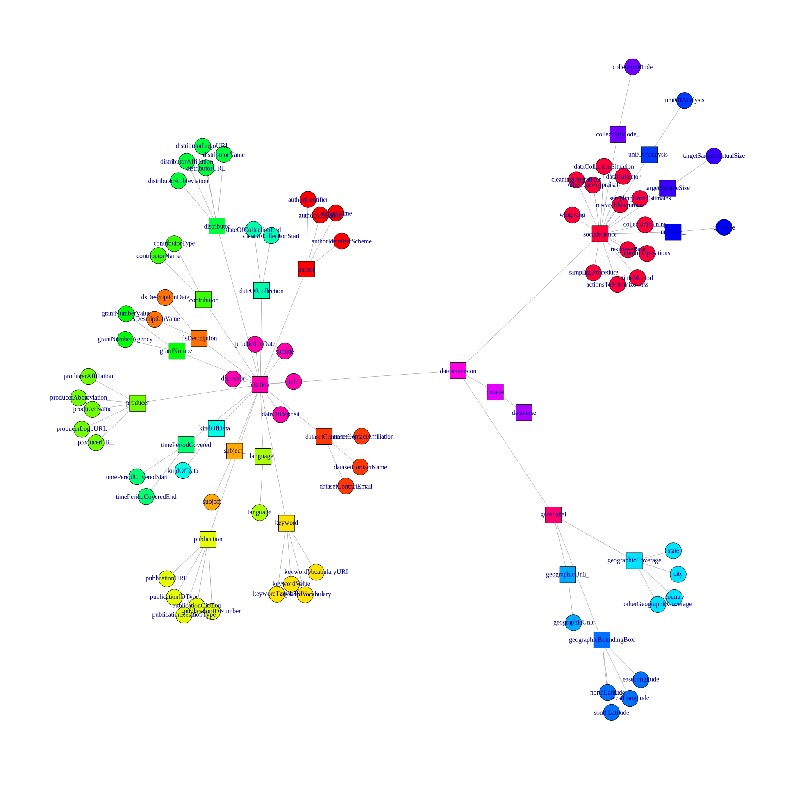
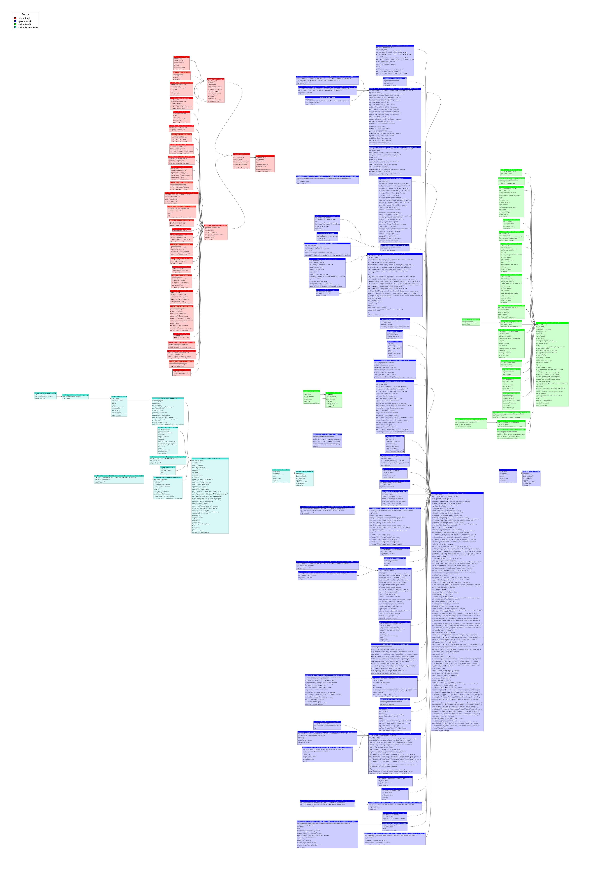

Extracción de los metadatos de los catalogos
================
Marius Bottin
2026-07-25

- [1 Connexión a la base de datos
  `meta_i2d`](#1-connexión-a-la-base-de-datos-meta_i2d)
- [2 Funciones de tratamiento de los metadatos en
  xml](#2-funciones-de-tratamiento-de-los-metadatos-en-xml)
- [3 Geonetwork](#3-geonetwork)
  - [3.1 Importación](#31-importación)
  - [3.2 XML representation and
    analyses](#32-xml-representation-and-analyses)
    - [3.2.1 Exportación de los metadatos de
      geonetwork](#321-exportación-de-los-metadatos-de-geonetwork)
- [4 Ceiba](#4-ceiba)
  - [4.1 Descripción](#41-descripción)
  - [4.2 Extracción de los metadatos](#42-extracción-de-los-metadatos)
  - [4.3 Metadatos: EML](#43-metadatos-eml)
    - [4.3.1 Exportación de los metadatos EML de
      Ceiba](#431-exportación-de-los-metadatos-eml-de-ceiba)
    - [4.3.2 Modificaciones para definir los conjuntos de datos y sus
      versiones](#432-modificaciones-para-definir-los-conjuntos-de-datos-y-sus-versiones)
  - [4.4 Metadatos: Resources](#44-metadatos-resources)
    - [4.4.1 Exportación de los metadatos “Resources” de
      Ceiba](#441-exportación-de-los-metadatos-resources-de-ceiba)
- [5 Biocultural](#5-biocultural)
- [6 Estructura de la base de datos completas de
  metadatos](#6-estructura-de-la-base-de-datos-completas-de-metadatos)

``` r
require(RPostgreSQL)
```

    ## Loading required package: RPostgreSQL

    ## Loading required package: DBI

``` r
require(dm)
```

    ## Loading required package: dm

    ## ! In a coming version, dm will no longer reexport dplyr functions. For best
    ##   results, run `library("dplyr")` before `library("dm")`.
    ## ℹ To suppress this message unconditionally, set
    ##   `options(dm.suppress_dplyr_startup_message = TRUE)`.

    ## 
    ## Attaching package: 'dm'

    ## The following object is masked from 'package:stats':
    ## 
    ##     filter

``` r
require(DiagrammeRsvg)
```

    ## Loading required package: DiagrammeRsvg

``` r
require(rsvg)
```

    ## Loading required package: rsvg

    ## Linking to librsvg 2.62.2

``` r
require(png)
```

    ## Loading required package: png

``` r
knitr::opts_chunk$set(cache=F,tidy.opts = list(width.cutoff = 70),
                     tidy = TRUE,
                     max.print=50,fig.path="./Fig/extraction_metadata_",echo=T,
                     collapse=F, echo=T)
def.chunk.hook  <- knitr::knit_hooks$get("chunk")
knitr::knit_hooks$set(chunk = function(x, options) {
  x <- def.chunk.hook(x, options)
  paste0("\n \\", "footnotesize","\n\n", x, "\n\n \\normalsize\n\n")
})
```

# 1 Connexión a la base de datos `meta_i2d`

``` r
require(RPostgres)
```

    ## Loading required package: RPostgres

``` r
meta_i2d <- dbConnect(Postgres(), dbname = "meta_i2d_v2")
```

# 2 Funciones de tratamiento de los metadatos en xml

En el archivo
[`analysis_metadatos_xml.R`](../funcionesGenerales/analysis_metadatos_xml.R),
se escribieron las funciones para manejar las estructuras complejas de
metadatos que se pueden obtener desde los archivos (o objetos) XML que
contienen los metadatos en los catálogos de Ceiba y Geonetwork.

``` r
source("../funcionesGenerales/analysis_metadatos_xml.R")
```

    ## Loading required package: data.tree

    ## Loading required package: igraph

    ## 
    ## Attaching package: 'igraph'

    ## The following objects are masked from 'package:stats':
    ## 
    ##     decompose, spectrum

    ## The following object is masked from 'package:base':
    ## 
    ##     union

    ## Loading required package: RSQLite

    ## Loading required package: openxlsx

# 3 Geonetwork

## 3.1 Importación

Desde un archivo dump de la base de datos de geonetwork extraído
directamente en el servidor, utilizamos los comandos siguientes para
duplicar la base de datos:

``` bash
createdb geonetwork -D extra
pg_restore -d geonetwork -c --no-owner --no-acl access_dump/dump-geonetwork-20260723.sql
```

``` r
geonetwork <- dbConnect(PostgreSQL(), dbname = "geonetwork", user = "marius")
```

``` r
dm_object <- dm_from_con(geonetwork, learn_keys = T)
A <- dm_object %>%
    dm_draw(view_type = "all")
A2 <- DiagrammeRsvg::export_svg(A) %>%
    charToRaw() %>%
    rsvg::rsvg_png("Fig/explor_geonetwork_structureDB.png")
knitr::include_graphics("Fig/explor_geonetwork_structureDB.png")
```


## 3.2 XML representation and analyses

It seems that most of the data is in an xml form in the field `data` of
the `metadata` table.

We will need to analyse particularly this XML structure, to be able to
extract the metadata from the geonetwork.

``` r
require(XML)
```

    ## Loading required package: XML

``` r
require(data.tree)
mtdt <- dbGetQuery(geonetwork, "SELECT uuid,data FROM metadata")
```

``` r
xml_list_gn <- lapply(mtdt[-115, 2], function(x) xmlToList(xmlParse(x)))
names(xml_list_gn) <- mtdt$uuid[-115]
# for(i in 1:nrow(mtdt)){xmlParse(mtdt[i,2])}
# xml_list_gn<-lapply(mtdt[,2],function(x)xmlToList(xmlParse(x)))
# names(xml_list_gn)<-mtdt$uuid
```

Con esas 3 grandes funciones, extraemos y analizamos los metadatos de
los juegos de datos en Geonetwork:

``` r
structGn <- extractStructureListDocuments(xml_list_gn)
gnv_gn <- groupsAndVariables(structGn)
tabs_gn <- extractTables(xml_list_gn, structGn, gpsAndVar = gnv_gn)
```

El resultado se puede representar así:

``` r
plotGroupsAndVariables(gnv_gn)
```

<!-- -->

### 3.2.1 Exportación de los metadatos de geonetwork

``` r
xlFile_gn <- "../../../data_metadatos_catalogos/exportMetaGeonetwork.xlsx"
sqlite_gn <- "../../../data_metadatos_catalogos/meta_geonetwork.sqlite"
tabs_gn <- sqlize_extractedTables(tabs_gn)
dbgn <- exportSQLite(tabs_gn, sqlite_file = sqlite_gn)
exportPostgres(tabs_gn, meta_i2d, schema = "geonetwork")
```

    ## NOTICE:  identifier "fk_grid_spatial_representation_axis_dimension_properties_spatial_representation_info_idx" will be truncated to "fk_grid_spatial_representation_axis_dimension_properties_spatia"

    ## NOTICE:  identifier "fk_transfer_options_md_digital_transfer_options_on_line_1_xml_doc_idx" will be truncated to "fk_transfer_options_md_digital_transfer_options_on_line_1_xml_d"

    ## NOTICE:  identifier "fk_md_georectified_axis_dimension_properties_spatial_representation_info_idx" will be truncated to "fk_md_georectified_axis_dimension_properties_spatial_representa"

    ## NOTICE:  identifier "fk_descriptive_keywords_md_keywords_keyword_1_sv_service_identification_descriptive_keywords_idx" will be truncated to "fk_descriptive_keywords_md_keywords_keyword_1_sv_service_identi"

    ## NOTICE:  identifier "fk_transfer_options_md_digital_transfer_options_on_line_2_transfer_options_idx" will be truncated to "fk_transfer_options_md_digital_transfer_options_on_line_2_trans"

    ## NOTICE:  identifier "fk_descriptive_keywords_md_keywords_keyword_2_md_data_identification_descriptive_keywords_idx" will be truncated to "fk_descriptive_keywords_md_keywords_keyword_2_md_data_identific"

    ## NOTICE:  identifier "fk_ci_contact_address_ci_address_electronic_mail_address_1_contact_idx" will be truncated to "fk_ci_contact_address_ci_address_electronic_mail_address_1_cont"

    ## NOTICE:  identifier "fk_ci_contact_address_ci_address_electronic_mail_address_2_point_of_contact_idx" will be truncated to "fk_ci_contact_address_ci_address_electronic_mail_address_2_poin"

    ## NOTICE:  identifier "fk_info_ci_contact_address_ci_address_delivery_point_1_point_of_contact_idx" will be truncated to "fk_info_ci_contact_address_ci_address_delivery_point_1_point_of"

    ## NOTICE:  identifier "fk_ci_contact_address_ci_address_electronic_mail_address_3_citation_ci_citation_cited_responsible_party_1_idx" will be truncated to "fk_ci_contact_address_ci_address_electronic_mail_address_3_cita"

    ## NOTICE:  identifier "fk_info_ci_contact_address_ci_address_delivery_point_2_citation_ci_citation_cited_responsible_party_1_idx" will be truncated to "fk_info_ci_contact_address_ci_address_delivery_point_2_citation"

``` r
exportXL(tabs_gn, file = xlFile_gn)
```

# 4 Ceiba

## 4.1 Descripción

Todos los datos de Ceiba están organizados como carpetas en el datadir
del servidor. Se maneja después con el sistema Integrated Publishing
Toolkit desarrollado por GBIF.

En cada carpeta (cada juego de datos), podemos encontrar:

- el archivo comprimido que contiene los archivos y los metadatos en
  formato DarwinCore completo.
- el archivo `eml.xml` que contiene los metadatos, y todas las versiones
  del archivo (con los nombres `eml-1.xml`, `eml-2.xml` etc)
- el archivo `publication.log` que contiene el historial de
  publicación/modificación del juego de datos
- archivos de descripción de los juegos de datos en “Rich Text Format”
  (rtf), tambien para cada versión publicada
- archivos de administración de datos y metadatos `resource.xml`
- una carpeta `sources` que contiene los datos (?)

## 4.2 Extracción de los metadatos

En ssh, accedemos al servidor de ceiba desde la red del instituto:

``` bash
ssh integracion@192.168.11.74
```

Extraemos 3 archivos:

- un archivo que tiene las direcciones de los archivos “eml.xml” y sus
  contenidos
- un archivo que contiene las direcciones de los archivos “resource.xml”
  y sus contenidos
- un catalogo de todos los archivos presentes en la carpeta de datos
  manejada por el ipt

Esos 2 archivos se pueden obtener con:

``` bash
find /home/pem/datadir/ -name eml.xml -exec bash file_and_content.sh {} \; >file_and_content_result_eml 2> errors_find_file_and_content_eml
find /home/pem/datadir/ -name resource.xml  -exec bash file_and_content.sh {} \; >file_and_content_result_resource 2> errors_find_file_and_content_resource
find /home/pem/datadir/ -type f  > result_find
```

Estoy trabajando ahora sobre una version que permite tratar todas las
versiones de los datasets:

``` bash
find datadir/ -regex ".*eml.*.xml" -exec bash file_and_content.sh {} \; >file_and_content_result_eml_allVersions 2> errors_find_file_and_content_eml_allVersions
```

Los archivos se pueden descargar desde la red del instituto, gracias al
applicativo scp, que funciona a través de ssh.

## 4.3 Metadatos: EML

``` r
result_find <- readLines("/home/marius/Travail/Data/IPTs/Ceiba/AmbPruebas2026/result_find")
meta_ceiba <- readLines("/home/marius/Travail/Data/IPTs/Ceiba/AmbPruebas2026/file_and_content_result_eml_allVersions")
meta_ceiba <- meta_ceiba[!meta_ceiba == ""]
```

``` r
adressesXML_emlCeiba <- extractAdressesMultiXml(meta_ceiba)
```

    ## Number of elements: 5860

``` r
xml_files_emlCeiba <- apply(adressesXML_emlCeiba, 1, function(a, rl) paste(rl[a[2]:a[3]],
    sep = "\n", collapse = "\n"), rl = meta_ceiba)
names(xml_files_emlCeiba) <- adressesXML_emlCeiba$name
xml_list_emlCeiba <- lapply(xml_files_emlCeiba, function(x) xmlToList(xmlParse(x)))
```

``` r
structEmlCeiba <- extractStructureListDocuments(xml_list_emlCeiba)
gnv_emlCeiba <- groupsAndVariables(structEmlCeiba)
tabs_emlCeiba <- extractTables(xml_list_emlCeiba, structEmlCeiba, gpsAndVar = gnv_emlCeiba)
```

``` r
plotGroupsAndVariables(gnv_emlCeiba)
```

<!-- -->

### 4.3.1 Exportación de los metadatos EML de Ceiba

``` r
xlFile_emlCeiba <- "../../../data_metadatos_catalogos/export_eml_ceiba.xlsx"
sqlite_emlCeiba <- "../../../data_metadatos_catalogos/meta_eml_ceiba.sqlite"
tabs_emlCeiba <- sqlize_extractedTables(tabs_emlCeiba)
dbEmlCeiba <- exportSQLite(tabs_emlCeiba, sqlite_file = sqlite_emlCeiba)
exportPostgres(tabs_emlCeiba, meta_i2d, schema = "ceiba_eml")
exportXL(tabs_emlCeiba, file = xlFile_emlCeiba)
```

    ## Warning in wb$writeData(df = x, colNames = TRUE, sheet = sheet, startRow = startRow, : ), Tiempo atmosf ... to del Casanare. is truncated. 
    ## Number of characters exeed the limit of 32767.
    ## Warning in wb$writeData(df = x, colNames = TRUE, sheet = sheet, startRow = startRow, : ), Tiempo atmosf ... to del Casanare. is truncated. 
    ## Number of characters exeed the limit of 32767.
    ## Warning in wb$writeData(df = x, colNames = TRUE, sheet = sheet, startRow = startRow, : ), Tiempo atmosf ... to del Casanare. is truncated. 
    ## Number of characters exeed the limit of 32767.
    ## Warning in wb$writeData(df = x, colNames = TRUE, sheet = sheet, startRow = startRow, : ), Tiempo atmosf ... to del Casanare. is truncated. 
    ## Number of characters exeed the limit of 32767.
    ## Warning in wb$writeData(df = x, colNames = TRUE, sheet = sheet, startRow = startRow, : ), Tiempo atmosf ... to del Casanare. is truncated. 
    ## Number of characters exeed the limit of 32767.
    ## Warning in wb$writeData(df = x, colNames = TRUE, sheet = sheet, startRow = startRow, : ), Tiempo atmosf ... to del Casanare. is truncated. 
    ## Number of characters exeed the limit of 32767.
    ## Warning in wb$writeData(df = x, colNames = TRUE, sheet = sheet, startRow = startRow, : ), Tiempo atmosf ... to del Casanare. is truncated. 
    ## Number of characters exeed the limit of 32767.
    ## Warning in wb$writeData(df = x, colNames = TRUE, sheet = sheet, startRow = startRow, : ), Tiempo atmosf ... to del Casanare. is truncated. 
    ## Number of characters exeed the limit of 32767.

### 4.3.2 Modificaciones para definir los conjuntos de datos y sus versiones

``` sql
SELECT cd_xml_doc, REGEXP_REPLACE(package_id, '^.*resource(\.do)?\?id=([^/]+)/v(.+)$', '\2') dataset_shortname, REGEXP_REPLACE(package_id, '^.*resource(\.do)?\?id=([^/]+)/v(.+)$', '\3') version 
FROM ceiba_eml.xml_doc
--WHERE NOT package_id ~* '^.*resource(\.do)?\?id=([^/]+)/v([0-9]+)\.?([0-9])?$'
LIMIT 10
```

<div class="knitsql-table">

| cd_xml_doc | dataset_shortname                | version |
|:-----------|:---------------------------------|:--------|
| 1          | fichas_bs_plantae_endemicas_2015 | 5       |
| 2          | fichas_bs_plantae_endemicas_2015 | 1       |
| 3          | fichas_bs_plantae_endemicas_2015 | 4       |
| 4          | fichas_bs_plantae_endemicas_2015 | 5.0     |
| 5          | fichas_bs_plantae_endemicas_2015 | 3       |
| 6          | fichas_bs_plantae_endemicas_2015 | 2       |
| 7          | plantas_sumapaz_colbio_2018      | 1       |
| 8          | plantas_sumapaz_colbio_2018      | 4.0     |
| 9          | plantas_sumapaz_colbio_2018      | 3       |
| 10         | plantas_sumapaz_colbio_2018      | 4       |

10 records

</div>

``` r
dbExecute(meta_i2d, "ALTER TABLE ceiba_eml.xml_doc 
          ADD COLUMN dataset_shortname TEXT,
          ADD COLUMN major_version INT,
          ADD COLUMN minor_version INT,
          ADD COLUMN last_version boolean default false")
```

    ## [1] 0

``` r
dbExecute(meta_i2d, "WITH extract AS(
  SELECT cd_xml_doc, 
    REGEXP_REPLACE(package_id, '^.*resource(\\.do)?\\?id=([^/]+)/v([0-9]+)\\.?([0-9])?$', '\\2') dataset_shortname, 
    REGEXP_REPLACE(package_id, '^.*resource(\\.do)?\\?id=([^/]+)/v(.+)$', '\\3') version ,
    REGEXP_REPLACE(package_id, '^.*resource(\\.do)?\\?id=([^/]+)/v([0-9]+)\\.?([0-9])?$', '\\3') major_version, 
    REGEXP_REPLACE(package_id, '^.*resource(\\.do)?\\?id=([^/]+)/v([0-9]+)\\.?([0-9])?$', '\\4') minor_version 
  FROM ceiba_eml.xml_doc
), e AS(
  SELECT cd_xml_doc,
    dataset_shortname, 
    CASE WHEN major_version='' THEN NULL ELSE major_version::int END major_version,
    CASE WHEN minor_version='' THEN NULL ELSE minor_version::int END minor_version
  FROM extract
)
UPDATE ceiba_eml.xml_doc AS xd
SET dataset_shortname=e.dataset_shortname, major_version=e.major_version, minor_version=e.minor_version
FROM e
WHERE xd.cd_xml_doc=e.cd_xml_doc
")
```

    ## [1] 5860

``` r
dbExecute(meta_i2d, "CREATE INDEX idx_ceiba_eml_xml_doc_dataset_shortname ON ceiba_eml.xml_doc (dataset_shortname)")
```

    ## [1] 0

``` sql
SELECT dataset_shortname, major_version, minor_version,
  ROW_NUMBER() OVER (PARTITION BY dataset_shortname ORDER BY major_version DESC, minor_version DESC NULLS FIRST), last_version
FROM ceiba_eml.xml_doc
LIMIT 50
```

<div class="knitsql-table">

| dataset_shortname        | major_version | minor_version | row_number | last_version |
|:-------------------------|--------------:|--------------:|-----------:|:-------------|
| abejas_rioclaro_2022     |             1 |            NA |          1 | FALSE        |
| abejas_rioclaro_2022     |             1 |             1 |          2 | FALSE        |
| abejas_rioclaro_2022     |             1 |             1 |          3 | FALSE        |
| acacias-mp_fibras_2022   |             3 |            NA |          1 | FALSE        |
| acacias-mp_fibras_2022   |             3 |             0 |          2 | FALSE        |
| acacias-mp_fibras_2022   |             2 |            NA |          3 | FALSE        |
| acacias-mp_fibras_2022   |             1 |            NA |          4 | FALSE        |
| acandi_arecaceae_2014    |            14 |            NA |          1 | FALSE        |
| acandi_arecaceae_2014    |            14 |             1 |          2 | FALSE        |
| acandi_arecaceae_2014    |            14 |             1 |          3 | FALSE        |
| acandi_arecaceae_2014    |            13 |            NA |          4 | FALSE        |
| acandi_arecaceae_2014    |            12 |            NA |          5 | FALSE        |
| acandi_arecaceae_2014    |            11 |            NA |          6 | FALSE        |
| acandi_arecaceae_2014    |            10 |            NA |          7 | FALSE        |
| acandi_arecaceae_2014    |             9 |            NA |          8 | FALSE        |
| acandi_arecaceae_2014    |             8 |            NA |          9 | FALSE        |
| acandi_arecaceae_2014    |             7 |            NA |         10 | FALSE        |
| acandi_arecaceae_2014    |             6 |            NA |         11 | FALSE        |
| acandi_arecaceae_2014    |             5 |            NA |         12 | FALSE        |
| acandi_arecaceae_2014    |             4 |            NA |         13 | FALSE        |
| acandi_arecaceae_2014    |             3 |            NA |         14 | FALSE        |
| acandi_arecaceae_2014    |             2 |            NA |         15 | FALSE        |
| acandi_arecaceae_2014    |             1 |            NA |         16 | FALSE        |
| adn_suelo_2018           |             1 |            NA |          1 | FALSE        |
| adn_suelo_2018           |             1 |             2 |          2 | FALSE        |
| adn_suelo_2018           |             1 |             2 |          3 | FALSE        |
| adn_suelo_2018           |             1 |             1 |          4 | FALSE        |
| agraz_palladium_2023     |             1 |             0 |          1 | FALSE        |
| agraz_palladium_2023     |             1 |             0 |          2 | FALSE        |
| america_arecaceae_2014   |            14 |            NA |          1 | FALSE        |
| america_arecaceae_2014   |            14 |             1 |          2 | FALSE        |
| america_arecaceae_2014   |            14 |             1 |          3 | FALSE        |
| america_arecaceae_2014   |            13 |            NA |          4 | FALSE        |
| america_arecaceae_2014   |            12 |            NA |          5 | FALSE        |
| america_arecaceae_2014   |            11 |            NA |          6 | FALSE        |
| america_arecaceae_2014   |            10 |            NA |          7 | FALSE        |
| america_arecaceae_2014   |             9 |            NA |          8 | FALSE        |
| america_arecaceae_2014   |             8 |            NA |          9 | FALSE        |
| america_arecaceae_2014   |             7 |            NA |         10 | FALSE        |
| america_arecaceae_2014   |             6 |            NA |         11 | FALSE        |
| america_arecaceae_2014   |             5 |            NA |         12 | FALSE        |
| america_arecaceae_2014   |             4 |            NA |         13 | FALSE        |
| america_arecaceae_2014   |             3 |            NA |         14 | FALSE        |
| america_arecaceae_2014   |             2 |            NA |         15 | FALSE        |
| america_arecaceae_2014   |             1 |            NA |         16 | FALSE        |
| america_exoticas_is_2014 |             7 |            NA |          1 | FALSE        |
| america_exoticas_is_2014 |             7 |             0 |          2 | FALSE        |
| america_exoticas_is_2014 |             6 |            NA |          3 | FALSE        |
| america_exoticas_is_2014 |             5 |            NA |          4 | FALSE        |
| america_exoticas_is_2014 |             4 |            NA |          5 | FALSE        |

Displaying records 1 - 50

</div>

``` r
dbExecute(meta_i2d, "WITH a AS (
            SELECT DISTINCT ON (dataset_shortname) cd_xml_doc
            FROM ceiba_eml.xml_doc
            ORDER BY dataset_shortname, major_version DESC, minor_version DESC NULLS FIRST
          )
          UPDATE ceiba_eml.xml_doc
          SET last_version=true
          WHERE cd_xml_doc IN (SELECT cd_xml_doc FROM a)
          ")
```

    ## [1] 1097

## 4.4 Metadatos: Resources

``` r
resource_ceiba <- readLines("/home/marius/Travail/Data/IPTs/Ceiba/AmbPruebas2026/file_and_content_result_resource")
```

    ## Warning in
    ## readLines("/home/marius/Travail/Data/IPTs/Ceiba/AmbPruebas2026/file_and_content_result_resource"):
    ## incomplete final line found on
    ## '/home/marius/Travail/Data/IPTs/Ceiba/AmbPruebas2026/file_and_content_result_resource'

``` r
resource_ceiba <- resource_ceiba[!resource_ceiba == ""]
```

``` r
adressesXML_resCeiba <- extractAdressesMultiXml(resource_ceiba)
```

    ## Number of elements: 1100

``` r
xml_files_resCeiba <- apply(adressesXML_resCeiba, 1, function(a, rl) paste(rl[a[2]:a[3]],
    sep = "\n", collapse = "\n"), rl = resource_ceiba)
names(xml_files_resCeiba) <- adressesXML_resCeiba$name
xml_list_resCeiba <- lapply(xml_files_resCeiba, function(x) xmlToList(xmlParse(x)))
```

``` r
structResCeiba <- extractStructureListDocuments(xml_list_resCeiba)
gnv_resCeiba <- groupsAndVariables(structResCeiba)
tabs_resCeiba <- extractTables(xml_list_resCeiba, structResCeiba, gpsAndVar = gnv_resCeiba)
```

``` r
plotGroupsAndVariables(gnv_resCeiba)
```

<!-- -->

### 4.4.1 Exportación de los metadatos “Resources” de Ceiba

``` r
xlFile_resCeiba <- "../../../data_metadatos_catalogos/export_res_ceiba.xlsx"
sqlite_resCeiba <- "../../../data_metadatos_catalogos/meta_res_ceiba.sqlite"
tabs_resCeiba <- sqlize_extractedTables(tabs_resCeiba)
dbResCeiba <- exportSQLite(tabs_resCeiba, sqlite_file = sqlite_resCeiba)
exportPostgres(tabs_resCeiba, meta_i2d, schema = "ceiba_struct")
```

    ## NOTICE:  drop cascades to 12 other objects
    ## DETAIL:  drop cascades to table ceiba_struct.tabinfo
    ## drop cascades to table ceiba_struct.varinfo
    ## drop cascades to table ceiba_struct.xml_doc
    ## drop cascades to table ceiba_struct.mapping
    ## drop cascades to table ceiba_struct.records_by_extension_entry
    ## drop cascades to table ceiba_struct.filesource
    ## drop cascades to table ceiba_struct.versionhistory
    ## drop cascades to table ceiba_struct."user"
    ## drop cascades to table ceiba_struct.field
    ## drop cascades to table ceiba_struct.versionhistory_records_by_extension_entry
    ## drop cascades to table ceiba_struct.translation_entry
    ## drop cascades to table ceiba_struct.entry_string

``` r
exportXL(tabs_resCeiba, file = xlFile_resCeiba)
```

# 5 Biocultural

``` r
source("../funcionesGenerales/analysis_metadata_dataverse.R")
biocultural <- dbConnect(PostgreSQL(), dbname = "biocultural", user = "marius")
analysisBC <- dvAnalyseVar(biocultural)
```

``` r
dv_plot_variables(analysisBC)
```

<!-- -->

``` r
descriTables <- dvPrepareTableDescription(analysisBC, biocultural)
```

``` r
dbExecute(meta_i2d, "DROP SCHEMA IF EXISTS biocultural CASCADE")
```

    ## [1] 0

``` r
dbExecute(meta_i2d, "CREATE SCHEMA biocultural")
```

    ## [1] 0

``` r
createPostgresTableStatement <- mapply(function(x, y) createTableStatement(nameTable = x,
    tabAttr = y, dbConnection = meta_i2d, schema = "biocultural"), x = names(descriTables),
    y = descriTables)
lapply(createPostgresTableStatement, dbExecute, conn = meta_i2d)
```

    ## $dataverse
    ## [1] 0
    ## 
    ## $dataset
    ## [1] 0
    ## 
    ## $datasetversion
    ## [1] 0
    ## 
    ## $citation
    ## [1] 0
    ## 
    ## $geospatial
    ## [1] 0
    ## 
    ## $socialscience
    ## [1] 0
    ## 
    ## $author
    ## [1] 0
    ## 
    ## $datasetContact
    ## [1] 0
    ## 
    ## $dsDescription
    ## [1] 0
    ## 
    ## $subject
    ## [1] 0
    ## 
    ## $keyword
    ## [1] 0
    ## 
    ## $publication
    ## [1] 0
    ## 
    ## $language
    ## [1] 0
    ## 
    ## $producer
    ## [1] 0
    ## 
    ## $contributor
    ## [1] 0
    ## 
    ## $grantNumber
    ## [1] 0
    ## 
    ## $distributor
    ## [1] 0
    ## 
    ## $timePeriodCovered
    ## [1] 0
    ## 
    ## $dateOfCollection
    ## [1] 0
    ## 
    ## $kindOfData
    ## [1] 0
    ## 
    ## $geographicCoverage
    ## [1] 0
    ## 
    ## $geographicUnit
    ## [1] 0
    ## 
    ## $geographicBoundingBox
    ## [1] 0
    ## 
    ## $unitOfAnalysis
    ## [1] 0
    ## 
    ## $universe
    ## [1] 0
    ## 
    ## $targetSampleSize
    ## [1] 0
    ## 
    ## $collectionMode
    ## [1] 0
    ## 
    ## $datafile
    ## [1] 0
    ## 
    ## $filedescription
    ## [1] 0
    ## 
    ## $ingest
    ## [1] 0
    ## 
    ## $variable
    ## [1] 0

``` r
extractedBiocultural <- extractValues(descriTables, biocultural)
extractedBiocultural <- lapply(extractedBiocultural, unique)  # THAT IS A BAD FIX for a serious problem: everything is duplicated!
insertTables(extractedBiocultural, meta_i2d, descriTables, "biocultural")
```

Para razones de practicidad, es importante poder determinar de manera
facil cual es la ultima versión de cada dataset en biocultural.

``` sql
WITH a AS(
SELECT  *, ROW_NUMBER() OVER (PARTITION BY dataset_id ORDER BY createtime DESC) version_order
FROM biocultural.datasetversion
WHERE versionstate='RELEASED'
ORDER BY dataset_id, createtime
)
SELECT * 
FROM a
WHERE version_order=1
```

<div class="knitsql-table">

| datasetversion_id | dataset_id | createtime | versionnumber | minorversionnumber | versionnote | versionstate | version_order |
|---:|---:|:---|---:|---:|:---|:---|---:|
| 9 | 10 | 2022-12-14 21:42:35 | 2 | 0 | NA | RELEASED | 1 |
| 24 | 11 | 2022-12-21 02:14:29 | 1 | 4 | NA | RELEASED | 1 |
| 6 | 18 | 2022-12-14 15:11:44 | 1 | 1 | NA | RELEASED | 1 |
| 77 | 22 | 2025-01-09 06:54:55 | 2 | 0 | NA | RELEASED | 1 |
| 78 | 26 | 2025-01-09 07:28:59 | 2 | 0 | NA | RELEASED | 1 |
| 79 | 34 | 2025-01-09 07:39:18 | 2 | 0 | NA | RELEASED | 1 |
| 80 | 39 | 2025-01-09 07:55:10 | 2 | 0 | NA | RELEASED | 1 |
| 13 | 42 | 2022-12-16 00:00:39 | 1 | 0 | NA | RELEASED | 1 |
| 82 | 46 | 2025-01-09 08:18:20 | 2 | 0 | NA | RELEASED | 1 |
| 15 | 49 | 2022-12-16 19:11:51 | 1 | 0 | NA | RELEASED | 1 |
| 17 | 54 | 2022-12-16 21:41:11 | 1 | 1 | NA | RELEASED | 1 |
| 18 | 57 | 2022-12-17 01:26:45 | 1 | 0 | NA | RELEASED | 1 |
| 19 | 59 | 2022-12-19 20:34:54 | 1 | 0 | NA | RELEASED | 1 |
| 84 | 63 | 2025-01-09 08:52:07 | 2 | 0 | NA | RELEASED | 1 |
| 85 | 72 | 2025-01-09 09:11:01 | 2 | 0 | NA | RELEASED | 1 |
| 29 | 78 | 2023-08-29 21:04:49 | 1 | 1 | NA | RELEASED | 1 |
| 27 | 81 | 2023-08-23 08:35:21 | 1 | 0 | NA | RELEASED | 1 |
| 28 | 83 | 2023-08-23 08:50:24 | 1 | 0 | NA | RELEASED | 1 |
| 73 | 90 | 2025-01-09 04:54:06 | 3 | 0 | NA | RELEASED | 1 |
| 75 | 94 | 2025-01-09 06:07:47 | 3 | 0 | NA | RELEASED | 1 |
| 36 | 100 | 2024-01-15 20:25:38 | 2 | 0 | NA | RELEASED | 1 |
| 119 | 105 | 2025-10-29 20:23:38 | 1 | 1 | NA | RELEASED | 1 |
| 76 | 109 | 2025-01-09 06:34:46 | 4 | 0 | NA | RELEASED | 1 |
| 46 | 114 | 2024-03-14 06:29:42 | 3 | 0 | NA | RELEASED | 1 |
| 47 | 120 | 2024-04-02 00:17:34 | 1 | 0 | NA | RELEASED | 1 |
| 49 | 122 | 2024-05-16 20:27:07 | 1 | 1 | NA | RELEASED | 1 |
| 95 | 127 | 2025-06-18 22:39:17 | 3 | 0 | NA | RELEASED | 1 |
| 52 | 136 | 2024-06-14 15:24:07 | 1 | 0 | NA | RELEASED | 1 |
| 53 | 138 | 2024-06-28 01:16:28 | 1 | 0 | NA | RELEASED | 1 |
| 65 | 144 | 2024-10-11 07:38:22 | 1 | 1 | NA | RELEASED | 1 |
| 60 | 148 | 2024-09-06 02:25:07 | 1 | 1 | NA | RELEASED | 1 |
| 118 | 155 | 2025-10-29 20:15:04 | 1 | 2 | NA | RELEASED | 1 |
| 117 | 159 | 2025-10-29 20:13:00 | 1 | 1 | NA | RELEASED | 1 |
| 67 | 164 | 2024-10-23 22:17:39 | 1 | 0 | NA | RELEASED | 1 |
| 68 | 172 | 2024-10-29 07:16:41 | 1 | 0 | NA | RELEASED | 1 |
| 69 | 176 | 2024-11-02 02:47:23 | 1 | 0 | NA | RELEASED | 1 |
| 141 | 189 | 2026-01-28 16:24:02 | 2 | 0 | NA | RELEASED | 1 |
| 72 | 201 | 2024-11-27 16:58:45 | 1 | 0 | NA | RELEASED | 1 |
| 93 | 220 | 2025-05-14 01:57:21 | 1 | 1 | NA | RELEASED | 1 |
| 92 | 226 | 2025-04-11 21:17:46 | 1 | 1 | NA | RELEASED | 1 |
| 116 | 228 | 2025-10-29 19:41:54 | 1 | 1 | NA | RELEASED | 1 |
| 99 | 238 | 2025-07-22 21:10:52 | 1 | 1 | NA | RELEASED | 1 |
| 108 | 243 | 2025-10-11 02:48:33 | 1 | 1 | NA | RELEASED | 1 |
| 106 | 249 | 2025-10-11 02:42:03 | 1 | 1 | NA | RELEASED | 1 |
| 107 | 251 | 2025-10-11 02:45:13 | 1 | 3 | NA | RELEASED | 1 |
| 109 | 255 | 2025-10-11 02:50:00 | 1 | 1 | NA | RELEASED | 1 |
| 114 | 262 | 2025-10-28 21:14:18 | 1 | 2 | NA | RELEASED | 1 |
| 120 | 263 | 2025-10-31 21:47:39 | 2 | 0 | NA | RELEASED | 1 |
| 121 | 270 | 2025-11-27 21:59:44 | 1 | 0 | NA | RELEASED | 1 |
| 130 | 272 | 2025-12-12 20:55:03 | 1 | 1 | NA | RELEASED | 1 |

Displaying records 1 - 50

</div>

``` r
dbExecute(meta_i2d, "ALTER TABLE biocultural.datasetversion ADD COLUMN IF NOT EXISTS lastversion boolean default false")
```

    ## [1] 0

``` r
dbExecute(meta_i2d, "WITH a AS(
SELECT  *, ROW_NUMBER() OVER (PARTITION BY dataset_id ORDER BY createtime DESC) version_order
FROM biocultural.datasetversion
WHERE versionstate='RELEASED'
ORDER BY dataset_id, createtime
),b AS(
SELECT * 
FROM a
WHERE version_order=1
)
UPDATE biocultural.datasetversion dv
SET lastversion=true
FROM b
WHERE dv.datasetversion_id=b.datasetversion_id
")
```

    ## [1] 61

# 6 Estructura de la base de datos completas de metadatos

``` r
tablestosupp <- dbGetQuery(meta_i2d, "SELECT table_schema, table_name FROM information_schema.tables WHERE table_schema NOT IN ('ceiba_eml','ceiba_struct','geonetwork','biocultural')")
tablesBiocultural <- dbGetQuery(meta_i2d, "SELECT table_schema, table_name, table_schema||'.'||table_name AS schema_table FROM information_schema.tables WHERE table_schema ='biocultural'")
tablesGeonetwork <- dbGetQuery(meta_i2d, "SELECT table_schema, table_name, table_name, table_schema||'.'||table_name AS schema_table FROM information_schema.tables WHERE table_schema ='geonetwork'")
tablesCeibaEml <- dbGetQuery(meta_i2d, "SELECT table_schema, table_name, table_name, table_schema||'.'||table_name AS schema_table FROM information_schema.tables WHERE table_schema ='ceiba_eml'")
tablesCeibaStruct <- dbGetQuery(meta_i2d, "SELECT table_schema, table_name, table_name, table_schema||'.'||table_name AS schema_table FROM information_schema.tables WHERE table_schema ='ceiba_struct'")

dm_object <- dm_from_con(con = meta_i2d, learn_keys = T, schema = c("ceiba_eml",
    "ceiba_struct", "geonetwork", "biocultural"), .names = "{.schema}.{.table}")
dm_object <- dm_object[names(dm_object)[!names(dm_object) %in% tablestosupp$table_name]]
A <- dm_object %>%
    dm_set_colors(red = all_of(names(dm_object)[names(dm_object) %in% tablesBiocultural$schema_table])) %>%
    dm_set_colors(blue = all_of(names(dm_object)[names(dm_object) %in%
        tablesGeonetwork$schema_table])) %>%
    dm_set_colors(green = all_of(names(dm_object)[names(dm_object) %in%
        tablesCeibaEml$schema_table])) %>%
    dm_set_colors(turquoise = all_of(names(dm_object)[names(dm_object) %in%
        tablesCeibaStruct$schema_table])) %>%
    dm_draw(view_type = "all")
t_file <- tempfile(fileext = ".png")
DiagrammeRsvg::export_svg(A) %>%
    charToRaw %>%
    rsvg_png(file = t_file)
plot(0, xaxt = "n", yaxt = "n", bty = "n", pch = "", ylab = "", xlab = "",
    xlim = c(0, 1), ylim = c(0, 1))
png <- readPNG(t_file)
rasterImage(png, 0, 0, 1, 1)
legend("topleft", fill = c("red", "blue", "green", "turquoise"), legend = c("biocultural",
    "geonetwork", "ceiba (eml)", "ceiba (estructura)"), title = "Source")
```

<!-- -->

``` r
dbDisconnect(dbEmlCeiba)
dbDisconnect(dbResCeiba)
dbDisconnect(dbgn)
dbDisconnect(geonetwork)
```

    ## [1] TRUE

``` r
dbDisconnect(meta_i2d)
```
