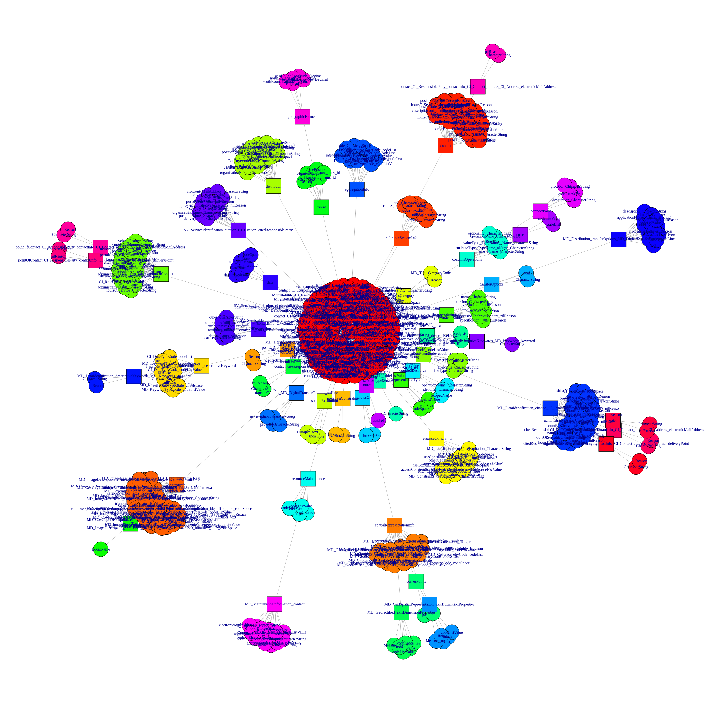
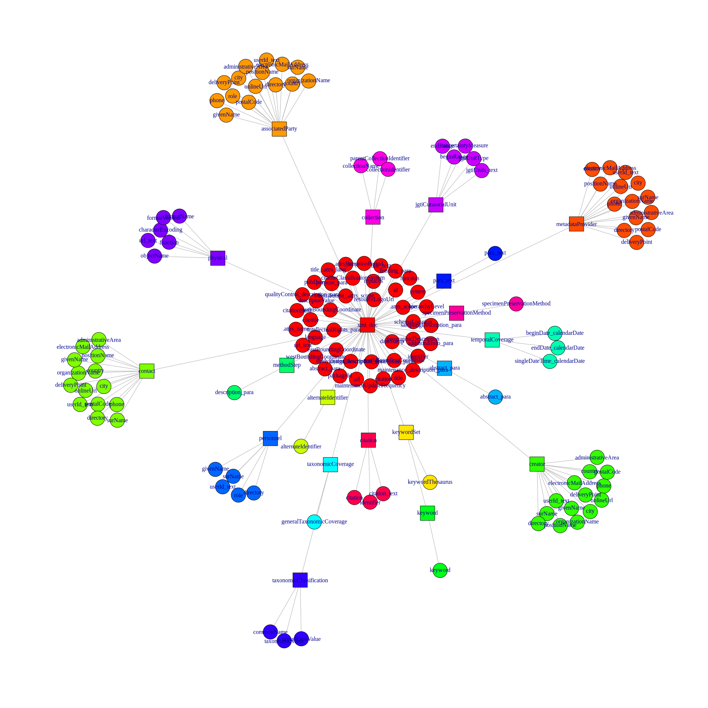
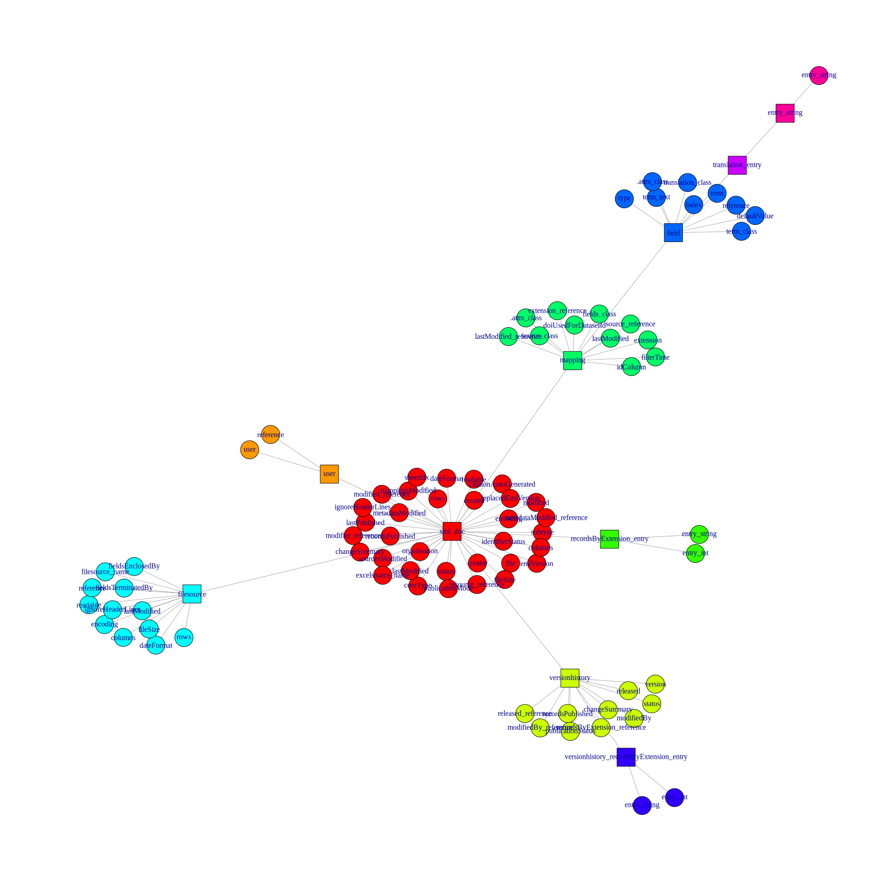
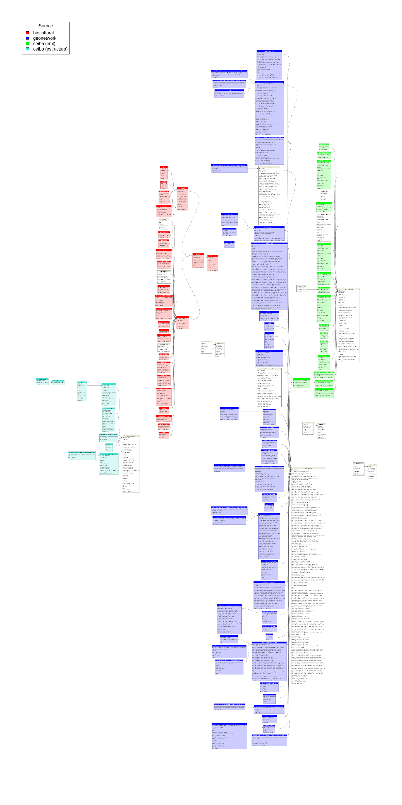

Extracción de los metadatos de los catalogos
================
Marius Bottin
2025-12-23

- [1 Connexión a la base de datos
  `meta_i2d`](#1-connexión-a-la-base-de-datos-meta_i2d)
- [2 Funciones de tratamiento de los metadatos en
  xml](#2-funciones-de-tratamiento-de-los-metadatos-en-xml)
- [3 Geonetwork](#3-geonetwork)
  - [3.1 Importación](#31-importación)
  - [3.2 XML representation and
    analyses](#32-xml-representation-and-analyses)
    - [3.2.1 Exportación de los metadatos de
      geonetwork](#321-exportación-de-los-metadatos-de-geonetwork)
- [4 Ceiba](#4-ceiba)
  - [4.1 Descripción](#41-descripción)
  - [4.2 Extracción de los metadatos](#42-extracción-de-los-metadatos)
  - [4.3 Metadatos: EML](#43-metadatos-eml)
    - [4.3.1 Exportación de los metadatos EML de
      Ceiba](#431-exportación-de-los-metadatos-eml-de-ceiba)
  - [4.4 Metadatos: Resources](#44-metadatos-resources)
    - [4.4.1 Exportación de los metadatos “Resources” de
      Ceiba](#441-exportación-de-los-metadatos-resources-de-ceiba)
- [5 Biocultural](#5-biocultural)
- [6 Estructura de la base de datos completas de
  metadatos](#6-estructura-de-la-base-de-datos-completas-de-metadatos)

``` r
require(RPostgreSQL)
```

    ## Loading required package: RPostgreSQL

    ## Loading required package: DBI

``` r
require(dm)
```

    ## Loading required package: dm

    ## 
    ## Attaching package: 'dm'

    ## The following object is masked from 'package:stats':
    ## 
    ##     filter

``` r
require(DiagrammeRsvg)
```

    ## Loading required package: DiagrammeRsvg

``` r
require(rsvg)
```

    ## Loading required package: rsvg

    ## Linking to librsvg 2.60.0

``` r
require(png)
```

    ## Loading required package: png

``` r
knitr::opts_chunk$set(cache=F,tidy.opts = list(width.cutoff = 70),
                     tidy = TRUE,
                     max.print=50,fig.path="./Fig/extraction_metadata_",echo=T,
                     collapse=F, echo=T)
def.chunk.hook  <- knitr::knit_hooks$get("chunk")
knitr::knit_hooks$set(chunk = function(x, options) {
  x <- def.chunk.hook(x, options)
  paste0("\n \\", "footnotesize","\n\n", x, "\n\n \\normalsize\n\n")
})
```

# 1 Connexión a la base de datos `meta_i2d`

``` r
require(RPostgres)
```

    ## Loading required package: RPostgres

``` r
meta_i2d <- dbConnect(Postgres(), dbname = "meta_i2d")
```

# 2 Funciones de tratamiento de los metadatos en xml

En el archivo
[`analysis_metadatos_xml.R`](../funcionesGenerales/analysis_metadatos_xml.R),
se escribieron las funciones para manejar las estructuras complejas de
metadatos que se pueden obtener desde los archivos (o objetos) XML que
contienen los metadatos en los catálogos de Ceiba y Geonetwork.

``` r
source("../funcionesGenerales/analysis_metadatos_xml.R")
```

    ## Loading required package: data.tree

    ## Loading required package: igraph

    ## 
    ## Attaching package: 'igraph'

    ## The following objects are masked from 'package:stats':
    ## 
    ##     decompose, spectrum

    ## The following object is masked from 'package:base':
    ## 
    ##     union

    ## Loading required package: RSQLite

    ## Loading required package: openxlsx

# 3 Geonetwork

## 3.1 Importación

Desde un archivo dump de la base de datos de geonetwork extraído
directamente en el servidor, utilizamos los comandos siguientes para
duplicar la base de datos:

``` bash
createdb geonetwork -D extra
pg_restore -d geonetwork -c --no-owner --no-acl access_dump/dump-geonetwork-202409051028.sql
```

``` r
geonetwork <- dbConnect(PostgreSQL(), dbname = "geonetwork", user = "marius")
```

``` r
dm_object <- dm_from_con(geonetwork, learn_keys = T)
```

    ## Warning: <PostgreSQLConnection> uses an old dbplyr interface
    ## ℹ Please install a newer version of the package or contact the maintainer
    ## This warning is displayed once every 8 hours.

    ## Warning: The `father` argument of `dfs()` is deprecated as of igraph 2.2.0.
    ## ℹ Please use the `parent` argument instead.
    ## ℹ The deprecated feature was likely used in the dm package.
    ##   Please report the issue at <https://github.com/cynkra/dm/issues>.
    ## This warning is displayed once every 8 hours.
    ## Call `lifecycle::last_lifecycle_warnings()` to see where this warning was
    ## generated.

``` r
A <- dm_object %>%
    dm_draw(view_type = "all")
A2 <- DiagrammeRsvg::export_svg(A) %>%
    charToRaw() %>%
    rsvg::rsvg_png("Fig/explor_geonetwork_structureDB.png")
knitr::include_graphics("Fig/explor_geonetwork_structureDB.png")
```


## 3.2 XML representation and analyses

It seems that most of the data is in an xml form in the field `data` of
the `metadata` table.

We will need to analyse particularly this XML structure, to be able to
extract the metadata from the geonetwork.

``` r
require(XML)
```

    ## Loading required package: XML

``` r
require(data.tree)
mtdt <- dbGetQuery(geonetwork, "SELECT uuid,data FROM metadata")
```

``` r
xml_list_gn <- lapply(mtdt[-479, 2], function(x) xmlToList(xmlParse(x)))
names(xml_list_gn) <- mtdt$uuid[-479]
```

Con esas 3 grandes funciones, extraemos y analizamos los metadatos de
los juegos de datos en Geonetwork:

``` r
structGn <- extractStructureListDocuments(xml_list_gn)
gnv_gn <- groupsAndVariables(structGn)
tabs_gn <- extractTables(xml_list_gn, structGn, gpsAndVar = gnv_gn)
```

El resultado se puede representar así:

``` r
plotGroupsAndVariables(gnv_gn)
```

<!-- -->

### 3.2.1 Exportación de los metadatos de geonetwork

``` r
xlFile_gn <- "../../../data_metadatos_catalogos/exportMetaGeonetwork.xlsx"
sqlite_gn <- "../../../data_metadatos_catalogos/meta_geonetwork.sqlite"
tabs_gn <- sqlize_extractedTables(tabs_gn)
dbgn <- exportSQLite(tabs_gn, sqlite_file = sqlite_gn)
exportPostgres(tabs_gn, meta_i2d, schema = "geonetwork")
```

    ## NOTICE:  identifier "fk_md_georectified_axis_dimension_properties_spatial_representation_info_idx" will be truncated to "fk_md_georectified_axis_dimension_properties_spatial_representa"

    ## NOTICE:  identifier "fk_grid_spatial_representation_axis_dimension_properties_spatial_representation_info_idx" will be truncated to "fk_grid_spatial_representation_axis_dimension_properties_spatia"

    ## NOTICE:  identifier "fk_transfer_options_md_digital_transfer_options_on_line_1_xml_doc_idx" will be truncated to "fk_transfer_options_md_digital_transfer_options_on_line_1_xml_d"

    ## NOTICE:  identifier "fk_descriptive_keywords_md_keywords_keyword_1_md_data_identification_descriptive_keywords_idx" will be truncated to "fk_descriptive_keywords_md_keywords_keyword_1_md_data_identific"

    ## NOTICE:  identifier "fk_transfer_options_md_digital_transfer_options_on_line_2_transfer_options_idx" will be truncated to "fk_transfer_options_md_digital_transfer_options_on_line_2_trans"

    ## NOTICE:  identifier "fk_descriptive_keywords_md_keywords_keyword_2_sv_service_identification_descriptive_keywords_idx" will be truncated to "fk_descriptive_keywords_md_keywords_keyword_2_sv_service_identi"

    ## NOTICE:  identifier "fk_ci_contact_address_ci_address_electronic_mail_address_1_contact_idx" will be truncated to "fk_ci_contact_address_ci_address_electronic_mail_address_1_cont"

    ## NOTICE:  identifier "fk_ci_contact_address_ci_address_electronic_mail_address_2_point_of_contact_idx" will be truncated to "fk_ci_contact_address_ci_address_electronic_mail_address_2_poin"

    ## NOTICE:  identifier "fk_info_ci_contact_address_ci_address_delivery_point_1_point_of_contact_idx" will be truncated to "fk_info_ci_contact_address_ci_address_delivery_point_1_point_of"

    ## NOTICE:  identifier "fk_ci_contact_address_ci_address_electronic_mail_address_3_citation_ci_citation_cited_responsible_party_1_idx" will be truncated to "fk_ci_contact_address_ci_address_electronic_mail_address_3_cita"

    ## NOTICE:  identifier "fk_info_ci_contact_address_ci_address_delivery_point_2_citation_ci_citation_cited_responsible_party_1_idx" will be truncated to "fk_info_ci_contact_address_ci_address_delivery_point_2_citation"

``` r
exportXL(tabs_gn, file = xlFile_gn)
```

# 4 Ceiba

## 4.1 Descripción

Todos los datos de Ceiba están organizados como carpetas en el datadir
del servidor. Se maneja después con el sistema Integrated Publishing
Toolkit desarrollado por GBIF.

En cada carpeta (cada juego de datos), podemos encontrar:

- el archivo comprimido que contiene los archivos y los metadatos en
  formato DarwinCore completo.
- el archivo `eml.xml` que contiene los metadatos, y todas las versiones
  del archivo (con los nombres `eml-1.xml`, `eml-2.xml` etc)
- el archivo `publication.log` que contiene el historial de
  publicación/modificación del juego de datos
- archivos de descripción de los juegos de datos en “Rich Text Format”
  (rtf), tambien para cada versión publicada
- archivos de administración de datos y metadatos `resource.xml`
- una carpeta `sources` que contiene los datos (?)

## 4.2 Extracción de los metadatos

En ssh, accedemos al servidor de ceiba desde la red del instituto:

``` bash
ssh integracion@192.168.11.74
```

Extraemos 3 archivos:

- un archivo que tiene las direcciones de los archivos “eml.xml” y sus
  contenidos
- un archivo que contiene las direcciones de los archivos “resource.xml”
  y sus contenidos
- un catalogo de todos los archivos presentes en la carpeta de datos
  manejada por el ipt

Esos 2 archivos se pueden obtener con:

``` bash
find /home/pem/datadir/ -name eml.xml -exec bash file_and_content.sh {} \; >file_and_content_result_eml 2> errors_find_file_and_content_eml
find /home/pem/datadir/ -name resource.xml  -exec bash file_and_content.sh {} \; >file_and_content_result_resource 2> errors_find_file_and_content_resource
find /home/pem/datadir/ -type f  > result_find
```

Los archivos se pueden descargar desde la red del instituto, gracias al
applicativo scp, que funciona a través de ssh.

## 4.3 Metadatos: EML

``` r
result_find <- readLines("../../../data_metadatos_catalogos/ceiba/result_find")
meta_ceiba <- readLines("../../../data_metadatos_catalogos/ceiba/file_and_content_result_eml")
meta_ceiba <- meta_ceiba[!meta_ceiba == ""]
```

``` r
adressesXML_emlCeiba <- extractAdressesMultiXml(meta_ceiba)
```

    ## Number of elements: 1050

    ## Warning in extractAdressesMultiXml(meta_ceiba): Some xml documents appear to be
    ## empty (we will not consider
    ## them):/home/pem/datadir/resources/cacay-moriche_guaviare/eml.xml

``` r
xml_files_emlCeiba <- apply(adressesXML_emlCeiba, 1, function(a, rl) paste(rl[a[2]:a[3]],
    sep = "\n", collapse = "\n"), rl = meta_ceiba)
names(xml_files_emlCeiba) <- adressesXML_emlCeiba$name
xml_list_emlCeiba <- lapply(xml_files_emlCeiba, function(x) xmlToList(xmlParse(x)))
```

``` r
structEmlCeiba <- extractStructureListDocuments(xml_list_emlCeiba)
gnv_emlCeiba <- groupsAndVariables(structEmlCeiba)
tabs_emlCeiba <- extractTables(xml_list_emlCeiba, structEmlCeiba, gpsAndVar = gnv_emlCeiba)
```

``` r
plotGroupsAndVariables(gnv_emlCeiba)
```

<!-- -->

### 4.3.1 Exportación de los metadatos EML de Ceiba

``` r
xlFile_emlCeiba <- "../../../data_metadatos_catalogos/export_eml_ceiba.xlsx"
sqlite_emlCeiba <- "../../../data_metadatos_catalogos/meta_eml_ceiba.sqlite"
tabs_emlCeiba <- sqlize_extractedTables(tabs_emlCeiba)
dbEmlCeiba <- exportSQLite(tabs_emlCeiba, sqlite_file = sqlite_emlCeiba)
exportPostgres(tabs_emlCeiba, meta_i2d, schema = "ceiba_eml")
exportXL(tabs_emlCeiba, file = xlFile_emlCeiba)
```

    ## Warning in wb$writeData(df = x, colNames = TRUE, sheet = sheet, startRow = startRow, : ), Tiempo atmosf ... to del Casanare. is truncated. 
    ## Number of characters exeed the limit of 32767.

## 4.4 Metadatos: Resources

``` r
resource_ceiba <- readLines("../../../data_metadatos_catalogos/ceiba/file_and_content_result_resource")
```

    ## Warning in
    ## readLines("../../../data_metadatos_catalogos/ceiba/file_and_content_result_resource"):
    ## incomplete final line found on
    ## '../../../data_metadatos_catalogos/ceiba/file_and_content_result_resource'

``` r
resource_ceiba <- resource_ceiba[!resource_ceiba == ""]
```

``` r
adressesXML_resCeiba <- extractAdressesMultiXml(resource_ceiba)
```

    ## Number of elements: 1052

``` r
xml_files_resCeiba <- apply(adressesXML_resCeiba, 1, function(a, rl) paste(rl[a[2]:a[3]],
    sep = "\n", collapse = "\n"), rl = resource_ceiba)
names(xml_files_resCeiba) <- adressesXML_resCeiba$name
xml_list_resCeiba <- lapply(xml_files_resCeiba, function(x) xmlToList(xmlParse(x)))
```

``` r
structResCeiba <- extractStructureListDocuments(xml_list_resCeiba)
gnv_resCeiba <- groupsAndVariables(structResCeiba)
tabs_resCeiba <- extractTables(xml_list_resCeiba, structResCeiba, gpsAndVar = gnv_resCeiba)
```

``` r
plotGroupsAndVariables(gnv_resCeiba)
```

<!-- -->

### 4.4.1 Exportación de los metadatos “Resources” de Ceiba

``` r
xlFile_resCeiba <- "../../../data_metadatos_catalogos/export_res_ceiba.xlsx"
sqlite_resCeiba <- "../../../data_metadatos_catalogos/meta_res_ceiba.sqlite"
tabs_resCeiba <- sqlize_extractedTables(tabs_resCeiba)
dbResCeiba <- exportSQLite(tabs_resCeiba, sqlite_file = sqlite_resCeiba)
exportPostgres(tabs_resCeiba, meta_i2d, schema = "ceiba_struct")
```

    ## NOTICE:  drop cascades to 12 other objects
    ## DETAIL:  drop cascades to table ceiba_struct.tabinfo
    ## drop cascades to table ceiba_struct.varinfo
    ## drop cascades to table ceiba_struct.xml_doc
    ## drop cascades to table ceiba_struct."user"
    ## drop cascades to table ceiba_struct.versionhistory
    ## drop cascades to table ceiba_struct.records_by_extension_entry
    ## drop cascades to table ceiba_struct.mapping
    ## drop cascades to table ceiba_struct.filesource
    ## drop cascades to table ceiba_struct.field
    ## drop cascades to table ceiba_struct.versionhistory_records_by_extension_entry
    ## drop cascades to table ceiba_struct.translation_entry
    ## drop cascades to table ceiba_struct.entry_string

``` r
exportXL(tabs_resCeiba, file = xlFile_resCeiba)
```

# 5 Biocultural

``` r
source("../funcionesGenerales/analysis_metadata_dataverse.R")
biocultural <- dbConnect(PostgreSQL(), dbname = "biocultural", user = "marius")
analysisBC <- dvAnalyseVar(biocultural)
```

``` r
dv_plot_variables(analysisBC)
```

<!-- -->

``` r
descriTables <- dvPrepareTableDescription(analysisBC, biocultural)
```

``` r
dbExecute(meta_i2d, "DROP SCHEMA IF EXISTS biocultural CASCADE")
```

    ## [1] 0

``` r
dbExecute(meta_i2d, "CREATE SCHEMA biocultural")
```

    ## [1] 0

``` r
createPostgresTableStatement <- mapply(function(x, y) createTableStatement(nameTable = x,
    tabAttr = y, dbConnection = meta_i2d, schema = "biocultural"), x = names(descriTables),
    y = descriTables)
lapply(createPostgresTableStatement, dbExecute, conn = meta_i2d)
```

    ## $dataverse
    ## [1] 0
    ## 
    ## $dataset
    ## [1] 0
    ## 
    ## $datasetversion
    ## [1] 0
    ## 
    ## $citation
    ## [1] 0
    ## 
    ## $geospatial
    ## [1] 0
    ## 
    ## $socialscience
    ## [1] 0
    ## 
    ## $author
    ## [1] 0
    ## 
    ## $datasetContact
    ## [1] 0
    ## 
    ## $dsDescription
    ## [1] 0
    ## 
    ## $subject
    ## [1] 0
    ## 
    ## $keyword
    ## [1] 0
    ## 
    ## $publication
    ## [1] 0
    ## 
    ## $producer
    ## [1] 0
    ## 
    ## $contributor
    ## [1] 0
    ## 
    ## $grantNumber
    ## [1] 0
    ## 
    ## $distributor
    ## [1] 0
    ## 
    ## $dateOfCollection
    ## [1] 0
    ## 
    ## $kindOfData
    ## [1] 0
    ## 
    ## $geographicCoverage
    ## [1] 0
    ## 
    ## $geographicUnit
    ## [1] 0
    ## 
    ## $geographicBoundingBox
    ## [1] 0
    ## 
    ## $unitOfAnalysis
    ## [1] 0
    ## 
    ## $universe
    ## [1] 0
    ## 
    ## $targetSampleSize
    ## [1] 0
    ## 
    ## $collectionMode
    ## [1] 0
    ## 
    ## $datafile
    ## [1] 0
    ## 
    ## $filedescription
    ## [1] 0
    ## 
    ## $ingest
    ## [1] 0
    ## 
    ## $variable
    ## [1] 0

``` r
extractedBiocultural <- extractValues(descriTables, biocultural)
insertTables(extractedBiocultural, meta_i2d, descriTables, "biocultural")
```

# 6 Estructura de la base de datos completas de metadatos

``` r
tablestosupp <- dbGetQuery(meta_i2d, "SELECT table_schema, table_name FROM information_schema.tables WHERE table_schema NOT IN ('ceiba_eml','ceiba_struct','geonetwork','biocultural')")
tablesBiocultural <- dbGetQuery(meta_i2d, "SELECT table_schema, table_name FROM information_schema.tables WHERE table_schema ='biocultural'")
tablesGeonetwork <- dbGetQuery(meta_i2d, "SELECT table_schema, table_name FROM information_schema.tables WHERE table_schema ='geonetwork'")
tablesCeibaEml <- dbGetQuery(meta_i2d, "SELECT table_schema, table_name FROM information_schema.tables WHERE table_schema ='ceiba_eml'")
tablesCeibaStruct <- dbGetQuery(meta_i2d, "SELECT table_schema, table_name FROM information_schema.tables WHERE table_schema ='ceiba_struct'")

dm_object <- dm_from_con(con = meta_i2d, learn_keys = T, schema = c("ceiba_eml",
    "ceiba_struct", "geonetwork", "biocultural"), .names = "{.schema}.{.table}")
```

    ## New names:
    ## • `xml_doc` -> `xml_doc...1`
    ## • `contact` -> `contact...2`
    ## • `tabinfo` -> `tabinfo...3`
    ## • `varinfo` -> `varinfo...4`
    ## • `tabinfo` -> `tabinfo...5`
    ## • `varinfo` -> `varinfo...7`
    ## • `xml_doc` -> `xml_doc...12`
    ## • `contact` -> `contact...19`
    ## • `keyword` -> `keyword...21`
    ## • `distributor` -> `distributor...24`
    ## • `citation` -> `citation...44`
    ## • `tabinfo` -> `tabinfo...47`
    ## • `varinfo` -> `varinfo...48`
    ## • `xml_doc` -> `xml_doc...49`
    ## • `citation` -> `citation...65`
    ## • `keyword` -> `keyword...74`
    ## • `distributor` -> `distributor...79`

``` r
dm_object <- dm_object[names(dm_object)[!names(dm_object) %in% tablestosupp$table_name]]
A <- dm_object %>%
    dm_set_colors(red = all_of(names(dm_object)[names(dm_object) %in% tablesBiocultural$table_name])) %>%
    dm_set_colors(blue = all_of(names(dm_object)[names(dm_object) %in%
        tablesGeonetwork$table_name])) %>%
    dm_set_colors(green = all_of(names(dm_object)[names(dm_object) %in%
        tablesCeibaEml$table_name])) %>%
    dm_set_colors(turquoise = all_of(names(dm_object)[names(dm_object) %in%
        tablesCeibaStruct$table_name])) %>%
    dm_draw(view_type = "all")
t_file <- tempfile(fileext = ".png")
DiagrammeRsvg::export_svg(A) %>%
    charToRaw %>%
    rsvg_png(file = t_file)
plot(0, xaxt = "n", yaxt = "n", bty = "n", pch = "", ylab = "", xlab = "",
    xlim = c(0, 1), ylim = c(0, 1))
png <- readPNG(t_file)
rasterImage(png, 0, 0, 1, 1)
legend("topleft", fill = c("red", "blue", "green", "turquoise"), legend = c("biocultural",
    "geonetwork", "ceiba (eml)", "ceiba (estructura)"), title = "Source")
```

<!-- -->

``` r
dbDisconnect(dbEmlCeiba)
dbDisconnect(dbResCeiba)
dbDisconnect(dbgn)
dbDisconnect(geonetwork)
```

    ## [1] TRUE

``` r
dbDisconnect(meta_i2d)
```
