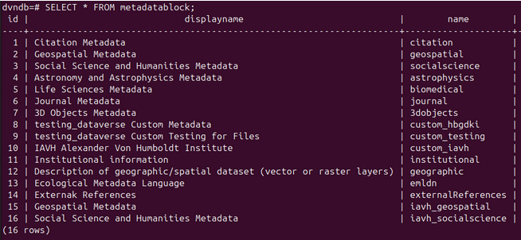
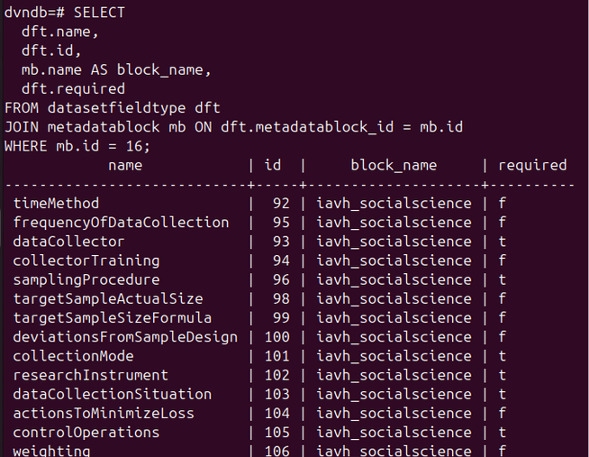
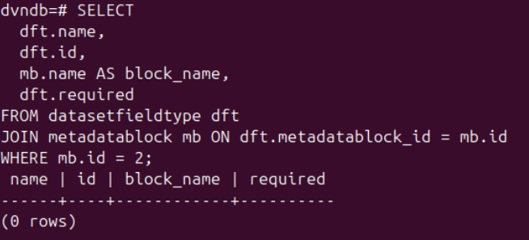
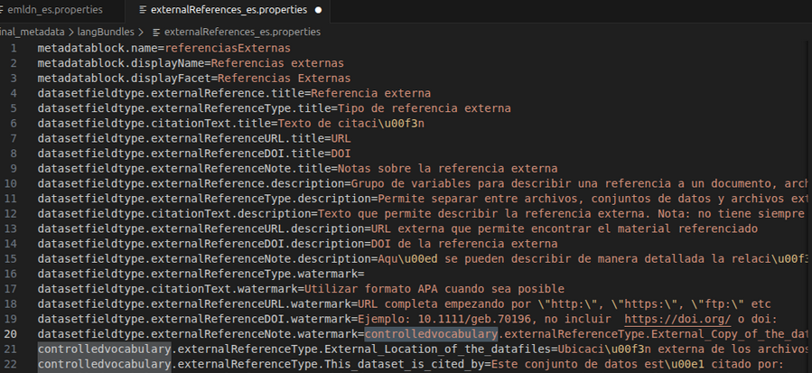
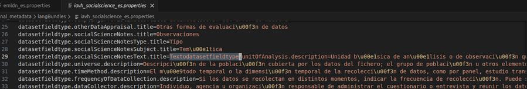
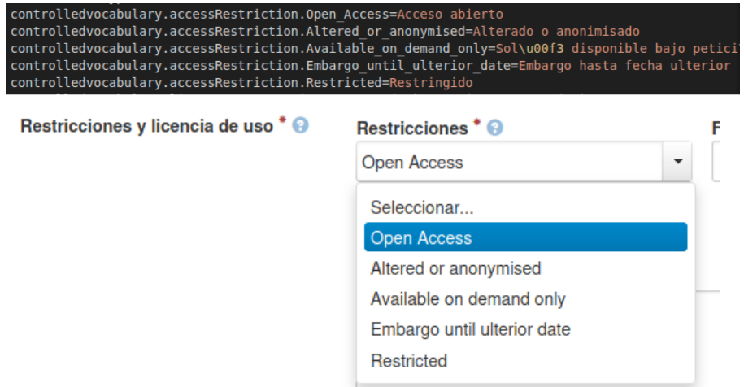
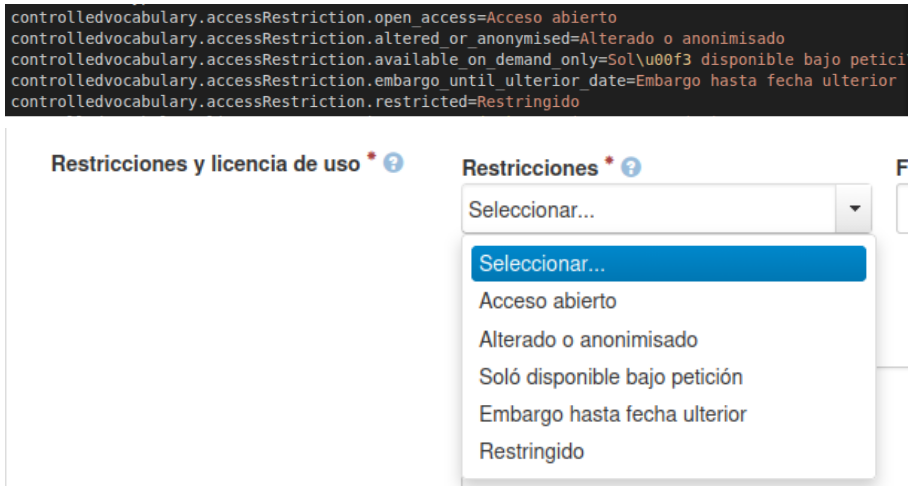
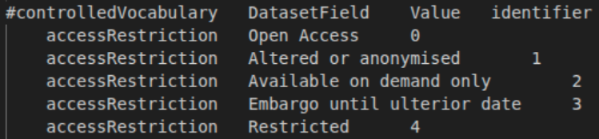

# Actualización de metadatos en BioCultural
Para la integración de metadatos de los tres catálogos, se realizó una primera fase de actualización de metadatos. Todos los pasos aquí descritos ya fueron explicados en [esta sección](../../dataverse_implementation/customization/custom_metadata.md), el objetivo de esta documentación es mantener una trazabilidad adecuada del proceso de la integración.

Durante la actualización de los nuevos metadatos para la integración de los catálogos me topé con algunos problemas. Esta sección la dividiré en dos: la primera sección será una recopilación de los errores/problemas que tuve que solucionar para el correcto funcionamiento de los datos; la segunda sección será una recopilación de los comandos que seguí, una vez arreglados los errores, para cargar los nuevos metadatos.

## Sección 1: Errores/problemas en la configuración de los archivos
### Error #1: Los nombres de los bloques y los campos deben ser únicos
No es posible utilizar los mismos nombres de metadatos para nuevos bloques. Por ejemplo, para esta actualización se creó un nuevo bloque geospatial y un nuevo bloque socialscience, cuyos nombres se modificaron, respectivamente a:
-   _iavh_geospatial_
-   _iavh_socialscience_
    
Para que no irrumpiera con los bloques originales de dataverse.

Al agregar estos nuevos bloques, como se mantuvieron los mismos nombres de los campos o metadatos originales, lo que hizo fue mover los campos originales de `geospatial` y `socialscience` a los nuevos bloques, ocasionando errores. Por ejemplo, en la UI aparecían errores de “este metadato no puede estar vacío” a pesar de ya tener datos.

Verifiqué en la base de datos de postgres:

1.  Revisé los IDs de los nuevos bloques de metadatos (id=15 y id=16). Los metadatos originales son id=2 y id=3.

2. Revisé cuáles eran los campos vinculados a los nuevos bloques, por ejemplo, a `iavh_geospatial`. Se observa que todos los campos aparecen relacionados a este nuevo bloque.

3. Sin embargo, al revisar los vinculados al bloque original de `geospatial`, aparecen vacíos:

Esto ocurrió porque los campos se llamaban iguales tanto en el bloque original como en el bloque nuevo. Esto hizo que Dataverse asumiera que eran los mismos campos y los movió de una tabla a la otra (recordemos que el nombre de los metadatos es su identificador).

Para darle solución, tuve que modificar los nombres de los metadatos de los nuevos bloques, así que añadí el prefijo `iavh_` para hacerlos únicos (esto para los casos de `socialscience` y `geospatial`).

Con esto ya era posible hacer la carga de los nuevos metadatos sin generar conflictos, sin embargo, debía recuperar las configuraciones originales antes de continuar.

#### Recuperación de configuraciones originales
Para recuperar los campos originales y arreglar estos errores, tuve que volver a las configuraciones iniciales:

1.  Se cargaron los bloques originales:
`curl http://localhost:8080/api/admin/datasetfield/load -H "Content-type: text/tab-separated-values" -X POST --upload-file geospatial.tsv`

	  `curl http://localhost:8080/api/admin/datasetfield/load -H "Content-type: text/tab-separated-values" -X POST --upload-file socialscience.tsv`

2.  Se habilitaron nuevamente (sólo los originales):
`curl -H "X-Dataverse-key:$API_TOKEN" -X POST -H "Content-type:application/json" -d "[\"citation\", \"geospatial\", \"socialscience\"]" http://localhost:8080/api/dataverses/:root/metadatablocks`

3.  Finalmente, se indexaron a Solr siguiendo los pasos descritos en una [sección anterior](../../dataverse_implementation/customization/custom_metadata.md).

### Error #2: El fieldType de tipo String no es válido
En el `emldn.tsv` se tenían unos datos marcados como `string` en la columna `fieldType`, lo cuál no es válido para la versión de Dataverse que maneja el instituto (`v6.6`). Se modificaron estos campos a `text`.

### Error #3. Saltos de línea faltantes en archivos .properties
Encontré algunos errores en todos los _es.properties relacionados a saltos de línea faltantes. Por ejemplo:

Para solucionarlo simplemente entré a los archivos y me aseguré de agregar los saltos de línea faltantes.

### Error #4: Los elementos del .properties siempre deben ir en minúscula
Para una correcta traducción, los elementos de `controlled vocabulary` deben estar en minúsculas. Por ejemplo: 

-   Así no toma la traducción (nótese las keys con mayúscula al inicio):

- Así sí toma la traducción (nótese que todas las keys están ahora en minúsculas):

Esto pasa porque los vocabularios transforman las keys a `lowercase` y hacen la búsqueda así. Esto significa que si los TSV están en mayúsculas no habrá problema, es decir, lo anterior seguirá funcionando incluso si el .tsv correspondiente se ve de la siguiente manera:

## Sección 2: Carga y configuración
### Carga de metadatos
1.  Se cargaron los nuevos bloques:
    
	`curl http://localhost:8080/api/admin/datasetfield/load -H "Content-type: text/tab-separated-values" -X POST --upload-file emldn.tsv`

	`curl http://localhost:8080/api/admin/datasetfield/load -H "Content-type: text/tab-separated-values" -X POST --upload-file externalReferences.tsv`

	  `curl http://localhost:8080/api/admin/datasetfield/load -H "Content-type: text/tab-separated-values" -X POST --upload-file geographic.tsv`

	  `curl http://localhost:8080/api/admin/datasetfield/load -H "Content-type: text/tab-separated-values" -X POST --upload-file iavh_geospatial.tsv`
  
	  `curl http://localhost:8080/api/admin/datasetfield/load -H "Content-type: text/tab-separated-values" -X POST --upload-file iavh_socialscience.tsv`

	`curl http://localhost:8080/api/admin/datasetfield/load -H "Content-type: text/tab-separated-values" -X POST --upload-file institutional.tsv`

2.  Se habilitaron los nuevos bloques de metadatos (en este caso, no se habilitaron los bloques originales):
    
	`curl -H "X-Dataverse-key:$API_TOKEN" -X POST -H "Content-type:application/json" -d "[\"citation\", \"emldn\", \"externalReferences\", \"geographic\", \"iavh_geospatial\", \"iavh_socialscience\", \"institutional\"]" http://localhost:8080/api/dataverses/:root/metadatablocks`

3.  Se indexaron a Solr siguiendo los pasos descritos en una [sección anterior](../../dataverse_implementation/customization/custom_metadata.md).

### Cargar nuevas traducciones
Para las nuevas traducciones, simplemente copié los archivos correctos a `/home/dataverse/langBundles` dentro del contenedor, y posteriormente lo reinicié:

1.  Se copian los archivos
    `docker cp emldn_es.properties dataverse:/home/dataverse/langBundles/`

	`docker cp geographic_es.properties dataverse:/home/dataverse/langBundles/`

	`docker cp iavh_socialscience_es.properties dataverse:/home/dataverse/langBundles/`

	`docker cp iavh_geospatial_es.properties dataverse:/home/dataverse/langBundles/`

	`docker cp citation_es.properties dataverse:/home/dataverse/langBundles/`

	`docker cp externalReferences_es.properties dataverse:/home/dataverse/langBundles/`

	`docker cp institutional_es.properties dataverse:/home/dataverse/langBundles/`

2.  Se reinicia dataverse
    `docker restart dataverse`

### Edición de plantillas
Finalizado esto, no se veían aún correctamente los nuevos metadatos pues seguía basándose en la plantilla anterior. Tuve que entrar a:

-   Editar –> Plantillas del Dataset –> Editar plantilla –> Guardar plantilla

 Para que recargara los cambios correctamente.
