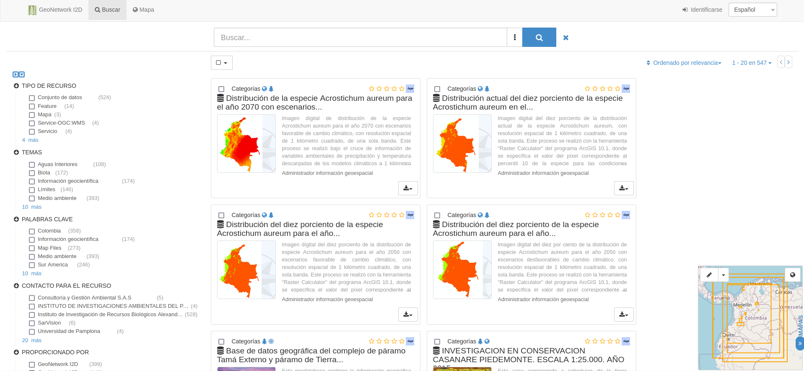
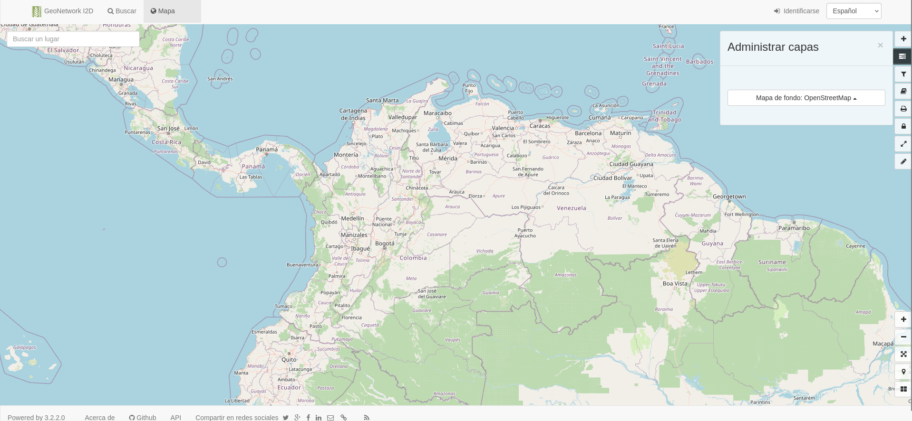

Integración de los catálogos: descripción del sistema GeoNetwork
================
Marius Bottin
2024-11-06

El catálogo Geonetwork (<http://geonetwork.humboldt.org.co>) del
instituto contiene los juegos datos espaciales y geográficos del IAvH
(ver figuras <a href="#fig:geon-general-interf">1</a> y
<a href="#fig:geon-map-interf">2</a>). Se maneja con el programa
*GeoNetwork opensource* ([Prunayre, García, Ticheler, Gravin, Pigot,
et al. 2024](#ref-Prunayre2024), <https://geonetwork-opensource.org/>),
un software libre que hace parte de las herramientas de la Open Source
Geospatial Foundation (OSGEO: <http://www.osgeo.org>). Este software
especializado en la publicación de juegos de datos espaciales y
geográficos permite:

1.  almacenar y publicar juegos de datos a través de una plataforma
    fácil de configurar
2.  presentar los juegos de datos en mapas utilizando los servicios WMS
    y OWS y estándares KML y OWS (la implementación actual del catálogo
    institucional no usa mucho esas posibilidades)
3.  incluir un sistema de búsqueda en los metadatos

Figure 1: Interfaz web del
catálogo geonetwork. Se pueden filtrar los datos basados en campos
particulares de los metadatos (parte izquierda), o buscar con palabras
claves. En la parte derecha, las extensiones de los datasets están
representadas en un mini-mapa.

Figure 2: Interfaz “mapa” del
catálogo geonetwork. Es posible implementar la integración de capas de
información geografica, pero en la implementación actual, solo se usan
mapas de fondos. Por ahora no se pueden representar caracteristicas
geograficas de los juegos de datos

El eje central del software GeoNetwork opensource es una base de datos
PostgreSQL que permite articular todas las funcionalidades de
publicación de los juegos de datos en la plataforma. Los metadatos
asociados con cada juego de datos están almacenados en esta base de
datos, pero de una forma poco practica: están en forma XML en un campo
de texto (ver figura <a href="#fig:structGeonetwork">3</a>). Ademas, la
estructura de este texto XML es particularmente oscura, con campos
anidificados que pueden tener una profundidad de hasta 12 niveles.

Figure 3: Base de datos de la
implementación del catálogo Geonetwork. Todos los metadatos de los
juegos de datos están en el campo indicado en rojo, en forma de texto
xml.

Las herramientas incluidas en las implementaciones de GeoNetwork
funcionan con el lenguaje *Java*, que comunica con la base de datos
PostgreSQL. Las búsquedas funcionan con el motor `elasticsearch`
(<https://docs.geonetwork-opensource.org/4.4/install-guide/installing-index/>)
y su cliente en Java. No se encuentran muchas informaciones sobre la
forma de interactuar, en Java, con una instancia de GeoNetwork. Sin
embargo, existen aplicaciones en formas de API (Restful) para comunicar
con el sistema en varios lenguajes (Python, R o otros a traves de Curl).

La instancia especifica del Geonetwork de la I2D del IAvH (en Octubre
del 2024) funciona con la versión de GeoNetwork opensource *3.2.2.0*. En
esta misma fecha, la ultima versión de Geonetwork opensource es *4.4*, y
la versión estable es *4.2*. Según la documentación oficial del
software, las versiones soportadas son las versiones *4.2* y *4.4*. Se
recomienda la migración para los usuarios de versiones anteriores, por
razones de seguridad y de funcionalidad
(<https://docs.geonetwork-opensource.org/4.4/overview/change-log/history/>).
Significa que, en el caso de seguir con este sistema en el futuro, se
deberán afectar recursos para hacer evolucionar la instalación, y
mantener el sistema. En particular, el sistema de búsqueda ha sido
mejorado y simplificado en la transición entre las versiones mayores *3*
y *4*, y la base de datos ha cambiado de manera significativa al pasar a
la versión *4.2*. En este marco, ahora es el tiempo para pensar de
manera racional el futuro del manejo de los datos geográficos para el
IAvH.

De manera general, GeoNetwork da buenos resultados con sus propias
funcionalidades. Es relativamente simple en términos de implementación y
mantenimiento. Sin embargo, presenta dificultades cuando se trate de
implementar funciones que no están en sus funcionalidades básicas, y el
formato de los metadatos es particularmente oscuro. En el marco de un
esfuerzo de integración de los catálogos institucionales, se vuelve
difícil manejar GeoNetwork en conjunto con otros sistemas. Ademas, el
uso institucional de las interfaces geográficas del portal internet
ofrecido por geonetwork es relativamente limitado, y podemos pensar en
una migración de este sistema hacía una alternativa sin arriesgar mucha
perdida de funcionalidad. La única función que podría ser difícil
replicar en otro sistema de gestión y publicación de datos es el pequeño
mapa que representa la extensión geográfica de los juegos de datos en la
parte derecha de la interfaz general del portal (ver figura
<a href="#fig:geon-general-interf">1</a>). Sin embargo, esta
funcionalidad podría desarrollarse como una aplicación externa.

Lista de recursos para el manejo de juegos de datos en una instalación
de Geonetwork opensource:

- documentación de GeoNetwork:
  <https://geonetwork-opensource.org/docs.html> (Anotar, existe también
  un repositorio github de documentación para geonetwork
  <https://github.com/geonetwork/doc>)
- documentación de la api de geonetwork:
  <https://docs.geonetwork-opensource.org/3.12/api/the-geonetwork-api/>
- documentación del componente elasticsearch de geonetwork opensource:
  <https://docs.geonetwork-opensource.org/3.12/maintainer-guide/statistics/setup-elasticsearch/>
- paquete R `geonapi` ([Blondel 2024](#ref-Blondel2024)) para consultar,
  cargar y publicar juegos de datos
- paquete python `soduco-geonetwork` como apoyo para el formateo de
  metadatos en xml y el manejo de la API

Blondel, Emmanuel. 2024. *[geonapi: ’GeoNetwork’ API R
Interface](https://github.com/eblondel/geonapi/wiki)*.

Prunayre, François, García, Jose, Ticheler, Jeroen, Gravin, Florent,
Pigot, Simon, … OSGeo, Open Source Geospatial Foundation -. 2024.
[GeoNetwork opensource](https://geonetwork-opensource.org).

