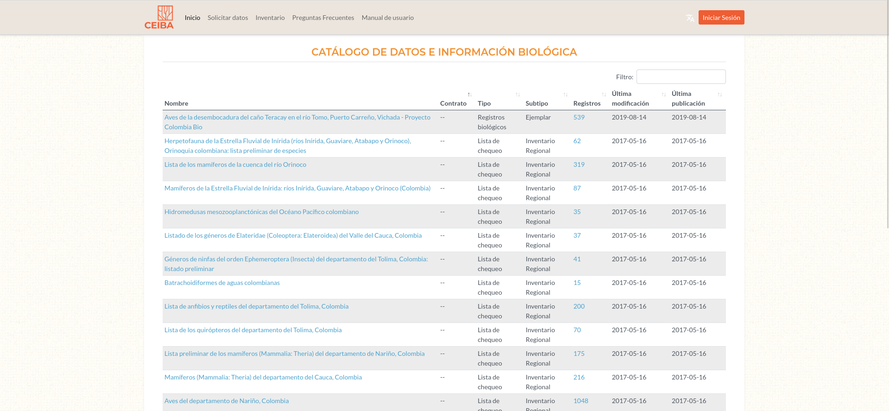

```{r setup, include=F}
knitr::opts_chunk$set(cache=F,tidy.opts = list(width.cutoff = 70),
                     tidy = TRUE,
                     max.print=50,fig.path="./Fig/recomend_",
                     collapse=F, echo=F)
```

La plataforma CEIBA (<http://i2d.humboldt.org.co/ceiba/>, ver fig. \@ref(fig:ceibaInterface)) es el catálogo de datos biológicos del Instituto de investigación de recursos biologícos Alexander von Humboldt (IAvH).
Está manejada desde un *Integrated Publishing Toolkit* (IPT: <https://www.gbif.org/ipt>, alojado en GitHub: <https://github.com/gbif/ipt>).
El ensamble de herramientas open source IPT está desarrollado por el equipo de la plataforma mundial de información sobre biodiversidad GBIF (<https:www.gbif.org>).
Este software permite realizar varías operaciones de gestión de registros biologicos de biodiversidad:

1. organizar y manejar juegos de datos (datos de occurrencias, checklists, eventos de muestreo y metadatos generales sobre fuentes de datos)
   + Gestión nativa del estándar DarwinCore [@Wieczorek2012] para los juegos de datos
   + Gestión nativa del estándar *Ecological Metadata Language* [EML, @Jones2019] para los metadatos
1. publicar los datos y metadatos en la plataforma institucional
1. publicar, registrar y indexar los juegos de datos en la plataforma GBIF
1. referenciar juegos de datos gracias a identificadores únicos 

```{r ceibaInterface,fig.cap="Interfaz web del catálogo Ceiba.", out.width='100%'}

```

Siendo una solución completa para los datos (biológicos) de biodiversidad, IPT no tiene muchas alternativas que podrían realizar todas las operaciones manejadas a través de sus herramientas.
En particular, las funciones de vinculación, publicación y indexación con la plataforma GBIF son muy especificas a este software.
Cualesquiera que sean las decisiones técnicas de integración de los sistemas de gestión de los catálogos institucionales, es muy poco probable que podamos suprimir totalmente una instalación de IPT, si queremos guardar la vinculación actual con el Sistema de Información Biologica (SIB Colombia) y GBIF.
Al mismo tiempo, tenemos una imposibilidad de incorporar los datos geográficos y socio-ecológicos en un sistema IPT porque las normas EML y DarwinCore no están compatibles con esos tipos de datos.
Eso implica que si las decisiones de integración de los catálogos nos llevan a un sistema único de almacenamiento y publicación de los datos, tendríamos una duplicación de los recursos para la parte biológica.


El funcionamiento de IPT está basado en un directorio de archivos almacenados y indexados en un servidor.
No tiene un sistema de gestión de bases de datos clásico como PostgreSQL, o MySQL.
Existen herramientas especificas que permiten conectar una base de datos relacional como fuente de un juego de datos en IPT (<https://ipt.gbif.org/manual/en/ipt/latest/database-connection>), pero es difícil tener instrucciones especificas para incorporar este tipo de datos.
En particular, es posible que (i) la única opción sea que el sistema tome cada base de datos como un único juego de datos, que (ii) el sistema funcione únicamente con los formatos más simples (que contienen solo una tabla) y que (iii) la incorporación de los metadatos en EML no sea automatica desde la información en la base de datos, sino a través de un proceso externo.
No se pudo encontrar directamente esa información en el manual de usuario, la situación descrita en este párrafo es no más que una deducción desde la pequeña descripción en el manual.

El tratamiento y la extracción de los datos almacenados en el servidor IPT es relativamente simple.
Un script bash puede permitir extraer un listado completo de los recursos y sus versiones, así como la lista completa de los metadatos, en formato XML, según la norma EML.
Los datos mismos se pueden extraer de los archivos en formato de texto.
No existen dificultades particulares para tener sistemas de extracción escritos en R, Python o Bash.

Una lista de recursos para manejar la información contenida en un IPT:


* **Manual del usuario de IPT**: <https://ipt.gbif.org/manual/es/ipt/latest/>
* **Repositorio GitHub de IPT**: <https://github.com/gbif/ipt>
* **Para los archivos EML**:
    + los paquetes Python `pyemllib` y `metapype-eml` para pasar de archivos EML a objetos de Python
    + paquetes R `xml2` [@Wickham2023] y `XML` [@TempleLang2024] para manejar los archivos XML
    + paquete R `EML` [@Boettiger] para leer directamente los archivos que contienen metadatos en la norma EML
* **Para los archivos DarwinCore**
    + paquete Python `python-dwca-reader` para leer los juegos de datos en Darwincore Archive (documentación: <https://python-dwca-reader.readthedocs.io/en/latest/> y repositorio GitHub: <https://github.com/BelgianBiodiversityPlatform/python-dwca-reader>) 
    + paquetes R `finch` [@Chamberlain2020] y `LivingNorwayR` [@Grainger2022] para manejar datos en la norma DarwinCore