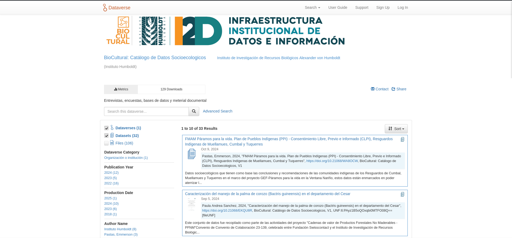

```{r setup, include=F}
knitr::opts_chunk$set(cache=F,tidy.opts = list(width.cutoff = 70),
                     tidy = TRUE,
                     max.print=50,fig.path="./Fig/recomend_",
                     collapse=F, echo=F)
```

La plataforma de datos socio-ecologicos Biocultural (see fig. \@ref(fig:interfaceBiocult)) se maneja a través del software libre Dataverse project (<https://dataverse.org/>), desarrollado por el Institute for Quantitative Social Sciences (IQSS) de la universidad de Harvard.
Dataverse es un set de herramientas que permite:

1. organizar y manejar juegos de datos
    + manejo nativo de la norma Dublin Core
1. publicar los datos y metadatos en la plataforma institucional, con un sistema de búsqueda en los juegos de datos por metadatos
1. referenciar juegos de datos gracias a identificadores únicos 
1. estar una base para herramientas de manejo de datos (dataverse es relativamente recien, pero conoce un desarrollo muy activo)

```{r interfaceBiocult,fig.cap="Interfaz web de biocultural, manejada con dataverse project.", out.width='100%'}

```


El sistema de dataverse funciona gracias a una base de datos PostgreSQL (ver estructura en la figura \@ref(fig:structBiocult)), y una base de codigo en Java.
El principio director de la base de datos de dataverse es la flexibilidad en la descripción de los juegos de datos y archivos asociados, aunque siga la norma general Dublin Core.
Los metadatos y descriptores están divididos en bloques que se pueden definir por los administradores de la plataforma.
Las variables de metadatos elegidas están almacenadas en una tabla, referenciada después en una tabla llave-valor que permite almacenar los metadatos de cada juego de datos.
La desventaja de este sistema es que las variables de metadatos son más difícil manejar en términos de indexación y restricciones de forma (todos los metadatos están almacenados en forma de texto en la base de datos), pero permite adaptarse a cualquier tipo de juegos de datos y da una libertad de manejo a los administradores de las colecciones de juegos de datos.
Dataverse incluye también un sistema de búsqueda completo y rápido basado en el motor de búsqueda solr de Apache (<https://solr.apache.org/>), que permite búsquedas gracias a palabras claves, consultas con parámetros o expresiones exactas.
En el marco del ejercicio de integración de los catálogos institucionales del IAvH, esas funcionalidades hacen de dataverse una herramienta adaptada para integrar todos los tipos de datos que maneja el instituto.

Aunque sea relativamente recién, el software dataverse ha tenido un desarrollado muy rápido, y muchas instituciones lo han elegido para el almacenamiento y la publicación de sus datos de investigación.
La comunidad de usuario es muy activa, y existen numerosos proyectos de desarrollo de herramientas suplementarias opcionales en una implementación de la plataforma, ademas de un plan ambicioso de desarrollo general del software (ver figura \@ref(fig:dvRoadmap)).
En particular, el equipo de la universidad de Harvard tiene el proyecto de desarrollar sistemas de inteligencia artificial y de búsqueda semántica para las futuras implementaciones de la plataforma.
Sabiendo que esos proyectos son también de importancia para la Gerencia de Información Científica, es importante que sigamos esos desarrollos para averiguar si las posibilidades ofrecidas podrían volverse una solución fácil de despliegue de esas funcionalidades para el IAvH.


```{r structBiocult,fig.cap="Base de datos de la implementación del catálogo Biocultural.", out.width='100%'}
knitr::include_graphics("../../importacion_analisis/Fig/explor_biocultural_structureBD.png")
```

```{r dvRoadmap,fig.cap="Planes de desarrollos de dataverse.  En particular, la parte en azul describe las funcionalidades futuras de herramientas suplementarias y implementación de sistemas de inteligencia artificial.", out.width='100%'}
roadmapFile<-"Fig/dataverse_roadmap.png"
if(!file.exists(roadmapFile))
{
  download.file("https://www.iq.harvard.edu/sites/projects.iq.harvard.edu/files/harvard-iqss/files/2024-07-02_dv_roadmap-4kx2k.png?m=1719959260",destfile = roadmapFile)
}
knitr::include_graphics(roadmapFile)
```

Dataverse cuenta con un sistema para que los administradores puedan personalizar los metadatos asociados con los juegos de datos (<https://guides.dataverse.org/en/latest/admin/metadatacustomization.html>), y con un sistema completo de API para poder automatizar muchas operaciones sobre las implementaciones de plataformas (<https://guides.dataverse.org/en/latest/api/index.html>).

Por ahora (Octubre de 2024), el catálogo biocultural (<http://ec2-34-238-22-20.compute-1.amazonaws.com:8080/dataverse/iavh_i2d_biocultural>) de los datos socio-ecologicos manejados con dataverse no está todavía en su fase de despliegue final, pero ya cuenta con varios juegos de datos de encuestas, entrevistas, actores, gobernanza y conflictos ambientales.
La plataforma funciona con la versión `v. 5.12.1 build 1122-cf90431`.
La versión actual es *6.4* y existen varias nuevas funcionalidades (ver <https://github.com/IQSS/dataverse/releases>).
Como para GeoNetwork opensource, es importante pensar en un upgrade del sistema si el esfuerzo de integración incluye cambios en la gestión de los catalogos. 

Una nota importante sobre las funcionalidades de dataverse es que, aunque sea, como los demás sistemas descritos en este documento, un catalogador de juegos de datos que maneja principalmente los metadatos y las referencias a juegos de datos brutos, existen posibilidades de catalogar y presentar operaciones sobre los datos.
Se pueden añadir *workflows* (ver <https://guides.dataverse.org/en/latest/user/dataset-management.html#id34>), y la plataforma puede presentar características que busca dentro de los archivos de datos en las paginas de presentación de los juegos de datos (ver <https://guides.dataverse.org/en/latest/user/dataset-management.html#id34>).
Ademas, dataverse puede referenciar codigos de tratamiento de datos almacenados en github y asociarlos a los datos para presentar tratamientos de datos asociados a los juegos de datos.
Por ahora, presentar datos y tratamientos en una misma plataforma no es una practica frecuente en el IAvH, pero la adopción de dataverse podría cambiar totalmente los alcances de la publicación de datos para el instituto.

Lista de recursos para el manejo de dataverse:

* Manuales técnicos de dataverse (usuario, administradores, API, instalación, desarrolladores etc.): <https://guides.dataverse.org>
* paquete R `dataverse` [@Kuriwaki2024,github repository: <https://github.com/IQSS/dataverse-client-r>]
* paquetes python:
    + `Easydataverse` para manejar los juegos de datos, archivos y carpetas
    + `pyDataverse` para facilitar las migraciones, manejar las colecciones y los metadatos
    + `dataverse_utils` permite automatizar la incorporación de juegos de datos
    + `Pooch` no es especifico para dataverse pero permite manejar la descarga de datos en una forma que puede ayudar en scripts de migración - manejo de datos para dataverse
  